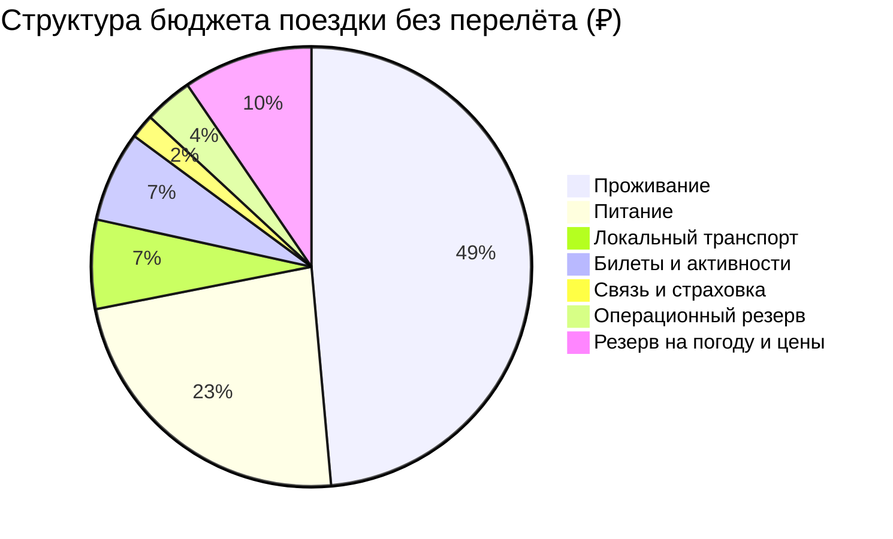

# 💰 Финансы: Владивосток на 7 дней

> [!summary]+ 💰 Общий ориентировочный бюджет: **84 000 ₽** на 1 человека без перелёта до Владивостока
> Расчёт: 6 ночей в центральном отеле, комфортный средний уровень, питание без ежедневного fine dining, две поездки на остров Русский и резерв на погоду и изменение цен. Город вылета не указан, поэтому авиабилеты и поезд до Владивостока в сумму не входят.

## 📊 Сводная смета

| Категория | Расчёт | Сумма |
|---|---|---:|
| 🏨 Проживание | `6 800 ₽ × 6 ночей` | **40 800 ₽** |
| 🍜 Питание | `2 800 ₽ × 7 дней` | **19 600 ₽** |
| 🚆 Локальный транспорт | поезд аэропорт, автобусы, такси, трансфер на остров | **5 500 ₽** |
| 🎟️ Билеты и активности | океанариум, С-56, музеи, сад, запас на батарею/морскую прогулку | **5 600 ₽** |
| 📱 Связь и страховка | eSIM / связь + внутренняя туристическая страховка | **1 500 ₽** |
| 🧾 Операционный резерв | мелкие расходы, вода, камера хранения, наличные | **3 000 ₽** |
| 🌦️ Резерв на погоду и изменение цен | около 10% от базовой сметы | **8 000 ₽** |
| **ИТОГО** |  | **84 000 ₽** |

---

## 🏨 Проживание — 40 800 ₽

- Рабочий ориентир: `6 800 ₽` за ночь × `6` ночей.
- База: центр между вокзалом и Светланской.
- При двухместном размещении ориентир на человека снижается примерно до `20 400 ₽` за номерную часть, если стоимость номера не зависит от количества гостей.
- Точную цену нельзя фиксировать без дат: проверить [файл отелей](../03%20-%20Бронирования/Отели.md) после выбора периода.

## 🍜 Питание — 19 600 ₽

- Средний дневной ориентир: `2 800 ₽`.
- В День 04 заложен большой ужин с морепродуктами; стоимость краба и гребешка зависит от веса и сезона.
- Для контроля счёта уточнять, указана ли цена за 100 г, порцию или килограмм.

## 🚆 Транспорт — 5 500 ₽

- Электропоезд Кневичи ⇄ Владивосток: ориентир `185 ₽` в одну сторону обычным тарифом по данным аэропорта; комфортный вагон дороже.
- Городские автобусы: заложен запас под несколько поездок.
- Такси: резерв на аэропорт или поздний возвращённый маршрут.
- День 06: часть суммы — место в сборном трансфере к Ворошиловской батарее.

## 🎟️ Билеты и активности — 5 600 ₽

| Активность | Ориентир |
|---|---:|
| Приморский океанариум | `1 200 ₽` |
| Подводная лодка С-56 | `200 ₽` |
| Музей Арсеньева | `~400 ₽` |
| Ботанический сад и оранжерея | `600 ₽` |
| Ворошиловская батарея / музейный вход | `~500 ₽` |
| Сезонная морская прогулка или резерв активности | `~2 700 ₽` |
| **Всего с запасом** | **`5 600 ₽`** |

## ❌ Что не включено

- Перелёт или поезд **из города пользователя до Владивостока и обратно**.
- Покупки дороже базовых сувениров.
- Алкоголь, дорогие дегустационные сеты и индивидуальный гид.
- Дельфинарий, если будет выбран комбинированный билет океанариума.
- Отдельная машина на весь день, если сборный трансфер к батарее окажется недоступен.

> [!CAUTION] Число `84 000 ₽` — ориентир планирования, а не цена бронирования. После выбора дат нужно заменить тариф отеля, транспорт до Владивостока и актуальные цены билетов, затем пересчитать итог.
