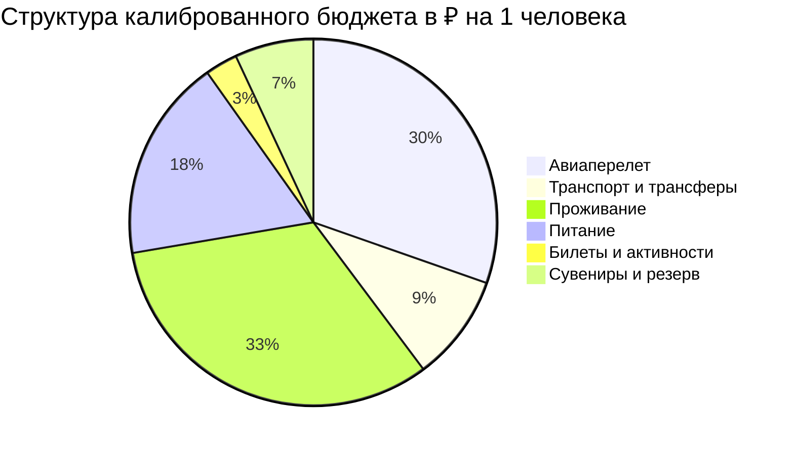

# 💰 Финансы: Владивосток на 7 дней (Калиброванная смета на двоих и на 1 чел.)

> [!summary]+ 💰 Рабочий бюджет: **115 250 ₽** на 1 человека (230 500 ₽ на двоих)
> - ✈️ Авиаперелет: `35 000 ₽`.
> - 🚄 Транспорт и трансферы: `10 850 ₽`.
> - 🏨 Проживание: `37 500 ₽`.
> - 🍜 Питание: `20 600 ₽`.
> - 🎟️ Билеты и активности: `3 300 ₽`.
> - 🎁 Сувениры и резерв: `8 000 ₽`.

---

### ✈️ 1. Международный авиаперелет

| Статья расхода | Стоимость в ₽ | Примечание |
| :--- | ---: | :--- |
| Прямой авиаперелет Москва ⇄ Владивосток (SU 1702/1703) | 35 000 ₽ | На 1 чел. с багажом 23 кг (на двоих: 70 000 ₽) *(план)* |

---

### 🚄 2. Поезда, междугородний транспорт и трансферы

| Статья расхода | Стоимость в ₽ | Примечание |
| :--- | ---: | :--- |
| Прямое такси VVO ⇄ TFL Hotel | 1 800 ₽ | Дни 01 и 07: доля 1 чел.; базовый безопасный сценарий *(план)* |
| Морская экспедиция на скоростном катере к ларгам и гротам | 4 500 ₽ | День 04 (08.09): аренда катера на 1 чел. *(план)* |
| Городское такси и поездки на остров Русский (доля 1 чел.) | 4 550 ₽ | Посуточная сумма такси и фуникулера сверх аэропортовых трансферов *(план)* |

---

### 🏨 3. Проживание (Отели и апартаменты)

| Статья расхода | Стоимость в ₽ | Примечание |
| :--- | ---: | :--- |
| TFL Hotel Vladivostok (Comfort), 6 ночей | 37 500 ₽ | Доля 1 чел. от оценки 75 000 ₽ за номер; заменить фактической ценой брони *(план)* |

---

### 🍜 4. Питание, кофе и гастрономия

| Статья расхода | Стоимость в ₽ | Примечание |
| :--- | ---: | :--- |
| Рестораны Zuma, Супра, Миллионка, Новик и свежие морепродукты | 20 600 ₽ | Сумма семи посуточных лимитов; Zuma запланирована один раз, в День 06 *(план)* |

---

### 🎟️ 5. Входные билеты, канатки и активности

| Статья расхода | Стоимость в ₽ | Примечание |
| :--- | ---: | :--- |
| Билет в Приморский океанариум (экспозиции) | 1 200 ₽ | День 05 (09.09): официальный взрослый тариф на 20.09.2026 *(план)* |
| Подводная лодка С-56 на Корабельной набережной | 200 ₽ | День 01 (05.09): мемориал ТОФ на 1 чел. *(план)* |
| Владивостокский исторический фуникулер | 100 ₽ | День 02 (06.09): подъем и спуск на 1 чел. *(план)* |
| Аренда SUP-бордов в закрытой бухте Новик | 1 800 ₽ | День 05 (09.09): 1.5 часа сап-прогулки на 1 чел. *(план)* |

---

### 🎁 6. Сувениры, локальные специалитеты и резервный буфер

| Статья расхода | Стоимость в ₽ | Примечание |
| :--- | ---: | :--- |
| Рыбный рынок: фаланги краба, красная икра, нерка | 5 000 ₽ | Вакуумная упаковка и термобокс в багаж на 1 чел. *(план)* |
| Конфеты «Приморские» (агар-агар) и дикоросы тайги | 1 000 ₽ | Фабрика «Приморский кондитер», лимонник, чай *(план)* |
| Операционный резервный буфер на погоду и непредвиденное | 2 000 ₽ | Наличные, мелкие расходы, вода, такси *(план)* |

---

## 👥 Сводный расчет бюджета на двоих (Пара)

| Категория | На 1 человека | На двоих (Пара) | Доля в бюджете |
| :--- | ---: | ---: | :---: |
| ✈️ Авиабилеты (багаж 23 кг) | 35 000 ₽ | 70 000 ₽ | 30.4% |
| 🏨 Проживание (Comfort, 6 ночей; оценка) | 37 500 ₽ | 75 000 ₽ | 32.5% |
| 🍜 Питание и морепродукты | 20 600 ₽ | 41 200 ₽ | 17.9% |
| 🚄 Транспорт, катер и такси | 10 850 ₽ | 21 700 ₽ | 9.4% |
| 🎟️ Билеты, Океанариум и сапы | 3 300 ₽ | 6 600 ₽ | 2.9% |
| 🎁 Сувениры, деликатесы и резерв | 8 000 ₽ | 16 000 ₽ | 6.9% |
| **ИТОГО ПОД КЛЮЧ** | **115 250 ₽** | **230 500 ₽** | **100%** |
| **ИТОГО БЕЗ АВИАПЕРЕЛЕТА** | **80 250 ₽** | **160 500 ₽** | — |

> [!WARNING] Что в бюджете ещё не подтверждено
> Авиатариф, TFL Hotel, катер, SUP и цены такси остаются плановыми оценками до появления оплаченных броней. Резерв `2 000 ₽` на человека мал для погодной отмены катера или дорогого трансфера; после фиксации броней разумно довести отдельный резерв до 5–10% от неподтверждённых расходов.
