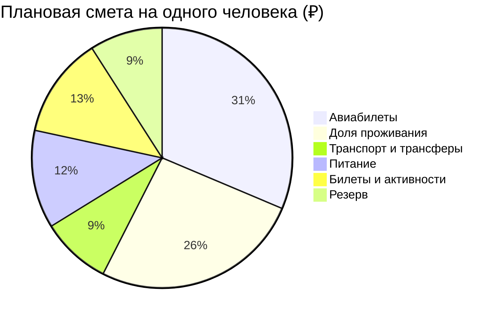

# 💰 Финансы: Владивосток, 5–11 сентября 2027

> [!summary]+ 💰 Плановый бюджет: **~143 500 ₽ на человека** / **~287 000 ₽ на двоих**
> Расчёт: 2 взрослых, один общий номер, 6 ночей. Доля отеля на человека — 37 500 ₽; стоимость номера целиком — 75 000 ₽. Поездка и бронирования не оплачены. Остальные суммы — ориентиры для планирования, с округлением вверх там, где тариф на даты поездки ещё не опубликован.
> - ✈️ **Перелёт Москва — Владивосток — Москва:** `~45 000 ₽/чел.`
> - 🏨 **Проживание:** `75 000 ₽ за номер / 37 500 ₽ на человека при поездке вдвоём`
> - 🚄 **Городской транспорт и трансферы:** `~12 500 ₽/чел.`
> - 🍜 **Питание:** `~17 500 ₽/чел.`
> - 🎟️ **Билеты и активности:** `~18 000 ₽/чел.`
> - 🎁 **Покупки:** `0 ₽ в плане`; **резерв:** `~13 000 ₽/чел.`

```mermaid
pie title Плановая смета на одного человека (₽)
    "Авиабилеты" : 45000
    "Доля проживания" : 37500
    "Транспорт и трансферы" : 12500
    "Питание" : 17500
    "Билеты и активности" : 18000
    "Резерв" : 13000
```

### ✈️ 1. Авиаперелёт Москва ⇄ Владивосток

Для сметы заложено `~45 000 ₽` на человека туда и обратно. Это рабочая оценка по статистике сентябрьских тарифов и опубликованным ценам на соседние месяцы; точная стоимость пары 04–11.09.2027, багаж и условия тарифа зависят от доступных рейсов и проверяются при покупке. Билет не выбран.

| Сегмент | Тариф с багажом | Стоимость ₽ | Статус |
|:---|:---|---:|:---|
| Москва — Владивосток — Москва, 04–11.09.2027 | Эконом, багаж проверить | `~45 000 ₽/чел.` | Плановая оценка; не куплен |

Ориентиры: [Trip.com](https://ru.trip.com/flights/moscow-to-vladivostok/airfares-mow-vvo/) показывает среднюю цену сентябрьского перелёта Москва—Владивосток около `19 358 ₽` в одну сторону за последние 12 месяцев; [Т-Банк Путешествия](https://www.tbank.ru/travel/flights/routes/MOW/VVO/) показывает примеры туда-обратно примерно `31 350 ₽` в сентябре 2026, `39 002 ₽` в июне 2027 и `51 510 ₽` в июле 2027, отмечая колебание цены более чем на 23% в зависимости от срока до вылета. Для дат 2027 года заложено `45 000 ₽/чел.` туда-обратно. Проверено 08.10.2026; точная цена, наличие прямого рейса и багаж на даты поездки требуют проверки при покупке.

### 🚄 2. Поезда, междугородний транспорт и трансферы

| Маршрут | Класс | Стоимость ₽ | Статус / примечание |
|:---|:---|---:|:---|
| День 01 и 07: аэропорт VVO ⇄ TFL Hotel | Такси, 2 поездки на машину | `~5 000 ₽ за пару / ~2 500 ₽ на человека` | План; при расчёте заложено до 2 500 ₽ за поездку |
| Дни 01–07: городские поездки, остров Русский, причалы и запас на тариф | Такси и городской транспорт | `~20 000 ₽ за пару / ~10 000 ₽ на человека` | План; удалённую обратную подачу согласовать заранее |
| **Итого** |  | **`~25 000 ₽ за пару / ~12 500 ₽ на человека`** | Ориентир, без аренды автомобиля |

Для сравнения: [аэропорт Владивостока — электропоезд от 185 ₽ до вокзала](https://aerovlad.ru/ru/transport/trains); [публикация о поездках из центра в аэропорт](https://www.newsvl.ru/vlad/2026/01/11/236139/) указывает средний тариф такси около 1 700 ₽ в одну сторону. В смете заложен более высокий ориентир на такси и поездки по острову Русский. Стоимость поездки в приложении уточнить непосредственно перед заказом.

### 🏨 3. Проживание (Отели и апартаменты)

| Город / локация | Ночей | Тариф / ночь | Итого за локацию (₽) |
|:---|---:|---:|---:|
| Владивосток — [TFL Hotel Vladivostok](https://tflhotel.ru/ru/) | 6 | `12 500 ₽` | `75 000 ₽ за номер` |
| **Итого за номер** | **6** | **`12 500 ₽`** | **`75 000 ₽`** |

Расчёт на человека при размещении двух путешественников в одном номере: `37 500 ₽`. Условия тарифа, завтрак и отмена проверяются при оформлении. Подробности — [[03 - Бронирования/Отели|в заметке об отелях]].

### 🍜 4. Питание, кофе и гастрономия

| Расчёт | На человека |
|:---|---:|
| Обычные завтраки, обеды, ужины и напитки: 7 дней × `2 500 ₽` | `17 500 ₽` |

Это бюджет обычного питания по маршруту; отдельные рестораны, дегустации и гастрономические выезды не заложены. План — `~2 500 ₽/чел.` в день. Для сравнения, [оценка обычного дня питания во Владивостоке](https://russian.tours/skolko-stoit-poezdka-vo-vladivostok-byudzhet-na-dvoih-2026) составляет около `2 800–4 800 ₽` на двоих; здесь заложено `5 000 ₽` на пару в день. При включённом завтраке в тариф отеля фактические расходы могут быть ниже.

### 🎟️ 5. Входные билеты, канатки и активности

| Локация / активность | План на человека | Основание / статус |
|:---|---:|:---|
| Мемориальная подводная лодка С-56 | `~200 ₽` | Плановый ориентир; проверить тариф, режим и оплату на месте |
| Форт № 11 и возможные экскурсионные объекты | `~1 300 ₽` | Расчётный запас на вход/экскурсию; уточнить доступ и билет |
| Морская прогулка «мосты и маяки» | `~4 900 ₽` | По текущей карточке группового тура; программа и цена 2027 года уточняются |
| Новосильцевская батарея | `~100 ₽` | Текущий взрослый тариф музея-заповедника |
| Приморский океанариум | `~1 200 ₽` | Текущий взрослый тариф за экспозицию; слот приобрести после публикации продаж |
| Ворошиловская батарея | `~200 ₽` | Плановый ориентир; тариф, доступ и режим подтвердить у музея |
| День 06: остров Шкота **или** Попов/Ликандера | `~10 000 ₽` | Плановый конверт на морской тур или организованный островной день |
| День 02: фуникулер | `~100 ₽` | Расчётный запас; точный тариф уточнить |
| **Итого** | **`~18 000 ₽/чел.`** | Плановая оценка на одного человека |

Текущие ориентиры: [катерная прогулка к мостам и маякам — 4 900 ₽/чел.](https://extraguide.ru/russia/vladivostok/excursion-127034/), [экспозиция Приморского океанариума — 1 200 ₽](https://primocean.ru/tickets/), [Новосильцевская батарея — 100 ₽](https://fortressvl.ru/events/poseshhenie-novosilcevskoj-batarei/), [Ворошиловская батарея — музей ТОФ](https://museumtof.ru/), [тур на Шкота за 8 200 ₽](https://visit-primorye.ru/events/ekskursiya-ostrov-shkota-po-sledam-pervootkryvatelej) и [другая программа на Шкота за 8 900 ₽](https://visit-primorye.ru/events/katernyj-gastrotur-ostrova-i-morskie-tyuleni), [расписание морского транспорта до Попова](https://www.vl.ru/transport/boat/station). Океанариум, Новосильцевская батарея и катер проверены по публичным страницам 08.10.2026. Карточки Шкота относятся к сезону 2026 и служат примерами; цены и наличие тура на сентябрь 2027 не подтверждены; для поездки использовать тарифы и условия, действующие на даты маршрута.

### 🎁 6. Сувениры, локальные специалитеты и резервный буфер

| Статья | На человека | Примечание |
|:---|---:|:---|
| Покупки и сувениры | `0 ₽` | Не включены в программу и основной бюджет |
| Резервный буфер | `~13 000 ₽` | Около 10% от плановых расходов до резерва; использовать только на изменение тарифов, погоду или внеплановые поездки |

## Сверка с дневными расходами

Суммы дней 01–07: **4 200 + 3 100 + 7 300 + 8 900 + 6 500 + 14 000 + 4 000 = 48 000 ₽ на человека**. Это ровно 12 500 ₽ транспорта + 17 500 ₽ питания + 18 000 ₽ активностей.

Это контрольная сверка уже учтённых категорий, а не дополнительные расходы. Такси делится на двух взрослых, билеты и питание считаются на каждого. При поездке одному смету пересчитать: номер и машина больше не делятся пополам. Тур с включённым трансфером заменяет соответствующие поездки, а не добавляется поверх них. Доплаты за ранний заезд, поздний выезд и дорогу до аэропорта Москвы не включены; при необходимости добавить их отдельно.

## Итог

**Плановая смета — около `143 500 ₽ на человека` и `287 000 ₽ на двоих`**, если жить в одном номере. В расчёт входят авиабилеты, проживание, местный транспорт, обычное питание, запланированные билеты/активности и резерв. Это оценка; после покупки билетов и выбора морского маршрута заменить ориентиры фактическими суммами.
