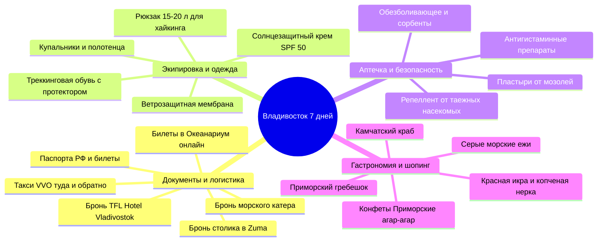

# ✅ Чек-листы экспедиции: Владивосток (7 дней)

> Навигационный хаб для подготовки к путешествию во Владивосток. Включает пошаговый таймлайн сборов от T−30 дней до дня вылета, аптечку, походный комплект для скал и островов, а также полный каталог гастрономических хайлайтов и шопинг-лист дальневосточных сувениров.

---

## 🗺️ Ментальная карта подготовки (Mindmap)

---

## 📂 Разделы чек-листов

1. **[[Чек-лист подготовки и сборов|🎒 Чек-лист подготовки и сборов (Таймлайн T-30, гардероб, аптечка, техника)]]**
2. **[[Что попробовать и купить (Must-Try & Must-Buy)|🦀 Что попробовать и купить (Must-Try & Must-Buy: 20 дальневосточных блюд и сувениров)]]**

---

## ⚡ Экспресс-чек перед выходом из дома

- [ ] Паспорта РФ (оригиналы).
- [ ] Банковские карты и наличные 3 000 ₽ (для лодки С-56, фуникулера и локальных покупок).
- [ ] Смартфоны с офлайн-картами Владивостока (Яндекс Карты) и билетами в Океанариум.
- [ ] Заряженный Power Bank (от 10 000 мАч) и провода зарядки.
- [ ] Треккинговые кроссовки для мыса Тобизина (на ногах или в чемодане).
- [ ] Ветровки для морской прогулки на катере.
- [ ] Солнцезащитные очки и крем SPF 50.
- [ ] Проверен прогноз ветра, осадков и видимости; подтверждён оператор катера.
