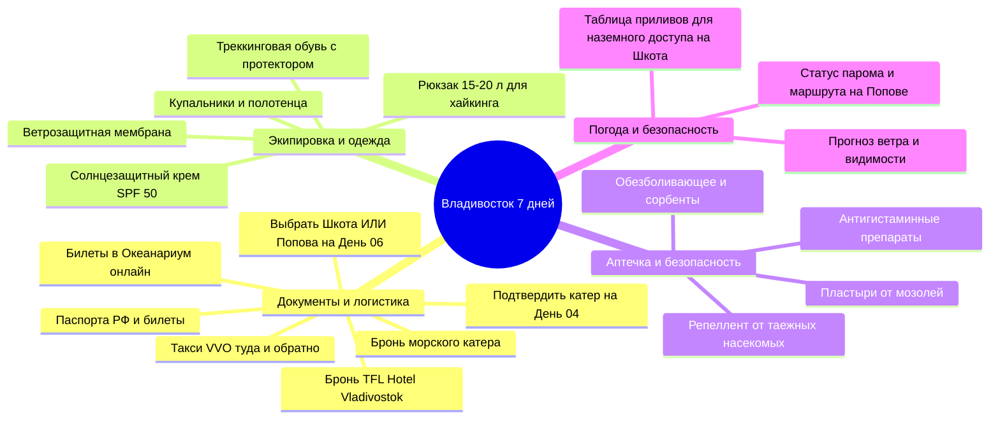

# ✅ Чек-листы экспедиции: Владивосток (7 дней)

> Навигационный хаб для подготовки к поездке 2027 года: перелёт и отель, погода, море, крепость и островные маршруты. Еда остаётся гибкой и необязательной.

---

## 🗺️ Ментальная карта подготовки (Mindmap)

```mermaid
mindmap
  root((Владивосток 7 дней))
    Документы и логистика
      Паспорта РФ и билеты
      Бронь TFL Hotel Vladivostok
      Такси VVO туда и обратно
      Билеты в Океанариум онлайн
      Бронь морского катера
      Подтвердить катер на День 04
      Выбрать Шкота ИЛИ Попова на День 06
    Экипировка и одежда
      Треккинговая обувь с протектором
      Ветрозащитная мембрана
      Купальники и полотенца
      Солнцезащитный крем SPF 50
      Рюкзак 15-20 л для хайкинга
    Аптечка и безопасность
      Пластыри от мозолей
      Антигистаминные препараты
      Репеллент от таежных насекомых
      Обезболивающее и сорбенты
    Погода и безопасность
      Прогноз ветра и видимости
      Таблица приливов для наземного доступа на Шкота
      Статус парома и маршрута на Попове
```

---

## 📂 Разделы чек-листов

1. **[[Чек-лист подготовки и сборов|🎒 Чек-лист подготовки и сборов (Таймлайн T-30, гардероб, аптечка, техника)]]**
2. **[[Что попробовать (по желанию)|🍲 Необязательные идеи местной кухни]]**

---

## ⚡ Экспресс-чек перед выходом из дома

- [ ] Паспорта РФ (оригиналы).
- [ ] Банковские карты и небольшая сумма наличных на билеты и непредвиденные расходы.
- [ ] Смартфоны с офлайн-картами Владивостока и подтверждёнными билетами.
- [ ] Заряженный Power Bank (от 10 000 мАч) и провода зарядки.
- [ ] Треккинговые кроссовки для мыса Тобизина и береговых троп.
- [ ] Ветровки для морской прогулки на катере.
- [ ] Солнцезащитные очки и крем SPF 50.
- [ ] Проверен прогноз ветра, осадков и видимости; подтверждён оператор катера.
