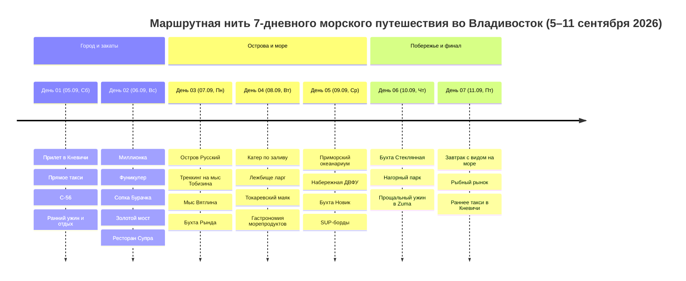

# 🌊 Владивосток и Японское море

## 📝 Краткое описание

Семидневное морское и природное путешествие во Владивосток и на остров Русский для пары (5–11 сентября 2026 года). В фокусе маршрута — Японское море, треккинг по мысам Тобизина и Вятлина, погодозависимая прогулка на катере с возможностью увидеть ларг, Токаревский маяк, панорамы сопок, крупнейший в России Приморский океанариум, бухта Стеклянная и дальневосточная гастрономия.

Базовое размещение — 4* **TFL Hotel Vladivostok** на ул. Нерчинской, 12. Для пары выбран номер категории Comfort площадью 26–30 м²; пешие выходы в центр дополняются такси после дальних выездов и вечером.

---

## 📖 Концепция путешествия

Сентябрь часто даёт комфортную погоду, но не гарантирует ясного неба, штиля или тёплой воды: туман, дождь и сильный ветер возможны. Маршрут сочетает открытое море, скалистый треккинг и портовый город, а погодозависимые дни требуют проверки прогноза и готовности к перестановке:

1. 🛬 **День 01 (05.09, Сб) — Врата Тихого океана и закат над морем:** Прилет в Кневичи, прямое такси в отель, Корабельная набережная, мемориальная ПЛ С-56, набережная Цесаревича и ранний ужин без перегруза после ночного перелёта.
2. 🏙️ **День 02 (06.09, Вс) — Сопки, панорамы и колоритная Миллионка:** Исторический лабиринт старого китайского квартала Миллионка, подъем на историческом фуникулере на сопку Орлиное Гнездо, обед в ресторане «Супра», новая видовая площадка на сопке Бурачка с 360-градусным обзором на бухты и мосты.
3. 🌊 **День 03 (07.09, Пн) — Остров Русский: Скалы Тобизина и мыс Вятлина:** Кульминационный природный день — хайкинг по скалистым обрывам мыса Тобизина над лазурным морем, мыс Вятлина, купание в чистейшей воде и обед свежими морепродуктами в бухте Рында.
4. 🛥️ **День 04 (08.09, Вт) — Морская прогулка к котикам и Токаревский маяк:** Утренняя экспедиция на катере по заливу Петра Великого с выходом к лежбищу ларг на камнях Алексеева и гротам, Токаревский маяк на песчаной косе Эгершельда и дегустация морских ежей.
5. 🐋 **День 05 (09.09, Ср) — Наука океана и тихая бухта Новик:** Грандиозный Приморский океанариум на полуострове Житкова (70-метровый подводный тоннель), парковая набережная ДВФУ, прогулка на SUP-бордах по зеркальной глади закрытой бухты Новик и ужин в яхт-клубе «Новик Кантри Клуб».
6. 🌊 **День 06 (10.09, Чт) — Бухта Стеклянная и Нагорный парк:** Мозаичный пляж бухты Стеклянной, неспешные террасы Нагорного парка и единственный, финальный визит в ресторан «Zuma».
7. 🛫 **День 07 (11.09, Пт) — Морской бриз, рыбный рынок и вылет:** Утренний кофе, покупка деликатесов и ранний прямой трансфер в Кневичи с запасом более двух часов до вылета.

---

## 🗺️ Ключевые параметры

- **Продолжительность:** 7 дней / 6 ночей (05.09.2026 – 11.09.2026).
- **Состав:** Пара (2 взрослых).
- **Базовый отель:** [TFL Hotel Vladivostok 4*](https://tflhotel.ru/ru/) (Владивосток, ул. Нерчинская, 12) — 6 ночей в номере категории Comfort с завтраками.
- **Рабочий бюджет на 1 человека под ключ:** `115 250 ₽` (на двоих: `230 500 ₽`); отель, авиа, катер и SUP пока не подтверждены бронями.
- **Рабочий бюджет без авиа:** `80 250 ₽` на человека (на двоих: `160 500 ₽`).
- **Логистика:** Прямое такси VVO ⇄ TFL как базовый аэропортовый трансфер, катер по подтверждённому ваучеру и такси по городу и острову Русский.

---

## 📅 Сводка по дням

| День | Дата | Локация | Главная тема дня | Ночёвка |
|:---:|:---:|:---|:---|:---|
| **01** | 05.09 (Сб) | Владивосток | Прямой трансфер, С-56, набережные и ранний отдых после перелёта | TFL Hotel |
| **02** | 06.09 (Вс) | Владивосток | Сопки и панорамы, Миллионка, фуникулер, сопка Бурачка и Золотой мост | TFL Hotel |
| **03** | 07.09 (Пн) | Остров Русский | Скалы мыса Тобизина, мыс Вятлина и свежие морепродукты в бухте Рында | TFL Hotel |
| **04** | 08.09 (Вт) | Владивосток / Залив | Морская прогулка на катере, лежбище ларг, Токаревский маяк и гастрономия | TFL Hotel |
| **05** | 09.09 (Ср) | Остров Русский | Приморский океанариум, набережная ДВФУ, бухта Новик и сап-борды | TFL Hotel |
| **06** | 10.09 (Чт) | Приморье / Город | Бухта Стеклянная, Нагорный парк и прощальный ужин в Zuma | TFL Hotel |
| **07** | 11.09 (Пт) | Владивосток ➔ Кневичи | Утренний морской бриз, рыбный рынок, сувениры и вылет | Вылет домой |

---
