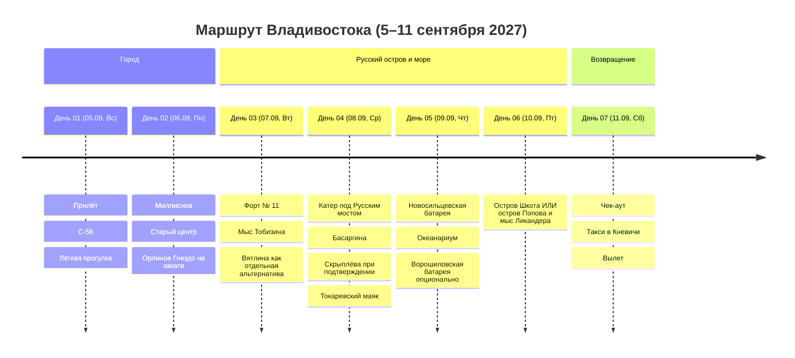

# 🌊 Владивосток и Японское море

## 📝 Краткое описание

План поездки на **5–11 сентября 2027 года**. Маршрут сосредоточен на море, островах, крепостях и характере города; питание — по месту, без ресторанного расписания.

Базовое размещение — TFL Hotel Vladivostok на ул. Нерчинской, 12: 12 500 ₽ за ночь, 75 000 ₽ за шесть ночей. Цена отеля подтверждена пользователем; бронь не оформлена. Перелёт и морские экскурсии ещё нужно выбрать.

---

## 📖 Концепция путешествия

Сентябрь не гарантирует штиля, ясного неба или тёплой воды. Поэтому два морских дня оставлены зависимыми от прогноза и подтверждённого расписания; один из них — короткая прогулка по заливу, второй — отдельная экспедиция на один остров.

1. 🛬 **День 01 (05.09, Вс) — Прибытие и лёгкая прогулка:** трансфер в отель, С-56 и набережная по силам после перелёта.
2. 🏙️ **День 02 (06.09, Пн) — Миллионка и городская панорама:** старый центр и сопка Орлиное Гнездо на закате и в синий час.
3. 🥾 **День 03 (07.09, Вт) — Тобизина и Форт № 11:** длинный маршрут к мысу и фортификация; Вятлина — отдельная альтернатива, не добавочная остановка.
4. 🛥️ **День 04 (08.09, Ср) — Владивосток с воды:** проход под Русским мостом, камни Алексеева и маяк Басаргина; Скрыплёва — только если входит в маршрут оператора. Вечером — Токаревский маяк.
5. 🏰 **День 05 (09.09, Чт) — Батареи и океанариум:** Новосильцевская батарея, основная экспозиция океанариума и, при подтверждённом доступе, Ворошиловская батарея.
6. 🌊 **День 06 (10.09, Пт) — Островная экспедиция:** выбрать Шкота либо Попова и полуостров Ликандера по расписанию, состоянию моря и условиям доступа 2027 года.
7. 🛫 **День 07 (11.09, Сб) — Вылет:** завтрак, чек-аут и прямой трансфер в Кневичи.

```mermaid
timeline
    title Маршрут Владивостока (5–11 сентября 2027)
    section Город
        День 01 (05.09, Вс) : Прилёт : С-56 : Лёгкая прогулка
        День 02 (06.09, Пн) : Миллионка : Старый центр : Орлиное Гнездо на закате
    section Русский остров и море
        День 03 (07.09, Вт) : Форт № 11 : Мыс Тобизина : Вятлина как отдельная альтернатива
        День 04 (08.09, Ср) : Катер под Русским мостом : Басаргина : Скрыплёва при подтверждении : Токаревский маяк
        День 05 (09.09, Чт) : Новосильцевская батарея : Океанариум : Ворошиловская батарея опционально
        День 06 (10.09, Пт) : Остров Шкота ИЛИ остров Попова и мыс Ликандера
    section Возвращение
        День 07 (11.09, Сб) : Чек-аут : Такси в Кневичи : Вылет
```

---

## 🗺️ Ключевые параметры

- **Продолжительность:** 7 дней / 6 ночей (05.09.2027–11.09.2027).
- **Базовый отель:** [TFL Hotel Vladivostok](https://tflhotel.ru/ru/), 6 ночей × 12 500 ₽ = 75 000 ₽; цена подтверждена пользователем, бронь не оформлена.
- **Бюджет:** ориентир около 143 500 ₽ на человека / 287 000 ₽ на двоих при одном общем номере; детализация и допущения — [[04 - Финансы/Финансы|Финансы]].
- **Логистика:** такси по городу и острову Русский; катер, паром и высадки — только по расписанию и условиям оператора.

## 📅 Сводка по дням

| День | Дата | Локация | Главная тема дня | Ночёвка |
|:---:|:---:|:---|:---|:---|
| **01** | 05.09 (Вс) | Владивосток | Прилёт, С-56, набережная и отдых | TFL Hotel |
| **02** | 06.09 (Пн) | Владивосток | Миллионка, старый центр, Орлиное Гнездо вечером | TFL Hotel |
| **03** | 07.09 (Вт) | Остров Русский | Форт № 11 и тропа Тобизина; Вятлина — отдельный вариант | TFL Hotel |
| **04** | 08.09 (Ср) | Владивосток / залив | Катер к мостам и Басаргина; Токаревский маяк | TFL Hotel |
| **05** | 09.09 (Чт) | Остров Русский | Новосильцевская батарея, океанариум, Ворошиловская батарея опционально | TFL Hotel |
| **06** | 10.09 (Пт) | Острова / море | Шкота **или** Попов и Ликандера | TFL Hotel |
| **07** | 11.09 (Сб) | Владивосток ➔ Кневичи | Чек-аут и трансфер в аэропорт | Вылет домой |

## 📂 Быстрый доступ

- [[02 - Маршрутный план/Маршрутный план|Подробный маршрут по дням]]
- [[03 - Бронирования/План покупки билетов|Перелёт: выбор билетов и сроки]]
- [[03 - Бронирования/Отели|Отель и условия заселения]]
- [[03 - Бронирования/Транспорт|Трансферы, катера и острова]]
- [[04 - Финансы/Финансы|Смета и допущения]]
- [[05 - Полезная информация/05 - Полезная информация|Погода, безопасность и запасной день]]
- [[06 - Чек лист/06 - Чек лист|Подготовка и сборы]]

Все часы дневного плана — местные (UTC+10). Дни 01, 04 и 06 используют примерные слоты до покупки билетов и туров; День 07 — относительный порядок действий до выбора обратного рейса. `is_ready: false` сохранён: расписания и брони на сентябрь 2027 ещё требуют подтверждения.
