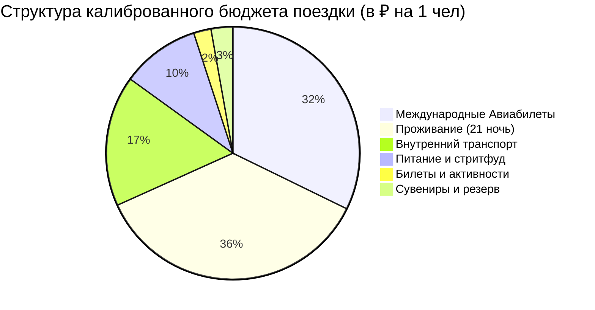

# 💰 Travel Budget Auditor: Финансовая Калибровка и Сметы «Копейка-в-Копейку»

Цель — воспроизводимая арифметика и прозрачные допущения. Не называй оценочную
цену подтвержденной и не смешивай резерв с расходами на сувениры.

---

## 📐 1. Золотые Правила Финансового Аудита

1. **Единство данных (Single Source of Truth):**
   Сумма за проживание в `Финансы.md` ОБЯЗАНА до рубля совпадать со строкой `ИТОГО` в таблице `03 - Бронирования/Отели.md`:
   $$\text{Итого Жильё в Финансах} \equiv \sum (\text{Ночей} \times \text{Цена/ночь в Отели.md})$$
2. **Сходимость суточных расходов:**
   Сумма всех посуточных блоков `## 💰 Финансовые затраты на день` из файлов `02 - Маршрутный план/*` должна коррелировать с суммой категорий «Еда», «Внутренний транспорт» и «Билеты» в файле `Финансы.md`.
3. **Резерв:**
   Показывай резерв отдельно. Размер зависит от неопределенности; 5–10% —
   рекомендация, а не универсальное правило.
4. **Валютная калибровка:**
   Сохраняй исходную валюту, курс, источник и дату курса. Комиссию и валютный
   буфер показывай отдельно, не прячь их в завышенном курсе.
5. **Округление:** считай в исходной валюте и полной точности, конвертируй и
   округляй один раз на уровне строки; итог складывай из показанных строк.
6. **Календарь:** до расчета сверяй число дней, ночей, путешественников и даты
   заселения/выселения.

---

## 📊 2. Архитектура Документа `04 - Финансы/Финансы.md`

Файл строится по строгому шаблону:

### А. Сводный Callout `[!summary]+`:
```markdown
> [!summary]+ 💰 Общий калиброванный бюджет поездки: **~175 000 ₽** (на 1 чел под ключ)
> - ✈️ **Международный авиаперелет:** `58 000 ₽`
> - 🏨 **Проживание (21 ночь по Варианту №1):** `64 721 ₽`
> - 🚄 **Внутренний транспорт (поезда, метро, такси):** `~30 100 ₽`
> - 🍜 **Ежедневное питание и рестораны (22 дня):** `~18 000 ₽`
> - 🎟️ **Входные билеты, онсэны и активности:** `~4 000 ₽`
> - 🎁 **Сувениры, чай и резервный буфер:** `~5 000 ₽`
```

### Б. Диаграмма распределения расходов (Mermaid Pie):

> [!IMPORTANT]
> Названия секторов в кавычках `"..."`, значения — строго целые положительные числа БЕЗ пробелов и знаков валют!

### В. Детализированные сметные таблицы по 6 категориям:
Заголовки таблиц ОБЯЗАНЫ содержать стандартные эмодзи для автоматического сопоставления веб-импортером:
1. `### ✈️ 1. Международный авиаперелет` (таблица: Сегмент, Тариф с багажом, Стоимость ₽, Статус).
2. `### 🚄 2. Поезда, междугородний транспорт и трансферы` (таблица: Маршрут, Класс, Стоимость ₽, Статус / Примечание).
3. `### 🏨 3. Проживание (Отели и апартаменты)` (таблица: Город, Ночей, Тариф/ночь, Итого ₽ — строго из `Отели.md`).
4. `### 🍜 4. Питание, кофе и гастрономия` (расчет: $N \text{ дней} \times \text{суточный норматив}$).
5. `### 🎟️ 5. Входные билеты, канатки и активности` (посещение смотровых, нацпарков, музеев).
6. `### 🎁 6. Сувениры, локальные специалитеты и резервный буфер` (шопинг, чай, подарки, аптека).

---

## ⚖️ 3. Парадигма «План vs Факт» (Plan vs Fact) и Конверты

Веб-приложение **Trip Scheduler** и его парсер `obsidian-importer` работают по финансовой модели **План vs Факт**:

1. **Разделение на Конверты (Лимиты) и Дискретные Транзакции:**
   - **Конверты (Лимиты категорий):**
     - «Питание и стритфуд» (🍜) и «Сувениры / Резерв» (🎁) задают общий **лимит бюджета** (`budgetLimit`) для категории.
     - Парсер **НЕ** создает единую гигантскую фиктивную транзакцию на всю сумму еды (например, на 18 000 ₽). Это позволяет пользователю во время путешествия вносить фактические чеки за завтраки, обеды и ужины, не задваивая бюджет. Прогресс-бар в приложении наглядно показывает освоение лимита конверта.
   - **Дискретные расходы (Транзакции):**
     - Перелеты, отели, поезда (THSR, TRA), паромы, трансферы, билеты на смотровые и визы парсятся как отдельные транзакции со своими суммами, статусами и датами.

2. **Синтаксис статуса оплаты (`paid` vs `planned`):**
   - Если расход уже оплачен (онлайн при подготовке к поездке): добавляйте маркер `*(оплачено)*` или статус `Оплачено онлайн`.
     Пример: `| Билеты на поезд THSR | 4 200 ₽ | Тайбэй ➔ Гаосюн *(оплачено)* |`
   - Если расход планируется оплатить на месте: маркер `*(план)*` или отсутствие отметки об оплате.
     Пример: `| Паром на Зеленый остров | 2 800 ₽ | Тайдун ➔ Зеленый остров *(план)* |`

3. **Привязка к календарным датам (`date`):**
   - Чтобы транзакция автоматически получила точную календарную дату в таймлайне финансов, указывайте дату или день маршрута в строке:
     - Формат даты: `(24.10)` или `(2026-10-24)`.
     - Формат дня: `День 03 (24.10)` или просто название локации из маршрутного плана (например, `Алишань`, `Зеленый остров`).
     - Дата перелета и отелей автоматически извлекается из `Авиаперелеты.md` и `Отели.md`.

---

## 🧮 4. Стандарты Расчета Посуточных Бюджетов в Днях

В конце каждого дневного файла вставляется лаконичный блок:
```markdown
## 💰 Финансовые затраты на день
* Транспорт (метро / автобус): `~250 ₽`.
* Входные билеты / активности: `~300 ₽`.
* Еда (обед + стритфуд + напитки): `~1 200 ₽`.
* **Итого за день (без отеля):** около `~1 750 ₽`.
```

---

## 📚 Справочные материалы
- [Шаблон сметы бюджета и PieChart](./references/budgeting-and-piechart-template.md)
- [Правила валютной конвертации и буферов](./references/currency-and-exchange-rules.md)
