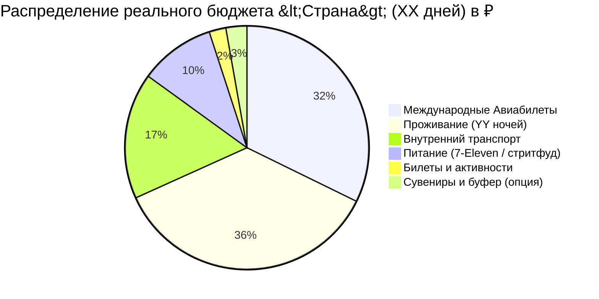

# 💰 Шаблон Расчета Сметы и Диаграммы Mermaid Pie

```markdown
# 💰 Полный Бюджет: <Название тура> (XX дней / YY ночей)

> [!summary]+ 💰 Общий бюджет поездки: **~XXX XXX ₽** (на 1 человека под ключ)
> - ✈️ **Международный авиаперелет (Москва ➔ Город ➔ Москва):** `XX XXX ₽`
> - 🏨 **Проживание (YY ночей по Варианту №1):** `XX XXX ₽`
> - 🚄 **Внутренний транспорт (поезда, скоростные магистрали, паромы, смарт-карты, автобусы):** `~XX XXX ₽`
> - 🍜 **Ежедневное питание (комбини, локальный стритфуд, обеды, рынки — XX дней):** `~XX XXX ₽`
> - 🎟️ **Входные билеты и активности (нацпарки, лодки, снорклинг, канатные дороги):** `~X XXX ₽`
> - 🎁 **Сувениры, чай и подарки (опциональный буфер):** `~X XXX ₽`



---

## 📋 Детализация расходов по категориям

### 1. ✈️ Транспорт и Логистика (~XX XXX ₽ с авиаперелетом)

#### 1.1. ✈️ Международный авиаперелет
| Статья расходов | Стоимость (RUB) | Детали и параметры |
| :--- | :---: | :--- |
| Москва ➔ <Город> ➔ Москва | **`XX XXX ₽`** | Рейс с 1 пересадкой, включен багаж 23 кг |

#### 1.2. 🚄 Междугородние поезда и экспрессы
| Тип поезда / Направление | Маршрут и время | Стоимость (RUB) | Класс и бронирование |
| :--- | :--- | :---: | :--- |
| 🚄 **Скоростной экспресс (300 км/ч)** | <Город А> ➔ <Город Б> *(1 ч 15 мин)* | `X XXX ₽` | За 28 дней онлайн |
| 🚆 **Региональный поезд** | <Город Б> ➔ <Город В> *(25 мин)* | `XXX ₽` | По смарт-карте |

#### 1.3. 🌲 Горная и Островная логистика
| Сегмент | Транспорт | Стоимость (RUB) | Примечание |
| :--- | :--- | :---: | :--- |
| Вокзал ➔ Горы | 🚌 Горный автобус | `XXX ₽` | Оплата картой |
| Материк ➔ Остров (RT) | ⛴️ Скоростной паром | `X XXX ₽` | Билет туда-обратно |

#### 1.4. 🚇 Городской транспорт, Смарт-карта и Буфер
| Статья | Назначение | Стоимость (RUB) | Примечание |
| :--- | :--- | :---: | :--- |
| **Смарт-карта (EasyCard/Suica)** | Метро, автобусы, паромы, покупки в 7-11 | `X XXX ₽` | Пополнение по мере поездок |
| **Резервный буфер такси** | Вечерние возвращения, тяжелый багаж | `X XXX ₽` | Подушка безопасности |

---

### 2. 🏨 Проживание (YY ночей: `XX XXX ₽`)
*См. детальный каталог в файле [[Отели]]. Средняя стоимость: `~X XXX ₽ / ночь`.*

---

### 3. 🍜 Питание и Гастрономия (`~XX XXX ₽`)
* `~XXX–XXX ₽ / день` (завтраки в 7-11/комбини `~150–250 ₽`, обеды `~400–700 ₽`, ночные рынки `~400–800 ₽`).

---

### 4. 🎟️ Входные билеты и Активности (`~X XXX ₽`)
| Локация / Активность | Стоимость (RUB) | Примечание |
| :--- | :---: | :--- |
| Национальный парк | `XXX ₽` | Входной билет |
| Снорклинг с гидом | `X XXX ₽` | Включая экипировку |
```
