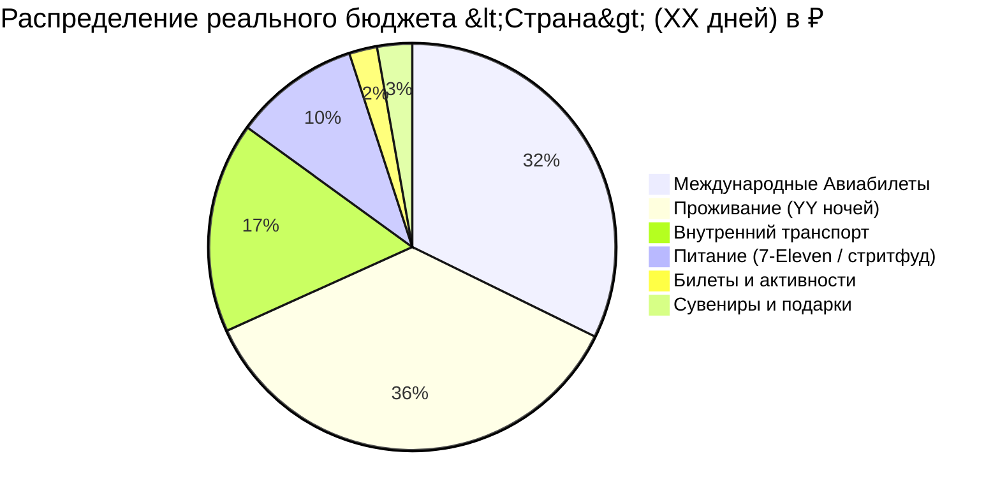

# 💰 Шаблон Расчета Сметы и Диаграммы Mermaid Pie

```markdown
# 💰 Полный Бюджет: <Название тура> (XX дней / YY ночей)

> **Курс и дата:** <1 LOCAL = X RUB; источник; YYYY-MM-DD>
> **Комиссия конвертации:** <X% отдельной строкой>

> [!summary]+ 💰 Общий бюджет поездки: **~XXX XXX ₽** (на 1 человека под ключ)
> - ✈️ **Международный авиаперелет (Москва ➔ Город ➔ Москва):** `XX XXX ₽`
> - 🏨 **Проживание (YY ночей по Варианту №1):** `XX XXX ₽`
> - 🚄 **Внутренний транспорт (поезда, скоростные магистрали, паромы, смарт-карты, автобусы):** `~XX XXX ₽`
> - 🍜 **Ежедневное питание (комбини, локальный стритфуд, обеды, рынки — XX дней):** `~XX XXX ₽`
> - 🎟️ **Входные билеты и активности (нацпарки, лодки, снорклинг, канатные дороги):** `~X XXX ₽`
> - 🎁 **Сувениры, чай и подарки:** `~X XXX ₽`
> - 🛟 **Резерв неопределенности:** `~X XXX ₽`, сверх базовой сметы



Резерв не смешивается с сувенирами и не включается в Pie из шести импортируемых
категорий. Явно покажи базовый итог, резерв и итог с резервом.

---

## 📋 Детализация расходов по 6 категориям

### ✈️ 1. Международный авиаперелет
| Сегмент маршрута | Тариф и багаж | Стоимость в ₽ | Статус |
| :--- | :--- | :---: | :---: |
| Москва ➔ <Город> ➔ Москва | Эконом с багажом 23 кг | **`XX XXX ₽`** | Планируется |

---

### 🚄 2. Поезда, междугородний транспорт и трансферы
| День / Сегмент | Транспорт | Стоимость в ₽ | Примечание |
| :--- | :--- | :---: | :--- |
| **01** Аэропорт ➔ Центр | Скоростной экспресс | `XXX ₽` | По смарт-карте |
| **05** <Город А> ➔ <Город Б> | Скоростной поезд (THSR / Shinkansen) | `X XXX ₽` | Онлайн за 28 дней |
| **15** Материк ➔ Остров (RT) | Паром туда-обратно | `X XXX ₽` | В кассе порта |
| **01–XX** Городской транспорт | Смарт-карта + буфер такси | `X XXX ₽` | Пополнение по ходу поездки |

---

### 🏨 3. Проживание (Отели и апартаменты)
*Полный перечень отелей с фото и описанием см. в каталоге [[Отели]].*

| Город / Локация | Ночей | Тариф / ночь | Итого за локацию (₽) |
| :--- | :---: | :---: | :---: |
| <Город 1> | N | `X XXX ₽` | `XX XXX ₽` |
| <Город 2> | M | `X XXX ₽` | `XX XXX ₽` |
| **ИТОГО (Вариант №1)** | **YY** | **~X XXX ₽** | **`XX XXX ₽`** |

---

### 🍜 4. Питание, кофе и гастрономия
*Расчет: XX дней × ~X XXX ₽/день (завтраки в комбини ~200 ₽, сытные обеды ~500–700 ₽, ночные рынки и стритфуд ~600–900 ₽).*

| Статья расходов | Дней / Норматив | Итоговая сумма |
| :--- | :---: | :---: |
| Ежедневный гастрономический бюджет | XX дней × `~X XXX ₽` | **`~XX XXX ₽`** |

---

### 🎟️ 5. Входные билеты, канатки и активности
| Локация / Активность | Стоимость в ₽ | Примечание |
| :--- | :---: | :--- |
| Национальный парк / Заповедник | `XXX ₽` | Входной билет |
| Смотровая площадка / Башня | `X XXX ₽` | Онлайн бронь |
| Снорклинг / Локальный тур | `X XXX ₽` | Экипировка включена |

---

### 🎁 6. Сувениры, локальные специалитеты и резервный буфер
| Статья расходов | Стоимость в ₽ | Назначение |
| :--- | :---: | :--- |
| Высокогорный чай и сладости | `X XXX ₽` | Подарки и деликатесы |
| Сувениры и традиционные ремесла | `X XXX ₽` | Керамика, открытки, смарт-брелоки |
| Непредвиденный резервный буфер (5–10%) | `X XXX ₽` | Аптека, экстренное такси, мелкие траты |
```
