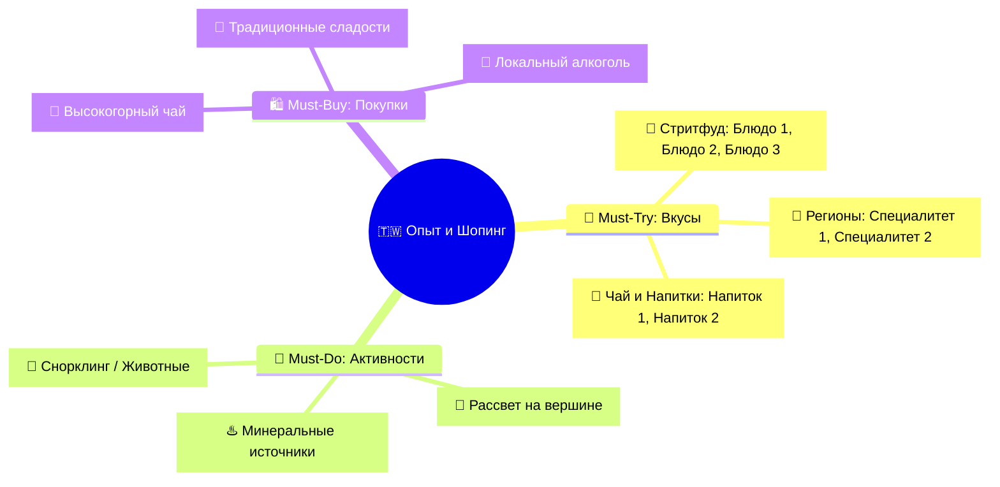

# 🎯 Шаблон Каталога Must-Try & Must-Buy

```markdown
# 🎯 Что попробовать и купить (Must-Try & Must-Buy)

> [!INFO] Полный каталог гастрономии, впечатлений и аутентичного шопинга
> Интерактивный трекер всех вкусов, культовых активностей и лучших сувениров <Страны> с ценами, адресами и проверенными рекомендациями.

---

## 🧭 Карта гастрономии и шопинга



---

## 🍜 I. Must-Try: Гастрономический гид

### 🏮 1. Легендарный стритфуд
- [ ] **<Название блюда на русском (Оригинал / Иероглифы)>:**
  - *Что это:* <Аппетитное описание ингредиентов и способа приготовления>.
  - *Где пробовать:* <Конкретный ночной рынок / лавка (`~XX TWD / ~XXX ₽`)>.

### 🍲 2. Региональные специалитеты
- [ ] **<Блюдо региона>:**
  - *Что это:* <Описание кулинарного ритуала и подачи>.
  - *Где пробовать:* <Ресторан (`~XXX ₽`)>.

### 🍵 3. Чайная культура и Напитки
- [ ] **<Чай / Bubble Tea>:**
  - *Что это:* <История напитка>.
  - *Формула заказа:* **Сахар: 30% (Wei Tang) | Лед: Без льда (Qu Bing)**.

---

## 🎯 II. Must-Do: Культовые активности и впечатления
- [ ] **<Активность 1>:** <Инструкция, утренние часы без толп, экипировка>.
- [ ] **<Активность 2>:** <Смотровые площадки, билеты на рассветный поезд>.

---

## 🛍️ III. Must-Buy: Аутентичный шопинг и сувениры
- [ ] **<Чай / Продукт 1>:** <Сорта, где покупать, ориентир цен>.
- [ ] **<Сувенир 2>:** <Дизайнерские транспортные брелоки, косметика, керамика>.
```
