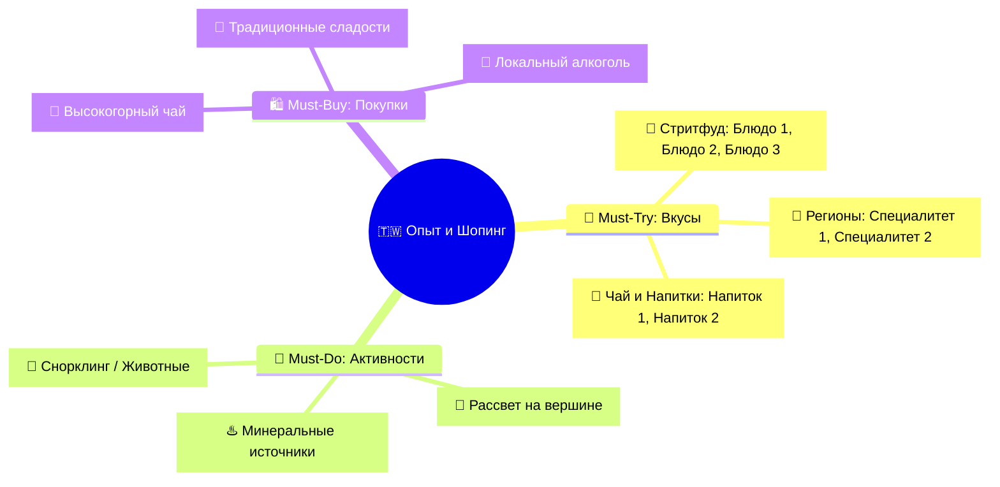

# 🎯 Шаблон Каталога Must-Try & Must-Buy

```markdown
# 🎯 Что попробовать и купить (Must-Try & Must-Buy)

> [!INFO] Полный каталог гастрономии, впечатлений и аутентичного шопинга
> Интерактивный трекер всех вкусов, культовых активностей и лучших сувениров <Страны> с ценами, адресами и проверенными рекомендациями.

---

## 🧭 Карта гастрономии и шопинга



---

## 🍜 I. Must-Try: Гастрономический гид

### 🏮 1. Легендарный стритфуд
- [ ] **<Название блюда на русском (Оригинал / Иероглифы)>** — <Аппетитное описание ингредиентов и способа приготовления>. *(💰 ~XX TWD / ~XXX ₽)*. *Локация:* [<Конкретный ночной рынок / лавка>](https://maps.google.com/...)
  - *Контекст:* <Дополнительные нюансы подачи или секретный соус>.

### 🍲 2. Региональные специалитеты
- [ ] **<Блюдо региона (Оригинал)>** — <Описание кулинарного ритуала, текстуры и вкусового профиля>. *(💰 ~XXX TWD / ~XXX ₽)*. *Локация:* [<Ресторан / Бистро>](https://maps.google.com/...)

### 🍵 3. Чайная культура и Напитки
- [ ] **<Чай / Bubble Tea>** — <Описание напитка и чайного листа>. *(💰 ~XX TWD)*. *Формула:* **Сахар: 30% (Wei Tang) | Лед: Без льда (Qu Bing)**. *Локация:* [<Чайный дом>](https://maps.google.com/...)

---

## 🎯 II. Must-Do: Культовые активности и впечатления
- [ ] **<Активность 1>** — <Инструкция, утренние часы без толп, экипировка>. *Локация:* [<Точка маршрута>](https://maps.google.com/...)
- [ ] **<Активность 2>** — <Смотровые площадки, билеты на рассветный поезд>. *Локация:* [<Смотровая>](https://maps.google.com/...)

---

## 🛍️ III. Must-Buy: Аутентичный шопинг и сувениры
- [ ] **<Высокогорный чай / Продукт>** — <Сорта, сертификация плантаций, вакуумная упаковка>. *(💰 ~XXX TWD)*. *Локация:* [<Чайная лавка>](https://maps.google.com/...)
- [ ] **<Сувенир / Артефакт>** — <Дизайнерские транспортные брелоки, косметика, керамика>. *(💰 ~XXX TWD)*. *Локация:* [<Магазин сувениров>](https://maps.google.com/...)
```
