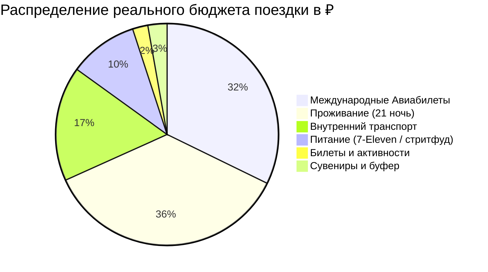

# 🚆 Travel Logistics & Budget: Транспортная Архитектура и Калибровка Бюджета

Этот навык обучает агента строить реалистичные, математически точные и логистически безупречные маршруты, исключающие холостые переезды, перегруз багажом и завышенные расходы.

---

## 🧭 1. Принципы Построения Транспортной Архитектуры

1. **Линейность и отсутствие бэктрекинга (No Backtracking):**
   - Маршрут строится по замкнутому кольцу (например, Тайбэй ➔ Восток ➔ Горы ➔ Юг ➔ Запад ➔ Аэропорт) либо линейно из точки А в точку Б с прямым скоростным выездом в аэропорт вылета в финальный день.
2. **Связки скоростных и живописных поездов:**
   - Для дальних переездов: сверхскоростные поезда (THSR / Синкансэны / KTX) со скоростью 300 км/ч.
   - Для побережий и ущелий: панорамные региональные экспрессы (TRA EMU3000, панорамные вагоны).
   - Для гор: узкоколейные исторические поезда или рейсовые горные автобусы с бронью мест.
3. **Багажные стратегии и путешествия налегке:**
   - Во время выездов в горы (Алишань) или на коралловые острова (Сяолюцю) основной тяжелый багаж бесплатно оставляется в камере хранения отеля в базовом городе (Гаосюн, Цзяи). На уикенд турист едет с легким городским рюкзаком.
4. **Универсальные транспортные смарт-карты:**
   - Использование бесконтактных карт (EasyCard, Suica, Pasmo, T-money) для 90% мелких оплат: метро MRT, городские автобусы, паромы, канатки, покупки в комбини (7-Eleven / FamilyMart).

---

## 💰 2. Стандарты Расчета Бюджета (`Финансы.md`)

Бюджет рассчитывается «под ключ» на 1 человека в российских рублях (с указанием местной валюты при необходимости) и оформляется по стандарту:

### 1. Сводный Callout `[!summary]+`:
```markdown
> [!summary]+ 💰 Общий бюджет поездки: **~175 000 ₽** (на 1 человека под ключ)
> - ✈️ **Международный авиаперелет:** `58 000 ₽`
> - 🏨 **Проживание (21 ночь по Варианту №1):** `64 721 ₽`
> - 🚄 **Внутренний транспорт:** `~30 100 ₽`
> - 🍜 **Ежедневное питание (22 дня):** `~18 000 ₽`
> - 🎟️ **Входные билеты и активности:** `~4 000 ₽`
> - 🎁 **Сувениры, чай и подарки (буфер):** `~5 000 ₽`
```

### 2. Круговая Диаграмма Mermaid Pie:


### 3. Детализация расходов по 6+ категориям:
- Авиабилеты (багаж, пересадки).
- Индивидуальные авто / чартеры (для труднодоступных скал/водопадов).
- Поезда (таблица с ценами, временем в пути и сроками открытия онлайн-бронирования за 28-30 дней).
- Горная и островная логистика (паромы, аренда байков, горные автобусы).
- Городской транспорт и карты метро.
- Сводный каталог проживания со средней ценой за ночь (`~2 500 – 4 000 ₽ / ночь` для комфорт-отелей).

---

## 📚 Справочники и примеры
- [Правила маршрутизации и транспортные связки](./references/transit-routing-rules.md)
- [Шаблон сметы бюджета и Mermaid Pie](./references/budgeting-and-piechart-template.md)
- [Пример таблиц логистики и финансов из Тайваня](./examples/finances-and-transit-sample.md)
