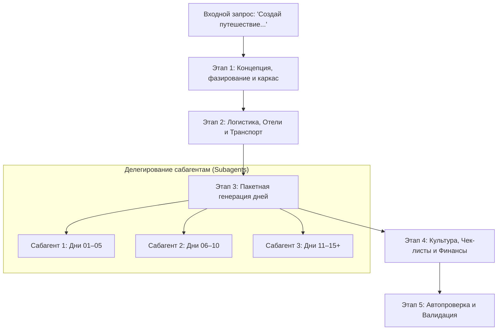

# 🌍 Travel Master Trip Creator: Комплексное Проектирование Путешествий

Используй этот навык, когда пользователь дает общий запрос на планирование поездки:
- *«Создай путешествие в [страну/регион] на N дней...»*
- *«Спланируй маршрут под ключ по...»*
- *«Разверни полный тур с отелями, поездами и днями...»*

Этот навык выступает **главным дирижером (оркестратором)** всей экосистемы travel-навыков, гарантируя бескомпромиссную детализацию, отсутствие ленивых сокращений и 100% совместимость с импортером `Trip Scheduler`.

---

## 🛑 1. Золотой стандарт: Принцип нулевых сокращений (No-Cutoffs Policy)

1. **Категорически запрещены любые сокращения:**
   - ❌ Никаких многоточий `...`, `<!-- продолжение следует -->`, `<!-- аналогично для дней 5-10 -->`.
   - ❌ Никаких фраз вида «Заполните этот раздел самостоятельно» или «Остальные дни строятся аналогично».
   - ❌ Никаких пустых таблиц без цен или без реальных ссылок.
2. **Каждый день экспедиции расписывается индивидуально и полностью:**
   - Четкие временные интервалы (утро, день, вечер, ночной слот).
   - Точные названия локаций на русском и оригинальном языке (напр., *Ximending (西門町)*).
   - Логика перемещения от двери до двери (выходы метро, номера автобусов/поездов).
   - Гастрономические и культурные акценты с рекомендацией конкретных блюд и заведений.
   - Обязательные коллауты подготовки `[!IMPORTANT]` и безопасности `[!CAUTION]`.
3. **Все цены калибруются в рублях (₽):**
   - Каждый отель, поезд, билет в музей, сим-карта и суточные расходы имеют рассчитанную рублевую стоимость на даты поездки.
   - Финансовая смета в `04 - Финансы/Финансы.md` математически строго сходится со всеми днями и каталогами бронирований.

---

## 👥 2. Оркестрация Сабагентов и Глубокое Рассуждение

Создание путешествия на 10–30 дней требует значительного объема контекста. Если попытаться сгенерировать все файлы за один ответ, модель неизбежно начнет экономить токены и сжимать дни.

### Рекомендуемый протокол разделения задач (Workflow):



### Как задействовать сабагентов (`invoke_subagent`):
- Для генерации больших блоков дней вызывай сабагентов (роли: `Itinerary Writer (Days 01-05)`, `Itinerary Writer (Days 06-10)`).
- Передавай сабагенту:
  1. Общую концепцию тура и даты.
  2. Города базирования и выбранные отели на эти дни.
  3. Требования навыка `travel-itinerary-enricher` (5 обязательных слоев, коллауты, временные слоты).
  4. Запрет на сокращения.

---

## 📋 3. Пошаговый пайплайн создания путешествия

### Шаг 1: Интервью и фиксация базовых параметров
Если пользователь не указал ключевые параметры, уточни их (или зафиксируй взвешенные дефолты и явно уведоми пользователя):
- **Даты и длительность:** сезон, праздники (цветение сакуры, тайфуны, золотая неделя).
- **Формат:** 100% активный отпуск, воркейшн (удаленная работа + путешествие) или гибрид.
- **Бюджетный класс:** комфорт / средний класс (напр., отели 6 000 – 12 000 ₽ / ночь с рабочими столами и Wi-Fi 150+ Мбит/с).
- **Состав путешественников:** соло, пара, семья, компания.

### Шаг 2: Создание структуры папок и Хаба (`travel-vault-architect`)
Создай папку `Personal Note/Travel/-- <Название>/` со стандартным деревом:
```text
Personal Note/Travel/-- <Название>/
├── <Название>.md
├── 01 - Заметки/
├── 02 - Маршрутный план/
├── 03 - Бронирования/
├── 04 - Финансы/
├── 05 - Полезная информация/
├── 06 - Чек лист/
└── _/
    ├── all/
    └── hotels/
```
Создай главный файл `<Название>.md` с Frontmatter (`startDate`, `endDate`, `cover`, `descriptionShort`, `tags`, `cities`) и обзорной концепцией.

### Шаг 3: Каталоги бронирований (`travel-logistics-cataloger`)
В папке `03 - Бронирования/` создай:
1. `Отели.md`:
   - Сводная калиброванная таблица (с опциональной колонкой `Локация отеля`).
   - Детальные карточки с указанием Wi-Fi, рабочего стола, цен и строки фото: `*Фото:* ![[photo1.jpg]]` или блока `> [!INFO]- Картинки`.
2. `Транспорт.md` / `Поезда, Паромы и Трансферы.md`:
   - Полная хронологическая таблица всех междугородних билетов.
   - Граф `mermaid flowchart TD` всей цепочки перемещений с номерами поездов/рейсов.

### Шаг 4: Развертывание всех дней (`travel-itinerary-enricher`)
В папке `02 - Маршрутный план/`:
1. Создай `Маршрутный план.md` со сводной таблицей всех дней тура со статусами и ссылками `[[01 ...]]`.
2. Создай отдельный файл для **каждого дня** тура (`01 <Город> (<дн>) <эмодзи> <Название>.md`).
3. Для воркейшн-дней применяй правила `travel-workation-designer` (утренний экскурсионный блок до 15:00, рабочий блок 16:00–22:00, ночные рынки после 22:00).
4. Для хайкингов применяй правила `travel-hiking-trail-enricher` (профиль высот, ссылки AllTrails/Komoot, точки схода).

### Шаг 5: Культурный контекст и Чек-листы
1. `05 - Полезная информация/05 - Полезная информация.md`:
   - Культурный этикет, запреты и правила въезда (`travel-safety-and-compliance`).
2. `06 - Чек лист/Что попробовать и купить (Must-Try & Must-Buy).md`:
   - Каталог ТОП-10 гастрономических хайлайтов и сувениров (`travel-cultural-curator`).
3. `06 - Чек лист/Чек-лист подготовки и сборов.md`:
   - Таймлайн T-30d, T-14d, T-7d, T-1d, аптечка, зарядные устройства.

### Шаг 6: Финансовый баланс (`travel-budget-auditor`)
В файле `04 - Финансы/Финансы.md`:
1. Сведи все категории: ✈️ Перелеты, 🏨 Проживание, 🚄 Транспорт, 🎟️ Достопримечательности, 🍲 Питание, 📱 Связь, 🛍️ Шопинг, 🛡️ Страховка.
2. Построй диаграмму `mermaid pie title Структура расходов`.
3. Сверь итоговую сумму с шапкой `<Название>.md`.

### Шаг 7: Автопроверка совместимости с импортером
Запусти валидатор структуры и контракта импортера:
```bash
bun run skills:install --check "Personal Note/Travel/-- <Название>"
```
Исправь любые предупреждения о структуре таблиц или именах файлов.

---

## ⚡ 4. Памятка по качеству для Агента

- **Глубокий фактчекинг:** Проверяй актуальность расписаний поездов (Shinkansen, THSR, KTX), дни закрытия музеев (часто понедельник) и сезонные особенности.
- **Машиночитаемость:** Ссылки на локации оформляй в виде `[Название](https://www.google.com/maps/search/?api=1&query=lat,lon)`.
- **Живой язык и атмосфера:** Пиши так, чтобы путешественник ощущал предвкушение поездки, но получал строгие прикладные инструкции без "воды".
