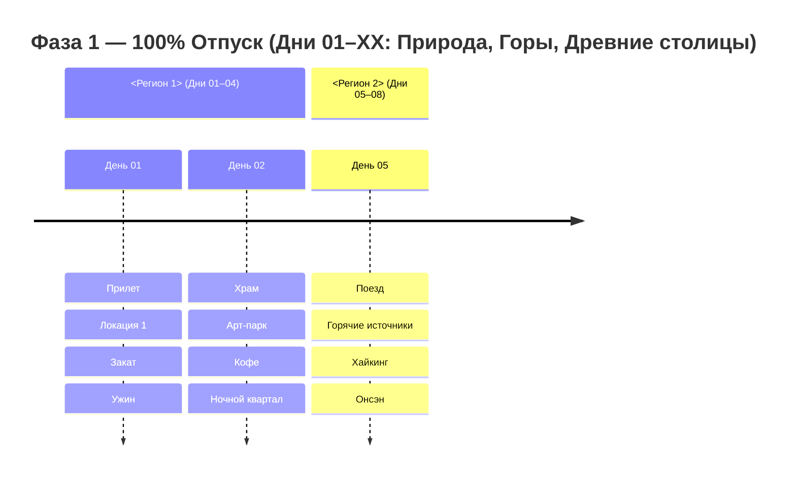
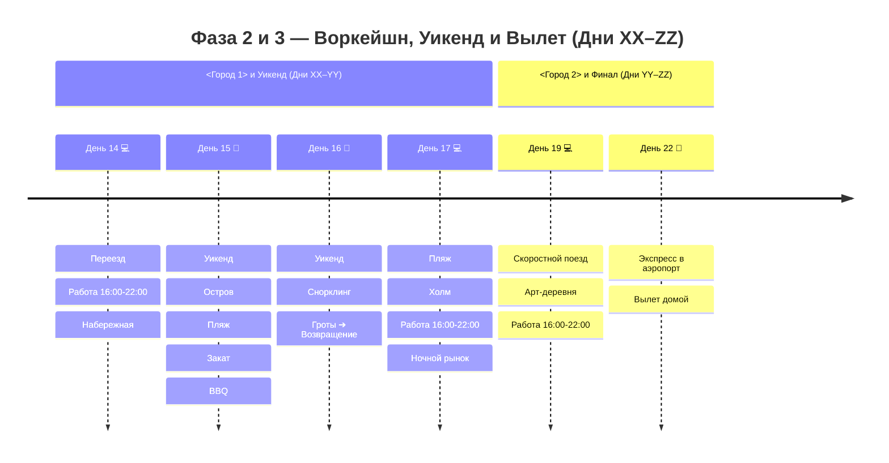

# 📄 Шаблоны Главного Хаба и Мастер-Плана

## 1. Шаблон Главного Хаба `<Страна>.md`

```markdown
# <Название Страны / Экспедиции>

## 📝 Краткое описание

<Емкое связное описание путешествия на 2-4 предложения: продолжительность, ключевые регионы, акценты отпуска, воркейшна и финальной точки. Используется для превью тура и краткой карточки.>

## 📖 Подробная концепция путешествия

Четкое и выверенное разделение на <N> гармоничные фазы:

1. 🌴 **Фаза 1 (Дни 01–XX — N дней):** **100% ПОЛНЫЙ ОТПУСК И СВОБОДА ОТ РАБОТЫ.** Экспедиция с максимальным погружением в природу и культуру: <Краткое перечисление ключевых локаций и эмоций>.

2. 💻 **Фаза 2 (Дни XX–YY — M дней):** **ГОРОДСКОЙ ВОРКЕЙШН И ОСТРОВНОЙ/ГОРНЫЙ УИКЕНД.** 
   * 💻 **Будние дни воркейшна (<K> дней — в <Городе 1> и <Городе 2>):**
     * 🌅 **До 15:00/15:15 — Расширенный дневной городской слот:** <достопримечательности, прогулки, музеи, неспешные обеды>.
     * ☕ **С 15:15/15:30 до 16:00 — Комфортная подготовка к работе (30–45 мин):** возвращение в отель, душ, настройка рабочего места.
     * 💻 **С 16:00 до 22:00 — Выделенная работа в отеле:** **6 часов глубокого фокуса** на оптоволоконном интернете (11:00–17:00 по Москве; при 8ч — до 00:00).
     * 🌙 **После 22:00 — Вечерний гастро-релакс:** знаменитые ночные рынки, набережные.
   * 🐢/🌲 **Уикенд (<2 дня>, суббота и воскресенье):** **100% ВЫХОДНЫЕ ДНИ БЕЗ РАБОТЫ!** <Остров, горы, активности>.

3. 🛫 **Фаза 3 (День ZZ — 1 день):** **ФИНАЛ И ПРЯМОЙ ВЫЛЕТ.** Утренний кофе, скоростной поезд в аэропорт и комфортный вылет домой.





---

## 🗺️ Ключевые параметры

* **Продолжительность:** XX дней / YY ночей.
* **Структура ночевок (YY ночей):**
  * <Город 1> — **N ночей** (*<Название отеля>*).
  * <Город 2> — **M ночей** (*<Название отеля>*).
* **Калиброванный бюджет проживания (YY ночей):** **`XX XXX ₽`** (в среднем `~X XXX ₽ / ночь`) — комфортные городские дизайн-отели, видовые B&B, строго без оверпрайса.
* **Бюджет под ключ на 1 чел:** **`~XXX XXX ₽`** (международные авиабилеты `XX XXX ₽`, проживание `XX XXX ₽`, транспорт `~XX XXX ₽`, питание `~XX XXX ₽`, активности `~X XXX ₽`, сувениры `~X XXX ₽`).

---

## 📋 Разделы проекта `-- <Название>`

1. **[[Personal Note/Travel/-- <Название>/02 - Маршрутный план/Маршрутный план|🗓️ Сводный Маршрутный план (XX Дней)]]**
2. **[[Гайд по удаленной работе и кофейням <Страны>|💻 Гайд: Удаленная работа, Скорости и Коворкинги]]**
3. **[[<Регион 1>|🏙️ Заметки: <Регион 1>]]**
4. **[[<Регион 2>|♨️ Заметки: <Регион 2>]]**
...
11. **[[Personal Note/Travel/-- <Название>/03 - Бронирования/Отели|🏨 Бронирования: Отели и Воркейшн-миньсу]]**
12. **[[Поезда, Паромы и Трансферы|🚆 Бронирования: Поезда, Паромы и Трансферы]]**
13. **[[Personal Note/Travel/-- <Название>/03 - Бронирования/Авиаперелеты|✈️ Бронирования: Авиаперелеты]]**
14. **[[Personal Note/Travel/-- <Название>/04 - Финансы/Финансы|💰 Бюджет и Полная смета (XX дней)]]**
15. **[[05 - Полезная информация|📖 Полезная информация: История, Дух Мест и Культурный Код]]**
16. **[[06 - Чек лист|✅ Чек-листы: Подготовка, Сборы, Must-Try & Must-Buy]]**
```

---

## 2. Шаблон Сводного Маршрутного Плана (`02 - Маршрутный план/Маршрутный план.md`)

```markdown
# 🗺️ Маршрутный план: <Название тура> (XX дней)

> **Формат тура:** 
> * 🌴 **Фаза 1 (Дни 01–XX / N дней):** **100% ПОЛНЫЙ ОТПУСК И СВОБОДА ОТ РАБОТЫ.** ...
> * 💻 **Фаза 2 (Дни XX–YY / M дней):** **ГОРОДСКОЙ ВОРКЕЙШН И ОСТРОВНОЙ УИКЕНД.** ...
> * 🛫 **Фаза 3 (День ZZ / 1 день):** **ФИНАЛ И ПРЯМОЙ ВЫЛЕТ.** ...

---

## 🗓️ Сводная таблица XX дней

|  День  | День нед. | Регион / Локация    | Программа дня                                           |  Фаза тура  |
|:----: |:-------: |:------------------ |:------------------------------------------------------ |:---------: |
| **01** |    Сб     | 🏙️ <Город 1>        | Прилет, EasyCard/Suica, заселение, закат, ночной рынок |  🌴 Отпуск  |
| **02** |    Вс     | 🏙️ <Город 1>        | Храм, Арт-парк, спешелти-кофе, исторический квартал    |  🌴 Отпуск  |
...
| **14** |    Пт     | 🚢 <Город 2> 💻     | Переезд, заселение. 16:00–22:00: Работа (11–17 МСК)    | 💻 Воркейшн |
| **15** |    Сб     | 🐢 <Остров>         | Выходной! Паром, B&B у океана, пляж, закат, Seafood BBQ| 🌴 Уикенд  |
...
| **22** |    Сб     | 🛫 Вылет домой      | Скоростной экспресс в аэропорт, комфортный вылет       |  🛫 Вылет   |

---

## 🧭 Навигация по дневным файлам

### 🏙️ Этап I: <Название этапа>
<Краткое вдохновляющее описание этапа.>

* **День 01 (сб):** [[01 <Город> (сб) 🛬 <Хайлайты>]]
  <2-3 строки описания программы дня>.
* **День 02 (вс):** [[02 <Город> (вс) 🏙️ <Хайлайты>]]
  <2-3 строки описания программы дня>.
...
```
