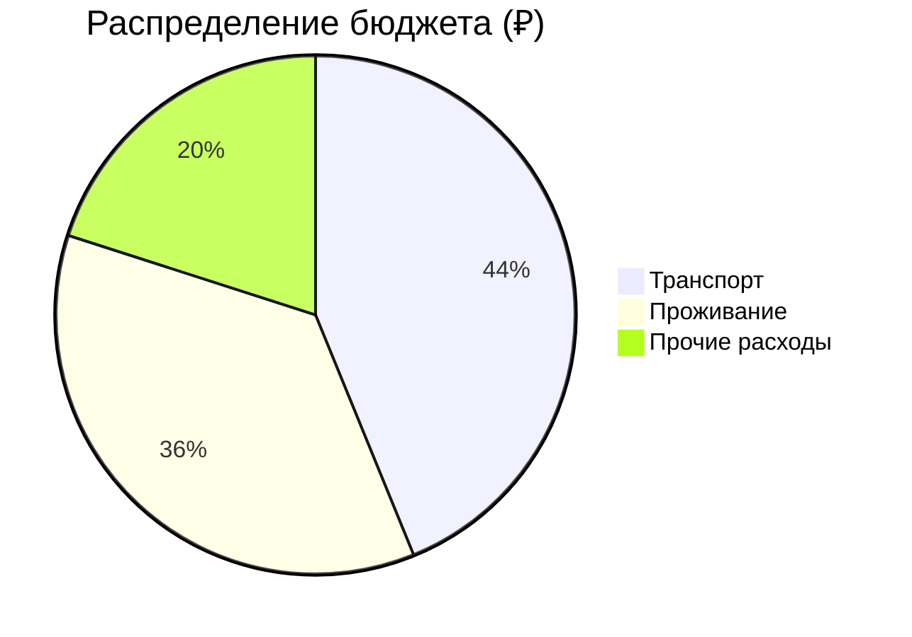
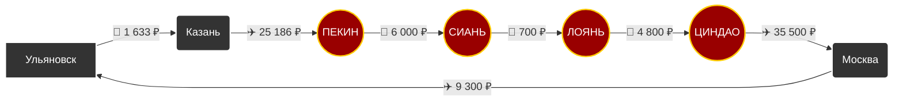

# 🗺️ Маршрут: Ульяновск → Китай → Ульяновск

> [!summary]+ 💰 Общий бюджет поездки: **189 619 ₽**
> - ✈️ **Транспорт:** 83 119 ₽
> - 🏨 **Проживание:** 68 500 ₽
> - 🍜 **Остальное:** 38 000 ₽

---

### 📍 Визуальный маршрут

---
### 📋 Детализация расходов

> [!info]- ✈️ Логистика (83 119 ₽)
> *Нажмите, чтобы развернуть детали*
> 
> | Откуда | Куда | Тип | Стоимость |
> | :--- | :--- | :---: | ---: |
> | Ульяновск | Казань | 🚂 Поезд | `1 633 ₽` |
> | Казань | Пекин | ✈️ Авиа | `25 186 ₽` |
> | Пекин | Сиань | 🚂 Поезд | `6 000 ₽` |
> | Сиань | Лоянь | 🚂 Поезд | `700 ₽` |
> | Лоянь | Циндао | 🚂 Поезд | `4 800 ₽` |
> | Циндао | Москва | ✈️ Авиа | `35 500 ₽` |
> | Москва | Ульяновск | ✈️ Авиа | `9 300 ₽` |

> [!abstract]- 🏨 Проживание (68 500 ₽)
> *Нажмите, чтобы развернуть детали*
> 
> | Город | Стоимость |
> | :--- | ---: |
> | 🇨🇳 Пекин | `23 700 ₽` |
> | 🇨🇳 Сиань | `10 000 ₽` |
> | 🇨🇳 Лоянь | `10 000 ₽` |
> | 🇨🇳 Циндао | `24 800 ₽` |

> [!todo]- 🍜 Повседневные расходы (38 000 ₽)
> *Нажмите, чтобы развернуть детали*
> 
> | Статья расходов | Стоимость |
> | :--- | ---: |
> | 🍽️ Еда | `28 000 ₽` |
> | 🚕 Местный транспорт | `1 000 ₽` |
> | 🎟️ Развлечения и билеты | `9 000 ₽` |

