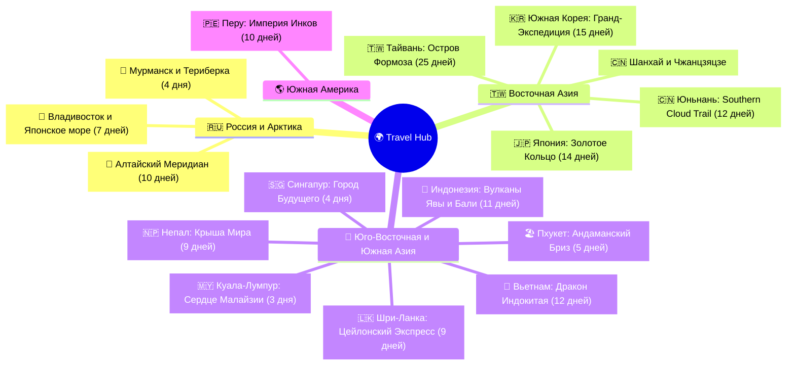

# 🌍 Travel Atlas

## 🗺️ Карта готовых экспедиций и маршрутов



---

## 📋 Сводный реестр всех экспедиций

| Флаг / Направление | Название экспедиции                                                                                         |  Дней  | Ключевой акцент маршрута                                                     |
| :----------------: | :---------------------------------------------------------------------------------------------------------- | :----: | :--------------------------------------------------------------------------- |
|   🌲 **Россия**    | **[[Personal Note/Travel/-- Altai/Altai\|Алтайский Меридиан]]**                                             | **10** | Телецкое озеро, Чемал, Караколы, Чуйский тракт, Марс, Ретранслятор 3038 м    |
|   🌌 **Россия**    | **[[Personal Note/Travel/-- Murmansk/Murmansk\|Мурманск и Арктика]]**                                       | **4**  | Ледокол Ленин, Алёша, Териберка, Баренцево море, Саамы, Северное сияние      |
|   🌊 **Россия**    | **[[Personal Note/Travel/-- Владивосток/Владивосток\|Владивосток и Японское море]]**                         | **7**  | Мыс Тобизина, мыс Вятлина, катер к ларгам, Токаревский маяк, Океанариум, сопки и морепродукты |
|  🇯🇵 **Япония**   | **[[Personal Note/Travel/-- Japan/Japan\|Золотое Кольцо Японии]]**                                          | **14** | Токио (5д), Камакура, Хаконэ (Фудзи), Киото (3д), Нара, Осака, Миядзима, Химэдзи |
|  🇹🇼 **Тайвань**  | **[[Personal Note/Travel/-- Taiwan/Taiwan\|Остров Формоза (Воркейшн & Отпуск)]]**                            | **25** | Тайбэй, Цзяоси, Хуалянь, Цзяи, Фэньциху, Шичжоу, Алишань, Тайнань, Гаосюн, Сяолюцю, Тайчжун |
|  🇮🇩 **Индонезия** | **[[Personal Note/Travel/-- Indonesia/Indonesia\|Вулканы Явы и Дзен Бали]]**                                | **11** | Боробудур, Прамбанан, поезда KAI, кратер Бромо, Синее Пламя Иджена, Убуд, Секумпул, Улувату |
| 🇱🇰 **Шри-Ланка**  | **[[Personal Note/Travel/-- Sri Lanka/Sri Lanka\|Цейлонский Экспресс]]**                                    |  **9** | Сигирия, Дамбулла, Храм Зуба Будды, Нувара-Элия, Синий поезд в Эллу, Сафари Удавалаве, Мирисса, Форт Галле |
|    🇳🇵 **Непал**    | **[[Personal Note/Travel/-- Nepal/Nepal\|Крыша Мира и Аннапурна]]**                                         |  **9** | Катманду (Боднатх, Сваямбунатх), Бхактапур, полет в Покхару, Озеро Фева, Рассвет на Poon Hill (3210 м), Дхаулагири, Патан |
|    🇵🇪 **Перу**     | **[[Personal Note/Travel/-- Peru/Peru\|Империя Инков и Анды]]**                                             | **10** | Лима (Мирафлорес), Куско, Мачу-Пикчу (ЮНЕСКО), поезд Vistadome, Соляные копи Марас, Радужные горы (5036 м) |
|   🐉 **Вьетнам**   | **[[Personal Note/Travel/-- Vietnam/Vietnam\|Дракон Индокитая]]**                                           | **12** | Ханой, Транг Ан Ниньбинь, Круиз Халонг 5*, Хюэ, Хойан, Золотой Мост Дананга  |
|  🏖️ **Таиланд**   | **[[Personal Note/Travel/-- Phuket/Phuket\|Пхукет и Андаман]]**                                             | **5**  | Ката Бич, Большой Будда, Black Rock, Промтхеп, Пхукет-таун, Freedom Beach    |
|   🇰🇷 **Корея**   | **[[Personal Note/Travel/-- South Korea/South Korea\|Южная Корея]]**                                        | **15** | Сеул (дворцы, неон), KTX, Пусан, древний Кёнджу (Силла), Чеджу (Халласан)    |
| 🇸🇬 **Сингапур**  | **[[Personal Note/Travel/-- Singapore/Singapore\|Город Будущего]]**                                         | **4**  | Marina Bay Sands, Gardens by the Bay, Сентоза, Chinatown, Jewel Changi       |
| 🇲🇾 **Малайзия**  | **[[Personal Note/Travel/-- Kuala Lumpur/Kuala Lumpur\|Куала-Лумпур]]**                                     | **3**  | Башни Петронас, пещеры Бату, Bukit Bintang, Merdeka 118, стритфуд Jalan Alor |
|   🇨🇳 **Китай**   | **[[Personal Note/Travel/-- The Southern Cloud Trail/The Southern Cloud Trail\|The Southern Cloud Trail]]** | **12** | Куньмин, Каменный лес, Дали, Лицзян, Ущелье Прыгающего Тигра, Шангри-Ла      |
|   🇨🇳 **Китай**   | **[[Personal Note/Travel/01 Shanghai/Shanghai\|Шанхай]]**                                                   | **4**  | Набережная Вайтань, небоскребы Пудуна, сад Юйюань, Французская концессия     |
|   🇨🇳 **Китай**   | **[[Personal Note/Travel/02 Zhangjiajie/Zhangjiajie\|Чжанцзяцзе]]**                                         | **4**  | Горы Аватара (Тяньцзы, Юаньцзяцзе), Стеклянный мост, гора Тяньмэнь           |

## 📂 Быстрый доступ к папкам проектов:

* 🌊 [**-- Владивосток**](file:///home/injurka/Documents/obsidian-mark/Personal%20Note/Travel/--%20%D0%92%D0%BB%D0%B0%D0%B4%D0%B8%D0%B2%D0%BE%D1%81%D1%82%D0%BE%D0%BA/%D0%92%D0%BB%D0%B0%D0%B4%D0%B8%D0%B2%D0%BE%D1%81%D1%82%D0%BE%D0%BA.md) — 7 дней по Владивостоку и Японскому морю
* 🇳🇵 [**-- Nepal**](file:///home/injurka/Documents/obsidian-mark/Personal%20Note/Travel/--%20Nepal/Nepal.md) — 9 дней по Непалу
* 🇵🇪 [**-- Peru**](file:///home/injurka/Documents/obsidian-mark/Personal%20Note/Travel/--%20Peru/Peru.md) — 10 дней по Перу
* 🇱🇰 [**-- Sri Lanka**](file:///home/injurka/Documents/obsidian-mark/Personal%20Note/Travel/--%20Sri%20Lanka/Sri%20Lanka.md) — 9 дней по Шри-Ланке
* 🇮🇩 [**-- Indonesia**](file:///home/injurka/Documents/obsidian-mark/Personal%20Note/Travel/--%20Indonesia/Indonesia.md) — 11 дней по Индонезии
* 🇯🇵 [**-- Japan**](file:///home/injurka/Documents/obsidian-mark/Personal%20Note/Travel/--%20Japan/Japan.md) — 14 дней по Японии
* 🌲 [**-- Altai**](file:///home/injurka/Documents/obsidian-mark/Personal%20Note/Travel/--%20Altai/Altai.md) — 10 дней по Алтаю
* 🌌 [**-- Murmansk**](file:///home/injurka/Documents/obsidian-mark/Personal%20Note/Travel/--%20Murmansk/Murmansk.md) — 4 дня в Заполярье и Териберке
* 🇹🇼 [**-- Taiwan**](file:///home/injurka/Documents/obsidian-mark/Personal%20Note/Travel/--%20Taiwan/Taiwan.md) — 25 дней по Тайваню (Воркейшн & Отпуск)
* 🐉 [**-- Vietnam**](file:///home/injurka/Documents/obsidian-mark/Personal%20Note/Travel/--%20Vietnam/Vietnam.md) — 12 дней по Вьетнаму
* 🏖️ [**-- Phuket**](file:///home/injurka/Documents/obsidian-mark/Personal%20Note/Travel/--%20Phuket/Phuket.md) — 5 дней на Пхукете
* 🇰🇷 [**-- South Korea**](file:///home/injurka/Documents/obsidian-mark/Personal%20Note/Travel/--%20South%20Korea/South%20Korea.md) — 10 дней по Корее
* 🇸🇬 [**-- Singapore**](file:///home/injurka/Documents/obsidian-mark/Personal%20Note/Travel/--%20Singapore/Singapore.md) — 4 дня в Сингапуре
* 🇲🇾 [**-- Kuala Lumpur**](file:///home/injurka/Documents/obsidian-mark/Personal%20Note/Travel/--%20Kuala%20Lumpur/Kuala%20Lumpur.md) — 3 дня в Куала-Лумпуре
* 🇨🇳 [**-- The Southern Cloud Trail**](file:///home/injurka/Documents/obsidian-mark/Personal%20Note/Travel/--%20The%20Southern%20Cloud%20Trail/The%20Southern%20Cloud%20Trail.md) — 12 дней по Юньнани


## 🚀 Команды для валидации и загрузки контента (Trip Scheduler Importer)

### 🌊 Владивосток (Vladivostok)
```bash
bunx --bun @limiteddissolve/obsidian-importer \
  --api-url "https://trip-scheduler-api.limited-dissolve.ru" \
  --dir "~/Documents/obsidian-mark/Personal Note/Travel/-- Владивосток" \
  --start-date "2026-09-05" \
  --status draft \
  --visibility public \
  --validate
```

### 🇹🇼 Тайвань (Taiwan)
```bash
bunx --bun @limiteddissolve/obsidian-importer \
  --api-url "https://trip-scheduler-api.limited-dissolve.ru" \
  --dir "~/Documents/obsidian-mark/Personal Note/Travel/-- Taiwan" \
  --start-date "2026-11-04" \
  --status draft \
  --visibility public \
  --validate
```

### 🇰🇷 Южная Корея (South Korea)
```bash
bunx --bun @limiteddissolve/obsidian-importer \
  --api-url "https://trip-scheduler-api.limited-dissolve.ru" \
  --dir "~/Documents/obsidian-mark/Personal Note/Travel/-- South Korea" \
  --start-date "2026-10-17" \
  --status draft \
  --visibility public \
  --validate
```

### 🌌 Мурманск (Murmansk)
```bash
bunx --bun @limiteddissolve/obsidian-importer \
  --api-url "https://trip-scheduler-api.limited-dissolve.ru" \
  --dir "~/Documents/obsidian-mark/Personal Note/Travel/-- Murmansk" \
  --start-date "2027-01-29" \
  --status draft \
  --visibility public \
  --validate
```

### 🌲 Алтай (Altai)
```bash
bunx --bun @limiteddissolve/obsidian-importer \
  --api-url "https://trip-scheduler-api.limited-dissolve.ru" \
  --dir "~/Documents/obsidian-mark/Personal Note/Travel/-- Altai" \
  --start-date "2026-08-05" \
  --status draft \
  --visibility public \
  --validate
```

### 🇯🇵 Япония (Japan)
```bash
bunx --bun @limiteddissolve/obsidian-importer \
  --api-url "https://trip-scheduler-api.limited-dissolve.ru" \
  --dir "~/Documents/obsidian-mark/Personal Note/Travel/-- Japan" \
  --start-date "2026-09-28" \
  --status draft \
  --visibility public \
  --validate
```
