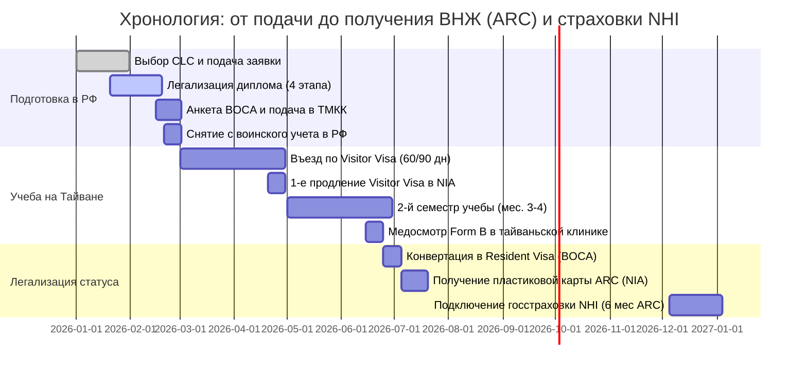

# Визовый Dashboard: Изучение китайского языка на Тайване (CLC / Visitor & Resident Visa / ARC)

### 📌 Основной профиль и статус
- **Целевой языковой центр (CLC):** `[ ] NTNU (MTC) | [ ] NTU (CLD/ICLP) | [ ] NCCU | [ ] NCKU (Тайнань) | [ ] Другой:` `[Вписать]`
- **Планируемый семестр начала:** `[ ] Осенний (Сентябрь) | [ ] Зимний (Декабрь) | [ ] Весенний (Март) | [ ] Летний (Июнь)`
- **Формат обучения:** `[ ] Regular (15 ч/нед) | [ ] Intensive (18-20 ч/нед) | [ ] Индивидуальный`
- **Стипендия Huayu (HES):** `[ ] Да (Подана в ТМКК до 31.03) | [ ] Нет (Самофинансирование)`
- **Текущий этап:** `Подготовка и консульская легализация документов`

---

## 🗺️ Интерактивная дорожная карта процесса

| Этап | Задача | Статус | Срок / Дедлайн | Материал в базе |
| :--- | :--- | :---: | :---: | :--- |
| **1. Выбор и Зачисление в CLC** | Выбрать аккредитованный языковой центр (MOE) | [ ] | За 4–5 мес. до начала | [[02_Школы_и_университеты/Аккредитованные_центры_CLC\|Аккредитованные центры CLC]] |
| | Подать онлайн-заявку в CLC и оплатить сбор (~500–1000 TWD) | [ ] | Дедлайн школы | [[02_Школы_и_университеты/Зачисление_и_Admission_Letter\|Зачисление и оплата]] |
| | Получить оригинал/PDF **Admission Letter** (минимум 15 ч/нед.) | [ ] | 2–4 недели | [[02_Школы_и_университеты/Зачисление_и_Admission_Letter\|Admission Letter]] |
| | (Опционально) Подать заявку на стипендию Huayu (HES) | [ ] | **01.02 — 31.03** | [[02_Школы_и_университеты/Стипендия_Huayu_(HES)_и_TOCFL\|Стипендия HES и TOCFL]] |
| **2. Документы и Легализация** | Сделать визовые фото 3.5×4.5 см (белый фон, открытые уши/лоб) | [ ] | Свежесть < 6 мес. | [[03_Сбор_документов/Загранпаспорт_и_Фото\|Загранпаспорт и Фото]] |
| | Получить справку из банка (остаток $\ge \$2500–\$5000\text{ USD}$) на англ. | [ ] | Свежесть < 30 дней | [[03_Сбор_документов/Финансовые_гарантии\|Финансовые гарантии]] |
| | Сделать нотариальную копию диплома/аттестата + перевод на EN | [ ] | Этап 1 легализации | [[03_Сбор_документов/Консульская_легализация_ТМКК\|Консульская легализация]] |
| | Пройти заверение перевода диплома в **Минюсте РФ** | [ ] | 5 рабочих дней | [[03_Сбор_документов/Консульская_легализация_ТМКК\|Консульская легализация]] |
| | Пройти заверение документа в **КД МИД РФ** | [ ] | 5–7 рабочих дней | [[03_Сбор_документов/Консульская_легализация_ТМКК\|Консульская легализация]] |
| | Финально легализовать диплом в **Представительстве ТМКК** ($15 USD) | [ ] | 5 рабочих дней | [[03_Сбор_документов/Консульская_легализация_ТМКК\|Консульская легализация]] |
| | Оформить снятие с воинского учета в РФ / подготовить доверенность | [ ] | До вылета | [[02_Школы_и_университеты/Военкомат_и_отсрочка_в_РФ\|Военкомат и отсрочка]] |
| | Забронировать авиабилеты (туда + обратный/возвратный) и жилье | [ ] | За 1–2 мес. | [[03_Сбор_документов/Бронь_билетов_и_жилья\|Бронь билетов и жилья]] |
| | Оформить международную медстраховку на первые 180–270 дней | [ ] | До вылета | [[05_После_приезда_(Post-arrival)/4_Госстраховка_NHI\|Госстраховка NHI]] |
| **3. Подача на визу в Москве** | Заполнить электронную анкету на портале **BOCA** и распечатать PDF | [ ] | Перед визитом | [[03_Сбор_документов/Анкета_BOCA\|Анкета BOCA]] |
| | Подготовить наличные доллары США (новые купюры, без штампов) | [ ] | $50–$100 USD | [[01_Информация_по_визам/Сроки_и_стоимость_ТМКК\|Сроки и стоимость ТМКК]] |
| | Подать пакет в Консульский отдел ТМКК (Тверская 24/2 к.1) | [ ] | Пн–Пт 09:00–13:00 | [[04_Процесс_подачи/Подача_в_Представительство_в_Москве_(ТМКК)\|Подача в ТМКК в Москве]] |
| | Получить паспорт с вклеенной **Visitor Visa (код FR / Extendable)** | [ ] | Через 5 раб. дней | [[01_Информация_по_визам/Отличия_Visitor_и_Resident_Visa\|Отличия виз]] |
| **4. Первые дни на Тайване** | Купить предоплаченную сим-карту в аэропорту (Chunghwa / TW Mobile) | [ ] | День 1 (в аэропорту) | [[05_После_приезда_(Post-arrival)/2_Симка_EasyCard_и_Банки\|Симка, EasyCard и Банки]] |
| | Купить карту **EasyCard (悠遊卡)** и пополнить в 7-Eleven | [ ] | День 1 | [[05_После_приезда_(Post-arrival)/2_Симка_EasyCard_и_Банки\|Симка, EasyCard и Банки]] |
| | Зарегистрироваться в CLC, пройти тест на уровень (*分班測驗*), оплатить курс | [ ] | Дни 1–3 | [[05_После_приезда_(Post-arrival)/Жизнь_на_Тайване_(LINE_Uber_Свободный_интернет)\|Жизнь на Тайване]] |
| | Оформить налоговый номер (*Uniform ID / 統一證號*) в офисе NIA | [ ] | Неделя 1 | [[05_После_приезда_(Post-arrival)/2_Симка_EasyCard_и_Банки\|Симка, EasyCard и Банки]] |
| | Открыть счет и карту в **Почтовом банке (Chunghwa Post 郵局)** | [ ] | Неделя 1–2 | [[05_После_приезда_(Post-arrival)/2_Симка_EasyCard_и_Банки\|Симка, EasyCard и Банки]] |
| **5. Продление и получение ARC** | Контролировать посещаемость уроков ($\ge 80–85\%$) и оценки | [ ] | Постоянно | [[05_После_приезда_(Post-arrival)/1_Продление_Visitor_Visa_в_NIA\|Продление в NIA]] |
| | Продлить Visitor Visa в офисе NIA за 10–14 дней до истечения 60/90 дн. | [ ] | За 2 нед. до срока | [[05_После_приезда_(Post-arrival)/1_Продление_Visitor_Visa_в_NIA\|Продление в NIA]] |
| | Пройти медосмотр **Form B (乙表)** в больнице на Тайване (~1500 TWD) | [ ] | На 4-м месяце | [[03_Сбор_документов/Медосмотр_Health_Certificate_Form_B\|Медосмотр Form B]] |
| | Подать документы в **BOCA** на конвертацию в **Resident Visa** | [ ] | После 4 мес. учебы | [[05_После_приезда_(Post-arrival)/3_Конвертация_в_Resident_Visa_и_ARC\|Конвертация в Resident Visa и ARC]] |
| | В течение 15–30 дней подать на пластиковую карту **ARC (居留證)** в NIA | [ ] | После Resident Visa | [[05_После_приезда_(Post-arrival)/3_Конвертация_в_Resident_Visa_и_ARC\|Конвертация в Resident Visa и ARC]] |
| | Через 6 месяцев проживания по ARC подключить госстраховку **NHI (健保)** | [ ] | Через 6 мес. ARC | [[05_После_приезда_(Post-arrival)/4_Госстраховка_NHI\|Госстраховка NHI]] |

---

## ⏰ Критические таймлайны и дедлайны

---

## 📞 Важные контакты и официальные ресурсы

- **Представительство ТМКК в Москве:**
  - Адрес: 125009, г. Москва, ул. Тверская, 24/2, корп. 1, 4 подъезд, 3 этаж (м. Маяковская / Тверская)
  - Тел.: +7 (495) 956-37-86 | Email: `rus@mofa.gov.tw` | Сайт: [tmeccc.org](https://www.tmeccc.org/ru_ru/)
  - Прием документов: Пн–Пт 09:00 – 13:00 | Выдача: Пн–Пт 14:00 – 17:00
- **Электронная визовая система МИД Тайваня:** [BOCA Visa Web Application](https://visawebapp.boca.gov.tw/)
- **Иммиграционная служба Тайваня (NIA):** [National Immigration Agency](https://www.immigration.gov.tw/)
- **Служба экстренной помощи иностранцам на Тайване:**
  - Горячая линия для иностранцев на английском/русском/китайском: **1990** (бесплатно внутри Тайваня)
  - Полиция: **110** | Скорая помощь и пожарные: **119**
