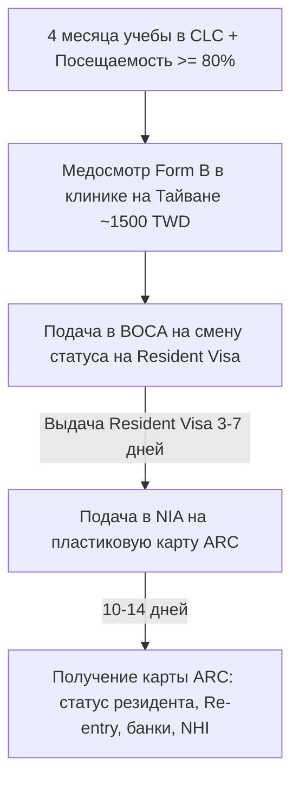

# Отличия Visitor Visa и Resident Visa / ARC на Тайване

На Тайване действует уникальная двухступенчатая система легализации для иностранных студентов, изучающих китайский язык в языковых центрах (**CLC — Chinese Language Centers**). 

> [!IMPORTANT]
> **Главное правило:** Студенты языковых курсов **НЕ могут получить Resident Visa сразу в консульстве за рубежом**. 
> Все студенты начинают с краткосрочной гостевой визы (**Visitor Visa for Studying Chinese, код FR**), въезжают по ней на Тайвань, и только **после 4 месяцев непрерывного обучения** получают право конвертировать свой статус в **Resident Visa** с последующей выдачей пластикового вида на жительство **ARC (Alien Resident Certificate / 居留證)**.

---

## 📊 Сравнительная таблица типов виз

| Параметр | Visitor Visa (Гостевая виза / 停留簽證) | Resident Visa $\rightarrow$ ARC (ВНЖ / 居留簽證 + 居留證) |
| :--- | :--- | :--- |
| **Целевое назначение** | Краткосрочное обучение языку в CLC (первые 1–4 месяца) | Долгосрочное обучение (от 4 месяцев до 2 лет) или бакалавриат/магистратура |
| **Код визы / Отметка** | Код **FR** (Mandarin Study) / Remark: *60 days, extendable* | Resident Visa: Код **FS** или **FR** $\rightarrow$ пластиковая ID-карта **ARC** |
| **Срок первичного пребывания** | **60 или 90 дней** с момента въезда | **От 6 месяцев до 1–2 лет** (продлевается ежегодно/по семестрам) |
| **Возможность продления** | Да, продлевается в офисах **NIA (移民署)** максимум до **180 дней** (в редких случаях дольше) | Да, продлевается в офисах NIA на основании продолжения учебы (до 2 лет максимум для CLC) |
| **Количество въездов** | Обычно **Single (Однократная)** (при выезде из страны сгорает, если не оформить Re-entry/Multiple) | **Multiple (Многократная)** — карта ARC работает как многократная въездная виза |
| **Где оформляется** | В Представительстве ТМКК в Москве (до выезда) | **Внутри Тайваня:** Resident Visa — в **BOCA**, карта ARC — в **NIA** |
| **Право на работу / подработку** | **Строго запрещено** (нелегальная работа карается штрафом до 150 000 TWD и депортацией) | Разрешено **только после 1 года учебы** (или 2 семестров) при оформлении официального **Work Permit** (до 20 ч/нед) |
| **Банковское обслуживание** | Ограничено: только **Почтовый банк (Chunghwa Post)** по номеру *Uniform ID* | **Полноценное**: любые коммерческие банки (Mega Bank, CTBC, E.SUN, Cathay United) |
| **Госстраховка NHI (健保)** | Недоступна (оформляется частная/университетская страховка) | **Доступна после 6 месяцев непрерывного проживания** по карте ARC |

---

## 🔍 Детальный разбор Visitor Visa (Код FR)

### 1. Как выглядит визовый стикер
На визе, выданной Представительством ТМКК в Москве, обязательно должны быть указаны следующие параметры:
* **Category / Type:** `VISITOR`
* **Purpose / Remarks:** `FR - STUDY CHINESE` или `STUDY MANDARIN`
* **Duration of Stay:** `60 DAYS` или `90 DAYS`
* **Entries:** `SINGLE` (или `MULTIPLE`)
* **Remarks:** **`DURATION OF STAY: 60 DAYS; EXTENSION MAY BE APPLIED FOR...`**

> [!WARNING]
> **Критический нюанс отметки «No Extension»:**
> Если на визе по ошибке стоит штамп **`NO EXTENSION WILL BE GRANTED`** (Без права продления), вы **не сможете продлить визу на Тайване** и будете вынуждены выехать из страны по истечении срока. Если вы обнаружили такую отметку при получении паспорта в ТМКК, немедленно обратитесь к консулу для исправления на основании вашего Admission Letter от 15 часов/неделю.

### 2. Схема продления Visitor Visa внутри Тайваня
1. Въезд на Тайвань: включается счетчик на 60 (или 90) дней.
2. За 10–14 дней до окончания срока: визит в местный офис **NIA (National Immigration Agency)** с документами от языкового центра (справка о посещаемости $\ge 80\%$ + квитанция об оплате следующего месяца/семестра).
3. Офицер NIA бесплатно ставит штамп продления еще на 60 дней.
4. Суммарный срок пребывания по Visitor Visa: **до 180 дней** (60 + 60 + 60 дней).

---

## 🏆 Переход в статус резидента: Resident Visa + ARC

### Условия для конвертации (Правило 4 месяцев):
Чтобы получить право на полноценный ВНЖ (**ARC**), языковой студент должен выполнить 4 строгих критерия:
1. **Непрерывное обучение:** Отучиться в аккредитованном центре CLC **не менее 4 месяцев подряд** (обычно это 1 полный семестр + 1 месяц следующего семестра, либо 2 стандартных семестра по 2–3 месяца).
2. **Интенсивность и успеваемость:** Посещаемость (**Attendance Rate**) должна составлять не менее **80%** (в некоторых вузах 85%), без академических задолженностей.
3. **Регистрация на следующий период:** Оплачен следующий семестр обучения длительностью не менее **3 месяцев**.
4. **Медицинский сертификат:** Пройден медосмотр по форме **Form B (乙表)** в одной из аккредитованных клиник Тайваня (срок годности анализа — 3 месяца).

### 3-этапный процесс получения ARC внутри страны:

---

## 💼 Право на работу для языковых студентов (Work Permit)

1. **Первый год учебы:** Иностранным студентам языковых центров работать **категорически запрещено**.
2. **После 1 года (2 полных семестров):** Студент получает право подать заявку на получение **Разрешения на работу для иностранных студентов (Work Permit for Foreign Students / 工作許可證)** через портал Министерства труда (*Ministry of Labor*).
3. **Условия разрешения:**
   - Лимит часов: до **20 часов в неделю** во время учебного семестра (во время летних/зимних каникул — полный рабочий день).
   - Требуется согласие языкового центра (успеваемость и посещаемость не должны страдать).
   - Срок действия Work Permit: до 6 месяцев (с правом продления).
