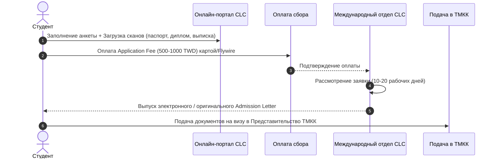

# Зачисление в языковой центр и получение Admission Letter

Процесс зачисления в языковые центры Тайваня (**CLC**) полностью стандартизирован и проходит онлайн через личный кабинет на сайте выбранного университета.

---

## 📋 Пошаговый алгоритм поступления

---

## 📂 Пакет документов для подачи заявки в школу

Для подачи онлайн-заявки на портале языкового центра вам потребуются:
1. **Скан загранпаспорта** (страница с фото и данными, срок действия не менее 6–12 месяцев).
2. **Скан диплома или школьного аттестата** с нотариальным переводом на английский язык.
3. **Банковская выписка (Financial Statement)** на английском языке с остатком не менее **$2 500 – $3 500 USD** (справка должна быть выдана не ранее, чем за 3 месяца до подачи).
4. **Цветная цифровая фотография** (3.5 × 4.5 см, белый фон, без головных уборов и очков).
5. **Краткий учебный план (Study Plan)** на английском или китайском языке (1 страница: почему хотите учить китайский, цели, выбор Тайваня).
6. **Оплата регистрационного сбора (Application Fee):** 500 – 1 000 TWD (оплачивается зарубежной банковской картой Visa/Mastercard/JCB, UnionPay или через систему *Flywire*).

---

## 🔍 Проверка документа: Что должно быть в Admission Letter

Главный визовый документ, который вы получаете от университета — **Письмо о зачислении (Admission Letter / 入學許可書)**.

> [!IMPORTANT]
> ### Параметры проверки Admission Letter:
> - [ ] **ФИО и дата рождения:** Должны **символ в символ** совпадать с вашим заграничным паспортом.
> - [ ] **Номер паспорта:** Указан корректно.
> - [ ] **Период обучения:** Четко указаны даты начала и окончания триместра/семестра (например, *September 1, 2026 – November 30, 2026*).
> - [ ] **Ключевая визовая формулировка:** Обязательно должна присутствовать строчка:  
>   `«The student is enrolled in a Mandarin program with at least 15 hours of classroom instruction per week»` *(Обучение не менее 15 аудиторных часов в неделю)*. Без этой фразы Представительство ТМКК не выдаст студенческую Visitor Visa.
> - [ ] **Официальная печать:** Красный гербовый оттиск университета/центра (*朱印*) и подпись директора центра.

---

## 💳 Оплата стоимости обучения (Tuition Fee) и Гарантийный депозит (Deposit)

> [!WARNING]
> ### ⚠️ Важное изменение 2023–2024 гг. (Гарантийный депозит):
> Исторически многие языковые центры позволяли оплачивать всю стоимость обучения на месте в первые дни после приезда.  
> **Однако с 2023–2024 годов ведущие центры (включая MTC при NTNU и NCCU)** после предварительного одобрения заявки **требуют внести гарантийный депозит (Tuition Deposit)** в размере **~5 000 – 10 000 TWD** либо полностью оплатить первый семестр через систему **Flywire** или банковской картой онлайн.  
> Только после подтверждения транзакции школа выпускает и отправляет официальный бланк **Admission Letter** с присвоенным регистрационным номером и гербовой печатью.

* **Способы онлайн-оплаты:** Зарубежные банковские карты (Visa / Mastercard / JCB), международные переводы SWIFT или специализированный сервис студенческих платежей **Flywire** (поддерживает различные способы конвертации).
* **Остаток суммы (если вносился депозит):** Доплачивается в кассе университета в первые 2–3 дня после прибытия наличными TWD или через банкомат/круглосуточный магазин 7-Eleven.
* **Для подачи на визу в ТМКК:** Предоставляется **Admission Letter** и **квитанция/подтверждение оплаты сбора/депозита**.
