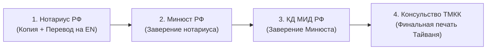

# Консульская легализация документов в ТМКК

> [!CAUTION]
> ### ⚠️ КРИТИЧЕСКИ ВАЖНО: ШТАМП «АПОСТИЛЬ» НЕ РАБОТАЕТ ДЛЯ ТАЙВАНЯ!
> Тайвань (Китайская Республика / ROC) **НЕ входит в Гаагскую конвенцию об апостиле во взаимоотношениях с РФ**.
> Ни один орган власти на Тайване (университеты CLC, МИД BOCA, иммиграционная служба NIA) **НЕ ПРИНИМАЕТ** российские документы со штампом «Апостиль».
> 
> Единственный законный способ признания российских документов — **полная 4-ступенчатая Консульская легализация**.

---

## 🏛️ 4 ступени классической консульской легализации

---

### Шаг 1: Нотариальная копия и нотариальный перевод
1. С оригинального документа (диплом, аттестат, справка о несудимости) у российского нотариуса снимается **нотариальная копия**.
2. Дипломированный переводчик выполняет перевод документа на **английский язык** (допускается перевод на традиционный китайский язык).
3. Российский нотариус сшивает нотариальную копию с переводом и удостоверяет подлинность подписи переводчика.

---

### Шаг 2: Удостоверение в Министерстве юстиции РФ (Минюст)
* **Куда обращаться:** Главное управление Минюста РФ по г. Москве (ул. Кржижановского, 13, корп. 1) либо управление Минюста в регионе, где работает удостоверивший документ нотариус.
* **Что делает Минюст:** Проверяет подлинность подписи и оттиска печати нотариуса РФ по единому реестру.
* **Срок:** **5 рабочих дней**.
* **Госпошлина:** **0 рублей** (госпошлиной не облагается).

---

### Шаг 3: Заверение в Консульском департаменте МИД РФ (КД МИД РФ)
* **Куда обращаться:** Консульский департамент МИД РФ (г. Москва, 1-й Неопалимовский пер., д. 12, м. «Смоленская» / «Парк Культуры»).
* **Что делает МИД:** Проверяет подлинность штампа и подписи должностного лица Минюста РФ и проставляет гербовый штамп консульской легализации МИД.
* **Срок:** **5–7 рабочих дней**.
* **Госпошлина:** **350 рублей** за 1 документ (оплачивается по квитанции в банке).

---

### Шаг 4: Финальное заверение в Представительстве ТМКК в Москве
* **Куда обращаться:** Консульский отдел ТМКК (г. Москва, ул. Тверская, 24/2, корп. 1, 4 подъезд, 3 этаж).
* **Что делает ТМКК:** Консул Тайваня проверяет штамп КД МИД РФ, наклеивает защитную голографическую марку и ставит гербовую консульскую печать Тайваня.
* **Срок:** **5 рабочих дней** (обычный) или **2–3 рабочих дня** (срочный).
* **Стоимость:** **$15 USD** за 1 документ (обычный тариф) / **$22.50 USD** (срочный тариф).
* **Оплата:** Исключительно наличными новыми долларами США (USD).

---

## 📋 Какие документы и в каких случаях требуют полной легализации

> [!NOTE]
> ### 💡 Разграничение: Первичная виза vs Академические цели и Стипендии
> * **Для первичной Visitor Visa (код FR, языковые курсы):** В Консульском отделе ТМКК в Москве для стандартной подачи на краткосрочную визу полная легализация диплома через Минюст и МИД РФ **требуется не всегда**. Как правило, консулу достаточно оригинала диплома/аттестата и его **нотариально заверенного перевода на английский язык**.
> 
> * **КОГДА ПОЛНАЯ 4-ЭТАПНАЯ ЛЕГАЛИЗАЦИЯ (Минюст $\rightarrow$ МИД $\rightarrow$ ТМКК) СТРОГО ОБЯЗАТЕЛЬНА:**
>   1. **Подача на государственную стипендию Huayu (HES):** Консульская комиссия принимает только дипломы с полным кругом легализации.
>   2. **Планы поступления на степень (Бакалавриат / Магистратура / PhD):** При поступлении на академическую программу тайваньские университеты требуют диплом, прошедший полную легализацию в ТМКК.
>   3. **Справка об отсутствии судимости:** Обязательна при переходе на рабочую визу, смене статуса на ПМЖ или подаче на отдельные долгосрочные программы. Срок действия справки — 3–6 месяцев.
>   4. **Свидетельство о рождении:** Требуется при спонсорстве родителей для стипендиальных или академических программ.
