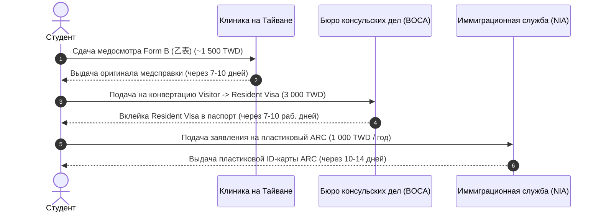

# Конвертация в Resident Visa и получение пластиковой карты ARC (ВНЖ)

Получение вида на жительство (**ARC — Alien Resident Certificate / 外僑居留證**) — главный юридический этап легализации языкового студента на Тайване.

---

## 🎯 Условия допуска к конвертации (Правило 4 месяцев)

Вы имеете право подать документы на получение Resident Visa и ARC только при одновременном выполнении условий:

1. **Срок обучения:** Вы непрерывно отучились в аккредитованном центре CLC **не менее 4 месяцев подряд**.
2. **Посещаемость:** Общая посещаемость занятий составляет **не менее 80%** (в ряде вузов — от 85%).
3. **Успеваемость:** Сданы промежуточные и итоговые экзамены (отсутствуют академические задолженности).
4. **Оплата следующего периода:** Оплачено дальнейшее обучение длительностью **не менее 3 месяцев (следующий семестр)**.

---

## 🔄 3-этапный регламент оформления статуса резидента

---

## 📑 Шаг 1: Медосмотр Form B в клинике на Тайване
* Обратитесь в сертифицированную больницу (например, *Taipei City Hospital Renai Branch* или *Mackay Memorial Hospital*).
* Сдайте рентген легких, анализы крови на сифилис и антитела к кори/краснухе.
* Стоимость: **~1 200 – 1 600 TWD**. Срок готовности — **7–10 дней**.

---

## 🏛️ Шаг 2: Подача на Resident Visa в BOCA (МИД Тайваня)

Заявление подается в центральный офис **Bureau of Consular Affairs (BOCA)** в Тайбэе или в региональные отделения в Тайчжуне, Тайнане, Гаосюне.

* **Адрес в Тайбэе:** 3-5 Fl., No. 2-2, Chi-Nan Rd., Sec. 1, Zhongzheng Dist., Taipei (м. *Shandao Temple* или *NTU Hospital*).
* **Необходимые документы:**
  1. Заполненная онлайн-анкета BOCA на **Resident Visa** (распечатка с подписью).
  2. Оригинал загранпаспорта (срок действия от 1 года) с действующей Visitor Visa.
  3. Оригинал письма о зачислении (**Admission Letter**) и справка о текущем обучении (**Enrollment Certificate**).
  4. Оригинал справки о посещаемости (**Attendance Record $\ge 80\%$**) и табель оценок (**Transcript**).
  5. Оригинал квитанции об оплате следующего семестра (не менее чем на 3 месяца).
  6. Оригинал медицинского сертификата **Form B (乙表)**.
  7. Финансовая выписка из банка (местного тайваньского или зарубежного на сумму от **$2 500 – $3 000 USD**).
  8. 2 цветные фотографии 3.5 × 4.5 см.
* **Стоимость сбора BOCA:** **3 000 TWD** (рассмотрение 7–10 рабочих дней).
* **Результат:** В паспорт вклеивается новая виза категории **Resident Visa**.

---

## 🪪 Шаг 3: Получение карты ARC в офисе NIA

В течение **30 дней** с момента получения стикера Resident Visa вы обязаны обратиться в офис миграционной службы (**NIA**) по месту жительства:

* **Документы в NIA:**
  1. Паспорт с вклеенной Resident Visa.
  2. Договор аренды жилья (*Lease Agreement*) для подтверждения фактического адреса проживания на Тайване.
  3. 1 фотография 3.5 × 4.5 см.
  4. Пошлина за изготовление карты: **1 000 TWD** (на 1 год действия).
* **Результат:** Через 10–14 рабочих дней вы получаете пластиковую смарт-карту **Alien Resident Certificate (居留證)**.

---

## 🌟 Привилегии обладателя карты ARC

* **Свободный въезд и выезд (Multiple Re-entry):** Карта ARC заменяет визу — вы можете покидать Тайвань и возвращаться неограниченное число раз.
* **Полноценный банковский сервис:** Открытие карт и счетов в любых банках Тайваня, подключение местных платежных систем.
* **Доступ к государственной страховке NHI:** Через 6 месяцев проживания по ARC вы получаете доступ к лучшей государственной медицине в мире.
* **Право на работу (Work Permit):** Студенты языковых центров, проучившиеся 1 полный год (2 семестра) по карте ARC, получают право оформить студенческое разрешение на работу (*Part-time Work Permit*) до 20 часов в неделю.
