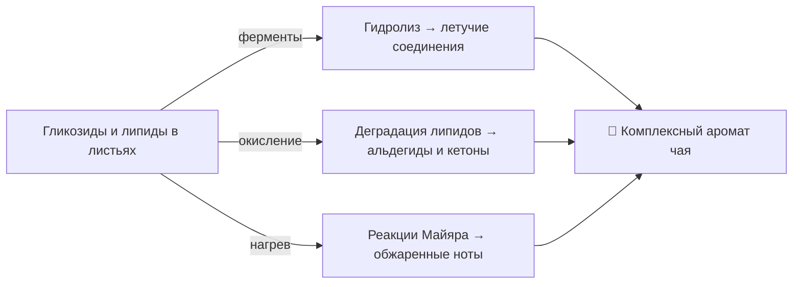
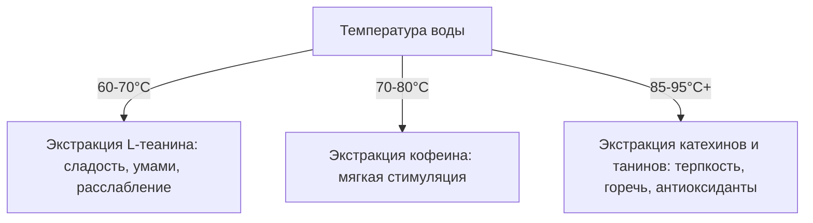

== Project Prompt ==
Generated: 2026-06-24T20:55:38.537Z
Source Directory: /home/injurka/Documents/obsidian-mark/Personal Note/茶 Cha
Included Files: 128
Total Size: 631.23 KB
Format: structured
====================

=== Project File Structure ===
├── Виды чая Китая
│   ├── 1_Зеленый
│   │   ├── Сорта Высушенный на солнце (Шайцин) чая
│   │   │   └── Сорта Высушенный на солнце (Шайцин) чая.md
│   │   ├── Сорта Высушенный над огнем (Хунцин) чая
│   │   │   ├── Люань Гуапянь (Тыквенные семечки из Люаня).md
│   │   │   ├── Сорта Высушенный над огнем (Хунцин) чая.md
│   │   │   └── Хуаншань Маофэн (Ворсистые пики с горы Хуаншань).md
│   │   ├── Сорта Жареного (Чаоцин) чая
│   │   │   ├── Би Ло Чунь (Изумрудные спирали весны).md
│   │   │   ├── Жичжао Люйча (Зеленый чай из Жичжао).md
│   │   │   ├── Лунцзин (Колодец Дракона).md
│   │   │   ├── Мейча (Сливовый чай).md
│   │   │   ├── Мэндин Ганьлу (Сладкая роса Мэндина).md
│   │   │   ├── Синьян Маоцзянь (Ворсистые кончики из Синьяна).md
│   │   │   ├── Сорта жареного (Чаоцин) чая.md
│   │   │   ├── Сухи Лунцзин (Колодец Дракона).md
│   │   │   └── Чжуча (Ганпаудер).md
│   │   ├── Сорта Обработанный паром (Чженцин) чая
│   │   │   ├── Гёкуро (Жемчужная роса).md
│   │   │   ├── Сенча.md
│   │   │   ├── Сорта Обработанный паром (Чженцин) чая.md
│   │   │   ├── Эмэй Шифэн (Пик десяти будд с Эмэй).md
│   │   │   └── Юйлу (Нефритовая роса).md
│   │   ├── Зеленый чай.md
│   │   ├── История появления Зеленого чая.md
│   │   ├── Классификация Зеленого чая.md
│   │   └── Эффект Зеленого чая.md
│   ├── 2_Белый
│   │   ├── Сорта Белого чая
│   │   │   ├── Бай Хао Инь Чжэнь (Серебряные иглы).md
│   │   │   └── Сорта Белого чая.md
│   │   ├── Белый чай.md
│   │   ├── История появления Белого чая.md
│   │   ├── Классификация Белого чая.md
│   │   ├── Технология производства Белого чая.md
│   │   └── Эффект Белого чая.md
│   ├── 3_Желтый
│   │   ├── Сорта Желтого чая
│   │   │   ├── Мэн Дин Хуан Я (Желтые почки с горы Мэндин).md
│   │   │   ├── Сорта Желтого чая.md
│   │   │   ├── Хо Шань Хуан Я (Желтые почки с горы Хошань).md
│   │   │   ├── Цзюнь Шань Инь Чжэнь (Серебряные иглы с горы Цзюнь).md
│   │   │   └── Цзюнь Шань Инь Чжэнь.md
│   │   ├── Желтый чай.md
│   │   ├── История появления Желтого чая.md
│   │   ├── Классификация Желтого чая.md
│   │   ├── Технология производства Желтого чая.md
│   │   └── Эффект Желтого чая.md
│   ├── 4_Улун
│   │   ├── Сорта Улун чая
│   │   │   ├── Аньси Те Гуань Инь (Железная Богиня Милосердия).md
│   │   │   ├── ГАБА-чай (GABA).md
│   │   │   ├── Да Хун Пао (Большой Красный Халат).md
│   │   │   ├── Дунфан Мэйжень (Восточная Красавица).md
│   │   │   ├── Ми Лань Сян (Медовая орхидея).md
│   │   │   ├── Сорта Улун чая.md
│   │   │   ├── Тегуаньинь (Железная Богиня Милосердия).md
│   │   │   ├── Уи Шуй Сянь (Нарцисс с гор Уи).md
│   │   │   └── Фэнхуан Даньцун (Одинокие Кусты с Фениксовых Гор).md
│   │   ├── История появления чая Улун.md
│   │   ├── Классификация улунов.md
│   │   ├── Технология производства чая Улун.md
│   │   ├── Улун.md
│   │   └── Эффект Улун чая.md
│   ├── 5_Красный
│   │   ├── Сорта Красного чая
│   │   │   ├── Сорта Красного чая.md
│   │   │   └── Чжэн Шань Сяо Чжун (Лапсанг Сушонг).md
│   │   ├── История появления Красного чая.md
│   │   ├── Классификация Красного чая.md
│   │   ├── Красный чай.md
│   │   ├── Технология производства Красного чая.md
│   │   └── Эффект Красного чая.md
│   ├── 6_Черный (Пуэр)
│   │   ├── Знаменитые сорта Пуэра
│   │   │   ├── Знаменитые сорта Пуэра.md
│   │   │   ├── Лао Бан Чжан.md
│   │   │   ├── Разница процесса производства Шу Пуэра от Шен Пуэра.md
│   │   │   ├── Шу Пуэр (Готовый Пуэр).md
│   │   │   └── Шэн Пуэр (Сырой Пуэр).md
│   │   ├── Формы прессовки пуэра
│   │   │   ├── Бин Ча (Блин).md
│   │   │   ├── Мэй Хуа Ча (Цветок сливы).md
│   │   │   ├── Точа (Гнездо).md
│   │   │   ├── Формы прессовки пуэра.md
│   │   │   ├── Цзинь Ча (Гриб).md
│   │   │   └── Чжуань Ча (Кирпич).md
│   │   ├── История появления чая Пуэр.md
│   │   ├── Пуэр.md
│   │   ├── Технология производства чая Пуэр.md
│   │   ├── Типы Пуэр чая.md
│   │   └── Эффект Пуэр чая.md
│   ├── 7_Особые и нечайные чаи
│   │   ├── Региональные рецепты и напитки
│   │   │   └── Юаньян (Гонконгский кофе-чай).md
│   │   ├── Гречишный чай (Ку Цяо).md
│   │   ├── Жасминовый чай (Молихуа).md
│   │   ├── Особые и нечайные чаи.md
│   │   └── Связанный чай.md
│   ├── 🌸 Виды чая Китая.md
│   └── Концепция.md
├── Исторические трактаты
│   ├── 🌸 Исторические трактаты.md
│   ├── Да Гуань Ча Лунь (蔡襄).md
│   ├── Ча Лу (蔡襄).md
│   └── Ча Цзин (陆羽).md
├── Регионы производства
│   ├── 🌸 Регионы производства.md
│   ├── Аньхой (Ци Мэнь Хун Ча).md
│   ├── Тайвань (Высокогорные улуны).md
│   ├── Фуцзянь (Улуны и Белый чай).md
│   ├── Хунань (Цзюнь Шань Инь Чжэнь).md
│   ├── Чжэцзян (Лунцзин).md
│   └── Юньнань (Пуэр).md
├── Современные чайные бренды
│   ├── A-Little Tea.md
│   ├── Chagee.md
│   ├── CoCo Fresh Tea & Juice.md
│   ├── GoodMe.md
│   ├── Heytea.md
│   ├── Mixue Bingcheng.md
│   ├── Nayuki.md
│   ├── Sexy Tea.md
│   ├── Shuyi Tealicious.md
│   ├── Yihetang.md
│   └── Современные чайные бренды.md
├── Чайная церемония
│   ├── Чайные инструменты
│   │   ├── Чайники
│   │   │   ├── Исинские чайники.md
│   │   │   ├── Стеклянные чайники.md
│   │   │   ├── Фарфоровые чайники.md
│   │   │   └── Чайники.md
│   │   ├── Гайвань (Чаша с крышкой).md
│   │   ├── Чайные инструменты.md
│   │   ├── Чахай (Море чая).md
│   │   ├── Чаху (Чайный сосуд).md
│   │   ├── Чахэ (Чайная коробочка).md
│   │   └── Чацзи (Чайное полотенце).md
│   ├── 🌸 Чайная церемония.md
│   ├── Гунфу Ча и Пинча (Искусство чаепития).md
│   └── Химия воды и заваривания.md
├── 🌸 Механизмы формирования аромата чая.md
├── 🍵 Эффекты и состояния от чая.md
├── Вода для заваривания чая.md
├── Известные фабрики и бренды.md
├── Практика: Дневник дегустаций (Шаблон).md
├── Углубление в биохимию.md
├── Хранение и выдержка.md
├── Чайная терминология и глоссарий.md
├── Чайная утварь и материалы.md
└── 茶 Cha.md
============================

=== File List ===
- 🌸 Механизмы формирования аромата чая.md (4.33 KB)
- 🍵 Эффекты и состояния от чая.md (8.04 KB)
- Виды чая Китая/🌸 Виды чая Китая.md (5.42 KB)
- Виды чая Китая/1_Зеленый/Зеленый чай.md (0.24 KB)
- Виды чая Китая/1_Зеленый/История появления Зеленого чая.md (4.81 KB)
- Виды чая Китая/1_Зеленый/Классификация Зеленого чая.md (9.99 KB)
- Виды чая Китая/1_Зеленый/Сорта Высушенный на солнце (Шайцин) чая/Сорта Высушенный на солнце (Шайцин) чая.md (0.08 KB)
- Виды чая Китая/1_Зеленый/Сорта Высушенный над огнем (Хунцин) чая/Люань Гуапянь (Тыквенные семечки из Люаня).md (2.82 KB)
- Виды чая Китая/1_Зеленый/Сорта Высушенный над огнем (Хунцин) чая/Сорта Высушенный над огнем (Хунцин) чая.md (0.18 KB)
- Виды чая Китая/1_Зеленый/Сорта Высушенный над огнем (Хунцин) чая/Хуаншань Маофэн (Ворсистые пики с горы Хуаншань).md (4.63 KB)
- Виды чая Китая/1_Зеленый/Сорта Жареного (Чаоцин) чая/Би Ло Чунь (Изумрудные спирали весны).md (6.76 KB)
- Виды чая Китая/1_Зеленый/Сорта Жареного (Чаоцин) чая/Жичжао Люйча (Зеленый чай из Жичжао).md (5.24 KB)
- Виды чая Китая/1_Зеленый/Сорта Жареного (Чаоцин) чая/Лунцзин (Колодец Дракона).md (2.33 KB)
- Виды чая Китая/1_Зеленый/Сорта Жареного (Чаоцин) чая/Мейча (Сливовый чай).md (4.71 KB)
- Виды чая Китая/1_Зеленый/Сорта Жареного (Чаоцин) чая/Мэндин Ганьлу (Сладкая роса Мэндина).md (0.01 KB)
- Виды чая Китая/1_Зеленый/Сорта Жареного (Чаоцин) чая/Синьян Маоцзянь (Ворсистые кончики из Синьяна).md (6.31 KB)
- Виды чая Китая/1_Зеленый/Сорта Жареного (Чаоцин) чая/Сорта жареного (Чаоцин) чая.md (0.47 KB)
- Виды чая Китая/1_Зеленый/Сорта Жареного (Чаоцин) чая/Сухи Лунцзин (Колодец Дракона).md (7.94 KB)
- Виды чая Китая/1_Зеленый/Сорта Жареного (Чаоцин) чая/Чжуча (Ганпаудер).md (6.12 KB)
- Виды чая Китая/1_Зеленый/Сорта Обработанный паром (Чженцин) чая/Гёкуро (Жемчужная роса).md (3.95 KB)
- Виды чая Китая/1_Зеленый/Сорта Обработанный паром (Чженцин) чая/Сенча.md (1.64 KB)
- Виды чая Китая/1_Зеленый/Сорта Обработанный паром (Чженцин) чая/Сорта Обработанный паром (Чженцин) чая.md (0.19 KB)
- Виды чая Китая/1_Зеленый/Сорта Обработанный паром (Чженцин) чая/Эмэй Шифэн (Пик десяти будд с Эмэй).md (0.00 KB)
- Виды чая Китая/1_Зеленый/Сорта Обработанный паром (Чженцин) чая/Юйлу (Нефритовая роса).md (2.51 KB)
- Виды чая Китая/1_Зеленый/Эффект Зеленого чая.md (8.27 KB)
- Виды чая Китая/2_Белый/Белый чай.md (0.27 KB)
- Виды чая Китая/2_Белый/История появления Белого чая.md (0.58 KB)
- Виды чая Китая/2_Белый/Классификация Белого чая.md (0.45 KB)
- Виды чая Китая/2_Белый/Сорта Белого чая/Бай Хао Инь Чжэнь (Серебряные иглы).md (2.15 KB)
- Виды чая Китая/2_Белый/Сорта Белого чая/Сорта Белого чая.md (0.26 KB)
- Виды чая Китая/2_Белый/Технология производства Белого чая.md (9.45 KB)
- Виды чая Китая/2_Белый/Эффект Белого чая.md (8.47 KB)
- Виды чая Китая/3_Желтый/Желтый чай.md (0.28 KB)
- Виды чая Китая/3_Желтый/История появления Желтого чая.md (5.36 KB)
- Виды чая Китая/3_Желтый/Классификация Желтого чая.md (1.94 KB)
- Виды чая Китая/3_Желтый/Сорта Желтого чая/Мэн Дин Хуан Я (Желтые почки с горы Мэндин).md (0.01 KB)
- Виды чая Китая/3_Желтый/Сорта Желтого чая/Сорта Желтого чая.md (0.27 KB)
- Виды чая Китая/3_Желтый/Сорта Желтого чая/Хо Шань Хуан Я (Желтые почки с горы Хошань).md (0.01 KB)
- Виды чая Китая/3_Желтый/Сорта Желтого чая/Цзюнь Шань Инь Чжэнь (Серебряные иглы с горы Цзюнь).md (0.01 KB)
- Виды чая Китая/3_Желтый/Сорта Желтого чая/Цзюнь Шань Инь Чжэнь.md (2.80 KB)
- Виды чая Китая/3_Желтый/Технология производства Желтого чая.md (9.37 KB)
- Виды чая Китая/3_Желтый/Эффект Желтого чая.md (7.27 KB)
- Виды чая Китая/4_Улун/История появления чая Улун.md (6.73 KB)
- Виды чая Китая/4_Улун/Классификация улунов.md (2.76 KB)
- Виды чая Китая/4_Улун/Сорта Улун чая/Аньси Те Гуань Инь (Железная Богиня Милосердия).md (5.58 KB)
- Виды чая Китая/4_Улун/Сорта Улун чая/ГАБА-чай (GABA).md (2.67 KB)
- Виды чая Китая/4_Улун/Сорта Улун чая/Да Хун Пао (Большой Красный Халат).md (2.60 KB)
- Виды чая Китая/4_Улун/Сорта Улун чая/Дунфан Мэйжень (Восточная Красавица).md (4.78 KB)
- Виды чая Китая/4_Улун/Сорта Улун чая/Ми Лань Сян (Медовая орхидея).md (0.01 KB)
- Виды чая Китая/4_Улун/Сорта Улун чая/Сорта Улун чая.md (0.46 KB)
- Виды чая Китая/4_Улун/Сорта Улун чая/Тегуаньинь (Железная Богиня Милосердия).md (2.65 KB)
- Виды чая Китая/4_Улун/Сорта Улун чая/Уи Шуй Сянь (Нарцисс с гор Уи).md (0.01 KB)
- Виды чая Китая/4_Улун/Сорта Улун чая/Фэнхуан Даньцун (Одинокие Кусты с Фениксовых Гор).md (4.96 KB)
- Виды чая Китая/4_Улун/Технология производства чая Улун.md (12.66 KB)
- Виды чая Китая/4_Улун/Улун.md (0.25 KB)
- Виды чая Китая/4_Улун/Эффект Улун чая.md (7.61 KB)
- Виды чая Китая/5_Красный/История появления Красного чая.md (6.13 KB)
- Виды чая Китая/5_Красный/Классификация Красного чая.md (3.16 KB)
- Виды чая Китая/5_Красный/Красный чай.md (0.29 KB)
- Виды чая Китая/5_Красный/Сорта Красного чая/Сорта Красного чая.md (0.40 KB)
- Виды чая Китая/5_Красный/Сорта Красного чая/Чжэн Шань Сяо Чжун (Лапсанг Сушонг).md (2.77 KB)
- Виды чая Китая/5_Красный/Технология производства Красного чая.md (9.90 KB)
- Виды чая Китая/5_Красный/Эффект Красного чая.md (7.14 KB)
- Виды чая Китая/6_Черный (Пуэр)/Знаменитые сорта Пуэра/Знаменитые сорта Пуэра.md (0.20 KB)
- Виды чая Китая/6_Черный (Пуэр)/Знаменитые сорта Пуэра/Лао Бан Чжан.md (2.62 KB)
- Виды чая Китая/6_Черный (Пуэр)/Знаменитые сорта Пуэра/Разница процесса производства Шу Пуэра от Шен Пуэра.md (5.83 KB)
- Виды чая Китая/6_Черный (Пуэр)/Знаменитые сорта Пуэра/Шу Пуэр (Готовый Пуэр).md (0.63 KB)
- Виды чая Китая/6_Черный (Пуэр)/Знаменитые сорта Пуэра/Шэн Пуэр (Сырой Пуэр).md (4.51 KB)
- Виды чая Китая/6_Черный (Пуэр)/История появления чая Пуэр.md (6.70 KB)
- Виды чая Китая/6_Черный (Пуэр)/Пуэр.md (0.30 KB)
- Виды чая Китая/6_Черный (Пуэр)/Технология производства чая Пуэр.md (6.68 KB)
- Виды чая Китая/6_Черный (Пуэр)/Типы Пуэр чая.md (5.89 KB)
- Виды чая Китая/6_Черный (Пуэр)/Формы прессовки пуэра/Бин Ча (Блин).md (0.01 KB)
- Виды чая Китая/6_Черный (Пуэр)/Формы прессовки пуэра/Мэй Хуа Ча (Цветок сливы).md (0.01 KB)
- Виды чая Китая/6_Черный (Пуэр)/Формы прессовки пуэра/Точа (Гнездо).md (0.01 KB)
- Виды чая Китая/6_Черный (Пуэр)/Формы прессовки пуэра/Формы прессовки пуэра.md (0.20 KB)
- Виды чая Китая/6_Черный (Пуэр)/Формы прессовки пуэра/Цзинь Ча (Гриб).md (0.01 KB)
- Виды чая Китая/6_Черный (Пуэр)/Формы прессовки пуэра/Чжуань Ча (Кирпич).md (0.01 KB)
- Виды чая Китая/6_Черный (Пуэр)/Эффект Пуэр чая.md (8.17 KB)
- Виды чая Китая/7_Особые и нечайные чаи/Гречишный чай (Ку Цяо).md (1.49 KB)
- Виды чая Китая/7_Особые и нечайные чаи/Жасминовый чай (Молихуа).md (2.11 KB)
- Виды чая Китая/7_Особые и нечайные чаи/Особые и нечайные чаи.md (2.43 KB)
- Виды чая Китая/7_Особые и нечайные чаи/Региональные рецепты и напитки/Юаньян (Гонконгский кофе-чай).md (12.23 KB)
- Виды чая Китая/7_Особые и нечайные чаи/Связанный чай.md (2.18 KB)
- Виды чая Китая/Концепция.md (9.96 KB)
- Вода для заваривания чая.md (4.01 KB)
- Известные фабрики и бренды.md (9.58 KB)
- Исторические трактаты/🌸 Исторические трактаты.md (0.54 KB)
- Исторические трактаты/Да Гуань Ча Лунь (蔡襄).md (132.58 KB)
- Исторические трактаты/Ча Лу (蔡襄).md (4.48 KB)
- Исторические трактаты/Ча Цзин (陆羽).md (4.67 KB)
- Практика: Дневник дегустаций (Шаблон).md (8.21 KB)
- Регионы производства/🌸 Регионы производства.md (0.69 KB)
- Регионы производства/Аньхой (Ци Мэнь Хун Ча).md (3.26 KB)
- Регионы производства/Тайвань (Высокогорные улуны).md (3.58 KB)
- Регионы производства/Фуцзянь (Улуны и Белый чай).md (2.81 KB)
- Регионы производства/Хунань (Цзюнь Шань Инь Чжэнь).md (2.74 KB)
- Регионы производства/Чжэцзян (Лунцзин).md (2.90 KB)
- Регионы производства/Юньнань (Пуэр).md (2.73 KB)
- Современные чайные бренды/A-Little Tea.md (4.81 KB)
- Современные чайные бренды/Chagee.md (4.88 KB)
- Современные чайные бренды/CoCo Fresh Tea & Juice.md (4.37 KB)
- Современные чайные бренды/GoodMe.md (4.55 KB)
- Современные чайные бренды/Heytea.md (5.26 KB)
- Современные чайные бренды/Mixue Bingcheng.md (4.92 KB)
- Современные чайные бренды/Nayuki.md (5.21 KB)
- Современные чайные бренды/Sexy Tea.md (5.74 KB)
- Современные чайные бренды/Shuyi Tealicious.md (4.49 KB)
- Современные чайные бренды/Yihetang.md (4.28 KB)
- Современные чайные бренды/Современные чайные бренды.md (0.41 KB)
- Углубление в биохимию.md (9.92 KB)
- Хранение и выдержка.md (13.01 KB)
- Чайная терминология и глоссарий.md (12.75 KB)
- Чайная утварь и материалы.md (5.07 KB)
- Чайная церемония/🌸 Чайная церемония.md (0.66 KB)
- Чайная церемония/Гунфу Ча и Пинча (Искусство чаепития).md (6.78 KB)
- Чайная церемония/Химия воды и заваривания.md (7.17 KB)
- Чайная церемония/Чайные инструменты/Гайвань (Чаша с крышкой).md (12.06 KB)
- Чайная церемония/Чайные инструменты/Чайники/Исинские чайники.md (2.88 KB)
- Чайная церемония/Чайные инструменты/Чайники/Стеклянные чайники.md (2.58 KB)
- Чайная церемония/Чайные инструменты/Чайники/Фарфоровые чайники.md (2.49 KB)
- Чайная церемония/Чайные инструменты/Чайники/Чайники.md (2.29 KB)
- Чайная церемония/Чайные инструменты/Чайные инструменты.md (0.26 KB)
- Чайная церемония/Чайные инструменты/Чахай (Море чая).md (3.43 KB)
- Чайная церемония/Чайные инструменты/Чаху (Чайный сосуд).md (6.11 KB)
- Чайная церемония/Чайные инструменты/Чахэ (Чайная коробочка).md (2.76 KB)
- Чайная церемония/Чайные инструменты/Чацзи (Чайное полотенце).md (5.38 KB)
- 茶 Cha.md (2.31 KB)
=================

=== File Contents ===

--- File: 🌸 Механизмы формирования аромата чая.md ---

---
tags:
  - чай
  - аромат
  - биохимия
  - улун
  - ферментация
cssclass: tea-notes
---

Формирование аромата чая — это **многоступенчатый биохимический процесс**, зависящий от:
- технологии обработки листа;
- степени **окисления / ферментации**;
- исходного **химического состава**茶 (чайного листа).

> 💬 Три основных механизма ароматогенеза:
> 1️⃣ Гидролиз  
> 2️⃣ Окислительная деградация липидов  
> 3️⃣ Нагрев

---

## 1️⃣ Гидролиз

Гидролиз — это **расщепление сложных органических соединений**, чаще всего гликозидов, под действием **ферментов или воды**.  
Он высвобождает скрытые ароматические молекулы, превращая предшественники во **летучие соединения**, создающие характерный аромат.

🫖 **Улуны** особенно зависят от гидролиза: при встряхивании листа активируются ферменты, и запускаются цепочки ароматических реакций.

> 🪷 *Пример:*  
> **Те Гуань Инь (Железная Богиня Милосердия)** — цветочный, медовый аромат → результат активного гидролиза гликозидов.

---

## 2️⃣ Окислительная деградация липидов

**Липиды** в чайных листьях при **окислении** распадаются на **альдегиды и кетоны** — вещества с насыщенным, глубоким ароматом.  
Этот процесс особенно выражен в **красных (чёрных)** чаях.

🔥 **Красный чай (Hong Cha)**  
Полная ферментация активирует липидную деградацию, создавая букет из нот:
- мёда 🍯  
- сухофруктов 🍑  
- шоколада 🍫  
- лёгких специй 🌰  

> 🌾 *Пример:*  
> **Дянь Хун (Юньнань)** — сладковатый аромат с оттенками какао и сушёных фруктов.

---

## 3️⃣ Нагрев

Нагрев инициирует **неферментативные реакции** — карамелизацию и **реакции Майяра** (взаимодействие сахаров и аминокислот).  
Эти процессы рождают **тёплые, ореховые или обжаренные нотки**.

🍃 **Зелёные чаи** подвергаются быстрому прогреву, чтобы остановить ферментацию и сохранить свежесть.

> 🌿 *Пример:*  
> **Лунцзин (Колодец Дракона)** — свежий, травянистый аромат с лёгкими ореховыми оттенками.

---

## 🔄 Взаимосвязь процессов



---

## 📘 Краткое сравнение

| Процесс | Основные вещества | Результирующие ноты | Тип чая |
|----------|------------------|---------------------|---------|
| Гидролиз | Гликозиды → альдегиды, спирты | Цветочные, фруктовые | Улун |
| Окислительная деградация | Липиды → кетоны, альдегиды | Медовые, шоколадные | Красный |
| Нагрев | Сахара + аминокислоты | Ореховые, жареные | Зелёный |

--- File: 🍵 Эффекты и состояния от чая.md ---

# 🍵 Эффекты и состояния от чая (Ча Ци / 茶气)

Чайное состояние (Ча Ци, "энергия чая") — это тонкое психофизическое воздействие чая на организм. Оно зависит от вида чая, терруара, возраста деревьев и способа заваривания. Ниже описаны типичные эффекты основных видов китайского чая.

## 🌿 Зеленый чай (Люй Ча)
**Действие:** Охлаждающее, освежающее, тонизирующее.
**Эффект:** Резкий заряд бодрости, прояснение ума, концентрация внимания. Зеленый чай содержит много кофеина (теина) и L-теанина в неферментированном виде, что дает быструю, но ровную энергию.
**Физика:** Снимает жар, охлаждает тело, может слегка понижать давление.
**Когда пить:** Утром для быстрого пробуждения, в первой половине дня, в жаркую погоду, перед активной умственной или физической работой.
**Не рекомендуется:** Натощак (раздражает желудок), поздно вечером (может вызвать бессонницу).

## 🤍 Белый чай (Бай Ча)
**Действие:** Мягкое, охлаждающее, умиротворяющее.
**Эффект:** Легкая, воздушная ясность. Снимает напряжение, успокаивает ум, дарит состояние созерцательности и тонкого восприятия. Молодой белый чай освежает, выдержанный (Лао Бай Ча) — глубоко расслабляет и согревает.
**Физика:** Снижает внутренний жар, снимает воспаления. Выдержанный белый чай действует как мягкое лекарство.
**Когда пить:** Днем и ранним вечером, для снятия стресса, в теплое время года, во время спокойных бесед или медитации.

## 🍂 Улуны (Цин Ча)
Улуны обладают самым широким спектром воздействий благодаря частичной ферментации и разнообразию видов.

### Светлые улуны (Те Гуань Инь, Тайваньские улуны)
**Действие:** Вдохновляющее, гармонизирующее, легкое.
**Эффект:** Эйфория, радость, легкость в теле. Снимает усталость, располагает к общению, вызывает "чайное опьянение" (состояние легкой приподнятости).
**Когда пить:** Днем, для поднятия настроения, в компании друзей, весной и летом.

### Темные улуны (Уишаньские улуны — Да Хун Пао, Жоу Гуй; Гуандунские — Даньцуны)
**Действие:** Согревающее, центрирующее, собирающее.
**Эффект:** Глубокая концентрация, "заземление", ясность мыслей без суеты. Да Хун Пао часто дает ровное, уверенное состояние, тогда как Даньцуны могут сильно тонизировать и "менять" восприятие (знаменитые "чайные мурашки").
**Физика:** Согревает, снимает напряжение в мышцах.
**Когда пить:** Во второй половине дня, осенью и зимой, для серьезных разговоров, перед важными делами, требующими фокуса.

## 🔴 Красный чай (Хун Ча)
**Действие:** Согревающее, обволакивающее, уютное.
**Эффект:** Ровная, мягкая бодрость. Дарит ощущение комфорта, уюта и тепла. Отличный антидепрессант, поднимает настроение, снимает нервное напряжение, не вызывая резких скачков энергии.
**Физика:** Согревает тело, улучшает кровообращение, мягко стимулирует пищеварение.
**Когда пить:** Утром и днем (особенно в холодное время года), на работе для снятия стресса, за чтением книги. Отличный вариант для чаепитий с выпечкой.

## 🌑 Пуэры (Хэй Ча)
Пуэры славятся самым сильным "Ча Ци" (чайной энергией).

### Шу Пуэр (Черный/готовый)
**Действие:** Сильно согревающее, заземляющее, бодрящее.
**Эффект:** Плотная, тяжелая энергия. Дает сильный, но мягкий тонус, собирает мысли "в кучу", дает чувство опоры и работоспособности. Снимает физическую усталость.
**Физика:** Улучшает пищеварение, согревает желудок (один из немногих чаев, который можно пить натощак), снимает тяжесть после еды, отрезвляет.
**Когда пить:** Утром (лучшая замена кофе), в холодную и сырую погоду, при упадке сил, после плотной еды, перед тяжелой физической или умственной работой.

### Шэн Пуэр (Зеленый/сырой)
**Действие:** Мощное, очищающее, медитативное.
**Эффект:** Самое непредсказуемое и сильное чайное состояние. Может вызвать мощный прилив энергии ("чайное опьянение"), эйфорию, а может глубоко расслабить и погрузить в медитацию. Молодые шэны бодрят и бывают "дерзкими", выдержанные шэны (Лао Шэн) дают глубокую мудрость, покой и ясность.
**Физика:** Сильно очищает организм, охлаждает (молодой) или гармонизирует (выдержанный).
**Когда пить:** Когда нужно изменить состояние, для глубокого погружения в себя, творческой работы, в первой половине дня.

---
### 💡 Краткая шпаргалка:
*   **Нужно проснуться и включиться:** Шу Пуэр, Зеленый чай.
*   **Нужно сфокусироваться и поработать:** Темный улун (Да Хун Пао), Шэн Пуэр.
*   **Нужно расслабиться и снять стресс:** Красный чай, Белый чай (особенно выдержанный).
*   **Для веселого общения:** Светлые улуны (Те Гуань Инь), Гуандунские улуны (Даньцуны).
*   **Для глубоких раздумий и медитации:** Выдержанный Шэн Пуэр, Выдержанный Белый чай.
*   **Холодно и сыро:** Шу Пуэр, Красный чай, Темный улун.
*   **Жарко:** Зеленый чай, Белый чай, Молодой Шэн Пуэр.

--- File: Виды чая Китая/🌸 Виды чая Китая.md ---

---
tags:
  - MOC
  - виды_чая
---

# 🍃 Виды чая

Существует шесть основных видов чая, которые классифицируются по степени окисления или ферментации полифенолов в чайных листьях. Эта концепция была предложена профессором *Чэн Цикунем* (Чэн Чуанем) и стала основой для понимания разнообразия чайного мира. Каждый вид чая обладает уникальными характеристиками, которые зависят от технологии обработки, региона произрастания и сорта чайного растения (Camellia sinensis). Вот основные виды:

1. **[[Зеленый чай]]**
   Зеленый чай практически не подвергается окислению. После сбора листья быстро прогревают (паром, на огне или в печи), чтобы остановить ферментацию. Это позволяет сохранить свежий, травянистый вкус и высокое содержание антиоксидантов. Популярные сорта: Лунцзин (Колодец Дракона), Би Ло Чунь (Изумрудные спирали весны), Сенча.

2. **[[Белый чай]]**
   Белый чай проходит минимальную обработку. Его листья слегка подвяливают и сушат на солнце или в тени. Этот вид чая ценится за нежный, цветочный аромат и мягкий вкус. Основные сорта: Бай Хао Инь Чжэнь (Серебряные иглы), Бай Му Дань (Белый пион).

3. **[[Желтый чай]]**
   Желтый чай — редкий и ценный вид, который проходит легкую ферментацию. Его особенность — этап томления, когда листья слегка прогревают и упаковывают, что придает чаю характерный желтоватый оттенок и мягкий, слегка сладковатый вкус. Примеры: Цзюнь Шань Инь Чжэнь (Серебряные иглы с горы Цзюньшань).

4. **[[Улун|Улун (Оолонг)]]**
   Улун — это полуферментированный чай, который занимает промежуточное положение между зеленым и черным чаем. Степень ферментации может варьироваться от 10% до 70%, что делает улуны невероятно разнообразными по вкусу и аромату. Популярные сорта: Те Гуань Инь (Железная Богиня Милосердия), Да Хун Пао (Большой Красный Халат).

5. **[[Красный чай|Красный чай (в Китае)]]**
   В Китае красный чай — это то, что в западной традиции называют черным чаем. Он проходит полную ферментацию, что придает ему насыщенный, глубокий вкус с нотами меда, сухофруктов или шоколада. Примеры: Дянь Хун (Юньнаньский красный чай), Кимун (Ци Мэнь Хун Ча).

6. **[[Пуэр|Черный чай (в Китае)]]**
   В Китае черный чай (или "темный чай") — это постферментированный чай, который проходит дополнительную обработку, включая длительное хранение и микробную ферментацию. Это придает ему землистый, насыщенный вкус и уникальные свойства. Самый известный представитель — Пуэр, который может быть как сырым (Шэн), так и зрелым (Шу).

7. **[[Особые и нечайные чаи]]**
   Помимо 6 классических видов, существует категория цветочных, ароматизированных и нечайных напитков. Сюда входят Жасминовый чай (Молихуа), Связанный чай, тизаны (такие как гречишный чай Ку Цяо), а также современные чаи, произведенные по технологии бескислородной ферментации (например, ГАБА).

Каждый вид чая имеет свои особенности, которые зависят не только от технологии обработки, но и от региона произрастания, климата и традиций. Например, японские зеленые чаи (такие как Матча и Гёкуро) отличаются от китайских благодаря уникальному методу затенения чайных кустов перед сбором.

![[10.jpeg]]

---
🔙 Назад к основной теме: [[茶 Cha]]

--- File: Виды чая Китая/1_Зеленый/Зеленый чай.md ---

- ### [[Техника получения Зеленого чая]]
- ### [[Классификация Зеленого чая]]
- ### [[История появления Зеленого чая]]
- ### [[Эффект Зеленого чая]]

--- File: Виды чая Китая/1_Зеленый/История появления Зеленого чая.md ---

# История появления Зеленого чая

История зеленого чая — это история развития всей чайной культуры Китая, так как именно зеленый чай был первым видом чая, который начали употреблять и обрабатывать.

## 🌿 Мифические истоки и древность
Согласно легендам, чай был открыт **Шэнь-нуном** (Божественным земледельцем) около 2737 года до н.э. Миф гласит, что несколько чайных листьев случайно упали в котел с кипящей водой, когда Шэнь-нун отдыхал под деревом. Попробовав настой, он ощутил прилив сил и ясность ума. 

Изначально чайные листья не заваривали, а варили с добавлением различных трав, кореньев и даже соли или лука, используя их как лекарственное средство или питательный суп.

---

## 📜 Эпоха Тан (618–907 гг.): Чай как искусство
В эпоху Тан чай перестает быть просто лекарством и становится повседневным и изысканным напитком. 
- **«Чайный канон» (Ча Цзин)**: В VIII веке Лу Юй написал первый в мире трактат о чае, где систематизировал знания о выращивании и приготовлении напитка.
- **Технология**: В это время доминировал метод *пропаривания* листьев (Чжэнцин) с последующим прессованием в блины. Для питья от блина отламывали кусочек, растирали в порошок и варили.

> *«Чай пьют, чтобы прогнать сонливость, очистить дух и обрести гармонию». — Лу Юй*

---

## 🍵 Эпоха Сун (960–1279 гг.): Взбитый чай
Чайная культура достигает небывалых высот. 
- Чай по-прежнему пропаривают, но теперь его перемалывают в тончайшую пудру.
- Этот порошок заливают кипятком и взбивают бамбуковым венчиком до образования густой пены. 
- Именно эта традиция позже была привезена буддийскими монахами в Японию, где сохранилась до наших дней в виде **Матча** (Матя) и японской чайной церемонии. В самом Китае этот метод со временем был утрачен.

---

## 🔥 Эпоха Мин (1368–1644 гг.): Революция обжарки
Эпоха Мин стала переломным моментом в истории зеленого чая:
1. **Запрет на прессовку**: Император Хунъу (Чжу Юаньчжан) запретил производство прессованного чая, посчитав этот процесс слишком трудоемким для крестьян.
2. **Листовой чай**: Началась эпоха рассыпного листового чая.
3. **Метод обжарки (Чаоцин)**: На смену пропариванию пришла технология обжарки листьев в горячем воке. Это позволило остановить ферментацию (убить зелень) быстрее, сохраняя при этом яркий аромат и вкус. 

Именно благодаря эпохе Мин современный китайский зеленый чай выглядит и готовится так, как мы привыкли сегодня — завариванием цельных листьев.

---

## 🌍 Современность
Сегодня Китай является крупнейшим производителем зеленого чая в мире. Зеленый чай составляет подавляющую часть внутреннего чайного рынка Китая. Каждый регион гордится своими уникальными сортами, такими как *Лунцзин* (Колодец Дракона), *Билочунь* (Изумрудные спирали весны) и *Тай Пин Хоу Куй* (Главарь обезьян из Тай Пина).

--- File: Виды чая Китая/1_Зеленый/Классификация Зеленого чая.md ---

Зеленый чай — это один из самых разнообразных видов чая, который отличается по способу обработки, форме листьев и вкусовым характеристикам. Основные типы зеленого чая классифицируются по методу "фиксации зелени" (Ша Цин) и сушки. Вот таблица, которая иллюстрирует основные типы зеленого чая:

## Схематичная классификация зеленого чая

![[greentea.jpg]]

## Чаоцин ([[Сорта жареного (Чаоцин) чая|Жареный]])

В случае чаоцина 炒青 лист термически обрабатывается на умеренном огне, используется своеобразный большой вок. Чай словно прожаривается, лист прижимается на короткое время к горячей поверхности. Множеством подобных манипуляций прихлопывания, переворачивания, подкидывания и другими технолог или машина добиваются того, что лист теряет влагу, и энзимное окисление прекращается. Чаоцин - самая массовая категория зеленого чая в Китае. И популярность во многом обусловлена высокими потребительскими свойствами этих чаев. Это всегда самостоятельные чаи с интенсивным ароматом уже в сухом листе, плотным объемным настоем. Профили чаоцинов варьируются от свежих травянистых до жареных ореховых. Чаоцины еще дополнительно делятся по форме листа после скрутки: длинный, круглый, плоский, спиральный чаоцины.

## Хунцин ([[Сорта Высушенный над огнем (Хунцин) чая|Высушенный над огнем]])

В случае хунцина чай фиксируется высокой температурой воздуха. Достигается она размещением чая над углями или в специальном духовом шкафу. Эти чаи часто объемные на вид, в форме иголочек, хвоста феникса или без придания определенной формы. Проигрывают чаоцинам по интенсивности аромата, зачастую звучат мягко и полунамеками. Доминируют травянистый и цветочный профиль, свежие овощные и сладкие в настое. Из-за легкости аромата зачастую служат базой для натуральной ароматизации жасмином или османтусом. Популярные специальные хунцины: Хуаншань Маофен, Аньцзы Байча, Тай Пин Хоу Куй, Лю Ань Гуа Пянь.

## Шайцин ([[Сорта Высушенный на солнце (Шайцин) чая|Высушенный на солнце]])

"Высушенный на Солнце" - именно так переводится шайцин 晒青. Наиболее известны и с лучшим качеством шайцины из провинций Шаньси (чай называется шаньцин 陕青), Гуанси (гуйцин 桂青), Гуйчжоу (цяньцин 黔青), Сычуань (чуаньцин 川青) и конечно первенство принадлежит Юньнань (дяньцин 滇青). Шайцин - это особый тип зеленого чая, схожий во многом с молодыми шен пуэрами, но агротип у такого зеленого чая не такой как у пуэра. Чай тонким слоем раскладывают на бамбуковых настилах и оставляют под рассеянными лучами солнца примерно на 2 часа. Такая технология позволяет в глухих районах без использования электроэнергии обрабатывать сразу большие объёмы собранного чая. После такого подвяливания происходит шацин "убийство зелени" на воках, как и в случае с чаоцинами, но при низкой температуре менее 80 градусов. При такой энзимное окисление останавливается лишь частично, сохраняя ферментативную активность. Можно сказать что "убийство зелени" не полное. После ручного скручивания листа, чай шайцин сушится на Солнце продолжительное время до тех пор, пока влаги в листе не останется около 8%. Для других типов зеленого чая на финише влаги в листе остается 4-5%. Производство шайцина возможно в сухие солнечные дни. Как правило это объемные чаи с цельным листом и побегом и высокой стойкостью к завариванию относительно других групп зелёного чая. по вкусоароматике они уступают интенсивным и более популярным жаренным чаоцинам, а в профиле можно встретить от лёгких травянисто-цветочных до овощных оттенков, во вкусе часто доминируют сладость и умами. Зелёные шайцины из Юньнани весьма доступны по цене. Из этой категории отметим Лунсюэ Люй Ча (Снежный дракон), Цуй Мин № 10 (Изумрудный чай), Циньшуй Инь Сы (Серебряные нити кристальной воды) которые часто делаются из культиваров, имеющих в ботанике названия Юнкан №10 и Юнкан №100. Ещё стоит отметить, что для любого пуэра используется как раз  шайцин. На обложках как шу, так и шен пуэров всегда присутствует  大叶种晒青毛茶 "чай-сырец шайцин из большелистного вида камелии".

## Чжэнцин ([[Сорта Обработанный паром (Чженцин) чая|Обработанный паром]])

"Пропаренный чай" в чайной индустрии Китая является антиквариатом. Энзимное окисление останавливается за счет обработки листа горячим водяным паром, воздействие длится буквально пару десятков секунд. Сейчас чжэнцинов в Поднебесной практически не производится, пропариваются исключительно единичные сорта. До династии Мин метод обработки паром был доминирующим, в "Чайном каноне" Лу Юя времен династии Тан есть упоминание только о чжэнцинах. А японские монахи паломники, перенявшие культурные обычаи Китая династии Тан и Сун, вывезли эту технологию в Японию. Последующие поколения японцев законсервировали и сохранили этот метод обработки, и широко применяют до сих пор. Большинство японских чаев - чжэнцины. С приходом династии Мин чай начинает преимущественно обжариваться, появляются другие методы "фиксации зелени", а чжэнцины задвигаются на задворки истории китайского чая. Эти чаи в сухом листе обладают слабым ароматом и насыщенным терпким вкусом, проигрывают другим зеленым видам по своим первичным вкусоароматическим качествам, поэтому в угоду торговли и низкого спонтанного спроса редки. Этот зеленый чай называют "три зеленых", имея ввиду темно-зеленые сухие чаинки, светло-зеленый настой и бирюзовый спитой лист. Чуть ли не единственный китайский чжэнцин, который на слуху сейчас, это Энши Юйлу "Белая роса из Энши". Из-за короткого термического воздействия, чжэнцин сохраняет больше полезных веществ, чем другие зеленые, и близок по биохимическому составу к свежему чайному листу.

## Источники
- #### [daochai](https://daochai.ru/blog/green-tea/klassifikaciya-zelenogo-chaya.html)

--- File: Виды чая Китая/1_Зеленый/Сорта Высушенный на солнце (Шайцин) чая/Сорта Высушенный на солнце (Шайцин) чая.md ---

- ### [[Чуаньцин]]
- ### [[Шаньцин]]
- ### [[Дяньцин]]

--- File: Виды чая Китая/1_Зеленый/Сорта Высушенный над огнем (Хунцин) чая/Люань Гуапянь (Тыквенные семечки из Люаня).md ---

Название "Люань Гуапянь" (六安瓜片) переводится как "Тыквенные семечки из Люаня". Это связано с формой чайных листьев, которые напоминают семечки тыквы. "Люань" — это название региона в провинции Аньхой, где производится этот чай.

## История и легенды

Люань Гуапянь имеет долгую историю, восходящую к династии Тан (618-907 гг.). Считается, что этот чай был любимым напитком императоров и знати. Одна из легенд гласит, что чай был подарен императору как символ уважения и преданности. В период династии Мин (1368-1644 гг.) Люань Гуапянь был включен в список "Десяти знаменитых чаев Китая".

## Особенности производства

1. **Завяливание**: Листья оставляют на солнце для легкого увядания.
2. **Обжарка**: Листья обжаривают в специальных котлах для остановки процесса окисления.
3. **Скручивание**: Листья скручивают вручную, чтобы придать им характерную форму.
4. **Сушка**: Листья сушат до полного удаления влаги.

## Характеристики чая

- **Внешний вид**: Листья плоские и гладкие, напоминающие семечки тыквы.
- **Аромат**: Насыщенный, с нотами цветов и свежей зелени.
- **Вкус**: Чистый и освежающий, с легкой сладостью и долгим послевкусием.
- **Цвет настоя**: Яркий, золотисто-зеленый.

## Интересные факты

1. **Уникальная форма**: Люань Гуапянь — единственный китайский чай, который производится без стеблей и почек, только из листьев.
2. **Экологичность**: Чайные плантации в Люане расположены в экологически чистых районах, что придает чаю особую чистоту и свежесть.
3. **Польза для здоровья**: Люань Гуапянь богат антиоксидантами и витаминами, что делает его полезным для здоровья, особенно для пищеварения и иммунной системы.

--- File: Виды чая Китая/1_Зеленый/Сорта Высушенный над огнем (Хунцин) чая/Сорта Высушенный над огнем (Хунцин) чая.md ---

- ### [[Хуаншань Маофэн (Ворсистые пики с горы Хуаншань)]]
- ### [[Люань Гуапянь (Тыквенные семечки из Люаня)]]

--- File: Виды чая Китая/1_Зеленый/Сорта Высушенный над огнем (Хунцин) чая/Хуаншань Маофэн (Ворсистые пики с горы Хуаншань).md ---

Чай **Хуаншань Маофэн (Ворсистые пики с горы Хуаншань)** — это один из самых известных и ценных зеленых чаев Китая. Его название переводится как "Ворсистые пики с горы Хуаншань", что отражает его внешний вид и место происхождения. Этот чай производится в провинции Аньхой, в районе горы Хуаншань (Желтые горы), которая славится своими живописными пейзажами и уникальными природными условиями.

## Происхождение названия

Название **Хуаншань Маофэн** связано с его внешним видом и местом произрастания:
- **Хуаншань** (黄山) — это название горного хребта, где выращивается этот чай. Горы Хуаншань известны своими туманами, которые создают идеальные условия для выращивания чая.
- **Маофэн** (毛峰) переводится как "ворсистые пики" и описывает внешний вид чайных листьев, которые покрыты тонкими ворсинками и имеют заостренную форму.

## История

Хуаншань Маофэн имеет долгую историю, которая насчитывает несколько столетий. Этот чай был известен еще во времена династии Мин (1368–1644 гг.), когда он стал популярным среди знати и императорского двора. В период династии Цин (1644–1912 гг.) Хуаншань Маофэн получил широкое признание и стал одним из самых ценных зеленых чаев Китая.

## Особенности производства

1. **Сбор**: Чай собирают ранней весной, до праздника Цинмин (4–5 апреля). Используются только молодые почки и первые листочки.
2. **Завяливание**: Листья слегка подвяливают, чтобы уменьшить влажность.
3. **Фиксация зелени (Ша Цин)**: Листья прогревают на сковороде или в печи, чтобы остановить ферментацию.
4. **Скручивание**: Листья скручивают вручную, придавая им характерную форму.
5. **Сушка**: Чай сушат, чтобы закрепить форму и аромат.

## Характеристики чая

- **Внешний вид**: Листья имеют заостренную форму, ярко-зеленый цвет и покрыты тонкими ворсинками.
- **Аромат**: Свежий, цветочный, с нотами орхидеи и сладковатыми оттенками.
- **Вкус**: Мягкий, сладковатый, с легкой терпкостью и долгим послевкусием.
- **Настой**: Светло-зеленый, прозрачный, с ярким ароматом.

## Интересные факты

1. **Императорский чай**: Хуаншань Маофэн был любимым чаем императора Цяньлуна из династии Цин. Легенда гласит, что он лично посещал чайные плантации в районе горы Хуаншань.
2. **Сезон сбора**: Лучший Хуаншань Маофэн собирают ранней весной, до праздника Цинмин (4–5 апреля). Этот чай называется **Мин Цянь Хуаншань Маофэн** и считается самым ценным.
3. **Ручной сбор**: Для производства 1 кг Хуаншань Маофэн требуется около 30 000–40 000 чайных почек, что делает его одним из самых трудоемких чаев в мире.
4. **Регион производства**: Чай производится в районе горы Хуаншань, который славится своими благоприятными климатическими условиями и плодородными почвами.

--- File: Виды чая Китая/1_Зеленый/Сорта Жареного (Чаоцин) чая/Би Ло Чунь (Изумрудные спирали весны).md ---

История сорта чая **Би Ло Чунь** (碧螺春, Bì Luó Chūn), что переводится как "Изумрудные спирали весны", — это увлекательная история, полная легенд, традиций и мастерства. Этот знаменитый китайский зеленый чай производится в провинции Цзянсу, в районе горы **Дунтиншань**, и считается одним из самых изысканных и дорогих чаев в Китае. Его история насчитывает более тысячи лет, и он по праву занимает место среди "Десяти знаменитых чаев Китая".

## Происхождение названия

Название "Би Ло Чунь" связано с его внешним видом и историей:
- **Би Ло** (碧螺) — "изумрудные спирали", что отражает форму чайных листьев, скрученных в плотные спирали, напоминающие раковины улиток.
- **Чунь** (春) — "весна", указывает на время сбора чая, который происходит ранней весной.

Первоначально чай назывался **"Ся Ша Жэнь Сян"** (吓煞人香, "Шокирующий аромат"), так как его аромат был настолько интенсивным, что "пугал людей". Однако в 1699 году император Канси из династии Цин, попробовав этот чай, был настолько впечатлен его качеством, что переименовал его в "Би Ло Чунь", чтобы подчеркнуть его изысканность.

## Легенды о происхождении

Существует несколько легенд, связанных с происхождением Би Ло Чуня:

Согласно одной из легенд, молодая девушка собирала чайные листья в горах Дунтиншань, когда на нее напала змея. Она закричала, и ее крик был настолько громким, что аромат чайных листьев, которые она держала в руках, усилился. С тех пор чай стали называть "Ся Ша Жэнь Сян" ("Шокирующий аромат").

## Историческое развитие
### 1. Династия Тан (618–907 гг.)
   Чайная культура в регионе Дунтиншань начала развиваться еще во времена династии Тан. Однако Би Ло Чунь в его современном виде появился позже.

### 2. Династия Сун (960–1279 гг.)
   В этот период чай из Дунтиншаня начал приобретать популярность. Местные жители совершенствовали методы сбора и обработки чайных листьев.

### 3. Династия Мин (1368–1644 гг.)
   Чай "Ся Ша Жэнь Сян" стал известен за пределами региона. Его уникальный аромат и форма привлекали внимание знати и чайных ценителей.

### 4. Династия Цин (1644–1912 гг.)
   В 1699 году император Канси переименовал чай в "Би Ло Чунь", что способствовало его популяризации. Чай стал подноситься императорскому двору и получил статус "императорского чая".

### 5. Современность
   Сегодня Би Ло Чунь продолжает производиться в регионе Дунтиншань, сохраняя традиционные методы обработки. Он считается одним из самых престижных зеленых чаев в Китае и за его пределами.

## Особенности производства

1. **Сбор**: Чай собирают ранней весной, до праздника Цинмин (4–5 апреля). Используются только молодые почки и первые листочки.
2. **Завяливание**: Листья слегка подвяливают, чтобы уменьшить влажность.
3. **Фиксация зелени (Ша Цин)**: Листья прогревают при высокой температуре, чтобы остановить ферментацию.
4. **Скручивание**: Листья скручивают вручную, придавая им форму плотных спиралей.
5. **Сушка**: Чай сушат, чтобы закрепить форму и аромат.

## Характеристики чая

- **Внешний вид**: Листья скручены в плотные спирали, напоминающие раковины улиток. Они имеют ярко-зеленый цвет и покрыты тонким белым ворсом.
- **Аромат**: Интенсивный, цветочный, с нотами фруктов и свежей зелени.
- **Вкус**: Нежный, сладковатый, с легкой терпкостью и долгим послевкусием.
- **Настой**: Светло-зеленый, прозрачный, с ярким ароматом.

## Интересные факты

1. **Ручной сбор**: Для производства 1 кг Би Ло Чуня требуется около 60 000–70 000 чайных почек, что делает его одним из самых трудоемких чаев в мире.
2. **Сезонность**: Лучший Би Ло Чунь собирают ранней весной. Чай, собранный после праздника Цинмин, считается менее ценным.
3. **Регион производства**: Чай производится в двух районах горы Дунтиншань — **Западный Дунтиншань** и **Восточный Дунтиншань**. Чай из Западного Дунтиншаня считается более качественным.
4. **Императорский подарок**: Би Ло Чунь был любимым чаем императора Канси, который лично контролировал его производство.

--- File: Виды чая Китая/1_Зеленый/Сорта Жареного (Чаоцин) чая/Жичжао Люйча (Зеленый чай из Жичжао).md ---

Чай **Жичжао Люйча** (или **Жичжао Люй Ча**) — это один из самых известных и ценных зеленых чаев Китая, который производится в провинции Чжэцзян, в районе Жичжао. Этот чай славится своим нежным вкусом, ярким ароматом и высоким качеством. Его название переводится как "Зеленый чай из Жичжао", что указывает на его происхождение.

## История и происхождение

Жичжао Люйча имеет долгую историю, которая восходит к временам династии Тан (618–907 гг.). Однако его современная форма и технология производства были разработаны в период династии Сун (960–1279 гг.). Чай стал популярным благодаря своим уникальным характеристикам и высокому качеству, что сделало его любимым напитком среди знати и императорского двора.

### Легенды и мифы

1. **Легенда о монахе и чайном кусте**:
   Согласно одной из легенд, монах, путешествующий по горам Жичжао, обнаружил дикий чайный куст. Он начал выращивать чай и передал свои знания местным жителям, которые стали производить чай с уникальным ароматом и вкусом.

2. **Легенда о императоре**:
   Другая легенда рассказывает о том, что император династии Сун, попробовав Жичжао Люйча, был настолько впечатлен его вкусом, что объявил его императорским чаем. С тех пор чай из Жичжао стал символом качества и изысканности.

## Особенности производства

1. **Сбор**: Чайные листья собирают вручную, обычно ранней весной, до праздника Цинмин (4–5 апреля). Используются молодые листья и почки.
2. **Завяливание**: Листья слегка подвяливают на солнце или в помещении, чтобы уменьшить влажность.
3. **Фиксация зелени (Ша Цин)**: Листья прогревают в котле или на сковороде, чтобы остановить процесс ферментации и сохранить зеленый цвет.
4. **Скручивание**: Листья скручивают вручную, придавая им плоскую форму.
5. **Сушка**: Чай сушат, чтобы закрепить форму и аромат.

## Характеристики чая

- **Внешний вид**: Листья имеют плоскую форму, ярко-зеленый цвет и гладкую поверхность.
- **Аромат**: Свежий, травянистый, с нотами каштана и сладковатыми оттенками.
- **Вкус**: Мягкий, сладковатый, с легкой терпкостью и долгим послевкусием.
- **Настой**: Светло-зеленый, прозрачный, с ярким ароматом.

## Интересные факты

1. **Императорский чай**: Жичжао Люйча был любимым чаем императора Цяньлуна из династии Цин. Легенда гласит, что он лично посещал чайные плантации в регионе Жичжао.
2. **Сезон сбора**: Лучший Жичжао Люйча собирают ранней весной, до праздника Цинмин (4–5 апреля). Этот чай называется **Мин Цянь Жичжао Люйча** и считается самым ценным.
3. **Ручной сбор**: Для производства 1 кг Жичжао Люйча требуется около 30 000–40 000 чайных почек, что делает его одним из самых трудоемких чаев в мире.
4. **Регион производства**: Чай производится в районе Жичжао, который славится своими благоприятными климатическими условиями и плодородными почвами.

## Как заваривать Жичжао Люйча

1. **Температура воды**: 80–85°C.
2. **Количество чая**: 1 чайная ложка на 200 мл воды.
3. **Время заваривания**: 2–3 минуты.
4. **Посуда**: Используйте стеклянный или керамический чайник, чтобы наблюдать за раскрытием листьев.

--- File: Виды чая Китая/1_Зеленый/Сорта Жареного (Чаоцин) чая/Лунцзин (Колодец Дракона).md ---

# Сиху Лунцзин (Колодец Дракона с озера Сиху)

**Категория:** Зеленый чай (Жареный / Чаоцин)
**Регион:** Провинция Чжэцзян, Ханчжоу, берега озера Сиху

## 🐉 Легенда
Название "Колодец Дракона" связано с древним колодцем возле храма в горах Ханчжоу. Вода в нем была настолько плотной из-за минералов, что во время дождя капли на поверхности образовывали узоры, напоминающие движения мифического дракона. Местные монахи выращивали здесь чай, который перенял силу этого места. Лунцзин был любимым чаем императора Цяньлуна (династия Цин), который даровал особый статус 18 чайным кустам (они живы до сих пор!).

## 🍃 Особенности и Внешний вид
Лунцзин имеет абсолютно плоскую, гладкую форму в виде сосновых иголок. Эта форма достигается за счет ручной обжарки в горячем воке: мастер голыми руками прижимает листья к раскаленному металлу, расплющивая их и останавливая ферментацию.
Цвет сухого листа — желтовато-зеленый (не изумрудный, это признак настоящей обжарки).

## 🍵 Вкусовой профиль
- **Аромат:** Сильный, теплый, с нотами жареных тыквенных семечек, орхидеи и каштанов.
- **Вкус:** Сладкий, плотный, с ярким умами, освежающий, без сильной терпкости. 
- **Цвет настоя:** Светло-желтый, прозрачный.

> **Как пить:** Идеально заваривать в высоком прозрачном стакане водой $80^\circ C$. Листья красиво опускаются на дно, отдавая свой вкус.

--- File: Виды чая Китая/1_Зеленый/Сорта Жареного (Чаоцин) чая/Мейча (Сливовый чай).md ---

Чай **Мейча** (梅茶, Méi Chá) — это уникальный вид чая, который сочетает в себе элементы традиционной китайской чайной культуры и особые методы обработки. Этот чай известен своим необычным вкусом и ароматом, который напоминает сливу (梅, méi), что и дало ему название. Мейча часто ассоциируется с южными регионами Китая, где слива является важным элементом культуры и кулинарии.

## Происхождение названия

Название **Мейча** происходит от китайского слова **梅** (méi), что означает "слива". Этот чай получил свое название благодаря своему характерному аромату, который напоминает сливу. В некоторых регионах его также называют "сливовым чаем", хотя он не всегда содержит настоящие сливы.

## История и легенды

Мейча имеет долгую историю, связанную с южными провинциями Китая, такими как Фуцзянь и Гуандун. Этот чай часто использовался в традиционной китайской медицине благодаря своим освежающим и тонизирующим свойствам.

Одна из легенд гласит, что Мейча был создан древним чайным мастером, который заметил, что листья чайного куста, растущего рядом со сливовыми деревьями, приобретают особый аромат. Он решил поэкспериментировать и добавил в чай сушеные сливы, что придало напитку уникальный вкус и аромат. С тех пор Мейча стал популярным напитком в южных регионах Китая.

## Особенности производства

Мейча производится с использованием специальных методов обработки, которые включают в себя добавление сушеных слив или сливового аромата. Основные этапы производства:

1. **Сбор чайных листьев**: Используются молодые листья и почки чайного куста, которые собирают весной или в начале лета.
2. **Завяливание**: Листья слегка подвяливают, чтобы уменьшить влажность.
3. **Фиксация зелени (Ша Цин)**: Листья прогревают, чтобы остановить ферментацию и сохранить яркий зеленый цвет.
4. **Смешивание со сливами**: В процессе производства добавляют сушеные сливы или сливовый экстракт, чтобы придать чаю характерный аромат.
5. **Сушка**: Чай сушат, чтобы закрепить форму и аромат.

## Характеристики чая

- **Внешний вид**: Листья имеют зеленый цвет, иногда с вкраплениями сушеных слив.
- **Аромат**: Яркий, фруктовый, с отчетливыми нотами сливы.
- **Вкус**: Сладковатый, с легкой кислинкой и долгим послевкусием.
- **Настой**: Светло-желтый или золотистый, с приятным фруктовым ароматом.

## Интересные факты

1. **Освежающий эффект**: Мейча известен своими освежающими свойствами, что делает его популярным напитком в жаркие летние дни.
2. **Символ юга**: Этот чай часто ассоциируется с южными провинциями Китая, где слива является важным элементом культуры.
3. **Медицинские свойства**: В традиционной китайской медицине Мейча используется для улучшения пищеварения и повышения энергии.

--- File: Виды чая Китая/1_Зеленый/Сорта Жареного (Чаоцин) чая/Мэндин Ганьлу (Сладкая роса Мэндина).md ---

#TODO

--- File: Виды чая Китая/1_Зеленый/Сорта Жареного (Чаоцин) чая/Синьян Маоцзянь (Ворсистые кончики из Синьяна).md ---

История сорта чая **Синьян Маоцзянь** (信阳毛尖, Xìnyáng Máojiān) — это история, наполненная древними традициями, мастерством и уникальными природными условиями, которые сделали этот чай одним из самых известных и почитаемых в Китае. Синьян Маоцзянь производится в городе **Синьян**, расположенном в провинции **Хэнань**, и считается одним из "Десяти знаменитых чаев Китая". Его история насчитывает более двух тысяч лет, и он по праву занимает место среди самых ценных зеленых чаев.

## Происхождение названия

Название **Синьян Маоцзянь** можно перевести как "Ворсистые кончики из Синьяна":
- **Синьян** (信阳) — город в провинции Хэнань, где производится этот чай.
- **Маоцзянь** (毛尖) — "ворсистые кончики", что отражает внешний вид чайных листьев: молодые, нежные почки и листочки, покрытые тонким белым ворсом.

## Легенды и мифы

Согласно одной из легенд, богиня чая Шэньнун (神农) путешествовала по Китаю, пробуя различные растения. В регионе Синьян она обнаружила чайные кусты с необычайно ароматными листьями. Она научила местных жителей выращивать и обрабатывать чай, что стало началом производства Синьян Маоцзянь.

## Историческое развитие
### 1. Династия Хань (206 г. до н.э. – 220 г. н.э.)
   Чайная культура в регионе Синьян начала развиваться еще во времена династии Хань. Однако Синьян Маоцзянь в его современном виде появился позже.

### 2. Династия Тан (618–907 гг.)
   В этот период чайная культура в Китае достигла расцвета. Чай из Синьяна начал приобретать популярность, а местные жители совершенствовали методы сбора и обработки чайных листьев.

### 3. Династия Сун (960–1279 гг.)
   Синьян Маоцзянь стал известен за пределами региона. Его уникальный аромат и форма привлекали внимание знати и чайных ценителей.

### 4. Династия Мин (1368–1644 гг.)
   Чай стал официальным подношением императору. Синьян Маоцзянь высоко ценился за его нежный вкус и аромат.

### 5. Династия Цин (1644–1912 гг.)
   Синьян Маоцзянь получил широкое признание не только в Китае, но и за его пределами. Он стал символом качества и изысканности.

### 6. Современность
   Сегодня Синьян Маоцзянь продолжает производиться в регионе Синьян, сохраняя традиционные методы обработки. Этот чай считается одним из лучших зеленых чаев в Китае и высоко ценится как в Китае, так и за рубежом.

## Особенности производства

1. **Сбор**: Чай собирают ранней весной, до праздника Цинмин (4–5 апреля). Используются только молодые почки и первые листочки.
2. **Завяливание**: Листья слегка подвяливают, чтобы уменьшить влажность.
3. **Фиксация зелени (Ша Цин)**: Листья прогревают при высокой температуре, чтобы остановить ферментацию.
4. **Скручивание**: Листья скручивают вручную, придавая им форму тонких иголок.
5. **Сушка**: Чай сушат, чтобы закрепить форму и аромат.

## Характеристики чая

- **Внешний вид**: Листья имеют форму тонких иголок, ярко-зеленый цвет и покрыты тонким белым ворсом.
- **Аромат**: Свежий, цветочный, с нотами фруктов и свежей зелени.
- **Вкус**: Нежный, сладковатый, с легкой терпкостью и долгим послевкусием.
- **Настой**: Светло-зеленый, прозрачный, с ярким ароматом.

## Интересные факты

1. **Ручной сбор**: Для производства 1 кг Синьян Маоцзянь требуется около 60 000–70 000 чайных почек, что делает его одним из самых трудоемких чаев в мире.
2. **Сезонность**: Лучший Синьян Маоцзянь собирают ранней весной. Чай, собранный после праздника Цинмин, считается менее ценным.
3. **Регион производства**: Чай производится в горах Синьян, которые славится своими благоприятными климатическими условиями и плодородными почвами.
4. **Императорский подарок**: Синьян Маоцзянь был любимым чаем императоров, которые лично контролировали его производство.

--- File: Виды чая Китая/1_Зеленый/Сорта Жареного (Чаоцин) чая/Сорта жареного (Чаоцин) чая.md ---

- ### [[Сухи Лунцзин (Колодец Дракона)]]
- ### [[Би Ло Чунь (Изумрудные спирали весны)]]
- ### [[Синьян Маоцзянь (Ворсистые кончики из Синьяна)]]
- ### [[Чжуча (Ганпаудер)]]
- ### [[Жичжао Люйча (Зеленый чай из Жичжао)]]
- ### [[Мейча (Сливовый чай)]]
- ### [[Мэндин Ганьлу (Сладкая роса Мэндина)]]

--- File: Виды чая Китая/1_Зеленый/Сорта Жареного (Чаоцин) чая/Сухи Лунцзин (Колодец Дракона).md ---

История сорта чая **Сухи Лунцзин** (или **Суху Лунцзин**) — это увлекательный рассказ о традициях, мастерстве и уникальных природных условиях, которые сделали этот чай одним из самых известных и почитаемых в Китае. Сухи Лунцзин является разновидностью знаменитого **Лунцзина** (Колодец Дракона), который производится в провинции Чжэцзян. Однако чай из региона **Сухи** (или **Суху**) имеет свои особенности, которые выделяют его среди других Лунцзинов.

## Происхождение названия

Название **Лунцзин** (龙井, Lóngjǐng) переводится как "Колодец Дракона". Оно связано с легендой о колодце, расположенном в деревне Лунцзин, вода в котором, как считалось, была связана с драконом — символом силы и благополучия. Чай, выращенный в этом регионе, получил такое же название.

**Сухи Лунцзин** назван в честь района **Сухи** (или **Суху**), который находится в провинции Чжэцзян. Этот регион славится своими благоприятными климатическими условиями и плодородными почвами, которые идеально подходят для выращивания чая.

## Легенды и мифы

История Лунцзина, включая Сухи Лунцзин, окутана легендами:
1. **Легенда о колодце дракона**:
   Согласно легенде, в деревне Лунцзин был колодец, вода в котором обладала магическими свойствами. Когда-то в колодце жил дракон, который контролировал дожди и урожаи. Чай, выращенный рядом с этим колодцем, считался благословенным.
2. **Легенда о монахе и чайном кусте**:
   Другая легенда рассказывает о монахе, который обнаружил дикий чайный куст в горах. Он начал выращивать чай и передал свои знания местным жителям, которые стали производить чай с уникальным ароматом.

## Историческое развитие
### 1. Династия Тан (618–907 гг.)

   Чайная культура в регионе Чжэцзян начала развиваться еще во времена династии Тан. Однако Лунцзин в его современном виде появился позже.

### 2. Династия Сун (960–1279 гг.)

   В этот период чайная культура в Китае достигла расцвета. Лунцзин начал приобретать популярность, а регион Сухи стал одним из центров его производства.

### 3. Династия Мин (1368–1644 гг.)

   Лунцзин стал официальным чаем, подносимым императору. Чай из региона Сухи высоко ценился за его нежный вкус и аромат.

### 4. Династия Цин (1644–1912 гг.)

   Лунцзин получил широкое признание не только в Китае, но и за его пределами. Сухи Лунцзин стал символом качества и изысканности. Император Цяньлун из династии Цин лично посещал чайные плантации в регионе Сухи и высоко оценил этот чай.

### 5. Современность

   Сегодня Сухи Лунцзин продолжает производиться в регионе Сухи, сохраняя традиционные методы обработки. Этот чай считается одним из лучших представителей Лунцзина и высоко ценится как в Китае, так и за рубежом.

## Особенности производства

Сухи Лунцзин — это чай, который требует исключительного мастерства и внимания к деталям. Его производство включает несколько этапов:
1. **Сбор**: Чай собирают ранней весной, до праздника Цинмин (4–5 апреля). Используются только молодые почки и первые листочки.
2. **Завяливание**: Листья слегка подвяливают, чтобы уменьшить влажность.
3. **Фиксация зелени (Ша Цин)**: Листья прогревают на сковороде или в печи, чтобы остановить ферментацию.
4. **Скручивание**: Листья скручивают вручную, придавая им плоскую форму.
5. **Сушка**: Чай сушат, чтобы закрепить форму и аромат.

## Характеристики чая

- **Внешний вид**: Листья имеют плоскую форму, ярко-зеленый цвет и гладкую поверхность.
- **Аромат**: Свежий, травянистый, с нотами каштана и сладковатыми оттенками.
- **Вкус**: Мягкий, сладковатый, с легкой терпкостью и долгим послевкусием.
- **Настой**: Светло-зеленый, прозрачный, с ярким ароматом.

## Культурное значение

Сухи Лунцзин — это не просто чай, а часть китайской культуры и истории. Он символизирует мастерство чайных производителей, которые на протяжении веков сохраняют традиции и передают их из поколения в поколение. Этот чай часто используется в качестве подарка, чтобы выразить уважение и признательность.

## Интересные факты

1. **Императорский чай**: Лунцзин, включая Сухи Лунцзин, был любимым чаем императора Цяньлуна из династии Цин. Легенда гласит, что он лично посещал чайные плантации в регионе Сухи.
2. **Сезон сбора**: Лучший Сухи Лунцзин собирают ранней весной, до праздника Цинмин (4–5 апреля). Этот чай называется **Мин Цянь Лунцзин** и считается самым ценным.
3. **Ручной сбор**: Для производства 1 кг Сухи Лунцзина требуется около 30 000–40 000 чайных почек, что делает его одним из самых трудоемких чаев в мире.
4. **Регион производства**: Чай производится в районе Сухи, который славится своими благоприятными климатическими условиями и плодородными почвами.

--- File: Виды чая Китая/1_Зеленый/Сорта Жареного (Чаоцин) чая/Чжуча (Ганпаудер).md ---

Чай **Чжуча (Ганпаудер)** — это один из самых известных и древних китайских зеленых чаев, который имеет богатую историю и уникальные характеристики. Его название переводится как "порох" (от английского "gunpowder"), что связано с его внешним видом: листья скручены в плотные шарики, напоминающие гранулы пороха. Этот чай производится в основном в провинции Чжэцзян, но также в других регионах Китая, таких как Фуцзянь и Аньхой.

## История и происхождение

Чжуча имеет долгую историю, которая восходит к временам династии Тан (618–907 гг.). Однако его современная форма и технология производства были разработаны в период династии Сун (960–1279 гг.). Чай стал популярным благодаря своей удобной форме для транспортировки и длительному сроку хранения, что сделало его идеальным для торговли, особенно с зарубежными странами.

### Легенды и мифы

1. **Легенда о скручивании чая**:
   Согласно одной из легенд, скручивание чайных листьев в шарики было изобретено случайно. Один из мастеров, чтобы сохранить чай во время долгого путешествия, решил скрутить листья в плотные комочки. Это не только помогло сохранить аромат, но и придало чаю уникальный внешний вид.

2. **Легенда о названии**:
   Название "Ганпаудер" появилось благодаря британским торговцам, которые заметили сходство скрученных чайных листьев с гранулами пороха. Это название закрепилось и стало широко использоваться в Европе.

## Особенности производства

Производство Чжуча включает несколько этапов, каждый из которых требует мастерства и внимания к деталям:

1. **Сбор**: Чайные листья собирают вручную, обычно весной или ранним летом. Используются молодые листья и почки.
2. **Завяливание**: Листья слегка подвяливают на солнце или в помещении, чтобы уменьшить влажность.
3. **Фиксация зелени (Ша Цин)**: Листья прогревают в котле или на сковороде, чтобы остановить процесс ферментации и сохранить зеленый цвет.
4. **Скручивание**: Листья скручивают вручную или с помощью специальных машин, придавая им форму плотных шариков.
5. **Сушка**: Чай сушат, чтобы закрепить форму и аромат.

## Характеристики чая

- **Внешний вид**: Листья скручены в плотные шарики, которые раскрываются при заваривании. Цвет листьев — темно-зеленый.
- **Аромат**: Свежий, травянистый, с легкими нотами дыма и орехов.
- **Вкус**: Насыщенный, с легкой терпкостью и сладковатым послевкусием.
- **Настой**: Золотисто-зеленый, прозрачный, с ярким ароматом.

## Культурное значение

Чжуча — это не только популярный напиток, но и важная часть китайской чайной культуры. Он часто используется в традиционных чайных церемониях и считается символом гостеприимства. Этот чай также популярен в странах Северной Африки и Ближнего Востока, где его часто пьют с мятой и сахаром.

## Интересные факты

1. **Экспортный чай**: Чжуча был одним из первых китайских чаев, который начали экспортировать в Европу. Его популярность в западных странах способствовала распространению китайской чайной культуры.
2. **Долгий срок хранения**: Благодаря плотной скрутке, Чжуча может храниться дольше, чем многие другие зеленые чаи, не теряя своих качеств.
3. **Разновидности**: Существует несколько разновидностей Чжуча, включая **Пиньча** (более крупные шарики) и **Темный Ганпаудер** (частично ферментированный чай с более насыщенным вкусом).

## Как заваривать Чжуча

1. **Температура воды**: 80–85°C.
2. **Количество чая**: 1 чайная ложка на 200 мл воды.
3. **Время заваривания**: 2–3 минуты.
4. **Посуда**: Используйте стеклянный или керамический чайник, чтобы наблюдать за раскрытием листьев.

--- File: Виды чая Китая/1_Зеленый/Сорта Обработанный паром (Чженцин) чая/Гёкуро (Жемчужная роса).md ---

Чай Гёкуро (玉露, Gyokuro) — это один из самых элитных и дорогих японских зеленых чаев, который славится своим уникальным вкусом и ароматом. Давайте подробно рассмотрим каждый из интересующих вас пунктов.

## Происхождение названия

Название «Гёкуро» переводится с японского как «жемчужная роса» или «драгоценная роса». Это название отражает нежный, почти мистический характер этого чая, который ассоциируется с каплями росы, сверкающими на листьях чайного куста.

## История и легенды

Гёкуро был впервые произведен в 1835 году в регионе Удзи, недалеко от Киото, чайным мастером Ямамото Кахэем. Он разработал метод затенения чайных кустов перед сбором урожая, что привело к созданию чая с уникальными характеристиками. Этот метод был вдохновлен китайской техникой производства чая, но был адаптирован к японским условиям.

## Особенности производства

- **Затенение**: За 20-30 дней до сбора урожая чайные кусты накрывают специальными сетками или соломенными циновками, чтобы ограничить доступ солнечного света. Это замедляет рост листьев и увеличивает содержание хлорофилла и аминокислот, что придает чаю сладкий вкус и насыщенный аромат.
- **Сбор урожая**: Листья собирают вручную, выбирая только самые молодые и нежные побеги.
- **Обработка**: После сбора листья пропаривают, чтобы остановить процесс окисления, затем скручивают и сушат. Это помогает сохранить яркий зеленый цвет и свежий аромат.

## Характеристики чая

- **Внешний вид**: Листья Гёкуро имеют темно-зеленый цвет и тонкую, игольчатую форму.
- **Аромат**: Чай обладает насыщенным, сладковатым ароматом с носями морской свежести и трав.
- **Вкус**: Вкус Гёкуро мягкий, сладкий и насыщенный, с умами (пятым вкусом, характерным для японской кухни) и легкой горчинкой.
- **Цвет настоя**: Настой имеет яркий, изумрудный цвет.

## Интересные факты

- **Редкость**: Гёкуро составляет менее 1% от общего объема производства японского чая, что делает его редким и ценным.
- **Цена**: Из-за трудоемкого процесса производства и ограниченного урожая Гёкуро является одним из самых дорогих чаев в мире.
- **Польза для здоровья**: Благодаря высокому содержанию антиоксидантов, витаминов и аминокислот, Гёкуро способствует укреплению иммунитета, улучшению пищеварения и снижению уровня стресса.

--- File: Виды чая Китая/1_Зеленый/Сорта Обработанный паром (Чженцин) чая/Сенча.md ---

Чай **Сенча** (яп. 煎茶, **сентя**) – это один из самых популярных и широко потребляемых зеленых чаев в Японии. Он известен своим свежим, слегка сладковатым вкусом и ярким зеленым цветом. Давайте подробно рассмотрим его историю, особенности производства и вкусовые характеристики.

## История чая Сенча

1. **Происхождение**:
   - Сенча появился в Японии в XVIII веке благодаря монаху Нагатани Соэну, который разработал новый метод обработки чайных листьев. Этот метод включал пропаривание листьев и их скручивание, что позволило сохранить яркий зеленый цвет и свежий вкус чая.
   - До этого в Японии в основном производили чай **Матча** (порошковый чай), который использовался в чайных церемониях. Сенча стал более доступным и повседневным напитком.

2. **Распространение**:
   - Сенча быстро завоевал популярность благодаря своему мягкому вкусу и простоте приготовления. Сегодня он составляет около 80% всего производимого в Японии чая.

--- File: Виды чая Китая/1_Зеленый/Сорта Обработанный паром (Чженцин) чая/Сорта Обработанный паром (Чженцин) чая.md ---

- ### [[Сенча]]
- ### [[Юйлу (Нефритовая роса)]]
- ### [[Гёкуро (Жемчужная роса)]]
- ### [[Эмэй Шифэн (Пик десяти будд с Эмэй)]]

--- File: Виды чая Китая/1_Зеленый/Сорта Обработанный паром (Чженцин) чая/Эмэй Шифэн (Пик десяти будд с Эмэй).md ---

#TODO

--- File: Виды чая Китая/1_Зеленый/Сорта Обработанный паром (Чженцин) чая/Юйлу (Нефритовая роса).md ---

Чай **Юйлу** (кит. 玉露, **Yùlù**) – это один из самых элитных и дорогих японских зеленых чаев. Его название переводится как "нефритовая роса", что отражает его изысканный вкус и высокое качество. Юйлу известен своим насыщенным, сладковатым вкусом и уникальным методом выращивания. Давайте подробно рассмотрим его историю, особенности производства и вкусовые характеристики.

## История чая Юйлу

1. **Происхождение**:
   - Юйлу был впервые произведен в регионе **Удзи** (префектура Киото) в 1835 году. Его создание приписывается чайному мастеру Ямамото Кахэю, который экспериментировал с методами затенения чайных кустов для улучшения вкуса чая.
   - Удзи считается родиной японского чая, и именно здесь зародились многие традиции чайного производства.

1. **Распространение**:
   - Юйлу быстро стал популярным среди аристократии и самураев благодаря своему изысканному вкусу. Сегодня он остается одним из самых пр

## Интересные факты о Юйлу

1. **Регионы производства**:
   - Лучший Юйлу производится в регионах **Удзи**, **Сидзуока** и **Кагосима**. Чай из Удзи считается особенно престижным.

2. **Разновидности**:
   - **Гёкуро**: Еще более элитный чай, который также выращивается в тени, но имеет более насыщенный вкус и аромат.
   - **Кабусэтя**: Чай, выращенный в тени, но с меньшим временем затенения, чем Юйлу.

3. **Сезонность**:
   - Юйлу из первого сбора (итибантя) считается самым ценным и дорогим. Он обладает наиболее нежным и сладким вкусом.

--- File: Виды чая Китая/1_Зеленый/Эффект Зеленого чая.md ---

# Биохимия и Эффект Зеленого чая

Зеленый чай отличается минимальной степенью окисления (ферментации), благодаря чему в нем сохраняется до 85-90% природных биоактивных веществ свежего чайного листа. С научной точки зрения, зеленый чай — это сложный химический коктейль, воздействие которого строится на синергии алкалоидов, аминокислот и полифенолов.

---

## 🧪 Химический профиль: Три кита зеленого чая

Воздействие зеленого чая на организм человека определяется тремя основными группами химических соединений.

### 1. Полифенолы (Катехины) — Щит организма
Полифенолы составляют до 30% сухой массы зеленого чая. Наиболее значимая их подгруппа — **катехины** (флаванолы). 
Самый мощный и изученный из них — **EGCG (эпигаллокатехин галлат)**.
- **Антиоксидантный механизм**: EGCG является "донором электронов". Он нейтрализует свободные радикалы (активные формы кислорода), предотвращая оксидативный стресс и повреждение ДНК клеток. По своей антиоксидантной активности EGCG в 100 раз превосходит витамин C и в 25 раз — витамин E.
- **Метаболизм**: EGCG ингибирует фермент *КОМТ* (катехол-О-метилтрансфераза), который разрушает норадреналин. За счет этого продлевается действие норадреналина, что ускоряет липолиз (расщепление жиров) и термогенез.

### 2. Алкалоиды (Кофеин/Теин) — Двигатель
Кофеин в чае часто называют **теином**. В зеленом чае его содержание варьируется от 2% до 4%.
- **Нейрохимия**: Кофеин блокирует аденозиновые рецепторы в мозге. Аденозин — это нейромедиатор, накапливающийся в течение дня и вызывающий чувство усталости. Блокируя его рецепторы, кофеин "обманывает" мозг, предотвращая сонливость и стимулируя выработку дофамина.
- **Особенность теина**: В отличие от кофе, кофеин в чае находится в связанном с дубильными веществами (таннинами) состоянии. Поэтому он всасывается в кровь медленнее, действуя мягче, но дольше, не вызывая резких скачков давления и тахикардии.

### 3. Аминокислоты (L-теанин) — Балансир
Зеленый чай богат аминокислотами (до 6% массы), из которых более половины приходится на **L-теанин** — уникальную аминокислоту, встречающуюся почти исключительно в чайном растении (*Camellia sinensis*).
- **Влияние на мозг**: L-теанин способен преодолевать гематоэнцефалический барьер. Он стимулирует выработку ГАМК (гамма-аминомасляной кислоты) — главного тормозного нейромедиатора центральной нервной системы. 
- **Волновой эффект**: Теанин повышает альфа-волновую активность мозга (8-14 Гц), что соответствует состоянию расслабленного бодрствования — именно это состояние достигается во время глубокой медитации.

---

## 🧠 Синергия Теанина и Кофеина: Эффект "Ясного спокойствия"

Именно химическое взаимодействие алкалоидов и аминокислот создает уникальное чайное состояние, недоступное при употреблении других напитков.

| Вещество | Изолированное действие | Результат синергии в чае |
| :--- | :--- | :--- |
| **Кофеин** | Стимулирует ЦНС, сужает сосуды мозга, ускоряет сердечный ритм. | L-теанин нивелирует побочные эффекты кофеина (тремор, скачки давления, тревожность). |
| **L-теанин** | Расслабляет, снижает давление, снимает стресс. | Кофеин не дает теанину вызвать вялость и сонливость. |

> **Итог (Эффект "Дзен")**: Высвобождение энергии происходит плавно. Мозг получает стимул для высокой концентрации и когнитивной работы, но при этом нервная система остается физиологически расслабленной.

---

## 🔬 Доказанное влияние на физиологию

1. **Нейропротекторное действие**: Регулярное употребление катехинов чая снижает риск нейродегенеративных заболеваний (Альцгеймера и Паркинсона) за счет подавления образования амилоидных бляшек в мозге.
2. **Сердечно-сосудистая система**: Флавоноиды улучшают функцию эндотелия кровеносных сосудов (внутренней оболочки), стимулируя выработку оксида азота (NO), что приводит к вазодилатации (расширению сосудов) и нормализации артериального давления.
3. **Антимикробный эффект**: EGCG разрушает клеточные мембраны некоторых бактерий (включая *Streptococcus mutans*, вызывающий кариес) и ингибирует вирусную репликацию.

---

## ⚠️ Биохимические противопоказания

Из-за высокой биологической активности зеленый чай требует осторожности:
- **Раздражение ЖКТ**: Дубильные вещества (таннины) при попадании в пустой желудок могут связываться с белками слизистой оболочки, вызывая тошноту ("чайное опьянение") и раздражение. *Правило: не пить натощак.*
- **Экстракция кипятком**: При заваривании водой выше $80^\circ C$ в воду мгновенно выходит избыток полифенолов и кофеина, что делает настой экстремально горьким и тяжелым для печени. *Правило: использовать остывшую воду ($70-80^\circ C$).*
- **Усвоение железа**: Таннины образуют нерастворимые соединения с негемовым железом из пищи, блокируя его усвоение. *Правило: не запивать чаем железосодержащие препараты и еду.*

--- File: Виды чая Китая/2_Белый/Белый чай.md ---

- ### [[Сорта Белого чая]]
- ### [[История появления Белого чая]]
- ### [[Технология производства Белого чая]]
- ### [[Классификация Белого чая]]
- ### [[Эффект Белого чая]]

--- File: Виды чая Китая/2_Белый/История появления Белого чая.md ---

Один из самых нежных среди всех видов чая – это белый чай. Его знаменитые представители не только носят поэтические названия – Бай Му Дань 白牡丹 (Белый пион), Бай Хао Инь Чжень 白毫银针 (Серебряные иглы с белым ворсом), Юэ Гуан Бай 月光白 (Белый лунный свет), но также дарят сладкий настой с оттенками цветочного нектара.

![[baicha.png]]

--- File: Виды чая Китая/2_Белый/Классификация Белого чая.md ---

Белый чай классифицируется в зависимости от типа сырья:

- **Типсовый белый чай**: Изготавливается преимущественно из почек (типсов). Пример – Бай Хао Инь Чжень (白毫银针).
- **Флешевый белый чай**: Изготавливается из листьев и почек. Пример – Бай Му Дань (白牡丹).

--- File: Виды чая Китая/2_Белый/Сорта Белого чая/Бай Хао Инь Чжэнь (Серебряные иглы).md ---

# Бай Хао Инь Чжэнь (Серебряные иглы с белым ворсом)

**Категория:** Белый чай
**Регион:** Провинция Фуцзянь (уезды Фудин и Чжэнхэ)

## 👑 Статус и Легенда
Бай Хао Инь Чжэнь — это абсолютная вершина белого чая, чай китайских императоров. Для его производства собирают **только нераспустившиеся почки**, покрытые густым белым пухом (ворсом). На изготовление одного килограмма уходит до 100 000 почек, которые собирают ранней весной всего в течение нескольких дней.

## 🍃 Особенности и Внешний вид
Сухой чай выглядит как россыпь серебряных игл. Длинные, прямые почки густо покрыты мягким белым ворсом (бай хао). Чай не сминается и не обжаривается, а лишь бережно сушится на солнце (шайцин) и воздухе.

## 🍵 Вкусовой профиль
- **Аромат:** Очень тонкий, прохладный, с нотами березового сока, дыни, цветущего луга и меда.
- **Вкус:** Легкий, освежающий, сладковатый. В нем нет горечи, он невероятно мягкий благодаря высочайшему содержанию аминокислоты L-теанина.
- **Цвет настоя:** Бледно-персиковый, почти прозрачный, с плавающими в воде микроскопическими ворсинками.

> **Эффект:** Мощно освежает, снимает "внутренний жар", успокаивает нервную систему (эффект "ясного спокойствия"). Осторожно: почки содержат очень много скрытого кофеина!

--- File: Виды чая Китая/2_Белый/Сорта Белого чая/Сорта Белого чая.md ---

- ### [[Бай Му Дань (Белый пион)]]
- ### [[Бай Хао Инь Чжэнь (Серебряные иглы с белым ворсом)]]
- ### [[Гун Мэй (Дань подношения)]]
- ### [[Шоу Мэй (Брови долголетия)]]

--- File: Виды чая Китая/2_Белый/Технология производства Белого чая.md ---

Главная особенность белого – минимальная обработка: листья лишь подвяливают на открытом воздухе, а затем сушат. В отличие от других категорий чая, белый не проходит сминание, пропаривание и или прожарку. Это позволяет сохранить целостность клеточных мембран, а энзимы внутри листа остаются активны. Благодаря минимальной обработке белый чай сохраняет естественную свежесть, содержит высокий уровень антиоксидантов, обладает нежным, тонким вкусом, а также потенциалом к дальнейшему изменению. Да, белый чай можно хранить длительное время.

Может показаться, что делать белый чай просто: собрал сырьё, подержал на открытом воздухе, просушил – готово. Формально именно так, но на самом деле это сложная процедура, где необходимо точно определять уровень влаги в листе. Нужно даже учитывать погоду в день сбора – это напрямую влияет на качество чая.

## Этапы

1. **Сбор листьев**: Белый чай изготавливается из молодых листьев и почек чайного растения (Camellia sinensis). Сбор обычно происходит ранней весной, когда листья еще покрыты тонкими белыми ворсинками, что и дало название этому виду чая.

2. **Завяливание**: Собранные листья раскладывают тонким слоем на бамбуковых подносах или циновках и оставляют на солнце или в тени для естественного завяливания. Этот процесс может длиться от нескольких часов до нескольких дней, в зависимости от погодных условий. Завяливание позволяет листьям потерять часть влаги и стать более мягкими.

3. **Сушка**: После завяливания листья слегка подсушивают, чтобы остановить процесс окисления. Это может быть сделано с помощью мягкого нагрева или естественной сушки на воздухе. Цель сушки — сохранить естественный вкус и аромат чая.

4. **Сортировка и упаковка**: После сушки листья сортируются по размеру и качеству, а затем упаковываются для продажи.

## Схема технология производства

![[baicha2.png]]

## Увядание - главный этап изготовления белого чая

Белый чай – слабоферментировнный, степень энзимного окисления у свежего чая от 5 до 10%. В свежесобранном чае важно не выходить за эти рамки. Чтобы это сделать, сырьё сначала проходит подвяливание – лист нужно обезвожить. Именно на этом этапе и произойдет незначительное окисление листа и стебля в местах отрыва. Как только сырьё собрано, его раскладывают на больших настилах, где лист продолжает терять влагу. В Китае процесс подвяливания называют вэйдяо 萎凋 wěidiāo – то есть «увядание». С его помощью можно извлечь из листа максимум до 85-88% влаги. Но для белого этого недостаточно, да и для любого чая вообще. Оставшиеся 12-15% влаги – это слишком много. Недосушенный чай в будущем испортится, станет затхлым и изменит вкус в худшую сторону... Такой чай не подойдёт для длительного хранения и никогда не станет выдержанным белым – лао бай ча. Чтобы изготовить качественный белый чай, после вэйдяо сырьё обязательно проходит низкотемпературную сушку. Над углями или в специальных духовых шкафах.

![[baicha5.jpeg]]
> _Низкотемпературная сушка над углями_

Сухость – это финальный ключ к раскрытию качества белого чая. Государственный стандарт – содержание влаги в листе не более 8,5%. Небольшое отклонение уже считается браком. Но и слишком малое содержание влаги приводит к сильному замедлению свойств чая стареть и превращаться в лао байча. Чайный технолог будто на острие ножа – малейшее отклонение по влажности – продукт испорчен или лишается потенциала улучшаться во времени.

## Варианты увядания
### Сушка на солнце

Для белого чая важна даже погода в день сбора сырья. Это напрямую сказывается на вкусе. Лучше всего подходит солнечный день, идеально – если дует северный ветер, когда солнце яркое, температура умеренная, влажность низкая. Подвяливание в солнечные дни называется 晒干 Шай Гань "сушка на солнце", тогда чай, как говорят китайцы, "наполнен вкусом солнца". Увядающий подобным образом чай продолжает процесс фотосинтеза, образуя питательные вещества, органические соединения и белки. Солнечный свет будто бы дает чаю вторую жизнь.

![[2.jpeg]]
> _晒干 Шай Гань "сушка на солнце"_

### Сушка в тени

Если в день сбора солнечных лучей недостаточно, то процесс подвяливания называется 阴干 Инь Гань "сушка в тени". Подвяливание происходит дольше, часто используется сушка на специальных настилах, которые продувается мощными потоками воздуха от вентилятора – "искусственным ветром" 人工风 или в специальных камерах. У такого чая чуть меньше питательных веществ и освежающих ноток, зато сам вкус получается более насыщенным. А вот в дождливые и туманные дни сбор и производство белого чая нежелательны.

![[baicha6.jpeg]]
> _阴干 Инь Гань "сушка в тени"_


Казалось бы, к чему такие тонкости? Но знать их важно. Некоторые поставщики выпускают на рынок недосушенный белый чай. Из-за высокого содержания влаги настой будет казаться очень вкусным – мягким, сочным, гладким, с тонким ароматом цветов. Но через полгода, когда вы заварите его, вкус будет совсем другим. Вы получите слабый настой, бледный вкус и немного намёков на чай, напоминающие о том, что это не просто кипяченая вода.

Еще одна частая уловка продавцов – использование одинаковых названия для белых чаёв из разных провинций и сортов растений (культиваров). Например, юньнаньский типсовый Юэ Гуан Бай часто выдают за Бай Хай Инь Чжень, скрывая регион производства. При этом юньнаньский чай выглядит иначе, у него другой сорт и он дешевле.

## Источники
- #### [daochai](https://daochai.ru/blog/vidy-chaja/proizvodstvo-belogo-chaya.html)

--- File: Виды чая Китая/2_Белый/Эффект Белого чая.md ---

# Биохимия и Эффект Белого чая

Белый чай подвергается минимальному антропогенному воздействию: его не сминают и не обжаривают (отсутствует этап "убийства зелени"). Лист лишь завяливают и сушат на солнце или в помещении. Именно эта "природная первозданность" делает химический состав белого чая уникальным, а его воздействие — исключительно тонким и мощным.

---

## 🧪 Химический профиль: Максимум природной пользы

Отсутствие высокотемпературной обработки (как у зеленого чая) позволяет сохранить хрупкие химические соединения в их первозданном виде. 

### 1. Аминокислоты (L-теанин) — Рекордсмены спокойствия
Благодаря щадящей сушке аминокислоты не разрушаются. Белый чай (особенно почковые сорта вроде *Бай Хао Инь Чжэнь*) является абсолютным лидером по содержанию **L-теанина**.
- **Нейрофизиология**: Теанин активно стимулирует выработку дофамина и ГАМК (гамма-аминомасляной кислоты) в мозге. Это вызывает мощный релаксирующий эффект. 
- **Эмоциональный фон**: Белый чай снимает нервное напряжение, тревожность и мышечные спазмы, не вызывая при этом сонливости. Он переводит мозг в режим альфа-ритмов — состояние глубокой сфокусированности и возвышенного покоя.

### 2. Полифенолы (Катехины) — Охлаждающий щит
Молодые флеши (почки и верхние листочки), идущие на белый чай, содержат колоссальное количество защитных соединений. Уровень мощнейшего антиоксиданта **EGCG** в белом чае зачастую выше, чем в зеленом.
- **Влияние на кожу**: Белый чай ингибирует ферменты *эластазу* и *коллагеназу* — вещества, разрушающие структурные белки кожи. Регулярное употребление защищает кожу от окислительного стресса, поддержания ее упругость и замедляя фотостарение.
- **Охлаждающий эффект (ТКМ)**: В Традиционной китайской медицине белый чай считается "холодным" (Инь). На биохимическом уровне это выражается в мощном противовоспалительном действии и способности быстро снимать жар организма.

### 3. Алкалоиды (Кофеин) — Скрытая энергия почек
Существует миф, что в белом чае мало кофеина. На самом деле, чайный куст накапливает максимум кофеина именно в молодых ворсистых почках — это естественный инсектицид для защиты юных побегов. 
- Почковый белый чай содержит **очень много кофеина**, однако его действие радикально смягчается высочайшей дозой L-теанина. 
- **Эффект**: Энергия белого чая приходит очень плавно, она "светлая", легкая и почти незаметная физиологически (отсутствует тахикардия), но при этом она дает сильную и долгую ясность ума.

---

## ⏳ Эволюция химии: Старый белый чай (Лао Бай Ча)

Особенность белого чая в том, что его можно (и нужно) выдерживать. Со временем в нем протекает медленная естественная ферментация (автоокисление), которая полностью меняет его биохимии и свойства:

| Возраст | Биохимические изменения | Физиологический эффект |
| :--- | :--- | :--- |
| **Молодой (до 3 лет)** | Максимум катехинов, свободных аминокислот и витаминов. | Освежает, бодрит, снимает воспаления, работает как мощный антиоксидант. "Охлаждает" тело. |
| **Выдержанный (3-7 лет)** | Катехины постепенно окисляются в теафлавины. Формируются новые летучие эфирные масла. | Воздействие становится более плотным, центрирующим. Мягко снимает стресс, улучшает пищеварение. |
| **Старый (от 7 лет)** | Значительное увеличение флавоноидов. Высокая концентрация сложных полисахаридов (пектинов). | Работает как мягкое лекарство. Оказывает сильное противовирусное действие, смягчает горло, глубоко расслабляет ("согревает"). Абсолютно комфортен для желудка. |

> *"Один год — это просто чай, три года — это лекарство, семь лет — это сокровище." (Китайская пословица о белом чае)*

---

## 🔬 Доказанное влияние на физиологию

1. **Защита ДНК**: Экстракт белого чая демонстрирует одни из самых высоких результатов *in vitro* в защите клеток организма от мутаций и повреждений свободными радикалами.
2. **Липолитический эффект**: Экстракт белого чая блокирует экспрессию генов, ответственных за образование новых адипоцитов (жировых клеток), и одновременно стимулирует расщепление жира в существующих клетках.
3. **Стоматологическое здоровье**: Белый чай содержит фториды, таннины и катехины, которые в синергии подавляют бактерии, вызывающие зубной налет, и укрепляют зубную эмаль.

---

## ⚠️ Правила заваривания и предосторожности

- **Молодой белый чай**: Из-за высокого содержания активных полифенолов и своей "холодной" природы, свежий белый чай не рекомендуется пить в больших объемах на голодный желудок людям с гастритом или слабым ЖКТ. Заваривать его следует остывшей водой ($75-80^\circ C$), чтобы сохранить нежные аминокислоты и не сделать настой горьким.
- **Старый белый чай**: Напротив, крайне мягок для слизистой. Его можно не только заваривать крутым кипятком ($95-100^\circ C$), но и **варить** на открытом огне. Варка позволяет вытянуть из выдержанного листа максимум плотных веществ и пектинов, делая настой густым, сладким и целебным.

--- File: Виды чая Китая/3_Желтый/Желтый чай.md ---

- ### [[История появления Желтого чая]]
- ### [[Технология производства Желтого чая]]
- ### [[Классификация Желтого чая]]
- ### [[Сорта Желтого чая]]
- ### [[Эффект Желтого чая]]

--- File: Виды чая Китая/3_Желтый/История появления Желтого чая.md ---

Жёлтый чай по праву считается самым редким видом. Так, во всём объёме китайского чая, который произвели в 2020 году, на жёлтый приходилось всего полпроцента. Ничтожно мало! Однако по динамике годового производства жёлтый идёт сразу за белым чаем, ежегодно показывая прирост. С 2016-го по 2020-й объёмы производства жёлтого чая выросли почти в два раза.

Собственно, а почему жёлтый чай так называется? До создания систематической теории классификации чая, жёлтый чай в основном определяли буквально на глаз. Есть жёлтый цвет у листа или настоя? Отлично, значит это жёлтый. Но такой метод часто вводил в заблуждение и был неточным: в категорию попадали другие сорта и виды чая. Например, в некоторых случаях пожелтение листа основано на характеристиках сорта чайного дерева, типсы и листья которого становятся жёлтыми по естественным причинам. Настой такого чая бледно-жёлтый по цвету. Хотя, если оценивать по технологии – это зелёный чай. 

В династии Сун, Су Чжэ (苏辙) (около 1094 года) в своем трактате "О пяти вредах чая из Сычуани" 《论蜀茶五害》 писал: _"Фермеры собирают поздний чай, который называют осенним старым желтым чаем (秋老黄茶)."_ Это было первое упоминание о "желтом чае" (黄茶) в истории. Но старый чай желтого цвета не является желтым чаем в современном понимании.

Интересная история у одного из самых известных жёлтых чаёв – «Мэндин Хуан Я» из Сычуани. Его использовали в качестве податного, то есть считали лучшим и отправляли самому императору. «Мэндин Хуан Я» был по факту зелёным чаем, ведь его делали по технологии зелёных, но из-за естественного жёлтоватого оттенка причисляли к жёлтым. В наши дни этот чай вне всякого сомнения можно назвать жёлтым, не только из-за цвета, но и потому что делают его теперь по технологии жёлтого чая. 

Кстати, раньше чай мог желтеть из-за неправильной обработки зелёных. К пожелтению могли привести излишнее убийство зелени или недостаточно своевременная сушка после.

## Желтый - «неправильно сделанный зеленый»

Можно сказать, что жёлтый чай появился как «неправильно сделанный зеленый». Первое упоминание технологии жёлтого чая появилось в эпоху династии Мин. Во второй половине 16-го века литератор Сюй Цышу 许次纾 (1549-1604) в своём трактате «Чайный очерк» 《茶疏》критикует неправильные методы производства зелёного чая, в результате которых он становился жёлтым. _«Земли на юге от реки Янцзы тёплые, и поэтому особенно подходят для чая... Несмотря на сочные зелёные ветви и пурпурные почки, они со временем увядают и желтеют...»_, – по сути это первое описание явления мэньхуан 闷黄, то есть – «томления», одной из стадий производства зелёного чая. 

Со временем фермеры обнаружили, что томление, вызванное влажным теплом, если его правильно контролировать, может на самом деле улучшить аромат и смягчить горчинку зелёного чая. Таким образом настоящий жёлтый чай в современном понимании, то есть сделанный с процессом томления уже существовал в середине и во второй половине периода династии Мин.

## Источники
- #### [daochai](https://daochai.ru/blog/vidy-chaja/zheltyy-chay-v-klassifikacii-po-stepeni-fermentacii.html)

--- File: Виды чая Китая/3_Желтый/Классификация Желтого чая.md ---

Но несмотря на ничтожные объёмы производства, у жёлтого чая внутри самой категории есть своя классификация. Она проста для понимания: чай делят по степени зрелости листа.

![[6.png]]

- Первая категория – это Хуан Я Ча «жёлтый типсовый чай». Используется типса или молодой побег с почкой и первым маленьким листом. Представители этой группы на слуху – Цзюньшань Инь Чжэнь, Мэндин Хуан Я, Хошань Хуан Я. 
- Вторая категория – Хуан Сяо Ча «жёлтый малый чай». Используются флеши, то есть побеги с почкой и первыми несколькими листьями. Известные представители – Вэйшань Мао Цзянь, Пинъян Хуан Тан. Сюда же относится один из самых удивительных чаёв, который есть в нашем ассортименте – Яань Хуан Сяо Ча, который мы назвали «Всё везде и сразу».
- Третья – Хуан Да Ча «жёлтый большой чай». Используются только листья. Среди известных – гуандунский Да Е Цин.
- Иногда выделяют четвертую группу прессованного чая. Но под пресс попадают представители из ранее названных категорий – малый и большой чай. А вот типсовый не прессуют.

## Источники
- #### [daochai](https://daochai.ru/blog/vidy-chaja/zheltyy-chay-v-klassifikacii-po-stepeni-fermentacii.html)

--- File: Виды чая Китая/3_Желтый/Сорта Желтого чая/Мэн Дин Хуан Я (Желтые почки с горы Мэндин).md ---

#TODO

--- File: Виды чая Китая/3_Желтый/Сорта Желтого чая/Сорта Желтого чая.md ---

- ### [[Мэн Дин Хуан Я (Желтые почки с горы Мэндин)]]
- ### [[Хо Шань Хуан Я (Желтые почки с горы Хошань)]]
- ### [[Цзюнь Шань Инь Чжэнь (Серебряные иглы с горы Цзюнь)]]

--- File: Виды чая Китая/3_Желтый/Сорта Желтого чая/Хо Шань Хуан Я (Желтые почки с горы Хошань).md ---

#TODO

--- File: Виды чая Китая/3_Желтый/Сорта Желтого чая/Цзюнь Шань Инь Чжэнь (Серебряные иглы с горы Цзюнь).md ---

#TODO

--- File: Виды чая Китая/3_Желтый/Сорта Желтого чая/Цзюнь Шань Инь Чжэнь.md ---

# Цзюнь Шань Инь Чжэнь (Серебряные Иглы с Горы Государя)

**Категория:** Желтый чай (Почковый)
**Регион:** Провинция Хунань, остров Цзюньшань на озере Дунтин

## 🐉 Легенда
Этот чай выращивают на крошечном острове Цзюньшань (Гора Государя), расположенном посреди огромного озера Дунтин. Местный микроклимат — постоянные туманы и влажность — делает этот чай уникальным. Долгое время Цзюнь Шань Инь Чжэнь был строго императорским чаем (Гун Ча), и за его вывоз за пределы страны или кражу секретов производства полагалась смертная казнь. Даже сегодня настоящего чая с этого острова производится критически мало (менее тонны в год).

## 🍃 Особенности и Внешний вид
Для производства собирают только крепкие, ровные, нераспустившиеся почки. Главная магия происходит во время процесса **Мэнь Хуан (Томление)**: почки оборачивают в специальную плотную бумагу и отправляют томиться в теплом месте на срок до 3 суток. В результате пушок на почках желтеет, а сам чай приобретает неповторимый цвет и аромат.

## 🍵 Вкусовой профиль
- **Аромат:** Сложный, "копчено-сладкий". Можно уловить ноты теплого сена, печеных каштанов, кукурузы, лесного ореха и меда.
- **Вкус:** Маслянистый, густой, невероятно мягкий и скользящий, без малейшей горечи. Долгое сладкое послевкусие.
- **Эстетика (Танец чаинок):** Это самый красивый чай для заваривания в стекле. Почки трижды поднимаются к поверхности воды и трижды опускаются на дно, выстраиваясь вертикально, как сталактиты.

> **Эффект:** Выравнивает эмоции, дарит чувство теплого уюта и комфорта. Считается одним из лучших чаев для поддержания здоровья желудка.

--- File: Виды чая Китая/3_Желтый/Технология производства Желтого чая.md ---

Производство желтого чая (黄茶, Huángchá) — это уникальный процесс, который сочетает в себе элементы производства зеленого чая с дополнительным этапом томления (или "желтения"), что придает чаю его характерный вкус, аромат и цвет. Вот основные этапы производства желтого чая:

## Этапы
### 1. Сбор сырья
   - Для желтого чая собирают молодые почки и первые листья чайного куста. Сбор обычно происходит ранней весной, когда листья наиболее нежные и насыщенные полезными веществами.

### 2. Завяливание
   - Собранные листья раскладывают тонким слоем на бамбуковых подносах или циновках и оставляют на несколько часов для легкого завяливания. Это помогает уменьшить влажность листьев и подготовить их к дальнейшей обработке.

### 3. Фиксация (Шацин)
   - Листья прогревают в котле или на пару при высокой температуре (около 200°C) в течение нескольких минут. Этот процесс останавливает окисление, сохраняя зеленый цвет листьев и их свежий аромат.

### 4. Скручивание
   - После фиксации листья скручивают вручную или с помощью специальных машин. Это помогает выделить сок и придать листьям нужную форму.

### 5. Томление (Желтение)
   - Это ключевой этап производства желтого чая. Листья заворачивают в ткань или бумагу и оставляют на несколько часов или даже дней в теплом и влажном помещении. В это время происходит легкое окисление, которое придает чаю характерный желтый цвет и мягкий, сладковатый вкус.

### 6. Сушка
   - После томления листья сушат при низкой температуре, чтобы остановить процесс окисления и закрепить аромат. Это также помогает продлить срок хранения чая.

## Томление мэньхуан - ключ к получению желтого чая

![[4.png]]> _Упрощенная последовательность процессов при производстве желтого чая (томление может быть как и сразу после "убийства зелени", так и после скручивания и частичной сушки в зависимости от типа желтого чая)_

Как вы уже поняли, технология производства жёлтого чая во многом схожа с производством зелёных. Технологический процесс у зелёного выглядит так: сбор листа, затем убийство зелени – шацин, следом скручивание и сушка. В жёлтом чае тоже есть все эти процессы, делаются они почти так же. Но есть одно отличие. После убийства зелени, либо скручивания проходит ещё одна процедура – это мэньхуан «томление чая». Это самый важный процесс в производстве жёлтых.

![[1.webp]]
>_Оборачивание классического Мэндин Хуан Я в пергамент для томления_

Выглядит следующим образом: обжаренный или скрученный чайный лист упаковывают в бумажный пергамент тонкими слоями или складывают в корзины и накрывают влажной тканью на некоторое время: от нескольких десятков минут до нескольких часов и даже дней в зависимости от типа и стиля жёлтого чая. Представьте, что вы обжарили молодые ярко-зелёные стручки фасоли, а следом сразу накрыли их крышкой на какое-то время, стручки фасоли пожелтеют и поменяют вкус.

## Какие преобразования происходят при «томлении»?

В чайных листьях при воздействии влажного тепла начинают окисляться катехины. Уходит горький вкус полифенольных соединений, увеличивается содержание растворимых моносахаров, делая вкус чая более сладким и насыщенным относительно зелёного. Зелёные пигменты в листе разрушаются, а каротиноиды (жёлтые пигменты) становятся более заметными, что определяет уникальный золотисто-жёлтый цвет чая. 

## Виды «томления» чая?

Процедура томления даёт технологам большой простор для творчества. В зависимости от чая томление отличается по длительности и делится на два вида: влажное и сухое.

![[5.png]]
> _Виды топления желтого чая_

### Влажное томление 

Выполняется сразу после убийства зелени или скручивания, когда чай ещё содержит много воды. В таком стиле процедура длится относительно недолго – от десятков минут до нескольких часов. После чай сушат до стандартного 5% содержания влаги.

Например, для **Сяо Шань Мао Цзянь** 消山毛尖 после убийства зелени листья складывают в кучу и через 6–8 часов они желтеют. **Для Пинъян Хуан Тан** 平阳黄汤 после убийства зелени и быстрого и интенсивного скручивания листья складывают в бамбуковую корзину на 1–2 часа и они желтеют. **Бэй Ган Мао Цзянь** после скручивания покрывают хлопковым покрывалом на полчаса, это называется Пай Хань 拍汗 "потение", что способствует желтению.

### Сухое томление

Выполняется после первичной сушки, когда сухость чая уже высокая, около 60-70%. При таких показателях томить чай до необходимого уровня окисления катехинов нужно значительно дольше. Время процедуры растягивается на несколько дней. Для некоторых чаёв делают несколько циклов томления и сушки, постепенно уменьшая влажность.  

Например, в известном жёлтом чае **Цзюньшань Инь Чжэнь** таких цикла два. Первое томление начинается, когда чай высушен примерно до 60-70%, длится около двух суток, потом чай снова сушат, на этот раз до 80%, и вновь повторяют томление ещё сутки, затем сушат до финальных показателей, чтобы добиться стандарта в 5% влаги в листе. Во многом из-за того, что производство жёлтого чая занимает длительное время, эта категория такая редкая. **Хуан Да Ча** сначала сушат до 70-80% сухости, затем горячие листья помещают в узкую высокую корзину из тростника и держат в сушильной камере 5–7 дней, чтобы стимулировать томление. **Хуошань Хуан Я** после сушки до 70% сухости складывают в кучу на 1–2 дня с целью томления.

## Источники
- #### [daochai](https://daochai.ru/blog/vidy-chaja/zheltyy-chay-v-klassifikacii-po-stepeni-fermentacii.html)

--- File: Виды чая Китая/3_Желтый/Эффект Желтого чая.md ---

# Биохимия и Эффект Желтого чая

Желтый чай — один из самых редких и технологически сложных видов китайского чая. Биохимически он очень близок к зеленому, но благодаря уникальному этапу производства — **"Мэнь Хуан" (Томление)** — его химический состав претерпевает важную трансформацию, делая воздействие чая на организм более мягким и уникальным.

---

## 🧪 Химия "Томления" (Мэнь Хуан)

После обжарки (остановки ферментации) влажный и горячий чайный лист оборачивают в специальную бумагу или ткань. В условиях высокой влажности и температуры запускаются процессы **неферментативного окисления** (гидролиза) и термохимических реакций.

Что происходит с химией листа в этот момент:
1. **Трансформация полифенолов**: Резкие и горькие катехины (дубильные вещества), характерные для зеленого чая, частично окисляются и разрушаются. Снижается терпкость, настой становится более гладким.
2. **Гидролиз белков**: Нерастворимые растительные белки распадаются на свободные **аминокислоты**. Это резко повышает концентрацию L-теанина и глутаминовой кислоты, давая чаю выраженный сладкий вкус и ноты *умами*.
3. **Карамелизация сахаров**: Крахмал распадается на растворимые сахара, которые под воздействием остаточного тепла придают чаю медово-ореховый ароматический профиль.

---

## 🧠 Воздействие на психику и состояние

Эффект желтого чая часто описывают как "возвышающий", "проясняющий" и очень деликатный.

| Компонент | Как работает в желтом чае | Эмоциональный эффект |
| :--- | :--- | :--- |
| **Кофеин (Теин)** | Мягко экстрагируется благодаря измененной структуре листа. | Дает долгую, очень ровную бодрость. Не вызывает тремора или тревожности. |
| **Свободные аминокислоты** | Их концентрация выше, чем в зеленом чае из-за гидролиза при томлении. | Глубоко расслабляет нервную систему, создает чувство "теплого уюта", снимает спазмы. |
| **Эфирные масла** | Формируют новые летучие соединения в процессе Мэнь Хуан. | Ароматерапевтический эффект: успокаивает эмоциональные качели, помогает при стрессе. |

> **Итог**: Состояние от желтого чая — это кристальная ясность ума в сочетании с физическим расслаблением. Он идеален для интеллектуальной работы или спокойной беседы, так как не имеет резких "пиков" энергии, как зеленый чай или пуэр.

---

## 🔬 Доказанное влияние на физиологию

С точки зрения современной науки и Традиционной китайской медицины (ТКМ), желтый чай является "золотой серединой" между свежестью зеленых чаев и теплотой красных.

### 1. Дружелюбие к желудку (Гастропротекция)
Это главное медицинское отличие желтого чая от зеленого. Зеленый чай богат агрессивными катехинами, которые раздражают слизистую желудка (особенно натощак). В желтом чае из-за процесса *Мэнь Хуан* количество этих агрессивных фракций значительно снижено.
- **ТКМ**: Желтый чай считается "теплым", он благотворно влияет на меридианы Селезенки и Желудка, стимулирует выработку ферментов и улучшает пищеварение.

### 2. Гепатопротекторное действие (Защита печени)
Исследования показывают, что полифенольные комплексы желтого чая эффективно защищают клетки печени (гепатоциты) от токсического повреждения (например, алкогольного) и помогают в комплексной терапии жирового гепатоза.

### 3. Регуляция метаболизма
Как и другие слабоферментированные чаи, желтый чай богат антиоксидантами. Он стимулирует метаболизм липидов, помогая организму более эффективно расщеплять жировые отложения в присутствии умеренных физических нагрузок.

---

## ⚠️ Правила заваривания и предосторожности

- **Мягкая экстракция**: Желтый чай, в отличие от зеленого, прощает легкие ошибки заваривания. Он почти не уходит в горечь, даже если его немного передержать в воде.
- **Температура воды**: Оптимальная температура для сохранения баланса аминокислот и высвобождения сладости — $75-80^\circ C$.
- **Эстетика**: Желтый чай (особенно почечные сорта, такие как *Цзюньшань Иньчжэнь*) принято заваривать в высоких прозрачных стеклянных стаканах. Во время заваривания покрытые ворсом почки захватывают пузырьки воздуха, вертикально поднимаются к поверхности и медленно опускаются на дно — этот завораживающий "танец чаинок" сам по себе имеет сильный медитативный эффект.

--- File: Виды чая Китая/4_Улун/История появления чая Улун.md ---

История появления чая Улун (или Оолонг) действительно увлекательна и тесно связана с культурой и традициями Китая. Этот чай, как и многие другие виды, имеет свои корни в древних легендах и исторических событиях, которые переплетаются с реальными фактами. Давайте углубимся в историю его возникновения.

## Легенды о происхождении Улуна

Как и многие традиционные китайские чаи, Улун окружён мифами и легендами. Одна из самых известных легенд, как вы упомянули, связана с юношей и кроликом. Эта история символизирует случайное открытие процесса ферментации чайных листьев. Юноша, увлечённый погоней за кроликом, забыл о собранных чайных листьях, которые начали окисляться под солнцем. Когда он вернулся, листья уже изменили цвет и аромат. Юноша решил заварить их и обнаружил, что чай получился необычайно вкусным и ароматным. Так, по легенде, появился первый Улун.

Другая легенда связывает происхождение Улуна с драконом. Считается, что один из чайных мастеров, работая над новым способом обработки чая, увидел в небе дракона, который вдохновил его на создание уникального чая. Отсюда и название «Улун» — «Тёмный дракон».

## Исторические корни Улуна

Реальная история Улуна начинается в Китае, в провинции Фуцзянь, которая считается родиной этого чая. Историки полагают, что Улун появился в эпоху династии Мин (1368–1644 гг.) или в начале династии Цин (1644–1912 гг.). В этот период китайские чайные мастера начали экспериментировать с различными способами обработки чайных листьев, чтобы создать новые вкусы и ароматы.

Появлению улуна как отдельному виду чая способствовала смена концепции в способах заваривания. С приходом к власти династии Мин сложные процедуры и церемонии взбивания порошкового чая дяньча 点茶, похожие на современное приготовление маття, были замены простым завариваем листьев кипятком - паоча 泡茶. А улуны - это прежде всего про листья. Самые ранние задокументированных записи об утесном чае датируются началом династии Цин, когда монах из храма Тяньсинь 天心寺 на горе Уишань, Ши Чаоцюань 释超全 написал «Чайную песнь Уишань»《武夷茶歌》.
## Распространение Улуна

Изначально Улун производился только в провинции Фуцзянь, в горных районах Уишань. Эти места с их уникальным климатом и почвой идеально подходили для выращивания чайных кустов. Со временем технология производства Улуна распространилась на другие регионы Китая, включая Гуандун и Тайвань.

Тайвань, который стал частью Китая в XVII веке, сыграл важную роль в развитии Улуна. Тайваньские мастера адаптировали традиционные методы производства и создали свои уникальные сорта, такие как Дун Дин и Алишань. Сегодня Тайвань считается одним из главных производителей высококачественных Улунов.

## Улун и чайная культура

Улун быстро завоевал популярность не только в Китае, но и за его пределами. В эпоху династии Цин он стал важной частью чайной церемонии, особенно в южных провинциях Китая. Чайные мастера разработали особые способы заваривания Улуна, чтобы максимально раскрыть его вкус и аромат.

В XIX веке Улун начал экспортироваться в Европу и Америку, где его оценили за уникальные свойства. Однако из-за сложности производства и высокой стоимости он долгое время оставался элитным напитком, доступным лишь избранным.

## Современная история Улуна

Сегодня Улун продолжает оставаться одним из самых популярных и ценных видов чая в мире. Его производство сохраняет традиционные методы, но также включает современные технологии, которые позволяют контролировать процесс ферментации и улучшать качество чая.

Китай и Тайвань остаются основными производителями Улуна, но его также выращивают в других странах, таких как Вьетнам, Индия и Таиланд. Однако настоящий Улун, произведённый в Китае или на Тайване, ценится выше всего благодаря уникальным климатическим условиям и многовековым традициям.

--- File: Виды чая Китая/4_Улун/Классификация улунов.md ---

Классифицировать улуны из-за их многообразия можно по-разному. Самые простой – делить на светлые (слабоферментированные, они ближе к зелёным по цвету) и тёмные (сильноферментированные, эти ближе к красным чаям). Но общепризнанный способ классификации, которым пользуются в России, и даже в Китае – по географическому признаку. В улунах сильный выражен региональный аромат, то есть характеристики вкуса, получающиеся от сочетания природно-географических факторов, терруара. Человек даже с небольшим чайным опытом легко отличит гуандунский дань цун от уишаньского утёсного чая. Именно география формирует уникальную мелодию вкуса и аромата для каждого региона.

![[spec.png]]
> _Классификация по географии_

- [Северофуцзянские с севера провинции Фуцзянь](https://daochai.ru/vid-chaya/ulun/uishanskie-uluny/) (сюда относится всем известный Да Хун Пао);
- [Южнофуцзянские](https://daochai.ru/vid-chaya/ulun/fudzjanskie-uluny/) (знаменитый Те Гуань Инь находится в этой категории);
- [Гуандунские даньцуны](https://daochai.ru/vid-chaya/ulun/guandunskie-uluny/) (например, Я Ши Сянь);
- [Тайваньские или островные](https://daochai.ru/vid-chaya/ulun/taiwan-ulun/) (один из популярнейших – Ли Шань);
- [Юньнаньские улуны](https://daochai.ru/vid-chaya/ulun/yunnanskiy-uluny/).

Улуны настолько обширная группа, что за один выпуск всего не рассказать. Мы затронули только этап первичной обработки чая – цзоцин. А еще есть шайцин «убийство зелени», скручивание и сушка, разное сочетание которых рождает абсолютно уникальные стили улунов. Взять хотя бы прогрев уишаньцев и даньцунов, культуру состаривания – лао ча ванов. Это всё отдельные темы, о которых мы расскажем в других выпусках.

--- File: Виды чая Китая/4_Улун/Сорта Улун чая/Аньси Те Гуань Инь (Железная Богиня Милосердия).md ---

**Аньси Те Гуань Инь (Железная Богиня Милосердия)** — это не просто чай, это легенда, воплощенная в листьях. Его история уходит корнями в глубину веков, а его аромат и вкус стали символом утонченности и гармонии. Этот чай занимает особое место в мире улунов, и его история, как и его вкус, полна удивительных деталей.

## История возникновения

История Те Гуань Инь начинается в уезде Аньси, провинции Фуцзянь, где горные склоны, окутанные туманами, создают идеальные условия для выращивания чая. Согласно легенде, в XVIII веке бедный фермер по имени Вэй Цинь каждый день проходил мимо разрушенного храма, посвященного богине милосердия Гуань Инь. Однажды он увидел, что храм находится в плачевном состоянии, и решил восстановить его, несмотря на свою бедность. В благодарность за его доброту богиня явилась ему во сне и указала на чайный куст, растущий неподалеку. Фермер нашел этот куст, посадил его у себя дома и начал ухаживать за ним. Листья этого куста оказались необычайно ароматными, а чай, приготовленный из них, поразил всех своим вкусом. В честь богини фермер назвал чай "Те Гуань Инь", что означает "Железная Богиня Милосердия".

С тех пор Те Гуань Инь стал символом Аньси и одним из самых почитаемых чаев в Китае. Его популярность быстро распространилась за пределы провинции Фуцзянь, и уже в XIX веке он стал обязательным атрибутом императорского двора. Сегодня Аньси Те Гуань Инь — это не просто чай, это культурное наследие, которое бережно передается из поколения в поколение.

## Особенности Те Гуань Инь в мире улунов

Те Гуань Инь занимает уникальное место среди улунов благодаря своей слабой степени ферментации (20–30%), что делает его близким к зеленому чаю, но с более сложным и насыщенным вкусом. Его листья, скрученные в плотные шарики, при заваривании раскрываются, как цветок, наполняя чашку ярким ароматом свежей зелени, орхидеи и сирени.

Вкус Те Гуань Инь — это гармония сладости и свежести. Он начинается с мягких цветочных нот, которые постепенно переходят в сладковатое послевкусие с легкими фруктовыми оттенками. Этот чай не только утоляет жажду, но и дарит ощущение умиротворения, как будто вы пьете саму природу.

Те Гуань Инь также известен своим "эффектом Гуань Инь" — особым состоянием, которое возникает после его употребления. Чай дарит легкость, бодрость и ясность ума, что делает его идеальным для медитации или спокойного времяпрепровождения.

## Интересные факты

1. **Сезонность**
   Лучший Те Гуань Инь собирают весной и осенью. Весенний чай отличается свежестью и ярким ароматом, а осенний — более насыщенным вкусом и долгим послевкусием.

2. **Ручной сбор**
   Листья для Те Гуань Инь собирают вручную, выбирая только молодые, нежные побеги. Это делает процесс производства трудоемким, но именно так достигается высочайшее качество чая.

3. **Многократное заваривание**
   Те Гуань Инь — это чай, который раскрывается постепенно. Его можно заваривать до 5–7 раз, и с каждым проливом он будет давать новые оттенки вкуса и аромата.

4. **Культурное значение**
   В Китае Те Гуань Инь часто используют в чайных церемониях, где он символизирует гармонию и уважение к традициям. Его дарят как знак уважения и благодарности.

--- File: Виды чая Китая/4_Улун/Сорта Улун чая/ГАБА-чай (GABA).md ---

---
tags:
  - чай
  - улун
  - gaba
cssclasses:
  - tea-notes
---

# 🧘‍♀️ ГАБА-чай (GABA)

**ГАБА-чай** (GABA Oolong) — это чай (чаще всего улун), произведенный по специальной технологии бескислородной ферментации, в результате которой в листьях образуется большое количество **гамма-аминомасляной кислоты (ГАМК)**. 

Эта технология была изобретена в Японии в 1987 году профессором Цусидой, а позже стала крайне популярной на Тайване, где сейчас производят лучшие ГАБА-улуны.

> [!info] Как это работает?
> Свежие чайные листья помещают в специальную барокамеру, откуда откачивают кислород и закачивают азот. В таких условиях глутаминовая кислота в листе превращается в ГАМК (от англ. GABA). Для того чтобы чай назывался "ГАБА", содержание этой кислоты должно быть не менее 150 мг на 100 г листа.

## Эффект и воздействие
Гамма-аминомасляная кислота — это важнейший тормозной нейромедиатор в мозге человека. Питье ГАБА-чая дает уникальный эффект:
- Снижает тревожность, стресс и нервное напряжение.
- Улучшает качество сна (если пить вечером).
- Помогает при гипертонии (снижает кровяное давление).
- Дарит состояние ясного, спокойного фокуса (идеально для работы и медитации).

## Вкусовой профиль
Технология анаэробной ферментации влияет и на вкус:
- **Кислинка**: Легкая, фруктовая кислинка (напоминает печеное яблоко или клюкву).
- **Сладость**: Ноты карамели, сухофруктов, выпечки.
- **Мягкость**: В ГАБА-чае почти нет терпкости или горечи.

Чаще всего делают ГАБА-улуны (Алишань ГАБА, Рубиновая ГАБА), но сейчас можно встретить и ГАБА красный чай, и ГАБА пуэр.

--- File: Виды чая Китая/4_Улун/Сорта Улун чая/Да Хун Пао (Большой Красный Халат).md ---

# Да Хун Пао (Большой Красный Халат)

**Категория:** Темный Улун (Уишаньский / Янь Ча - Утесный чай)
**Регион:** Провинция Фуцзянь, горы Уишань

## 🐉 Легенда
Самый знаменитый улун в мире. По легенде, в эпоху Мин студент, ехавший на сдачу императорских экзаменов, получил тепловой удар. Монахи из монастыря Тяньсинь спасли его, напоив чаем с кустов, росших на скале. Студент сдал экзамены, получил высокую должность и в знак благодарности вернулся к скале, укрыв кусты своим красным чиновничьим халатом. 

Сегодня "Материнские кусты" Да Хун Пао (их осталось всего 6) охраняются государством, а чай с них бесценен. Современный коммерческий Да Хун Пао — это мастерский купаж из потомков этих кустов (сортов Шуйсянь, Жоугуй и др.).

## 🍃 Особенности и Внешний вид
Листья крупные, продольно скрученные, темного, почти черно-бурого цвета. Главная особенность производства — **Хунбэй (прожарка на углях)**. Чай томится над тлеющими древесными углями от нескольких часов до суток, приобретая свой знаменитый печеный профиль.

## 🍵 Вкусовой профиль
- **Аромат:** Густой, карамельный, с нотами ржаного хлеба, горького шоколада, какао и жареных орехов.
- **Вкус:** Плотный, согревающий, пряный. Знаменитая "Утесная мелодия" (Янь Юнь) — минеральное, сладкое и долгое послевкусие, обусловленное каменистой почвой Уишаньских гор.
- **Цвет настоя:** Темно-янтарный, коньячный.

> **Эффект (Ча Ци):** Мощное "заземление". Центрирует ум, согревает тело, снимает суету и дает чувство уверенной внутренней силы.

--- File: Виды чая Китая/4_Улун/Сорта Улун чая/Дунфан Мэйжень (Восточная Красавица).md ---

**Дунфан Мэйжень (Восточная Красавица)** — это один из самых изысканных и уникальных улунов, который покоряет своим нежным ароматом, сложным вкусом и богатой историей. Этот чай, родом из Тайваня, является настоящим произведением искусства, созданным природой и руками мастеров. Его история и особенности делают его настоящей жемчужиной в мире улунов.

## История возникновения

История Дунфан Мэйжень начинается в конце XIX века на Тайване, в уезде Синьчжу. Согласно легенде, один из местных фермеров обнаружил, что его чайные кусты подверглись нашествию цикадок — маленьких насекомых, которые питаются соком чайных листьев. Вместо того чтобы уничтожить урожай, фермер решил собрать поврежденные листья и обработать их. К его удивлению, чай, приготовленный из этих листьев, оказался невероятно ароматным и сладким, с уникальными медовыми и фруктовыми нотами.

Этот чай был подарен британской королеве Виктории, которая была поражена его вкусом и назвала его "Восточная Красавица" (Дунфан Мэйжень). С тех пор чай стал символом Тайваня и одним из самых дорогих и престижных улунов в мире.

## Особенности Дунфан Мэйжень в мире улунов

Дунфан Мэйжень — это чай, который невозможно спутать с другими. Его уникальность заключается в том, что он создается благодаря взаимодействию чайных листьев и цикадок. Насекомые, питаясь соком листьев, вызывают естественную ферментацию, которая придает чаю неповторимый аромат и вкус.

Листья Дунфан Мэйжень имеют характерный вид: они скручены в плотные шарики, а их цвет варьируется от темно-зеленого до красновато-коричневого. При заваривании они раскрываются, наполняя чашку ярким ароматом меда, персика и цветов.

Вкус этого чая — это гармония сладости, фруктовых нот и легкой терпкости. Он начинается с нежных медовых оттенков, которые постепенно переходят в насыщенное послевкусие с нотами специй и сухофруктов. Этот чай не только утоляет жажду, но и дарит ощущение тепла и уюта.

## Интересные факты

1. **Роль цикадок**
   Цикадки, которые "атакуют" чайные кусты, играют ключевую роль в создании Дунфан Мэйжень. Их слюна вызывает естественную ферментацию листьев, что придает чаю уникальный аромат и вкус.

2. **Ручной сбор**
   Листья для Дунфан Мэйжень собирают вручную, выбирая только те, которые были "обработаны" цикадками. Это делает процесс производства трудоемким и дорогостоящим.

3. **Сезонность**
   Лучший Дунфан Мэйжень собирают летом, когда активность цикадок достигает пика. Именно в это время листья приобретают свои уникальные характеристики.

4. **Культурное значение**
   В Тайване Дунфан Мэйжень считается символом изысканности и роскоши. Его часто дарят как знак уважения и благодарности, а также используют в особых случаях и церемониях.

--- File: Виды чая Китая/4_Улун/Сорта Улун чая/Ми Лань Сян (Медовая орхидея).md ---

#TODO

--- File: Виды чая Китая/4_Улун/Сорта Улун чая/Сорта Улун чая.md ---

- ### [[Аньси Те Гуань Инь (Железная Богиня Милосердия)]]
- ### [[Дунфан Мэйжень (Восточная Красавица)]]
- ### [[Фэнхуан Даньцун (Одинокие Кусты с Фениксовых Гор)]]
- ### [[Да Хун Пао (Большой Красный Халат)]]
- ### [[Ми Лань Сян (Медовая орхидея)]]
- ### [[Уи Шуй Сянь (Нарцисс с гор Уи)]]

--- File: Виды чая Китая/4_Улун/Сорта Улун чая/Тегуаньинь (Железная Богиня Милосердия).md ---

# Тегуаньинь (Железная Богиня Милосердия)

**Категория:** Светлый Улун (Южнофуцзяньский)
**Регион:** Провинция Фуцзянь, уезд Аньси

## 🐉 Легенда
Легенда гласит, что в уезде Аньси жил бедный крестьянин Вэй Инь, который каждый день подносил чашку чая статуе Богини Милосердия (Гуаньинь) в старом заброшенном храме. Однажды во сне богиня показала ему место высоко в горах, где растет чудесное дерево. Крестьянин нашел куст, пересадил его к себе в огород и сделал из него чай удивительной красоты. Листья были тяжелыми, как железо (Те), а аромат — божественным. Отсюда и название "Железная Гуаньинь".

## 🍃 Особенности и Внешний вид
Чай сферической скрутки. Листья плотно свернуты в тяжелые, плотные шарики изумрудно-зеленого цвета. Для производства берут мясистый зрелый лист (флеш). Чай подвергается слабому окислению (15-25%), из-за чего край листа краснеет, а середина остается зеленой ("красная кайма, зеленый лист"). 

В наше время делают два основных вида: **Цин Сян** (Свежий аромат, изумрудный, легкий) и **Нун Сян** (Плотный аромат, прогретый на углях, более темный).

## 🍵 Вкусовой профиль (для Цин Сян)
- **Аромат:** Взрывной, интенсивный цветочный (сирень, орхидея), с нотами свежей зелени, весеннего луга и сливочной карамели.
- **Вкус:** Объемный, сладковатый, маслянистый, с ярким цветочным послевкусием.
- **Цвет настоя:** Светло-золотистый, с легким зеленым отливом.

> **Эффект:** "Весенняя эйфория". Сильно поднимает настроение, расслабляет мышцы лица, вызывает желание общаться, улыбаться и радоваться жизни.

--- File: Виды чая Китая/4_Улун/Сорта Улун чая/Уи Шуй Сянь (Нарцисс с гор Уи).md ---

#TODO

--- File: Виды чая Китая/4_Улун/Сорта Улун чая/Фэнхуан Даньцун (Одинокие Кусты с Фениксовых Гор).md ---

**Фэнхуан Даньцун (Одинокие Кусты с Фениксовых Гор)** — это чай, который можно назвать настоящим сокровищем китайской чайной культуры. Его история уходит корнями в древность, а его уникальность заключается в том, что каждый куст этого чая обладает своим неповторимым характером. Этот улун, родом из гор Феникса (Фэнхуаншань) в провинции Гуандун, является воплощением гармонии природы и мастерства человека.

## История возникновения

История Фэнхуан Даньцуна начинается более 900 лет назад, во времена династии Сун. Согласно легенде, император Чжао Бин, спасаясь от врагов, нашел убежище в горах Феникса. Местные жители предложили ему чай, который поразил его своим ароматом и вкусом. Император был настолько впечатлен, что назвал этот чай "Даньцун", что означает "одинокий куст".

Горы Феникса, где выращивают этот чай, известны своим уникальным микроклиматом: высокогорные туманы, плодородные почвы и чистый воздух создают идеальные условия для роста чайных кустов. Каждый куст здесь выращивается отдельно, без плотных плантаций, что позволяет ему впитывать всю энергию природы и развивать свой уникальный вкус.

## Особенности Фэнхуан Даньцуна

Фэнхуан Даньцун — это чай, который невозможно стандартизировать. Каждый куст, растущий в горах Феникса, имеет свои особенности, которые зависят от почвы, высоты, возраста куста и даже направления ветра. Это делает каждый урожай уникальным, а процесс производства — настоящим искусством.

Листья Фэнхуан Даньцуна крупные, темно-зеленые, с характерным блеском. При заваривании они раскрываются, наполняя чашку ярким ароматом, который может варьироваться от цветочного до фруктового, с нотами меда, персика, миндаля или даже пряностей.

Вкус этого чая — это гармония сложности и глубины. Он начинается с нежных цветочных нот, которые постепенно переходят в насыщенное послевкусие с легкой терпкостью и сладостью. Этот чай не только утоляет жажду, но и дарит ощущение умиротворения, как будто вы пьете саму природу.

## Интересные факты

1. **Одинокие кусты**
   Название "Даньцун" (одинокий куст) отражает уникальную особенность этого чая: каждый куст выращивается отдельно, без плотных плантаций. Это позволяет ему развивать свой уникальный вкус и аромат.

2. **Многообразие вкусов**
   Существует более 100 разновидностей Фэнхуан Даньцуна, каждая из которых имеет свой уникальный вкус и аромат. Это делает его одним из самых разнообразных улунов в мире.

3. **Ручной сбор**
   Листья для Фэнхуан Даньцуна собирают вручную, выбирая только молодые, нежные побеги. Это делает процесс производства трудоемким, но именно так достигается высочайшее качество чая.

4. **Культурное значение**
   В Китае Фэнхуан Даньцун считается символом изысканности и роскоши. Его часто дарят как знак уважения и благодарности, а также используют в особых случаях и церемониях.

--- File: Виды чая Китая/4_Улун/Технология производства чая Улун.md ---

Производство чая улун (оолонг) — это сложный и многоступенчатый процесс, который требует мастерства и внимания к деталям. Улун занимает промежуточное положение между зелёным и чёрным чаем, сочетая в себе свежесть зелёного чая и насыщенность чёрного. Процесс его изготовления включает несколько ключевых этапов, среди которых важное место занимают "утряска зелени" (Яоцин) и "проветривание зелени" (Лянцин). Давайте разберём эти этапы подробнее.

## Основные этапы производства улуна:

1. **Сбор чайных листьев**
   Для улуна собирают зрелые листья, обычно с верхних побегов чайного куста. Важно, чтобы листья были целыми и не повреждёнными.

2. **Завяливание (Вэйдяо)**
   Собранные листья раскладывают тонким слоем на бамбуковых подносах или специальных стеллажах для подсушивания. Этот процесс позволяет уменьшить влажность листьев и подготовить их к дальнейшей обработке.

3. **Утряска зелени (Яоцин)**
   Это один из самых важных этапов в производстве улуна. Листья помещают в большие бамбуковые корзины или вращающиеся барабаны и начинают встряхивать, переворачивать и слегка мять. Цель этого процесса — разрушить клеточные стенки листьев, чтобы началось окисление (ферментация).
   - Во время Яоцин выделяется сок, который взаимодействует с кислородом, запуская процесс ферментации.
   - Этот этап может длиться несколько часов, в зависимости от желаемого уровня окисления.
   - Встряхивание также придаёт листьям характерный аромат и вкус, который отличает улун от других видов чая.

4. **Проветривание зелени (Лянцин)**
   После утряски листья снова раскладывают тонким слоем для проветривания. Это позволяет им "отдохнуть" и равномерно окислиться.
   - Лянцин может длиться от нескольких часов до суток, в зависимости от сорта улуна.
   - В этот момент чайный мастер внимательно следит за процессом, чтобы не допустить переокисления или недостаточного окисления.

>[!INFO]
> Этапы 3 и 4 сменяют друг друга на протяжении 12 часов подряд. Этот процесс называется `цзоцин`
> 
> ![[czocin.png]]
 
5. **Прожарка (Шацин)**
   Чтобы остановить процесс окисления, листья подвергают кратковременной термической обработке. Это может быть прожарка в котле или пропаривание.
   - Шацин фиксирует аромат и вкус чая, а также сохраняет его полезные свойства.

6. **Скручивание (Жоунянь)**
   Листья скручивают вручную или с помощью специальных машин. Это придаёт им характерную форму (шарики, полоски) и усиливает выделение эфирных масел.

7. **Сушка (Хунбэй)**
   Чай окончательно сушат, чтобы удалить остатки влаги и стабилизировать его свойства.

8. **Сортировка и упаковка**
   Готовый чай сортируют по размеру листьев и упаковывают для продажи.

## Особенности процесса:

- **Длительность**: Процесс производства улуна может занимать от 12 часов до нескольких дней, в зависимости от сорта и желаемого уровня окисления.
- **Ручной труд**: Многие этапы, особенно Яоцин и Жоунянь, выполняются вручную, что делает производство улуна трудоёмким и дорогим.
- **Контроль окисления**: Уровень окисления улуна варьируется от 10% до 70%. Это определяет его цвет, аромат и вкус. Например, слабоокисленные улуны (например, Те Гуань Инь) имеют зелёный цвет и свежий вкус, а сильноокисленные (например, Да Хун Пао) — тёмный цвет и насыщенный вкус.


## Тайна улуна: «Выделка зелени» цзоцин 做青

«Улунская запутанная легенда» выше рассказывает не только о происхождении названия, но и том, какой процесс приводит к формированию аромата чая. Много китайских чаев и даже отдельных видов, как например желтый в предыдущем выпуске, появились случайно или в результате ошибок технологов. Так и тут тряска листа в корзине была нежеланным процессом в конечном итоге приведшем к появлению самой обширной во вкусом плане группе чаев.

![[zuoqing.jpg]]
>_Встряхивание листа на бамбуковых матах_


Главный технологический процесс для категории улунов действительно чем-то напоминает тряску. Речь о «цзоцин» 做青– «выделке зелени». Это важнейший процесс первичной обработки улунов. Выделка зелени состоит из двух действий – чередования и многократного повторения утряски «摇青» яоцин  и сушки «晾青» лянцин. Технолог раскладывает свежие листья на большой плетёный бамбуковый поднос и, держа такой противень в руках, начинает водить им восьмёркой по кругу, потряхивая, чтобы слегка подбрасывать лист. Есть и другой вариант, когда лист крутится в большом бамбуковом барабане, если «выделка зелени» происходит не в ручную.

![[c9dc31adcbef7609a0ed15d422dda3cc7dd99e44.jpg]]
> _Красная кромка листов в побеге шуй сянь после "Выделки зелени" Цзоцин_

В итоге зелёный цвет в листьях уменьшается, красный цвет краёв становится глубже, приобретая цвет киновари, появляется насыщенный цветочный аромат. Цзоцин позволяет подходящим образом контролировать испарение влаги во время увядания листа и преобразование веществ внутри него. 

То, насколько ферментированным будет чай, определяется интенсивностью выделки зелени, если точнее – длительностью и энергичностью встряхивания чая. Трясешь сильнее и дольше – больше мнётся и надламывается лист, разрушая клетки. Слабее и бережнее – меньше. Процесс контролирует технолог, который и добивается того или иного стиля улуна.

## Цельный побег - обязательное условие для любого улуна

![[kaimiancai.jpeg]]
> _Цельный побег - стандарт сбора и первичной обработки для всех улунов_

Характерная особенность улунов – использование целого побега с несколькими листьями и стеблем. Например, в улунах плотной сферической скрутки – тайваньских и юньнаньских стебель остаётся, вы можете заметить его во время чаепития, а у других видов – уишаньских и гуандунских стебля не увидите: его удаляют на финальной стадии сортировки. Но для чего же нужен стебель? Во время выделки зелени, когда технолог перестаёт трясти чай и даёт возможность ему отдохнуть, в побегах активизируется транспортная система, листья, находясь в покое, возвращают объём и перераспределяют питательные вещества между собой и стеблем – отсюда и название «возвращение зелени» "还青" хайцин или «возврат солнца» "还阳" хайян. Грубо говоря, лист впитывает то, что остаётся в стебле и жилах. 

А химический состав стебля и листа отличаются! В стебельках катехины менее терпкие и содержится их вдвое больше, а более вяжущих катехинов наоборот – в два раза меньше. Теанина – кратно больше в стебле, именно он способствует проявлению сладости и вкуса умами у улунов. Уравновешивает горчинку катехинов и делает чай более мягким на вкус. А кроме того, теанин известен релаксирующим эффектом, не вызывая сонливости и улучшая при этом восприятие. Именно поэтому мы часто предлагаем улуны, когда нас спрашивают о чаях, подходящих для расслабления.

## Улуны - самый ароматный тип чая

Улуны по богатству ароматических веществ лидируют среди всех остальных групп. В сыром чайном листе изначально содержится чуть более 80 ароматических веществ. Во время производства состав сильно меняется и усложняется. Всего в готовом чае совокупно по всем видам выделяют около 700 различных ароматических компонентов. В зелёном – порядка 260, в красном около 400, а в улунах более 500 – ни в каком другом виде чая больше не встретите. Улуны – настоящий праздник для обонятельных рецепторов и тяжелое испытание для титестеров.

## Источники
- #### [daochai](https://daochai.ru/blog/vidy-chaja/uluny.html)

--- File: Виды чая Китая/4_Улун/Улун.md ---

- ### [[Технология производства чая Улун]]
- ### [[Классификация улунов]]
- ### [[Сорта Улун чая]]
- ### [[История появления чая Улун]]
- ### [[Эффект Улун чая]]

--- File: Виды чая Китая/4_Улун/Эффект Улун чая.md ---

# Биохимия и Эффект чая Улун

Улуны (Оолонги) — это полуферментированные (частично окисленные) чаи. Их степень окисления варьируется от 15% до 70%. С биохимической точки зрения улуны — самая сложная категория чая, так как они сочетают в себе свежесть зеленых чаев и плотность красных, порождая при этом совершенно уникальные химические соединения.

---

## 🧪 Химия "Встряхивания" и Окисления

Главный секрет улунов кроется в этапе **Яоцин (Встряхивание)**. Листья аккуратно сминают и трясут, из-за чего клеточные мембраны разрушаются по краям листа, но остаются целыми в центре.

1. **Ферментативный взрыв**: Фермент полифенолоксидаза (PPO) встречается с кислородом и катехинами, запуская процесс окисления. Катехины (зеленая база) начинают превращаться в **теафлавины** (желто-золотые пигменты) и **теарубигины** (красно-коричневые пигменты). Улун балансирует ровно посередине этого перехода.
2. **Полимеры улуна (OTPP)**: В процессе частичного окисления образуются уникальные вещества, которые встречаются *только в улунах* — **OTPP (Oolong Tea Polymerized Polyphenols)**. Это крупные полифенольные соединения, которые играют ключевую роль в физиологическом эффекте улунов.
3. **Реакция Майяра (Прожарка Хунбэй)**: Темные улуны (Да Хун Пао, Уишаньские улуны) проходят финальную стадию глубокой прожарки на углях. Сахара и аминокислоты вступают в реакцию Майяра, образуя **меланоидины** — они дают чаю карамельно-печеные ноты, густоту и "согревающий" эффект для тела.

---

## 🧠 Эмоциональное состояние и "Чайная Ци"

Улуны славятся самым ярким воздействием на психику, которое в чайной культуре называют **Ча Ци** (Чайная Энергия). Эффект кардинально зависит от типа улуна:

| Тип Улуна | Доминирующая биохимия | Эффект ("Ча Ци") |
| :--- | :--- | :--- |
| **Светлые (Тегуаньинь, Тайваньские)** | Высокая концентрация летучих эфирных масел (линалоол), L-теанина. Слабое окисление. | **"Эйфория и полет"**. Сильно поднимают настроение, вызывают коммуникабельность, улыбчивость, чувство весенней легкости и вдохновения. |
| **Темные Уишаньские (Да Хун Пао, Жоу Гуй)** | Высокий уровень меланоидинов, минералов (выращенных на скалах) и продуктов прожарки. | **"Заземление и мощь"**. Состояние плотное, медитативное. Сильно расслабляет тело ("эффект тяжелых ног"), очищает голову от лишних мыслей, дает внутренний стержень. |
| **Гуандунские (Даньцуны)** | Экстремально высокий профиль ароматических алкалоидов. | **"Чайное опьянение"**. Дают резкий, почти психоделический фокус, бодрость, обостряют восприятие цветов и звуков. |

> **Ароматерапия**: Улуны содержат до 500 различных летучих ароматических соединений (больше, чем любой другой чай). Вдыхание аромата улуна со дна пустой пиалы напрямую стимулирует лимбическую систему мозга, мгновенно снимая стресс.

---

## 🔬 Доказанное влияние на физиологию

С медицинской и научной точек зрения улун — чемпион по нормализации веса и пищеварения.

### 1. Блокировка усвоения жиров (Эффект OTPP)
Полифенолы OTPP уникальны тем, что они **ингибируют панкреатическую липазу** — фермент поджелудочной железы, который расщепляет жиры из пищи. 
- Жиры, которые вы съели, не расщепляются в кишечнике и проходят "транзитом", не усваиваясь. 
- Именно поэтому улуны (особенно темные) идеально пить во время или после тяжелой, жирной пищи.

### 2. Ускорение базового метаболизма
Исследования показывают, что регулярное употребление улуна увеличивает расход энергии организмом (базовый метаболизм) на 10% эффективнее, чем экстракт зеленого чая, за счет синергии OTPP и кофеина.

### 3. Польза для кожи и костей
Улуны эффективно борются с атопическим дерматитом и экземой. Кроме того, минеральный состав (особенно у утесных улунов, растущих на каменистых почвах) способствует сохранению минеральной плотности костей, снижая риск остеопороза.

---

## ⚠️ Правила заваривания и предосторожности

- **Окисление на воздухе**: Светлые улуны (Тегуаньинь) быстро окисляются при контакте с воздухом и теряют свежесть. Их нужно хранить в вакууме в морозильнике.
- **Вода**: Светлые улуны заваривают при $85-90^\circ C$, темные и прожаренные (Да Хун Пао, Даньцуны) требуют крутого кипятка ($95-100^\circ C$) для экстракции плотных масел.
- **Влияние на ЖКТ**: Светлые улуны не стоит пить натощак. А вот прожаренные темные улуны гораздо мягче воздействуют на желудок благодаря "теплой" природе, однако они могут вызвать сильное чувство голода из-за стремительного ускорения метаболизма.

--- File: Виды чая Китая/5_Красный/История появления Красного чая.md ---

Предпосылки к его появлению возникли на закате Династии Мин в начале 17-го века и касаются чая с названием Чжэнь Шань Сяо Чжун, он же известен как лапсанг сушонг.

### Стояние армии в Синцун

По легенде, однажды солдаты остановились на отдых в одной из деревень на севере провинции Фуцзянь 福建省, в окрестностях Тунмугуань 桐木关 в деревушке Синцун 星村镇. Сезон сбора чая был в самом разгаре, и солдаты использовали свежесобранные чайные листья в качестве подстилки для сна и отдыха. После ухода армии, фермеры обнаружили, что чайные листья сильно помяли, они потеряли свой свежий зелёный цвет и потемнели. Чтобы хоть как-то сохранить урожай фермеры решили быстро поджарить листья на воке и быстро высушить их на сосновых дровах. Готовый чай отправили в порт Сямэнь 厦门市, где велась торговля с иностранцами. Каково же было удивление, когда на следующий год купцы запросили партию того самого чая с копчёно-древесными нотками. В то время торговые отношения с Португалией уже сложились, поэтому легендарная версия появления красного чая вполне допустима.

В Европу чай экспортировался на медленных гружённых судах – карраках. До Португалии они могли плыть год и даже больше. Это очень долго для зелёного чая, да и в условиях корабельного трюма он неизбежно портился. Но вот в 1610 году на европейский континент попадает лапсанг сушонг, который без проблем выдержал длительную транспортировку. Начинается пока ещё робкое, но однозначно победное шествие красного чая по европейскому континенту и остальному миру.

Спустя полвека, в 1662 году, принцесса Португалии Екатерина выходит замуж за короля Англии Карла II. В её приданном – несколько коробок чая лапсанг сушонг. Спустя некоторое время он станет незаменимым напитком среди британского высшего сословия, которое ввело моду на чай.

Несколько веков спустя без лапсанг сушонга не могли обойтись Шерлок Холмс и Уинстон Черчилль. Впрочем, поводом к проникновению чая в широкие массы стало не только подражание знати, но и исторические процессы 16-го – 17-го веков: индустриальная революция, урбанизация и стремительный рост населения. Лондон из города в 50 000 человек кратно вырос за короткий промежуток времени. Канализации не было, из-за перенаселения все водоносные артерии были заражены бактериями и инфекцией. И вот тут-то помог чай. Его потребление вынуждало кипятить, а значит, обеззараживать воду. Да и сам красный чай, благодаря активности полифенольных соединений, обладал заметным антибактериальным эффектом.

## Доля красного чая

Сегодня весь мир, кроме нескольких азиатских стран, с чаем как таковым ассоциирует именно красный чай. А вот в самом Китае красный не в таком почёте, его доля занимает менее 14% среди всего объёма производства чая в Поднебесной, а потребление и того ниже, ведь он является экспортным продуктом. Он по-прежнему сильно отстаёт от зелёного чая, однако с 2018-го года динамика производства красного выросла с доли в 9% до 14%. В России, как и во всём мире, красный чай – номер один.

![[rf.png]]
> _Структура импорта «чёрного» чая в РФ на 2021 года в натуральном и стоимостном выражении_

Среди импортого чая на полках супермаркетов – девять из десяти пачек будут именно чёрным чаем. Львиная доля поставляется из Шри-Ланки, Индии и Кении.  Китайского чая экспортируется к нам лишь 8% от всего объема (прямой импорт и через Казахстан). Так что даже просто покупая чай в универмаге, наткнуться на китайский не так-то и просто.
## Источники
- #### [daochai](https://daochai.ru/blog/vidy-chaja/krasnyy-kitayskiy-chay.html)

--- File: Виды чая Китая/5_Красный/Классификация Красного чая.md ---

Есть несколько систем, но самая известная – по вариациям в производственном процессе.  По такому признаку красный чай делят на сяочжуны 小种, гунфухуны 工夫红茶 (или чай высшего мастерства) и резанный/ломанный чай суйча 碎茶 или пяньча 片茶. Последний режут на пластинки или мелкие гранулы ещё до стадии ферментации. Этот чай рассчитан на быструю разовую экстракцию и обычно является содержимым относительно качественных чайных пакетиков（можете представить, что внутри не самых качественных).

![[hccc.png]]

В производстве сяо чжунов есть уникальная стадия «прохождения красного котла», когда ферментацию быстро останавливают прожаркой чая. Всего 3-5 минут на воке, нагретом до экстремальных 150-ти градусов. При таких температурах равномерно перемешивать чай – очень непросто. Среди этой категории выделим, собственно, Чжэнь Шань Сяо Чжун и Цзинь Цзюнь Мэй – «Золотые брови». На самом деле классификация сяочжунов несколько сложнее.

![[xzh.png]]
> _Производство сяочжунов_

В гунфухунах «прохождение красного котла» отсутствует, зато часто встречается чередование нескольких циклов сушки-сортировки чтобы достичь однородности чая. Поэтому он и получил название «чай высшего мастерства» или 工夫红茶. Сегодня гунфухуны занимают доминирующую долю в производстве красного китайского чая. Из самых известных – Цимэнь хунча или Кимун, Таньян Гунфу и конечно же Дяньхуны, красный чай из Юньнани.

![[gfh.png]]> _Исчерпывающая классификация гунфухунов по географии_

Можно дробить классификацию дальше, есть шайхуны 晒红 и дикоросы Е Шены 野生红茶, которые не похожи ни на одну из названных групп выше. Но мы остановимся на той классификации красных чаев, которая встречается чаще всего. О шайхунах и Е Шенах расскажем в следующих выпусках.

## Источники
- #### [daochai](https://daochai.ru/blog/vidy-chaja/krasnyy-kitayskiy-chay.html)

--- File: Виды чая Китая/5_Красный/Красный чай.md ---

- ### [[Сорта Красного чая]]
- ### [[История появления Красного чая]]
- ### [[Технология производства Красного чая]]
- ### [[Классификация Красного чая]]
- ### [[Эффект Красного чая]]

--- File: Виды чая Китая/5_Красный/Сорта Красного чая/Сорта Красного чая.md ---

- ### [[Бай Линь Гун Фу]]
- ### [[Дянь Хун (Юньнаньский красный)]]
- ### [[И Хун Мао Фэн (Красные ворсистые пики из Иян)]]
- ### [[Цзинь Цзюнь Мэй (Золотые брови)]]
- ### [[Цимэнь Хун Ча (Красный чай из Цимэнь)]]
- ### [[Чжэн Шань Сяо Чжун (Лапсанг Сушонг)]]

--- File: Виды чая Китая/5_Красный/Сорта Красного чая/Чжэн Шань Сяо Чжун (Лапсанг Сушонг).md ---

# Чжэн Шань Сяо Чжун (Лапсанг Сушонг)

**Категория:** Красный чай
**Регион:** Провинция Фуцзянь, горы Уишань, деревня Тунму

## 🐉 Легенда и История
Это **самый первый красный чай в мире**, предок всех черных чаев, которые мы пьем на Западе. В эпоху Мин армия проходила через горы Уишань и остановилась на ночлег на чайной мануфактуре. Солдаты спали прямо на свежих чайных листьях, из-за чего те помялись и начали стремительно чернеть (окисляться). Утром, чтобы спасти урожай, крестьяне решили быстро высушить лист над кострами из сосновых дров. Так появился уникальный "копченый" красный чай, который потряс весь мир.

## 🍃 Особенности и Внешний вид
Существует две версии этого чая:
1. **Копченый (Янь Сяо Чжун)**: Классический Лапсанг Сушонг, который поставлялся в Британскую империю (любимый чай Уинстона Черчилля). Его реально коптят на тлеющих сосновых ветках.
2. **Некопченый (У И Сяо Чжун)**: Современная, более тонкая версия. Лист скручен в тонкие, изящные жгутики черного цвета, без запаха дыма.

## 🍵 Вкусовой профиль
**Копченый:**
- **Аромат:** Костер, сосновая смола, копченый чернослив, бастурма, деготь. Запах крайне брутальный и специфический!
- **Вкус:** Густой, копчено-сладкий, смолистый, напоминающий сухофрукты и карамель над костром.

**Некопченый:**
- **Аромат:** Мягкий, цветочно-медовый, с нотками ржаной корочки, сухофруктов (курага, изюм) и сладкой сдобы.
- **Вкус:** Обволакивающий, сладкий, абсолютно без горечи.

> **Эффект:** Мощно согревает изнутри (Янская природа). Идеальный чай для холодных зимних вечеров, походов или посиделок у камина. Очень дружелюбен к желудку.

--- File: Виды чая Китая/5_Красный/Технология производства Красного чая.md ---

Производство красного чая (红茶, Hóngchá), который в западных странах часто называют черным чаем, — это сложный процесс, включающий несколько этапов, которые придают чаю его характерный темный цвет, насыщенный аромат и глубокий вкус. Вот основные этапы производства красного чая:

## Этапы
### 1. Сбор сырья
   - Для красного чая собирают молодые почки и первые два-три листа чайного куста. Сбор обычно происходит весной или ранним летом, когда листья наиболее сочные и богаты полезными веществами.

### 2. Завяливание
   - Собранные листья раскладывают тонким слоем на бамбуковых подносах или циновках и оставляют на несколько часов для завяливания. Этот процесс помогает уменьшить влажность листьев и сделать их более мягкими и гибкими для дальнейшей обработки.

### 3. Скручивание
   - Листья скручивают вручную или с помощью специальных машин. Это помогает разрушить клеточные стенки листьев, выделить сок и запустить процесс окисления. Скручивание также придает листьям нужную форму.

### 4. Окисление (Ферментация)
   - Это ключевой этап производства красного чая. Скрученные листья раскладывают в теплом и влажном помещении и оставляют на несколько часов. В это время происходит окисление, в результате которого листья темнеют, а их вкус и аромат становятся более насыщенными. Длительность окисления может варьироваться в зависимости от желаемого результата.

### 5. Сушка
   - После окисления листья сушат при высокой температуре (около 90-100°C) в специальных печах или на солнце. Это останавливает процесс окисления и закрепляет аромат и вкус чая. Сушка также помогает продлить срок хранения чая.


На шкале ферментации он занимает противоположную сторону от зелёного. Красный – полностью ферментированный чай, степень энзимного окисления варьируется от 70 до 90%. Базовые процессы для красного выглядят так: сбор листа – подвяливание – сминание – ферментация – сушка

![[dh.png]]> _Основные процессы производства красного чая на примере юньнаньского дяньхуна_

Ключевой процесс – именно ферментация фацзяо 发酵, но перед ней лист нужно хорошо смять, что и отражено в легенде про остановившихся на отдых солдатах. Необходимо разрушить мембраны клеток, чтобы выдавить сок из листьев. Оптимальным считается сминание когда разрушены стенки 90% клеток. Эта процедура называется «Жоунянь» 揉捻

![[2024-06-06 02.38.07.jpg]]
![[2024-06-06 02.37.53.jpg]]
> _Лучший способ смять подвяленный побег - использование механических роллеров. На примере дяньхуан "Классика 58" нужная степень сминания достигается за 40-45 минут_

После запускается процесс ферментации, для которого оптимальна влажность 90% и температура в пределах 22-30 градусов. Чтобы обеспечить такой микроклимат иногда сооружают специальные помещения, называемые "комнатами ферментации" 发酵间, где используют датчики для контроля и средства поддержания нужных условий. Есть и другой вариант, когда технолог определяет время ферментации, основываясь на своём опыте и интуиции.

В таком случае ферментация красного чая длится от 4 до 6 часов, но конкретная продолжительность зависит от множества факторов: возраста чайных листьев, холодной или жаркой погоды, степени сухости листьев после увядания и скручивания. Обычно у хорошо скрученных молодых листьев при высокой температуре воздуха ферментация проходит быстрее. В противоположном случае требуется больше времени, иногда вплоть до 10-ти часов. Впрочем, продолжительность ферментации — это лишь ориентировочный показатель. Как говорит один наш знакомый технолог  **Чжан Сюэчен:**

_о, что написано в книгах о температуре, влажности и времени ферментации — это теоретические усреднённые стандарты. Мы должны «делая чай, обращать внимание на сам чай!»_

Он имеет ввиду определяющую роль технолога и его опыта. Хороший специалист вовремя остановит ферментацию и убережёт чай от появления кислого запаха.  

После ферментации следует сушка ганьцзао 干燥. Она необходима чтобы:

- высокой температурой быстро инактивировать ферменты, то есть остановить ферментацию и закрепить её качество;
- испарить влагу из чайных листьев, уменьшить объем, закрепить форму листа и обеспечить стандарт сухости чая; 
- высвободить большинство летучих веществ с низкой точкой кипения (обычно они травянистые по аромату), и наоборот усилить ароматические вещества с высокой, тем самым добиться характерного сладкого аромата красного чая.

## Как преобразуются вещества в красном чае во время производства?

Собственно, вот мы и получили готовый чай. Что же с ним произошло во время производства? Во время ферментации из-за биохимических преобразований состав листа кардинально поменялся. Около 90% простых полифенолов катехинов преобразовались в более сложные полифенольные соединения, основные из которых теафлавины и теарубигины. Именно они во многом ответственны за качество и свойства красного чая. Количество ароматических веществ с 80 у свежего листа увеличилось до более чем 400, среди которых группа терпеновых и ароматических спиртов и их производных играют особую роль в формировании аромата красного чая. По количеству ароматических соединений красный проигрывает только улунам. А вот содержание кислот, эфиров и фенолов уменьшилось, в результате чего у красного чая пропал травянистый аромат. Ещё одно изменение – увеличилось число моносахаридов, отвечающих за выраженный сладкий вкус настоя. Если чай сладкий, знайте – его произвёл опытный технолог, который вовремя смог остановить ферментацию и создал для умеренного его темпа (на эту тему будет отдельный материал). Если сладости нет вовсе – ферментация проходила слишком интенсивно.

## Источники
- #### [daochai](https://daochai.ru/blog/vidy-chaja/krasnyy-kitayskiy-chay.html)

--- File: Виды чая Китая/5_Красный/Эффект Красного чая.md ---

# Биохимия и Эффект Красного чая

Красный чай (в западной терминологии — *черный*) — это чай полной ферментации (окисления). Благодаря длительному процессу разрушения клеток листа и контакту с кислородом, его первоначальная зеленая биохимия претерпевает тотальную трансформацию. Это делает красный чай самым "теплым", густым и физиологически понятным напитком.

---

## 🧪 Химия полного окисления

Фундаментальный процесс создания красного чая — это **энзимное (ферментативное) окисление**. Во время этапа сильного сминания (Жоу Нянь) клетки листа полностью разрушаются, и ферменты (полифенолоксидаза и пероксидаза) выходят наружу.

В присутствии кислорода происходит масштабная перестройка полифенолов:
1. **Теафлавины (Золотые пигменты)**: Горькие зеленые катехины объединяются (димеризуются), образуя теафлавины. Именно они дают чаю яркий золотистый ореол по краю чашки (так называемое "золотое кольцо"), а также приятную терпкость и свежесть во вкусе.
2. **Теарубигины (Красные пигменты)**: При дальнейшем окислении теафлавины превращаются в более крупные полимеры — теарубигины. Они отвечают за глубокий рубиново-красный цвет настоя, его плотность, "тело" и сладкое послевкусие.
3. **Разрушение хлорофилла**: Зеленый пигмент листа полностью разрушается, превращаясь в темные феофитины, из-за чего сухой лист приобретает черный цвет.

---

## 🧠 Воздействие на состояние: Бодрость и Тепло

Эффект красного чая — это прямой, понятный и мощный заряд энергии.

| Компонент | Как работает в красном чае | Физиологический эффект |
| :--- | :--- | :--- |
| **Кофеин (Теин)** | Из-за тотального разрушения клеток листа кофеин экстрагируется в воду **очень быстро**. | Дает моментальный заряд бодрости и снимает сонливость. Работает быстрее, чем в других чаях. |
| **Комплексные Таннины** | Теафлавины и теарубигины связывают часть кофеина. | Спасают от резких скачков давления. Энергия сильная, но без "кофейного тремора" и тахикардии. |
| **Летучие масла** | Формируют густые ароматы (мед, хлеб, шоколад, сосна). | Создают ощущение "домашнего уюта", безопасности и психологического согревания. |

> **ТКМ (Традиционная китайская медицина)**: Красный чай обладает ярко выраженной природой **Ян (Тепло)**. Он разгоняет кровь, стимулирует сердечную мышцу, устраняет внутренний холод и идеально подходит для согревания в зимнее время.

---

## 🔬 Доказанное влияние на физиологию

Несмотря на потерю свежих катехинов, красный чай обладает не меньшей медицинской ценностью благодаря новым образовавшимся полимерам.

### 1. Здоровье сердца и сосудов
**Теафлавины** красного чая — это мощнейшие защитники сердечно-сосудистой системы. Научно доказано, что они работают аналогично статинам:
- Снижают уровень липопротеинов низкой плотности ("плохого" холестерина).
- Улучшают эластичность кровеносных сосудов и препятствуют образованию тромбов (снижают агрегацию тромбоцитов).

### 2. Защита желудка (Гастропротекция)
Это самый **безопасный чай для слизистой желудка**. В отличие от зеленого чая, в красном почти не осталось первичных агрессивных катехинов. Крупные молекулы теарубигинов, напротив, мягко обволакивают стенки желудка, улучшают пищеварение и снимают спазмы. Качественный красный чай можно без опасений пить натощак.

### 3. Энергетический метаболизм
Благодаря высокой и быстрой экстракции кофеина в сочетании с полифенолами, красный чай отлично стимулирует мозговое кровообращение и повышает физическую выносливость перед тренировками.

---

## ⚠️ Правила заваривания и предосторожности

- **Температура**: Красный чай любит жар. Для раскрытия тяжелых ароматических масел (медовых, бисквитных, шоколадных) необходим крутой кипяток ($95-100^\circ C$).
- **Крепость (Перезаваривание)**: Из-за высокой концентрации дубильных веществ, если передержать красный чай, он станет экстремально терпким и вяжущим. Китайские красные чаи (например, Дянь Хун или Цзинь Цзюнь Мэй) лучше заваривать быстрыми проливами, чтобы не вытянуть в воду лишнюю горечь.
- **Вечернее время**: Из-за высокой доступности теина крепкий красный чай, выпитый на ночь, может стать причиной бессонницы.

--- File: Виды чая Китая/6_Черный (Пуэр)/Знаменитые сорта Пуэра/Знаменитые сорта Пуэра.md ---

- ### [[Шу Пуэр (Готовый Пуэр)]]
- ### [[Шэн Пуэр (Сырой Пуэр)]]
- ### [[Разница процесса производства Шу Пуэра от Шен Пуэра]]

--- File: Виды чая Китая/6_Черный (Пуэр)/Знаменитые сорта Пуэра/Лао Бан Чжан.md ---

# Лао Бан Чжан (Король Пуэров)

**Категория:** Пуэр (Шен и Шу)
**Регион:** Провинция Юньнань, Сишуаньбаньна, горы Буланшань, деревня Лао Бан Чжан

## 👑 Статус и Легенда
Если Тегуаньинь — это королева чая, то Лао Бан Чжан — это безусловный, авторитарный Король Пуэров. Деревня Лао Бан Чжан находится глубоко в горах, где живут народности Хани. Здесь растут древние чайные деревья (Гушу), возраст которых достигает 500-800 лет. Из-за дикой природы, высоты и возраста деревьев, чай отсюда обладает самой высокой концентрацией чайной энергии (Ча Ци). Цена на настоящий Лао Бан Чжан бьет все рекорды и может достигать десятков тысяч долларов за блин.

## 🍃 Особенности и Внешний вид
Листья с деревьев Лао Бан Чжан очень крупные, мясистые, с толстыми прожилками и густым серебристым ворсом на почках. Чай чаще всего прессуют в блины (Бин Ча) по 357 граммов.

## 🍵 Вкусовой профиль (для Шен Пуэра)
- **Аромат:** Дикий лес, орхидея, камфора, старое дерево, дымные и черносливовые ноты.
- **Вкус (Ча Ци):** Вкус Лао Бан Чжана знаменит своей "Властной горечью" (Ба Ци). Горечь мгновенно заполняет рот, но уже через пару секунд трансформируется в мощнейшую, бесконечную сладость в горле (Хуэй Гань — "возвращающаяся сладость"). Настой плотный, как бульон.

> **Эффект:** "Удар Короля". Лао Бан Чжан дает самую сильную Ча Ци среди всех пуэров. Он вызывает бросание в жар, обильное потоотделение, мощный приток энергии и измененное состояние сознания ("чайное опьянение"). Это чай не на каждый день, а для глубоких церемоний.

--- File: Виды чая Китая/6_Черный (Пуэр)/Знаменитые сорта Пуэра/Разница процесса производства Шу Пуэра от Шен Пуэра.md ---

## 1. Сбор сырья

- **Шу Пуэр**: Используются зрелые листья с чайных деревьев, чаще всего из провинции Юньнань. Листья собирают в любое время года, но чаще весной или осенью.
- **Шен Пуэр**: Также используются листья с чайных деревьев, но предпочтение отдается молодым листьям и почкам, собранным весной. Это придает чаю более свежий и яркий вкус.

## 2. Завяливание

- **Шу Пуэр**: Листья подвяливают на солнце или в помещении, чтобы уменьшить влажность и подготовить их к ферментации.
- **Шен Пуэр**: Процесс завяливания аналогичен, но он может быть менее интенсивным, чтобы сохранить свежесть листьев.

## 3. Фиксация зелени (шацин)

- **Шу Пуэр**: Листья прогревают в котлах или на пару, чтобы остановить окисление. Это стандартный этап для обоих видов пуэра.
- **Шен Пуэр**: Фиксация зелени также проводится, но с меньшим нагревом, чтобы сохранить естественные ферменты в листьях.

## 4. Скручивание

- **Шу Пуэр**: Листья скручивают, чтобы разрушить их структуру и высвободить соки. Это способствует более интенсивной ферментации.
- **Шен Пуэр**: Скручивание также применяется, но оно менее агрессивное, чтобы сохранить целостность листьев.

## 5. Ферментация

- **Шу Пуэр**: Это ключевое отличие. Листья складывают в кучи, увлажняют и накрывают тканью. Под воздействием микроорганизмов и тепла начинается процесс искусственной ферментации (во дуй), который длится от нескольких недель до нескольких месяцев. В результате листья приобретают темный цвет, насыщенный аромат и характерный землистый вкус.
- **Шен Пуэр**: Ферментация происходит естественным образом, без искусственного ускорения. Листья сушат на солнце и оставляют для медленного окисления. Этот процесс может длиться годы или даже десятилетия. В результате Шен Пуэр сохраняет свежий, травянистый вкус и светлый цвет.

## 6. Сушка

- **Шу Пуэр**: После ферментации чай сушат, чтобы остановить процесс брожения и стабилизировать его свойства.
- **Шен Пуэр**: Листья сушат на солнце, чтобы сохранить их естественные характеристики.

## 7. Прессовка

- **Шу Пуэр**: Чай может продаваться в рассыпном виде или прессоваться в блины, кирпичи, гнезда и другие формы.
- **Шен Пуэр**: Также прессуется, но чаще в блины или кирпичи. Прессованный Шен Пуэр может выдерживаться для дальнейшего созревания.

## 8. Выдержка

- **Шу Пуэр**: Хотя Шу Пуэр уже готов к употреблению, его можно выдерживать для улучшения вкуса. Со временем чай становится более мягким и глубоким.
- **Шен Пуэр**: Выдержка играет ключевую роль. С годами Шен Пуэр меняет свой вкус: из свежего и травянистого он превращается в более мягкий, сладкий и сложный, с нотами сухофруктов, меда и древесины.

## Итоговые различия

| Характеристика       | **Шу Пуэр**                          | **Шен Пуэр**                          |
|----------------------|--------------------------------------|---------------------------------------|
| **Ферментация**      | Искусственная (во дуй)               | Естественная (медленное окисление)   |
| **Цвет настоя**      | Темный, красно-коричневый, почти черный | Светлый, желто-зеленый, золотистый   |
| **Аромат**           | Землистый, древесный, ореховый       | Свежий, травянистый, цветочный       |
| **Вкус**             | Насыщенный, мягкий, с нотами шоколада, сухофруктов | Свежий, яркий, с нотами зелени, меда, фруктов |
| **Эффект**           | Согревающий, успокаивающий           | Бодрящий, освежающий                 |
| **Срок созревания**  | Готов к употреблению сразу           | Требует выдержки для улучшения вкуса |

--- File: Виды чая Китая/6_Черный (Пуэр)/Знаменитые сорта Пуэра/Шу Пуэр (Готовый Пуэр).md ---

Шу Пуэр (или Готовый Пуэр) — это один из двух основных видов пуэра, наряду с Шен Пуэром (Сырым Пуэром). Шу Пуэр отличается своим уникальным процессом ферментации, который придает ему характерный вкус, аромат и цвет. Этот вид чая был разработан в 1970-х годах в Китае, чтобы ускорить процесс созревания чая, который в естественных условиях занимает десятилетия.

--- File: Виды чая Китая/6_Черный (Пуэр)/Знаменитые сорта Пуэра/Шэн Пуэр (Сырой Пуэр).md ---

**Шэн Пуэр (Сырой Пуэр)** — это один из двух основных типов пуэра (наряду с шу пуэром), который отличается естественным процессом ферментации. Его также называют "зеленым пуэром" или "сырым пуэром". Шэн пуэр ценится за сложный вкус, аромат и способность улучшаться с возрастом, как хорошее вино. Давайте разберем его подробнее.

## Вкус и аромат

Шэн пуэр обладает ярким, свежим и сложным вкусом, который меняется с возрастом. Молодой шэн пуэр (до 5 лет) имеет следующие характеристики:
- **Вкус**: травянистый, цветочный, с нотами фруктов, меда, иногда с легкой горчинкой и терпкостью.
- **Аромат**: свежий, с оттенками зелени, цветов и цитрусов.
- **Послевкусие**: долгое, с легкой сладостью или кислинкой.

С возрастом (10 лет и более) шэн пуэр становится более мягким и глубоким:
- **Вкус**: сладковатый, с нотами сухофруктов, меда, древесины и земли.
- **Аромат**: насыщенный, с оттенками специй, сушеных фруктов и леса.
- **Послевкусие**: становится более округлым и продолжительным.

## Регионы производства

Лучший шэн пуэр производится в провинции Юньнань, в следующих регионах:
1. **И У (Yi Wu)**: известен мягким, сладковатым вкусом с цветочными нотами.
2. **Лао Бань Чжан (Lao Ban Zhang)**: один из самых престижных сортов с мощным вкусом и долгим послевкусием.
3. **Бин Дао (Bing Dao)**: редкий и дорогой сорт с чистым, освежающим вкусом.
4. **Бу Лан (Bu Lang)**: чай с ярким, терпким вкусом и фруктовыми нотами.
5. **Цзин Май (Jing Mai)**: славится мягким, сладковатым вкусом с цветочными оттенками.

## Преимущества шэн пуэра

1. **Высокое содержание антиоксидантов**: помогает бороться со свободными радикалами.
2. **Очищение организма**: способствует выведению токсинов.
3. **Улучшение пищеварения**: стимулирует работу желудочно-кишечного тракта.
4. **Бодрящий эффект**: содержит кофеин, но действует мягче, чем кофе.
5. **Долговечность**: с возрастом вкус и аромат шэн пуэра только улучшаются.

## Как заваривать шэн пуэр

1. **Посуда**: лучше использовать исинскую глину, гайвань или стеклянный чайник.
2. **Температура воды**: 90–95 °C.
3. **Пропорции**: 5–7 грамм чая на 100–150 мл воды.
4. **Время заваривания**:
   - Первая заварка: 5–10 секунд (для "пробуждения" чая).
   - Последующие заварки: 10–30 секунд, постепенно увеличивая время.
5. **Количество заварок**: шэн пуэр можно заваривать до 10–15 раз, в зависимости от качества чая.

## Хранение шэн пуэра

1. **Условия**: хранить в сухом, прохладном месте, защищенном от прямых солнечных лучей.
2. **Упаковка**: лучше использовать бумажные или тканевые мешочки, чтобы чай "дышал".
3. **Соседство**: избегать хранения рядом с сильно пахнущими продуктами, так как чай легко впитывает запахи.

--- File: Виды чая Китая/6_Черный (Пуэр)/История появления чая Пуэр.md ---

История **шэн пуэра** (сырого пуэра) тесно связана с историей чая пуэр в целом и уходит корнями в глубокую древность. Этот чай имеет богатую культурную и историческую подоплеку, связанную с провинцией Юньнань на юго-западе Китая. Давайте рассмотрим ключевые этапы его развития.

## Древние истоки

1. **Эпоха династии Хань (206 г. до н.э. – 220 г. н.э.)**
   Чайные деревья в Юньнани существовали тысячи лет, но первые упоминания о чае как напитке относятся к периоду династии Хань. В то время чай использовался в основном в медицинских целях.
   - **Чайные деревья**: В Юньнани растут древние чайные деревья (Гу Шу), возраст которых может достигать нескольких сотен или даже тысяч лет. Эти деревья стали основой для производства шэн пуэра.

2. **Эпоха династии Тан (618–907 гг.)**
   В этот период чай стал популярным напитком, а Юньнань начала активно развивать чайное производство.
   - **Чайные караваны**: Чай из Юньнани начали транспортировать в другие регионы Китая и за его пределы по древним торговым путям, таким как **Чайный путь** (часть Великого шелкового пути).

## Эпоха династии Мин (1368–1644 гг.)

1. **Появление прессованного чая**
   В этот период чай начали прессовать в формы (блины, кирпичи, гнезда) для удобства транспортировки. Это стало важным шагом в развитии пуэра.
   - **Шэн пуэр**: В то время весь пуэр был "сырым" (шэн), так как технология искусственной ферментации (шу пуэр) еще не была изобретена.

2. **Название "Пуэр"**
   Название "пуэр" происходит от города **Пуэр** (ныне Сымао) в провинции Юньнань, который был важным центром торговли чаем. Чай, производимый в этом регионе, стали называть "пуэр ча".

## Эпоха династии Цин (1644–1912 гг.)

1. **Расцвет торговли пуэром**
   Пуэр стал популярным не только в Китае, но и за его пределами, особенно в Тибете, Монголии и Юго-Восточной Азии.
   - **Тибетский рынок**: Пуэр высоко ценился в Тибете за его способность долго храниться и насыщенный вкус, который хорошо сочетался с местной кухней.

2. **Естественное старение**
   В этот период люди заметили, что пуэр со временем становится лучше. Это привело к появлению традиции выдерживать чай для улучшения его вкуса.

## XX век: упадок и возрождение

1. **Середина XX века**
   В период культурной революции (1966–1976 гг.) многие традиции чайного производства были утрачены. Чайные плантации пришли в упадок, а древние деревья были заброшены.

2. **1970-е годы: изобретение шу пуэра**
   В 1973 году была разработана технология искусственной ферментации (шу пуэр), чтобы ускорить процесс созревания чая. Это привело к разделению пуэра на два типа: шэн (сырой) и шу (готовый).

3. **1980–1990-е годы: возрождение интереса**
   В конце XX века интерес к традиционному шэн пуэру начал возрождаться. Коллекционеры и ценители чая обратили внимание на его уникальные свойства и способность улучшаться с возрастом.

## XXI век: современная популярность

1. **Рост спроса на Гу Шу**
   Чай из древних деревьев (Гу Шу) стал особенно популярным благодаря своему сложному вкусу и высокой ценности.
   - **Редкость**: Чайные деревья Гу Шу растут в ограниченных количествах, что делает их продукцию дорогой и востребованной.

2. **Коллекционирование**
   Шэн пуэр стал объектом коллекционирования. Старые блины (например, из 1950–1980-х годов) могут стоить десятки тысяч долларов.

3. **Глобализация**
   Сегодня шэн пуэр известен не только в Китае, но и во всем мире. Его ценят за уникальный вкус, аромат и способность к старению.

## Культурное значение

Шэн пуэр — это не просто чай, а часть китайской культуры и истории. Он символизирует связь между человеком и природой, а также традиции, передаваемые из поколения в поколение.
- **Чайные церемонии**: Шэн пуэр часто используется в традиционных чайных церемониях, где важны внимание к деталям и уважение к процессу.
- **Философия**: Шэн пуэр учит терпению, так как его вкус раскрывается постепенно, как и сам процесс его старения.

--- File: Виды чая Китая/6_Черный (Пуэр)/Пуэр.md ---

- ### [[Технология производства чая Пуэр]]
- ### [[Типы Пуэр чая]]
- ### [[История появления чая Пуэр]]
- ### [[Знаменитые сорта Пуэра]]
- ### [[Формы прессовки пуэра]]
- ### [[Эффект Пуэр чая]]

--- File: Виды чая Китая/6_Черный (Пуэр)/Технология производства чая Пуэр.md ---

## 1. Сбор сырья

Для производства Пуэра используются листья чайного дерева **Camellia sinensis var. assamica**, которое растет в провинции Юньнань (Китай). Сбор листьев может производиться как с дикорастущих деревьев, так и с культивируемых плантаций. Обычно собирают зрелые листья, а не только молодые почки, так как они лучше подходят для длительной ферментации.
- **Сезон сбора**: Весна и осень считаются лучшими периодами для сбора, так как листья в это время содержат больше питательных веществ и ароматических соединений.

## 2. Завяливание

Собранные листья слегка подвяливают, чтобы уменьшить их влажность. Этот этап может проводиться на солнце или в тени, в зависимости от традиций и технологии. Завяливание длится несколько часов и помогает подготовить листья к дальнейшей обработке.

## 3. Фиксация зелени (Ша Цин)

Как и в случае с зеленым чаем, листья прогревают, чтобы остановить окисление и сохранить их свойства. Для Пуэра это делается при более низких температурах, чтобы не разрушить ферменты, которые будут участвовать в последующей ферментации. Прогревание может проводиться в котлах или на сковородах.

## 4. Скручивание

После фиксации листья скручивают, чтобы разрушить их клеточную структуру и высвободить соки. Это способствует более интенсивной ферментации в дальнейшем. Скручивание может быть ручным или механическим.

## 5. Сушка

Скрученные листья сушат на солнце или в печи. Солнечная сушка считается традиционной и предпочтительной для Пуэра, так как она сохраняет естественные ферменты, необходимые для постферментации.

## 6. Формирование прессованного чая (для Шу и Шен Пуэра)

После сушки чайные листья могут быть:
- **Оставлены в рассыпном виде** (Мао Ча) для дальнейшей естественной ферментации (Шен Пуэр).
- **Прессованы в формы** (блины, кирпичи, гнезда и т.д.) для удобства хранения и транспортировки. Прессование может быть ручным или механическим.

## 7. Ферментация и созревание

Это ключевой этап, который отличает Пуэр от других видов чая. В зависимости от типа Пуэра (Шен или Шу), процесс ферментации и созревания проходит по-разному:

### **Шен Пуэр (сырой Пуэр)**:
- Листья оставляют для естественной ферментации, которая происходит под воздействием микроорганизмов и кислорода. Этот процесс может длиться годы или даже десятилетия.
- Шен Пуэр со временем меняет свой вкус, становясь более мягким и глубоким.

### **Шу Пуэр (готовый Пуэр)**:
- Для ускорения ферментации листья подвергают искусственному процессу, называемому **"влажное скирдование"** (Водуй). Листья складывают в кучи, увлажняют и накрывают, создавая условия для активного размножения микроорганизмов. Этот процесс длится несколько недель или месяцев.
- После завершения ферментации чай сушат и прессуют.

## 8. Хранение и выдержка

Пуэр — это чай, который с годами становится только лучше. Его хранят в прохладном, сухом месте с хорошей вентиляцией. В процессе хранения чай продолжает медленно ферментироваться, приобретая новые оттенки вкуса и аромата.
- **Шен Пуэр** может выдерживаться десятилетиями, постепенно превращаясь из свежего и травянистого в глубокий и сложный. 
  Имеет более свежий, травянистый вкус и со временем становится мягче и слаще.
- **Шу Пуэр** обычно готов к употреблению сразу после производства, но также может улучшаться с возрастом. 
  Обладает насыщенным, землистым вкусом с нотами ореха, шоколада и древесины.

## Дополнительные нюансы:

- **Регион производства**: Пуэр производится только в провинции Юньнань, где уникальные климатические условия и почва придают чаю его характерный вкус.
- **Сырье**: Для Пуэра используются как молодые, так и зрелые листья, а также стебли, что придает чаю насыщенность и терпкость.
- **Традиции**: Производство Пуэра тесно связано с культурой и историей Юньнани, и многие этапы обработки остаются неизменными на протяжении веков.

--- File: Виды чая Китая/6_Черный (Пуэр)/Типы Пуэр чая.md ---

Чай Пуэр делится на два основных типа, которые отличаются технологией производства и вкусовыми характеристиками: **Шен Пуэр (сырой Пуэр)** и **Шу Пуэр (готовый Пуэр)**. Кроме того, Пуэр классифицируется по форме прессовки, возрасту и региону произрастания. Рассмотрим основные типы:

## 1. По технологии производства
#### **Шен Пуэр (сырой Пуэр)**
   - **Производство**: Изготавливается по традиционной технологии с минимальной обработкой. Листья проходят этапы завяливания, обжарки, скручивания и сушки, после чего прессуются или остаются в рассыпном виде.
   - **Ферментация**: Естественная, медленная. Чай ферментируется в процессе хранения, иногда десятилетиями.
   - **Вкус**: Свежий, травянистый, с цветочными и фруктовыми нотами. Со временем вкус становится более мягким, сладким и сложным.
   - **Цвет настоя**: Светло-желтый или золотистый у молодого чая, с возрастом становится темнее.
   - **Особенности**: Ценится за способность "стареть" и улучшать свои качества с годами.

#### **Шу Пуэр (готовый Пуэр)**
   - **Производство**: Изготавливается с использованием ускоренной ферментации (технология "во дуй"). Листья складывают в кучи, увлажняют и накрывают, чтобы стимулировать микробную ферментацию.
   - **Ферментация**: Искусственная, занимает несколько недель или месяцев.
   - **Вкус**: Насыщенный, землистый, с нотами ореха, шоколада, древесины и иногда сладковатыми оттенками.
   - **Цвет настоя**: Темно-коричневый или почти черный.
   - **Особенности**: Готов к употреблению сразу после производства, но также может улучшаться с возрастом.

## 2. По форме прессовки

Пуэр часто прессуют в различные формы, которые влияют на удобство хранения и эстетику:
   - **Блин (Бин Ча)**: Круглая форма, самая популярная. Вес обычно 100, 250, 357 или 500 грамм.
   - **Кирпич (Чжуань Ча)**: Прямоугольная форма, удобная для транспортировки.
   - **Гнездо (То Ча)**: Небольшая порционная форма, напоминающая птичье гнездо. Вес обычно 3–10 грамм.
   - **Квадрат (Фан Ча)**: Квадратная форма, иногда с оттиском иероглифов.
   - **Тыква (Цзинь Гуа)**: Форма тыквы, символизирующая долголетие и благополучие.
   - **Рассыпной Пуэр (Мао Ча)**: Непрессованный чай, который может быть как Шен, так и Шу.

## 3. По возрасту

   - **Молодой Пуэр**: Шен Пуэр возрастом до 5 лет. Имеет свежий, яркий вкус.
   - **Выдержанный Пуэр**: Шен Пуэр возрастом от 5 до 20 лет. Вкус становится более мягким и сложным.
   - **Старый Пуэр**: Шен Пуэр возрастом более 20 лет. Ценится за уникальный вкус и аромат, который развивается за десятилетия хранения.

## 4. По региону произрастания

   - **Пуэр из разных регионов Юньнани**: Вкус и аромат чая зависят от терруара (почвы, климата, высоты над уровнем моря). Наиболее известные регионы:
     - **И У (Иу)**: Чай с мягким, сладковатым вкусом.
     - **Бу Лан (Булан)**: Чай с насыщенным, ярким вкусом.
     - **Линь Цан (Линьцан)**: Чай с фруктовыми и цветочными нотами.
     - **Си Шуан Бань На (Сишуанбаньна)**: Чай с богатым, глубоким вкусом.

## 5. По качеству сырья

   - **Гу Шу (Древние деревья)**: Чай из листьев, собранных с дикорастущих или старых чайных деревьев (возрастом более 100 лет). Ценится за сложный вкус и высокое качество.
   - **Цяо Му (Кустовые деревья)**: Чай из листьев, собранных с молодых или культурных чайных деревьев. Более доступный по цене.

## 6. По добавкам

   - **Чистый Пуэр**: Без добавок, только чайные листья.
   - **Ароматизированный Пуэр**: С добавлением цветов (например, хризантемы, жасмина), фруктов или специй.

--- File: Виды чая Китая/6_Черный (Пуэр)/Формы прессовки пуэра/Бин Ча (Блин).md ---

#TODO

--- File: Виды чая Китая/6_Черный (Пуэр)/Формы прессовки пуэра/Мэй Хуа Ча (Цветок сливы).md ---

#TODO

--- File: Виды чая Китая/6_Черный (Пуэр)/Формы прессовки пуэра/Точа (Гнездо).md ---

#TODO

--- File: Виды чая Китая/6_Черный (Пуэр)/Формы прессовки пуэра/Формы прессовки пуэра.md ---

- ### [[Бин Ча (Блин)]]
- ### [[Мэй Хуа Ча (Цветок сливы)]]
- ### [[Точа (Гнездо)]]
- ### [[Цзинь Ча (Гриб)]]
- ### [[Чжуань Ча (Кирпич)]]

--- File: Виды чая Китая/6_Черный (Пуэр)/Формы прессовки пуэра/Цзинь Ча (Гриб).md ---

#TODO

--- File: Виды чая Китая/6_Черный (Пуэр)/Формы прессовки пуэра/Чжуань Ча (Кирпич).md ---

#TODO

--- File: Виды чая Китая/6_Черный (Пуэр)/Эффект Пуэр чая.md ---

# Биохимия и Эффект Пуэра (Черного чая)

Пуэры и другие китайские черные чаи (Хэй Ча) — это единственная категория чая, которая проходит через **настоящую микробную ферментацию** (постферментацию). В то время как другие чаи меняются за счет окисления собственных ферментов листа, пуэр трансформируется благодаря работе микроорганизмов — грибков (в частности, *Aspergillus niger*), дрожжей и бактерий.

Эффект и биохимия радикально зависят от типа пуэра: **Шен** (Сырой/Зеленый) или **Шу** (Приготовленный/Темный).

---

## 🧪 Биохимия Шу Пуэра (Влажное скирдование - Во Дуй)

Шу пуэр ферментируется ускоренно: чай складывают в огромные влажные кучи, где он "созревает" за 45-60 дней в условиях высокой температуры и влажности под воздействием бактерий.

1. **Теаброунины (Черные пигменты)**: Микробы полностью разрушают катехины (зеленую базу), превращая их в огромные молекулярные комплексы — теаброунины. Именно они делают настой Шу пуэра густым, непроницаемо черным, убирают всю горечь и дают знаменитый землисто-древесный, шоколадный вкус.
2. **Гидролиз целлюлозы**: Микроорганизмы выделяют ферменты (целлюлазы), которые разрушают жесткие растительные волокна листа, превращая их в простые сахара. Поэтому хороший Шу пуэр всегда имеет плотное "тело" и естественную сладковатость в послевкусии.
3. **Естественные Статины**: В процессе жизнедеятельности грибка *Aspergillus niger* в чае синтезируется **ловастатин** — природный аналог медицинских препаратов, применяемых для снижения уровня холестерина.

---

## 🧠 Эмоциональное состояние: "Чайное опьянение" (Ча Ци)

Пуэры обладают самой мощной, плотной и физиологически ощутимой "Чайной энергией" (Ча Ци) среди всех чаев.

| Тип Пуэра | Биологический профиль | Эффект на состояние |
| :--- | :--- | :--- |
| **Шу Пуэр (Темный)** | Теаброунины, ловастатин, продукты микробного распада, ГАМК (от бактерий). | **"Танк"**. Мощное, ровное, "темное" тепло. Дает физическое расслабление ("заземление") в теле, но при этом железобетонную ясность и несгибаемый фокус в голове. Идеален для тяжелой физической или интеллектуальной работы. |
| **Молодой Шен (Светлый)** | Максимум агрессивных катехинов, высокий кофеин, дикая генетика (со старых деревьев). | **"Дикая энергия"**. Резкий, пронзительный заряд бодрости. Может вызвать сильную эйфорию, жар, повышенное потоотделение и легкое изменение восприятия ("чайное опьянение"). |
| **Старый Шен (от 15 лет)** | Катехины медленно окислились (автоокисление), образовались новые эфирные масла. | **"Глубокая медитация"**. Энергия уходит вглубь тела. Очень мягкое, возвышенное, интровертное состояние. Мгновенно снимает стресс и мышечные зажимы. |

---

## 🔬 Доказанное влияние на физиологию

В Традиционной китайской медицине пуэр считается "лекарством от ста болезней", и современная наука находит этому прямые биохимические подтверждения.

### 1. Метаболизм жиров и Холестерин
Шу пуэр — абсолютный чемпион по борьбе с плохим холестерином (ЛПНП) и триглицеридами. Теаброунины в связке с природным ловастатином напрямую ингибируют синтез холестерина в печени и блокируют усвоение жиров в кишечнике. Пуэр — лучший чай для расщепления тяжелой, жирной пищи (именно поэтому им запивают жирные мясные блюда).

### 2. Поддержка микробиома (Пребиотик)
Поскольку Шу пуэр — глубоко ферментированный продукт, он содержит метаболиты полезных бактерий и сложные полисахариды. Они служат идеальной пищей для здоровой микрофлоры нашего кишечника (пребиотический эффект), улучшая пищеварение и укрепляя иммунитет.

### 3. Гастропротекция
Шу пуэр имеет сильную природу **Ян (Тепло)**. Густой настой теаброунинов нежно обволакивает стенки желудка, снижает кислотность и снимает спазмы. Это идеальный утренний напиток натощак. *(Примечание: молодой Шен пуэр, напротив, экстремально агрессивен для пустого желудка из-за обилия свежих катехинов).*

---

## ⚠️ Правила заваривания и предосторожности

- **Промывка (Нулевой пролив)**: Любой пуэр (Шу и Шен) **обязательно промывают**. Первую заварку заливают кипятком на 5-10 секунд и выливают в раковину. Это смывает чайную пыль (ведь чай ферментировался в кучах или лежал на складах годами) и раскрывает спрессованный лист.
- **Температура**: Прессованный пуэр требует максимального жара — только крутой кипяток ($98-100^\circ C$).
- **Шен натощак**: Категорически не рекомендуется пить молодой Шен пуэр на голодный желудок — высока вероятность тошноты, рези в желудке и резкого падения уровня сахара в крови ("чайный обморок").
- **Экстракция**: Шу пуэр практически невозможно испортить (он редко уходит в горечь, даже если его забыть в воде на 5 минут), а вот Шен пуэр при передержке мгновенно становится экстремально горьким и терпким. Шен заваривают только быстрыми проливами.

--- File: Виды чая Китая/7_Особые и нечайные чаи/Гречишный чай (Ку Цяо).md ---

---
tags:
  - чай
  - нечайный
  - тизан
cssclasses:
  - tea-notes
---

# 🌾 Гречишный чай (Ку Цяо)

**Ку Цяо** (кит. 苦荞) — это популярный китайский напиток (тизан), который делается из семян татарской гречихи. Хотя он называется "чаем", в нем нет чайных листьев, и, соответственно, **нет кофеина**.

> [!tip] Вкус и аромат
> Гречишный чай имеет потрясающий сладковатый аромат, напоминающий свежее овсяное печенье, мед и поджаренные орехи. Настой получается ярко-желтым.

## Полезные свойства:
- Содержит рутин (витамин P), укрепляющий стенки сосудов.
- Нормализует уровень сахара и давления в крови.
- Не бодрит, поэтому идеально подходит для вечернего чаепития или для детей.

## Как заваривать:
Семена татарской гречихи очень неприхотливы:
1. Залить кипятком (90-100°C) и настоять 3-5 минут.
2. Можно заваривать 2-3 раза.
3. Оставшиеся мягкие зернышки многие едят — они вкусные и полезные.

--- File: Виды чая Китая/7_Особые и нечайные чаи/Жасминовый чай (Молихуа).md ---

---
tags:
  - чай
  - жасмин
  - хуача
cssclasses:
  - tea-notes
---

# 🌼 Жасминовый чай (Молихуа Ча)

**Жасминовый чай** (кит. 茉莉花茶, *Молихуа Ча*) — это самый известный и популярный ароматизированный чай в Китае. Чаще всего основой для него служит зеленый чай, но иногда используются белый или красный чаи.

> [!info] Натуральная ароматизация (Хуа Ча)
> Настоящий жасминовый чай ароматизируется исключительно натуральным способом: свежесобранные бутоны жасмина смешивают с чайными листьями в несколько этапов (от 3 до 7 раз). Чайный лист, как губка, впитывает эфирные масла цветка. После этого цветы бережно удаляют, хотя в некоторых дешевых сортах их оставляют для красоты.

## Особенности:
1. **Аромат и вкус**: Яркий, сладковатый, цветочный аромат, который гармонично дополняет свежесть зеленого чая.
2. **Эффект**: Отлично освежает, поднимает настроение и снимает нервное напряжение. Жасмин в традиционной китайской медицине считается успокаивающим средством.
3. **Заваривание**: Так как основа зеленая, заваривать его следует остывшей водой (80-85°C), чтобы избежать горечи.

Самый известный сорт — **Моли Лун Чжу (Жасминовая Жемчужина Дракона)**, где каждый листик скручен в плотный шарик, раскрывающийся при заваривании.

--- File: Виды чая Китая/7_Особые и нечайные чаи/Особые и нечайные чаи.md ---

---
tags:
  - чай
  - особый
  - нечайный
cssclasses:
  - tea-notes
---

# 🪄 Особые и нечайные чаи

Помимо классической "шестицветной" классификации (зеленый, белый, желтый, улун, красный, пуэр), в Китае существует множество других видов напитков, которые пьют и заваривают так же, как чай.

## 🌸 Цветочные и ароматизированные (Хуа Ча)
Это настоящие чаи (зеленые, белые, красные), которые в процессе обработки впитали ароматы цветов или были связаны с ними.
- **[[Жасминовый чай (Молихуа)]]** — самый известный ароматизированный чай.
- **[[Связанный чай]]** — листья зеленого чая, вручную сшитые с бутоном цветка, которые эффектно раскрываются в стеклянном чайнике.

## 🌾 Нечайные чаи (Фэй Ча / Тизаны)
Напитки, в составе которых нет чайного листа (*Camellia sinensis*), и, следовательно, нет кофеина.
- **[[Гречишный чай (Ку Цяо)]]** — сладкий настой из татарской гречихи со вкусом овсяного печенья.
- **Цзюй Хуа (Хризантема)** — освежающий цветочный настой, часто смешиваемый с пуэром.
- **Женьшень, Кудин, Роза, Османтус** — травы и коренья, используемые в традиционной китайской медицине.

## 🧬 Современные технологии и экстракты
- **[[ГАБА-чай (GABA)]]** — улун (или красный чай), ферментированный без кислорода для выработки гамма-аминомасляной кислоты. Обладает расслабляющим эффектом.
- **Ча Гао (Смола пуэра)** — вываренный твердый концентрат (экстракт) чайного листа. Дает мощную бодрость и мгновенно растворяется в воде.

--- File: Виды чая Китая/7_Особые и нечайные чаи/Региональные рецепты и напитки/Юаньян (Гонконгский кофе-чай).md ---

# ☕ Гонконгский чай-кофе «Юаньян» (Yuenyeung)

**Юаньян** (кит. 鴛鴦, ютпхин: *jyun1 joeng1*) — это культовый напиток гонконгских традиционных кафе (ча-чань-тэнов). Он представляет собой шелковистую, бодрящую смесь крепкого черного чая по-гонконгски, кофе и концентрированного молока.

> [!info] Почему «Утки-мандаринки»?
> В китайской культуре утки-мандаринки символизируют супружескую верность и союз двух противоположностей, так как самец и самка выглядят совершенно по-разному, но всегда неразлучны. Так же и в этом напитке: дерзкая горечь кофе и глубокая терпкость чая сливаются в идеальной гармонии.

---

## 🛒 Ингредиенты (на 2 порции)

Для достижения аутентичного вкуса очень важно не заменять концентрированное молоко на обычные сливки, так как именно оно дает ту самую «шелковистость».

**Для чайной основы:**
- **Черный чай (Цейлонский)** — 2 ст. ложки (лучше брать мелкий лист или смесь BOP — Broken Orange Pekoe, он дает максимальную крепость и цвет).
- **Вода** — 400 мл.

**Для кофейной основы:**
- **Крепкий кофе** — 150-200 мл (идеально подойдет фильтр-кофе, эспрессо или кофе из гейзерной кофеварки; в крайнем случае — качественный растворимый).

**Сливочно-сладкая часть:**
- **Концентрированное молоко (Evaporated milk)** — 100-150 мл (без сахара, в идеале бренда *Black & White*, как делают в Гонконге).
- **Сахар** — 2-3 ст. ложки (по вкусу). 
  *(Альтернатива: можно использовать обычное сгущенное молоко с сахаром, тогда дополнительный сахар не нужен).*

---

## 👩‍🍳 Пошаговый рецепт

### Шаг 1. Заваривание «Шелкового чая»
Гонконгский чай славится своей экстра-крепостью. 
1. В небольшую кастрюлю или сотейник налейте воду и доведите до кипения.
2. Добавьте черный чай, убавьте огонь до минимума и **варите 3-5 минут**.
3. Снимите с огня и дайте настояться еще 3 минуты. 
4. Процедите чай. *(В Гонконге чай несколько раз переливают через длинный тканевый фильтр, похожий на чулок — отсюда название "чай в шелковом чулке". Переливание с высоты обогащает чай кислородом и убирает лишнюю горечь).*

### Шаг 2. Подготовка кофе
Пока чай настаивается, сварите ваш любимый крепкий черный кофе (около 150-200 мл). Он должен быть достаточно насыщенным, чтобы не потеряться на фоне терпкого чая.

### Шаг 3. Создание «Уток-мандаринок»
Классическая пропорция Юаньян: **7 частей чая к 3 частям кофе** (но многие любят делать 50/50).

1. В теплые чашки (или большой термостойкий кувшин) налейте горячий процеженный черный чай.
2. Влейте горячий кофе.
3. Добавьте сахар и тщательно перемешайте до полного растворения.
4. Влейте концентрированное молоко. Напиток должен приобрести красивый, глубокий карамельно-бежевый оттенок. 

---

## 💡 Секреты аутентичности и подачи

- **Идеальная пропорция:** Повара в гонконгских *ча-чань-тэнах* считают, что кофе не должен доминировать. Чай — это тело напитка, а кофе — его парфюм и послевкусие.
- **Холодный вариант (Iced Yuenyeung):** Напиток потрясающе пьется со льдом. Чтобы лед не разбавлял насыщенный вкус, сделайте напиток чуть слаще и крепче обычного, либо используйте кубики льда, замороженные из черного чая/кофе.
- **С чем подавать:** Идеальная пара для Юаньян — это гонконгские яичные тарты (Egg Tarts), булочки с ананасом (Pineapple Bun / Бо Ло Бао) со слайсом холодного сливочного масла или французский тост с арахисовой пастой.

---

### 🥛 1. Где взять концентрированное молоко в России?
В англоязычных рецептах этот ингредиент называется *Evaporated milk*. В России это **«Концентрированное молоко без сахара»**. Оно продается в таких же жестяных банках, как и обычная сгущенка, но принципиально отличается от нее тем, что в нем нет сахара, а вкус имеет легкий карамельно-топленый оттенок из-за термической обработки.

**Где искать и какие бренды брать:**
- **«Шадринское» концентрированное молоко (7.1%)** — абсолютная классика, продается в большинстве крупных супермаркетов (Перекресток, Ашан, Лента, Магнит).
- **«Рогачевъ»** (белорусское) концентрированное молоко — отличное качество, часто встречается на полках рядом с их же сгущенкой.
- Маркетплейсы (**Ozon, Wildberries, Яндекс Маркет**) — там всегда можно заказать упаковку концентрированного молока по запросу *«молоко концентрированное без сахара»*.

**Чем заменить, если не нашли?**
- **Обычной сгущенкой (с сахаром)**. В этом случае просто **не добавляйте** в напиток дополнительный сахар из рецепта. 
- **Сливками 10% или 20%**. Напиток получится вкусным, но текстура будет чуть менее «шелковистой» и пропадет фирменная нотка топленого молока, которую дает концентрированное.

---

### 🫖 2. Можно ли использовать Пуэр?
**Короткий ответ:** Можно, но это будет уже не классический гонконгский Юаньян, а ваш авторский фьюжн-напиток. Использовать нужно **только Шу Пуэр** (темный/готовый), Шэн Пуэр (светлый/сырой) категорически не подойдет.

**Подробный разбор с точки зрения химии вкуса:**
1. **Почему в оригинале берут Цейлонский чай?** 
   Цейлонский черный чай (мелколистовой) обладает высокой терпкостью и мощными дубильными веществами (таннинами). Эта резкая чайная терпкость нужна для того, чтобы «прорезать» жирность концентрированного молока и не потеряться на фоне яркого кофе.
2. **Что будет, если взять Шу Пуэр?**
   Шу Пуэр лишен терпкости и горечи (благодаря микробной ферментации), у него мягкий, древесно-землистый, ореховый профиль. 
   - *Плюсы:* Напиток получится очень густым, темным и бархатистым. Ореховые ноты Шу Пуэра могут интересно сыграть с шоколадными нотами кофе.
   - *Минусы:* Землистый вкус пуэра может «столкнуться» с кофейной кислинкой или горечью, дав странный привкус (как будто кофе смешали с сырой корой дерева). Кроме того, пуэру не хватит «яркости», чтобы пробиться через молоко.

**Как правильно приготовить Юаньян с Шу Пуэром (если решите экспериментировать):**
- Заваривайте Шу Пуэр **экстремально крепко** (можно даже поварить его 3-5 минут, пуэр не боится варки и не уйдет в горечь). Нам нужна консистенция «нефти».
- Выбирайте кофе с плотным телом, шоколадно-ореховым профилем и **минимальной кислотностью** (Бразилия, робуста или темная обжарка эспрессо). Кислотный кофе (например, Эфиопия) в сочетании с пуэром и молоком даст неприятный кислый привкус.

---

### 📝 Что добавить в вашу заметку в Obsidian:

Вы можете вставить этот блок в конец файла `Юаньян (Гонконгский кофе-чай).md`:

```markdown
## 🇷🇺 Адаптация ингредиентов для России

> [!faq] **Где взять концентрированное молоко?**
> Ищите в супермаркетах банки с надписью **«Концентрированное молоко без сахара»** (самые популярные бренды: *«Шадринское»* и *«Рогачевъ»*). Если его нет, используйте обычную сладкую сгущенку, но тогда полностью исключите сахар из рецепта. Альтернатива: сливки 10-20% (однако пропадет легкий привкус топленого молока).

> [!faq] **Можно ли использовать Пуэр вместо черного чая?**
> Традиционный рецепт требует терпкого цейлонского чая, так как его горечь и дубильные вещества отлично "прорезают" жирное молоко. 
> Если вы хотите поэкспериментировать, используйте **только Шу Пуэр** (сварите его до состояния «нефти»). Шэн Пуэр не подойдет! Шу Пуэр придаст напитку землисто-ореховые ноты, но важно использовать кофе темной обжарки без кислинки, чтобы вкусы не конфликтовали.
```

--- File: Виды чая Китая/7_Особые и нечайные чаи/Связанный чай.md ---

---
tags:
  - чай
  - цветочный
  - связанный
cssclasses:
  - tea-notes
---

# 🌺 Связанный чай (Хуа Цао Ча)

**Связанный чай** — это настоящее произведение чайного искусства, которое объединяет в себе листья чая (обычно зеленого или белого) и бутон цветка. 

Чайные листья вручную оборачивают вокруг цветка (чаще всего амаранта, хризантемы, лилии или жасмина) и связывают шелковой нитью в плотный шарик, сердечко или бутон.

> [!tip] Танец чаинок
> Главная прелесть связанного чая — это визуальное удовольствие от заваривания. Помещенный в горячую воду шарик начинает медленно распускаться, обнажая спрятанный внутри цветок. Это зрелище называют "танцем чаинок". Поэтому заваривать его нужно **строго в прозрачной стеклянной посуде**.

## Особенности
1. **Эстетика превыше вкуса**: Связанный чай пьют глазами. Его вкус обычно довольно простой, мягкий и травянистый, с легкими цветочными нотами.
2. **Отличный подарок**: Из-за своего эффектного раскрытия этот чай часто дарят или подают гостям на праздниках.

## Как заваривать
- Посуда: Только стекло (высокий стеклянный стакан или чайник).
- Температура: Около 85-90°C. Если залить крутым кипятком, чай будет горчить.
- Настаивание: Ждите 3-5 минут, пока цветок полностью не раскроется. Можно доливать воду несколько раз.

--- File: Виды чая Китая/Концепция.md ---

```d2
direction: right

# ==========================================
# ГЛОБАЛЬНЫЕ СТИЛИ
# ==========================================
classes: {
  tea_card: {
    shape: rectangle
    style: {
      border-radius: 10
      stroke-width: 2
      shadow: true
    }
  }
  
  group_node: {
    shape: rectangle
    style: {
      border-radius: 15
      font-size: 16
      bold: true
      shadow: true
    }
  }
  
  link_style: {
    style: {
      stroke-width: 2
      stroke-dash: 5
      animated: true
    }
  }
}

# ==========================================
# 1. КОРЕНЬ
# ==========================================
leaf: "🌿 Свежий лист\nCamellia sinensis" {
  shape: hexagon
  style: {
    fill: "#e0f7fa"
    stroke: "#00838f"
    stroke-width: 3
    font-size: 18
    bold: true
    shadow: true
  }
}

# ==========================================
# 2. ПРОМЕЖУТОЧНЫЕ ГРУППЫ (Разветвление)
# ==========================================
light: "Слабая ферментация\n(Светлые чаи)" {
  class: group_node
  style.fill: "#f1f8e9"
  style.stroke: "#689f38"
  style.font-color: "#33691e"
}

dark: "Сильная ферментация\n(Темные чаи)" {
  class: group_node
  style.fill: "#efebe9"
  style.stroke: "#795548"
  style.font-color: "#3e2723"
}

# ==========================================
# 3. КАРТОЧКИ С ЧАЕМ (Markdown-формат)
# ==========================================
green: |md
  ### 🟢 Зеленый чай
  **🔥 Ша Цин (Убийство зелени)**
  Остановка ферментации (жарка или пар).

  **🧠 Эффект: Дзен и Фокус**
  Максимум антиоксидантов (EGCG).
  L-теанин дает спокойствие (альфа-ритмы).
  *Сорта: Лунцзин, Би Ло Чунь*
| { class: tea_card; style.fill: "#e8f5e9"; style.stroke: "#2e7d32" }

white: |md
  ### ⚪ Белый чай
  **🌬️ Вэйдяо (Увядание)**
  Минимальная обработка (сушка на солнце).

  **🧊 Эффект: Охлаждение (Инь)**
  Рекордсмен по аминокислотам.
  Снимает жар. С годами становится лекарством.
  *Сорта: Инь Чжэнь, Бай Му Дань*
| { class: tea_card; style.fill: "#fafafa"; style.stroke: "#9e9e9e" }

yellow: |md
  ### 🟡 Желтый чай
  **📦 Мэнь Хуан (Томление)**
  Влажное томление. Распад белков на аминокислоты.

  **🍯 Эффект: Забота о ЖКТ**
  Мягче зеленого, не раздражает желудок.
  Дает возвышающее, ровное состояние.
  *Сорта: Мэн Дин Хуан Я*
| { class: tea_card; style.fill: "#fffde7"; style.stroke: "#fbc02d" }

oolong: |md
  ### 🔵 Улун (Оолонг)
  **⛰️ Цзоцин (Выделка зелени)**
  Встряхивание до красной кромки. Прожарка на углях.

  **✨ Эффект: Ча Ци (Энергия)**
  Светлые дают эйфорию, темные — заземление.
  Блокирует усвоение жиров (полимеры OTPP).
  *Сорта: Да Хун Пао, Те Гуань Инь*
| { class: tea_card; style.fill: "#e3f2fd"; style.stroke: "#1976d2" }

red: |md
  ### 🔴 Красный чай
  **🩸 Фацзяо (Ферментация)**
  Сильное сминание (Жоунянь) и полное окисление.

  **🔥 Эффект: Тепло (Ян)**
  Разгоняет кровь, моментально бодрит.
  Полностью безопасен для слизистой желудка.
  *Сорта: Дянь Хун, Лапсанг Сушонг*
| { class: tea_card; style.fill: "#ffebee"; style.stroke: "#d32f2f" }

puerh: |md
  ### ⚫ Пуэр (Хэй Ча)
  **🦠 Во Дуй (Микробная ферментация)**
  Шу пуэр скирдуют во влажных кучах (работа бактерий).

  **🛡️ Эффект: Чайный Танк**
  Сжигает холестерин (природные статины).
  Шэн дает дикую энергию, Шу — плотный фокус.
  *Формы: Блин, Точа (Гнездо)*
| { class: tea_card; style.fill: "#efebe9"; style.stroke: "#5d4037" }

# ==========================================
# 4. СВЯЗИ И МАРШРУТИЗАЦИЯ
# ==========================================
leaf -> light { class: link_style }
leaf -> dark { class: link_style }

light -> green: " 0-5%" { class: link_style }
light -> white: " 5-10%" { class: link_style }
light -> yellow: " 10-20%" { class: link_style }

dark -> oolong: " 15-70%" { class: link_style }
dark -> red: " 70-90%" { class: link_style }
dark -> puerh: " Постферментация" { class: link_style }
```



```mermaid
flowchart LR

    %% ==========================================
    %% 1. КОРЕНЬ
    %% ==========================================
    leaf{{"🌿 Свежий лист<br/>Camellia sinensis"}}

    %% ==========================================
    %% 2. ПРОМЕЖУТОЧНЫЕ ГРУППЫ (Разветвление)
    %% ==========================================
    light["Слабая ферментация<br/>(Светлые чаи)"]
    dark["Сильная ферментация<br/>(Темные чаи)"]

    %% ==========================================
    %% 3. КАРТОЧКИ С ЧАЕМ (С разделителями и списками для "воздуха")
    %% ==========================================
    green["`<br/>### 🟢 Зеленый чай
    ---
    **🔥 Ша Цин (Убийство зелени)**
    * Остановка ферментации (жарка/пар).

    **🧠 Эффект: Дзен и Фокус**
    * Максимум антиоксидантов (EGCG).
    * L-теанин дает спокойствие.
    
    ---
    *Сорта: Лунцзин, Би Ло Чунь*<br/>`"]

    white["`<br/>### ⚪ Белый чай
    ---
    **🌬️ Вэйдяо (Увядание)**
    * Минимальная обработка (сушка).

    **🧊 Эффект: Охлаждение (Инь)**
    * Рекордсмен по аминокислотам.
    * Снимает жар. С годами как лекарство.
    
    ---
    *Сорта: Инь Чжэнь, Бай Му Дань*<br/>`"]

    yellow["`<br/>### 🟡 Желтый чай
    ---
    **📦 Мэнь Хуан (Томление)**
    * Влажное томление. 
    * Распад белков на аминокислоты.

    **🍯 Эффект: Забота о ЖКТ**
    * Мягче зеленого, не раздражает желудок.
    * Возвышающее, ровное состояние.
    
    ---
    *Сорта: Мэн Дин Хуан Я*<br/>`"]

    oolong["`<br/>### 🔵 Улун (Оолонг)
    ---
    **⛰️ Цзоцин (Выделка зелени)**
    * Встряхивание до красной кромки. 
    * Прожарка на углях.

    **✨ Эффект: Ча Ци (Энергия)**
    * Светлые: эйфория, Темные: заземление.
    * Блокирует усвоение жиров (OTPP).
    
    ---
    *Сорта: Да Хун Пао, Те Гуань Инь*<br/>`"]

    red["`<br/>### 🔴 Красный чай
    ---
    **🩸 Фацзяо (Ферментация)**
    * Сильное сминание (Жоунянь).
    * Полное окисление.

    **🔥 Эффект: Тепло (Ян)**
    * Разгоняет кровь, бодрит.
    * Безопасен для слизистой желудка.
    
    ---
    *Сорта: Дянь Хун, Лапсанг Сушонг*<br/>`"]

    puerh["`<br/>### ⚫ Пуэр (Хэй Ча)
    ---
    **🦠 Во Дуй (Ферментация)**
    * Скирдование во влажных кучах.
    * Активная работа микроорганизмов.

    **🛡️ Эффект: Чайный Танк**
    * Сжигает холестерин (природные статины).
    * Шэн — дикая энергия, Шу — фокус.
    
    ---
    *Формы: Блин, Точа (Гнездо)*<br/>`"]

    %% ==========================================
    %% 4. СВЯЗИ И МАРШРУТИЗАЦИЯ
    %% ==========================================
    leaf -.-> light
    leaf -.-> dark

    light -. "0-5%" .-> green
    light -. "5-10%" .-> white
    light -. "10-20%" .-> yellow

    dark -. "15-70%" .-> oolong
    dark -. "70-90%" .-> red
    dark -. "Постферментация" .-> puerh

    %% ==========================================
    %% ГЛОБАЛЬНЫЕ СТИЛИ
    %% ==========================================
    
    %% Определение классов (добавлен line-height для межстрочного интервала)
    classDef tea_card rx:10,ry:10,stroke-width:2px,text-align:left,line-height:1.4;
    classDef group_node rx:15,ry:15,font-weight:bold,font-size:16px,padding:20px;
    
    %% Привязка классов
    class green,white,yellow,oolong,red,puerh tea_card;
    class light,dark group_node;

    %% Индивидуальные стили узлов
    style leaf fill:#e0f7fa,stroke:#00838f,stroke-width:3px,font-weight:bold,font-size:18px
    
    style light fill:#f1f8e9,stroke:#689f38,color:#33691e
    style dark fill:#efebe9,stroke:#795548,color:#3e2723
    
    style green fill:#e8f5e9,stroke:#2e7d32
    style white fill:#fafafa,stroke:#9e9e9e
    style yellow fill:#fffde7,stroke:#fbc02d
    style oolong fill:#e3f2fd,stroke:#1976d2
    style red fill:#ffebee,stroke:#d32f2f
    style puerh fill:#efebe9,stroke:#5d4037

    %% Настройка стиля линий
    linkStyle default stroke-width:2px,stroke-dasharray:5 5;
```

--- File: Вода для заваривания чая.md ---

---
tags: [чай]
cssclasses: [tea-notes]
---

# Вода для заваривания чая

Химический состав воды является главным фактором, определяющим степень экстракции полезных веществ из чайного листа.

## Химические параметры воды
- **Минерализация (TDS - Total Dissolved Solids)**:
  - **Оптимальный уровень**: 50–120 мг/л (ppm).
  - *Низкий TDS (<30 мг/л)*: Слишком мягкая (например, дистиллят или чистый обратный осмос) вода приводит к избыточной экстракции. Чай становится горьким, плоским и излишне терпким.
  - *Высокий TDS (>200 мг/л)*: Жесткая вода блокирует экстракцию полезных соединений. Чай получается ненасыщенным, тусклым, с характерной серой пленкой на поверхности настоя.
- **Кислотность (pH)**:
  - **Оптимальный уровень**: 6.0–7.0 (нейтральная или слабокислая реакция).
  - Щелочная вода (pH > 7.5) нейтрализует природную кислотность чая, лишая настой яркости и свежести. Кислая вода (pH < 5.5) придает вкусу излишнюю резкость.
- **Жесткость (кальций и магний)**:
  - Карбонатная жесткость выступает буфером кислотности. Вода с высоким содержанием гидрокарбонатов подавляет летучие ароматические соединения.

## Температурный контроль заваривания
Температура воды напрямую влияет на скорость растворения различных химических веществ:
- **Аминокислоты и L-теанин** (сладость, умами) — экстрагируются при любой температуре.
- **Катехины и Кофеин** (горечь, терпкость, стимуляция) — активно выделяются при температуре выше 80°C.

**Рекомендуемые температуры для основных групп чая**:
- **Зеленый чай**: 70–80°C. Нежный лист легко «сварить», что вызовет сильную горечь.
- **Белый и Желтый чай**: 75–85°C. Бережное заваривание для сохранения тонких цветочных нот.
- **Светлые улуны**: 80–90°C. Требуется достаточная температура для раскрытия сферической скрутки листа.
- **Темные улуны и Красный чай**: 90–95°C. Высокая температура помогает извлечь глубокий древесный и фруктовый профиль.
- **Пуэры (Шэн и Шу)**: 95–100°C. Плотные прессованные листья требуют максимального тепла для экстракции.

> [!important] Правило кипячения
> Никогда не доводите воду до бурного, продолжительного кипения («белого ключа») и не кипятите её повторно. Это приводит к удалению растворенного кислорода, что ухудшает способность воды раскрывать летучие ароматические вещества чая. Нагревайте воду до первых мелких пузырьков (около 95°C) и давайте ей остыть до нужной температуры.

--- File: Известные фабрики и бренды.md ---

---
tags: [чай]
cssclasses: [tea-notes]
---

# Известные чайные фабрики и бренды

Чайная культура Китая и Тайваня опирается на богатую историю производств. Переход от государственных чайных мануфактур середины XX века к современным брендам сформировал уникальный ландшафт чайного рынка. В этой статье рассматриваются ведущие фабрики пуэра, улунов и красного чая.

## 1. Легендарные фабрики пуэра (Юньнань)

Исторически производство пуэра в провинции Юньнань контролировалось государственной Китайской национальной чайной корпорацией (CNNP). Фабрики получали цифровые коды, которые до сих пор используются в классической рецептуре пуэров.

### 🍃 Мэнхайская чайная фабрика (Menghai Tea Factory / Бренд «Да И» — Dayi)
*   **История:** Основана в 1940 году как чайная фабрика Фохай (Fo Hai Tea Factory), позже переименована в Мэнхайскую. Расположена в уезде Мэнхай округа Сишуанбаньна. В 1989 году зарегистрирован бренд «Да И» (TAETEA), а в 2004 году фабрика была полностью приватизирована.
*   **Значение:** Мэнхайская фабрика — ключевой разработчик технологии ускоренной ферментации («влажного скирдования» или *Во Дуй* / 渥堆) для создания готового пуэра (Шу Пуэра) в 1973–1974 годах (совместно с Куньминской фабрикой).
*   **Знаменитые рецепты:** 
    *   **7542 (Шэн Пуэр):** Абсолютный эталон шэн пуэра, рецепт разработан в 1975 году, собирается из сырья 4-го класса (средний лист), код фабрики — 2.
    *   **7572 (Шу Пуэр):** Самый известный рецепт шу пуэра, эталон мягкого, сбалансированного вкуса с нотами сухофруктов и орехов.

### 🏔️ Сягуаньская чайная фабрика (Xiaguan Tea Factory / Бренды «Сун Хэ» и «Бао Янь»)
*   **История:** Основана в 1941 году в городе Дали. Провинция Юньнань славится ветреным климатом Дали, который оказывает уникальное воздействие на созревание чая на этой фабрике.
*   **Специализация:** Фабрика знаменита своими прессованными формами, особенно *Точа* (Tuo Cha — чашеобразное гнездо) и очень плотно спрессованными «железными блинами» (Tie Bing).
*   **Бренды:** 
    *   **«松鹤» (Song He / Pine & Crane — Сосна и Журавль):** Основной бренд для внутреннего рынка Китая.
    *   **«宝焰» (Bao Yan / Sacred Flame — Священное пламя):** Бренд, созданный специально для тибетского рынка и национальных меньшинств, выпускающий прессованный чай в форме гриба (Jincha) and кирпичей. Код фабрики — 3.

### 🤝 Хайваньская чайная фабрика (Haiwan Tea Factory / Бренд «Лао Тун Чжи» — Старый Товарищ)
*   **История:** Основана в 1999 году легендарным мастером Цзоу Бинляном (бывшим директором Мэнхайской фабрики) и Лу Голином. 
*   **Значение:** Цзоу Бинлян считается «отцом современного Шу Пуэра», разработавшим и стандартизировавшим температурные режимы *Во Дуй*. Продукция фабрики Хайвань известна стабильным качеством и демократичными ценами.
*   **Знаменитые рецепты:** «9978» (Шу пуэр), «9948» (Шэн пуэр). Код фабрики — 4.

### 🇨🇳 Куньминская чайная фабрика (Kunming Tea Factory)
*   **История:** Основана в 1938 году. Исторический первопроходец в коммерческом производстве Шу Пуэра. Именно здесь в 1973 году был выпущен первый прессованный кирпич Шу Пуэра по рецепту **7581**, который до сих пор является визитной карточкой фабрики. Код фабрики — 1.

---

## 2. Ведущие производители улунов

### ⛰️ Уишаньские утесные улуны (провинция Фуцзянь)
*   **Wuyi Star (Уи Син / 武夷星):** Созданная в 2001 году, сегодня это крупнейшая фабрика в Уишане. Компания управляет обширными чайными плантациями в заповедной зоне и владеет правами на уход за материнскими кустами Да Хун Пао. Продукция славится стабильным качеством и широкой линейкой — от массового чая до премиальных коллекционных утесных улунов.
*   **曦瓜 (Xi Gua / Сигуа):** Известный бренд, ориентированный на сохранение традиционных методов глубокого прогрева улунов на древесных углях (Хун Пэй). Выпускает высококачественные Жоу Гуй и Шуй Сянь.

### 🇹🇼 Тайваньские высокогорные улуны
*   **Ten Ren Tea (Тэн Жэнь / 天仁茗茶):** Основана в 1953 году на Тайване. Крупнейший мировой бренд тайваньского чая с сотнями магазинов по всему миру. Славится популяризацией слабоокисленных высокогорных улунов (Алишань, Лишань), а также фирменным улуном с женьшенем (бренд King's Tea).

---

## 3. Производители красного чая

### 🦊 Фэнцинская чайная фабрика (Fengqing Tea Factory / Бренд «Фэн Пай» — Феникс)
*   **История:** Расположена в уезде Фэнцин (округ Линьцан, Юньнань). Именно здесь в 1939 году под руководством мастера Фэн Шаоцю был создан знаменитый красный чай **Дянь Хун** (Dian Hong).
*   **Значение:** Главный производитель юньнаньского красного чая. Их визитная карточка — бренд **«凤牌» (Feng Pai)** и знаменитый купаж **«Классика 58» (Classic 58)**, созданный в честь признания чая на международной выставке 1958 года. Чай отличается обилием золотистых почек и плотным медово-шоколадным вкусом.

### 🍂 Keemun Black Tea Factory (Аньхой)
*   **Специализация:** Главный производитель всемирно известного красного чая **Цихун (Кимун)** из уезда Цимэнь провинции Аньхой. Объединенная группа компаний Keemun Tea Group поддерживает традиционную технологию ручной выделки чая категории «Гунфу» с характерным «кимунским ароматом» (ноты розы, яблок и соснового дыма).

---

> [!info] Рецептурный код пуэров (Четырехзначный код)
> Классические пуэры часто маркируются четырехзначным цифровым кодом (например, 7542 или 7572):
> - Первые две цифры — год разработки рецепта (например, «75» — 1975 год).
> - Третья цифра — сорт сырья (средний размер листа по шкале от 0 до 9, где 0 — самые мелкие почки, а 9 — крупные листья).
> - Четвертая цифра — код фабрики-производителя:
>   - `1` — Куньминская чайная фабрика (Kunming)
>   - `2` — Мэнхайская чайная фабрика (Menghai, бренд Да И)
>   - `3` — Сягуаньская чайная фабрика (Xiaguan)
>   - `4` — Хайваньская чайная фабрика (Haiwan)

--- File: Исторические трактаты/🌸 Исторические трактаты.md ---

---
tags:
  - MOC
  - история_чая
---

# 📜 Исторические трактаты о чае

Ключевые тексты, сформировавшие чайную культуру и философию.

## Тексты и авторы
- [[Ча Цзин (陆羽)]] — "Канон чая", первый в мире трактат о чае.
- [[Ча Лу (蔡襄)]] — Записи о чае.
- [[Да Гуань Ча Лунь (蔡襄)]] — Трактат о чае.

---
🔙 Назад к основной теме: [[茶 Cha]]

--- File: Исторические трактаты/Да Гуань Ча Лунь (蔡襄).md ---

Приветствую вас! Я - эксперт по китайскому чаю. Я рад помочь вам узнать больше об этом удивительном напитке и богатой чайной культуре Китая.

Чем я могу вам помочь сегодня? Может быть, у вас есть конкретные вопросы о сортах чая, способах заваривания или чайной церемонии? Я готов поделиться своими знаниями и опытом.
***

## Дагуань чалунь (大观茶论): Исследование китайского трактата о чае

## Введение
Изначально «Дагуань чалунь» назывался просто «Чалунь» (Суждения о чае), так как автор – сунский Хуэйцзун во вступлении к книге пишет: «Это произведение из 20 глав называется «Чалунь»». Произведение было написано Хуэйцзуном в период правления Дагуань (1107-1115 г.г.), поэтому составитель сборника «Пригородные рассказы» (шофу, 说郛 ), в котором оно было впервые напечатано, минский Тао Цзунъи (陶宗仪 ) назвал его «Дагуань чалунь». Впоследствии это название прижилось и осталось в веках. Южно-сунский Чжао Гунъу (晁公武 ) упоминает его в своих «Записях канцелярии начальника области» (Цзуньчжай душу чжи, 郡斋读书志 )под названием «Чайные Суждения Императора Сун» (Шэнсун чалунь, 圣宋茶论 ) . Споры о настоящем названии книги ведутся по сей день.

## Авторство и подлинность трактата
Некоторые исследователи высказывают сомнения в авторстве книги и считают её подделкой, поскольку в библиографическом разделе «Истории династии Сун» (Сунши Ивэнь Чжи, 宋史•艺文志 ) запись о ней отсутствует, также как в историческом источнике «Сыку Цюаньшу» (四库全书 ) и в минском сборнике «Полное собрание книг о чае» (Чашу Цюаньцзи, 茶书全集 ) . Сомнения в авторстве «Дагуань Чалунь» выссказывает и американский исследователь Эган. Он называет трактат «инструкцией по чаю» и считает, что текст был написан не самим императором, но кем-то из его дворца, хорошо знакомым с концепцией чаепития, практиковавшийся при дворе. По словам Эгана, наличествуют ранние свидетельства о существовании такой «инструкции» авторства Хуэйцзуна, и, хотя названия варьировались, сам текст убедительно свидетельствовал о происхождении из императорской среды. Однако, воспользовавшись китайскими источниками того же периода, можно удостоверится в подлинности «Дагуань чалуня». Например, в «Записях о поднесении чая из Бэйваня императору Сюаньхэ» Сюн Фаня есть фраза: «В начале правления Дагуань сам (император) написал «Чайные суждения» из 20 глав…» . Ещё одним важным вопросом для исследователя является то, в каком именно году был написан «Дагуань чалунь», так как весь период Дагуань продолжался восемь лет. Сюн Фань пишет, что «в начале правления (大观初 )» началом могут считаться первый и второй годы . Однако дальше он отмечает, что «во второй год правления Дагуань» (大观二年 ) императору были поднесены <…> чаи» , из чего можно сделать вывод, что «начало правления» соответствует «первому году правления» (大观元年 ), а, следовательно, мы можем сделать вывод, что книга была написана в 1107 году.

## Структура и содержание трактата
Текст книги составляет всего 2800 иероглифов, что немного даже по средневековым китайским меркам, однако содержание книги очень насыщено и богато. В книге, как уже говорилось, двадцать глав, предваряемых вступлением.

Названия глав:
1.  «Места производства» (次分地产 )
2.  «Погода» (天时 )
3.  «Сбор» (采择 )
4.  «Пропаривание и прессование» (蒸压 )
5.  «Производство» (制造 )
6.  «Оценка и обнаружение» (鉴辨 )
7.  «Белый чай» (白茶 )
8.  «Дробление и просеивание» (罗碾 )
9.  «Чайная чаша» (盏 )
10. «Бамбуковая кисть» (筅 )
11. «Кувшин»(瓶 )
12. «Ковш»(杓 )
13. «Вода» (水 )
14. «Заваривание» (点 )
15. «Вкус» (味 )
16. «Аромат» (香 )
17. «Цвет»» (色 )
18. «Хранение и прожарка» (藏焙 )
19. «Названия» (品名 )
20. «Посторонняя прожарка» (外焙 )

## Издания и переводы
Следует отметить, что «Дагуань чалунь» по сей день остаётся достаточно редко издаваемым произведением даже в Китае. У него было четыре основных издания – в сборнике «Пригородные рассказы» издательства «Вань Вэй Шань Тан» (Мин), в переиздании этого сборника издательством «Хань Фэнь Лоу» (Мин), в позднейшем переиздании Минского сборника в «Сыку Цюаньшу» (Цин), а также в «Полном собрании старых и новых книг» (Гуцзинь тушу цзичэн, 古今图书集成 ) (Цин). В 2012 году была издана книга «Подробное толкование китайских исторических книг о чае» (Чжунго лидай чашу сянцзе, 中国历代茶书详解 ), в котором также есть текст «Дагуань чалунь» и его исследование. Существуют переводы на байхуа. «Дагуань чалунь» переводился и на английский язык. Автору известен только перевод гарвардского профессора Рональда Эгана. Статья Р. Эгана «Руководство по чаю император Хуэйцзуна» , в которой приводится выше означенный перевод состоит из краткого вступления, где даётся пояснение к трактату, перевода и двух историй из жизни императора. Трактат также служил исследовательским материалом для главы, посвящённой исследованию чая шестого тома («Биология») монографии Джозефа Нидема «Наука и цивилизация в Китае». «Дагуань чалунь» исследуется здесь наравне с другими традиционными произведениями жанра «чашу» (книги о чае) для восстановления процесса производства, хранения и заваривания чая в разные эпохи. О периоде становления чая в Китае можно прочитать в статье Дэрка Бодда «Ранние упоминания о питие чая в Китае». О процессе изготовления чая в разные эпохи можно прочитать в эссе Роберта Гарделла «Производство чая в Китае» и статье Л. Керрингтона Гудрича и К. Мартина Вилбура «Дополнительные заметки о чае». В России книга «Дагуань чалунь» не издавалась и не исследовалась. Что касается более общих исследований чая в отечественном востоковедении, можно найти немало работ посвящённых этой теме, однако действительно глубоких и последовательных исследований не много даже в академических изданиях. Статья на русском языке, посвящённая чаю в эпохи Тан и Сун вышла в книге «Китайский этнос в средние века (VII-XIII)» авторства М.В. Крюкова, В.В. Малявина и М.В. Софронова. К сожалению, статья общим образом рассказывает о распространении чая в Китае, торговле и обычаях, связанных с ним. Основной упор делается на чайную культуру при династии Тан; из всех книг, написанных по чаю за оба периода упоминается только «Чайный канон» Лу Юя, а произведения сунского времении не рассматриваются вообще. В книге В. В. Малявина «Китайская цивилизация» в разделе «Кухня» также наличиствует небольшая заметка по чаю. Другая статья В. В. Малявина «Музыка чувств, каллиграфия сердца» даёт краткий экскурс в историю чая, но в большей степени она посвящена философскому анализу автором китайского образа жизни и места чая в нём. В 2007 году выпускники ИСАА МГУ Ю. Дрейзис и А. Габуев перевели на русский язык и издали «Чайный канон» Лу Юя. К изданию прилагается краткое введение, повествующее об эпохе создания трактата и основных вехах жизни автора. Внимание стоит уделить работам М. М. Богачихина, хотя они и не связаны непосредственно с чаем. Это три его работы – книга «Керамика Китая», статьи «Чёрные глазури при Сунах и чайная церемония» и «Два пути развития керамики при Сунах». В книге «Керамика Китая» подробно исследуется история развития керамического и фарфорового производства в Китае, начиная с культуры Яншао и до современности, в том числе хорошо описана керамика эпохи Сун и чайная посуда, приведены археологические сведения и исследования источников соответсвующего периода. Тезисы означенных статей, изданные в сборниках научной конференции «Общество и государство в Китае» 1974 и 1975 годах более подробно сфокусированы на керамике и чайной посуде эпохи Сун, часть этого материала вошла в книгу «Керамика Китая» 1998 года издания. Познакомиться более подробно с Сунской керамикой можно в статьях Генри Дж. Клейнхэнза «Фарфор для императорского пользования: династия Сун», М. Лёрнера «Фарфор для чайной церемонии и фарфор на экспорт » и Ш. Э. Лии «Сунская керамика в свете недавних японских исследований». Из работ посвящённых императору Хуэцзуну, его политической, культурной и общественной деятельности для данного исследования использовалась книга «Император Хуэйцзун и поздняя северно-сунская политика культуры и культура политики». В России каждый год издаётся множество популярных изданий, посвящённых чаю. Научная и практическая ценность большиства из них вызывает сомнения. Наиболее известным популярным автором, пишущим о чае, считается Бронислав Виногродский. Под его авторством вышли такие книги как: «Путь чая» и «Магия чая» в соавторстве с Агеевым и Баевым. Хотя академическое востоковедение не признаёт этого автора как профессионала, невозможно отрицать, что он одним из первых стал прививать китайскую чайную культуру в России. Именно он в 90-е годы XX века открыл два знаменитых чайных клуба, благодаря которым сформировалось течение российской чайной практики, основанное на классических китайских принципах.

## Глава 1. Развитие чайной культуры до и после эпохи Сун
Китайцы считают, что чайная культура возникла у них еще в додинастийный период. Согласно легенде, китайская чайная традиция уходит своими корнями в глубокое прошлое, насчитывает приблизительно 3000 лет и родоначальником своим считает мифического императора-земледельца Шэнь Нуна (神农 ). В «Чайном каноне» Лу Юя есть такая фраза: «Чай появился при Шэньнуне, а распространился при луском Чжоу Гуне…» . Легенда гласит, что божественный император Шэньнун (Божественный пахарь), обладал прозрачным нефритовым животом, благодаря чему видел все процессы, которые происходят в нем. Он пользовался этим для определения того, какие растения ядовиты, а какие — нет. Шэньнун почитается как одно из чайных божеств. Однажды Шэньнун отравился и лежал под чайным кустом в ожидании смерти, но роса с чайного листа, разогретая полуденным солнцем, упала ему в рот, и он излечился и почувствовал необыкновенный прилив сил. Так чай попал в медицинский трактат «Шэньнун бэньцао цзин» (Канон Шэньнуна о травах) , который считается самым древним китайским трактатом по фармакологии. Настоящий автор трактата неизвестен. Трактат примерно датируется периодом династии Цинь (221-206 гг до н.э.) или начала Западной Хань (206 г. до н.э. – 220 н.э.). Существуют и другие, менее легендарные версии проникновения чая в Китай, так В.В. Малявин в статье «Музыка чувств, каллиграфия сердца» придерживается мнения, что «он попал к древним китайцам от народов, населявших юго-западные окраины китайской цивилизации, и долгое время оставался напитком простонародья. На первых порах чайные листья даже не заваривали в чайнике, а просто варили в лохани и ели ложками, как суп… Постепенно новый напиток привлекает к себе внимание ученых, которые, как и положено образованным людям, открывают в нем эстетические качества» . По другой версии, чай начал использоваться вместе с приходом буддийского учения, и долгое время чай оставался напитком монахов, которые применяли его во время медитаций для поддержания тонких духовных состояний. Когда действительно стали употреблять чай неизвестно. Существуют предположения, что чай получил некоторое распространение при династии Хань. Часть китайских исследователей, ссылаясь на «Ханьшу» (汉书 ), считают, что чай в этот период рос на юге страны в районе современной провинции Хунань . О периоде Хань в чайной культуре мы знаем довольно мало. Самые ранние достоверные письменные упоминания о чае в Китае встречаются в биографии Вэй Чжао (韦昭 ) из «Истории Троецарствия» (三国志, , «Записи о трех царствах»), где есть предложение: «Кто-то тайно дал ему (Вэй Чжао) немного чая, чтобы заменить вино» . Самые ранние упоминания чая в мировой истории датируются примерно 264-273 гг. н. э. В произведении Чжан Хуа (张华 ) «Коллекция чудес» (Бо у чжи, 博物志 ) (232-300 гг.) есть фраза: «Настоящий чай приводит к нехватке сна» . В книге «Пища, которую следует избегать» (ши цзинь, 食忌 ) есть свидетельства о том, что в Китае во времена Чжан Хуа присутствовало недоверие к чаю. Иероглиф «ча» 茶, который употребляется во всех современных текстах и служит основным определением чая уже несколько веков, изначально записывался как «ту» 荼, а современный вариант являлся лишь его вульгаризованной разнописью. Первоначально эти два иероглифа имели одинаковое чтение «да». Иероглиф 荼 также встречается в «Книге песен» (Шицзин, 诗经 ) и в «Книге ритуала» (Лицзи, 礼记 ) , где им обозначается целый ряд разнообразных растений, таких как осот, сусак, горец и др., поэтому чрезвычайно сложно определить, когда китайцы стали использовать данный иероглиф для обозначения именно чая. «Осот» же иногда называли «горький овощ» (куцай, 苦菜 ). Автор полагает, что именно качество «горечи», присущее как минимум одному растению, обозначавшемуся иероглифом 荼, повлияло на то, что чай впоследствии стали обозначать именно этим иероглифом. Первое же научное описание чая появляется десятилетия после Чжан Хуа в комментарии Го Пу (郭璞 ) к словарю Эръя (尔雅 ) . Комментарий был следующим: «Он мал как гардения (чжицзы, 栀子 ). Зимой на нём вырастают листья, из которых можно сварить напиток. Сейчас тот, что собирают рано называют «ту» (荼 ), а тот, который собирают поздно называют «мин» (茗 ). Последний также называется «листом позднего сбора» (чуань,荈 ). Люди из Шу называют его «горьким ту» (куту, 苦荼 )» . Иероглиф «ту» встречается в книге Чжоули (周礼, Чжоуский ритуал) в составе титула чиновника «чжанту» (掌荼, Смотритель Ту) . Обязанность этого чиновника заключалась отслеживании наличия растения ту на царских похоронах. Однако нет никакого указания на то, что именно чай в современном понимании являлся составной частью похоронных ритуалов эпохи Чжоу. Так называемый «горький овощ» упоминался в книге «Шэнь Нун бэн цао цзин» (神农本草经, Фармакологический трактат Шэнь Нуна), как высококлассное лекарство . Трактат был собран в ханьское время, но в значительной мере базировался на чжоуских материалах. Вторым наиболее распространённым словом для обозначения чая служил иероглиф «мин» (茗 ). По сведениям из «Чацзина», это название впервые употребляется в «Янши Чуньцю» (IV век до н. э.), этот иероглиф возник в результате ошибки при переписывании и являлся разнописью иероглифа «тай» (苔 ) . В словаре «Шовэнь цзецзы» (说文解字 ) есть следующий разъясняющий комментарий к этому иероглифу: «荼苦荼、茗荼芽» (ту ку ту, мин ту я), который переводится как – «ту – это горький ту, а мин – почки ту». Комментарий Сю Сюаня (X век н. э.) гласит: «Ту – это то, что в наши дни называют ча» . В период Северных и Южных династий чайное производство выходит на новый этап развития. Чай начинают сажать в междуречии Янцзы и Хуайхэ (совр. пров. Цзянсу и Аньхой), а также в междуречии Янцзы и Чжэцзяна (совр. пров. Цзянсу и Чжэцзян). Во времена Троецарствия же основными областями произрастания Башу (совр. пров. Сычуань) и Цзинчу (совр. пров. Хунань и Хубэй). В книге о травяных снадобьях Сунской династии дома Лю (刘宋时代,лю сун ши дай, 420-479 гг. н. э.) периода Южных династий, под названием «Заметки мудреца тунгового древа» (тун цзюнь лу, 桐君录 ), есть следующая цитата: «Из Сияня (совр. пров. Хубэй, восточная часть уезда Хуанган), Учана и Пулина (совр. пров. Цзянсу, область Чанчжоу) происходит прекрасный чай» . Все три местности находились в междуречии Янцзы и Хуайхэ. Границы распространения чайной культуры существенно расширились по сравнению с эпохой Троецарствия и уже включали в себя всё прежнее царство У. Во времена Северных и Южных династий (420-589 гг. н.э.) чай начал применяться в ритуальных целях для подношений духам, в то время, как ранее он не имел религиозного применения и использовался только для встречи почётных гостей. В этот период чай постепенно начинает входить в число повседневно употребляемых продуктов наравне с вином и рисом. Однако он всё ещё мало распространён в северной части Китая. О том, что чай начинает становиться повседневным явлением, свидетельствуют многочисленные литературные произведения, в которых упоминается чай. Например, в «Чайном каноне» Лу Юя перечислены следующие произведения, относящиеся к данной эпохе: «Поэма об ароматном чае» (Сян мин фу, 香茗赋 ), «Записи о Матери-Земле» (Кунь юань лу, 坤元录 ), «Поземельные описи» (Куо ди ту, 括地图 ), «Записи из Усина» (Усин Цзи, 吴兴记 ), «Иллюстрированная книга о Илине» (Илин туцзин, 夷陵图经 ), «Иллюстрированная книга об Юнцзя» (Юнцзя туцзин, 永嘉图经 ), «Иллюстрированная книга о Хуайъине» (Хуайъинь туцзин, 淮阴图经 ) и «Иллюстрированная книга о Чалине (Чалин туцзин, 茶陵图经 ) . Своему постепенному проникновению на север Китая чай во многом обязан чань-буддизму. Чаньские монахи применяли чай в своих медитативных практиках, так как он считался незаменимым средством для борьбы с сонливостью и поддержания духа. Существует знаменитая чаньская легенда о создании чая Бодхидхармой. Она гласит, что пришедший из Индии около 526 года н. э. основатель школы Чань девять лет сидел в медитации и ни на минуту не смыкал глаз. Однажды Бодхидхарма случайно заснул на мгновение, а когда проснулся, то был столь сердит на себя самого, что отрезал себе веки и бросил их на землю. Они сразу дали корни и проросли чайными кустами. Несколько императоров Северных династий (ок. 479-581 гг. н.э.) были ревностными буддистами. Их взгляды помогли привить моду на чай в придворных кругах. Однако достоверные доказательства этому найти не так легко, описанные выше истории являются легендами, передаваемыми китайским народом. Автор данного исследования прекрасно понимает, что чай рос на юге, и в эпоху Северных и Южных династий, ввиду раздробленности страны, хорошо налаженных поставок из мест произрастания чая на север, по-видимому, быть не могло, поэтому чай вряд ли имел там широкое хождение. Тем не менее, как ранее отмечалось, легенда, миф и предание формируют историческое сознание народа. Вера значительной части населения страны в тот или иной миф, делает его частью истории общества. Известно, что история может и регулярно переписывается в зависимости от политического или социального заказа или потребности. В китайской историографии уже имелись прецеденты, когда что-то, казавшееся исследователям (в особенности западным) вымыслом или преувеличением, оказывалось правдой. Так под сомнения ставилось наличие ртутных рек в могиле Цинь Ши Хуан Ди, описанных Сыма Цянем, однако сканирование местности с воздуха и пробы почвы, выявившие повышенное содержание ртути, явно доказали правдивость описанного в «Исторических записках». Сомнение также вызывало существование царства Шан, пока благодаря гадательным надписям на панцирях черепах не была обнаружена его столица Инь. Поэтому автор данного исследования считает нужным на ряду с проверенными научными фактами приводить и народные легенды, которые добавляют разнообразия и полноты исторической картине китайской чайной культуры. К началу эпохи Тан (618-907 гг. н.э.) чай стал играть существенную роль в экономической, религиозной и культурной жизни страны. Начало «эпохи чая» было отмечено выходом в свет самого фундаментального и знаменитого творения в истории чайной культуры Китая – «Чайного канона» Лу Юя (около 760 года н.э.). «Чайный канон» — первая в мировой истории специализированная книга о чае. Именно он дал начало жанру так называемых «Книг о чае» (Чашу, 茶书 ). До 1800 года н.э. в этом жанре было опубликованно порядка 100 книг, но многие из них не дошли до нас. Немного о «Чацзине»: это короткая книга из десяти глав, которая описывает все технологические и культурные аспекты, связанные с чаем в VIII веке.

Названия глав:
1.  Происхождение, характеристики, названия и качество чаёв
2.  Что необходимо для сбора и обработки чаёв
3.  Сбор и обработка чаёв
4.  Утварь для варки и питья чая
5.  Варка чая
6.  Искусство питья чая
7.  Исторические источники о чае
8.  Элитные чаи из разных регионов
9.  Утварь, которую можно не использовать
10. Как переписывать эту книгу на шелковом свитке

В главе 8 Лу Юй чётко даёт понять, что в его время центр производства чаёв стал постепенно смещаться из Сычуани в провинции юго-восточного побережья Китая . Лучшие чаи происходили из местности под названием Гучжушань (顾渚山 ), которая находилась на границы современных провинций Цзянсу и Чжэцзян. Там впервые стали производить чаи для «даров» императору (гунча, 贡茶 ). Их производили малое количество и собирали за несколько дней до праздника Цинмин . В книге «Введение в чайное искусство» описывается следующая легенда, связанная с этим – «обработку «гунча» следовало завершить в канун праздника и доставить чай в императорский дворец за ночь, хотя расстояние от места производства до столицы составляло несколько тысяч ли. Утром император и члены его рода отправлялись в храм августейших предков, где чай сначала подносился им, затем проводилось ритуальное чаепитие, по завершении которого устраивался банкет» . Из других произведений о чае, относящихся к эпохе Тан, также можно упомянуть «Чайную коллекцию» (Чапу, 茶谱 ) и «Записи о чае» (Чуань мин лу, 荈茗录 ), последнее является собранием рассказов о чае авторства Цин Илу (ок. 960 года н. э.). Во времена династии Тан (618-690 гг. н. э.) чай выходит за пределы монастырей и попадает в круг высших слоев общества, а затем и простолюдинов. Во времена Поздней Тан (705 — 907 гг. н.э.) впервые начинает собираться «чайный налог», налагавшийся на владельцев чайных лавок и публичных чайных. Последние два явления – тоже нововведение эпохи Тан, которое найдёт своё распространение в период Сун (690-1279 гг. н.э.). При династии Юань (1280-1368) чай входит в новый важный период своего развития. Он перестаёт быть чисто китайским напитком и попадает за пределы Великой китайской стены в центральную и среднюю Азию. В эту эпоху чай становится важным элементом китайского экспорта на многие века. С династии Юань начинается новая история чая. Его научились сохранять, не нарушая целостность листа. Это привело к революции в технологии заваривания чая, изменению чайной посуды и эстетики чайного действа. Можно сказать, что именно чай послужил катализатором развития фарфорового производства, в том числе изобретения белого костяного фарфора. В чае начинают ценить так называемые «три зелёных»: зелёный цвет, зелёный настой и зелёный лист . Династии Мин (1368-1644) и Цин (1644-1912) в основном развивали чайную культуру юаньского периода. Время от времени появлялись новые формы как чаёв, так и посуды, а также форм заваривания. В Минское и Цинское время технология производства чая усовершенствовалась, и чайный лист сохранялся в целостности. Лучшие чаи делались из молодых листочков и почек, были изумрудно-зеленого цвета и давали нежно-зеленый настой, цвет которого терялся в черных чашках, не говоря уже о том, что взбить такой настой было сложно, а пена держалась недолго. Фарфором высшего сорта стал бело-голубой цзиндэчжэньский фарфор под названием «кобальтовый цветок» или белый фарфор «байцы» из уезда Дэхуа провинции Фуцзянь . В наши дни чайная культура продолжает развиваться. Активная популяризация улунских (бирюзовых) чаёв приходится на ХХ век. Несмотря на то, что такой тип ферментации чаёв впервые становится известен в 1725 году, только в 1995 году уезд Аньси провиции Фуцзянь, получает статус «родины улунских чаёв» (中国乌龙茶 (名茶 ) 之乡 ) . Начинает применяться стеклянная чайная посуда. Однако все нововведения органично интегрируются в древнюю, но живую чайную традицию. А если спросить наших современников о том, какая посуда больше всего подходит для чая, то они ответят — стеклянная, потому что позволяет лучше оценить цвет чайного настоя . Б. Виногродский в книге «Путь чая» пишет: «Существует несколько подходов к классификации поистине огромного количества сортов чая. Наиболее распространенная классификация – по степени ферментации, сложного биохимического процесса, происходящего в чайном листе под воздействием кислорода, ферментов, влаги, солнечного света, температуры и механического воздействия. Согласно такой классификации чай подразделяется на зеленый, белый, жёлтый, бирюзовый, красный и чёрный» . Существуют также порядка трёх тысяч наименований чаёв по всему Китаю, разнообразного цвета, вкуса и аромата.

## Глава 2. Чайная культура в эпоху Сун (960-1279)
Династия Сун (960-1279) стала последним рубежом той чайной культуры, которая дошла до нас, в несколько видоизмененном состоянии, лишь в Японии. Именно в период династии Сун чай становится доступен простому населению. В Юаньском источнике «История Сун» в подразделе о пище говорится, что «чай есть двух видов: (один) называется пяньча (прессованный чай), (другой) называется саньча (порошковый чай)» . Пяньча предназначался для элиты. Он выходил победителем в чайных состязаниях «доуча», «победа определялась меньшей скоростью погружения листа в воду» . Саньча был посредственного качества и предназначался для простолюдинов. В Сунское время о чае пишут много, одним из выдающихся и до сих пор не переведенных на русский язык произведений является «Дагуань чалунь» (Трактат о чае периода правления Дагуань (1107-1110)) авторства императора Хуэйцзуна (1101 — 1125). Император Хуэйцзун был покровителем искусств, художником, каллиграфом, поэтом и большим ценителем чая. Он лично совершил паломничества по всем знаменитым источникам Китая, из которых отобрал четыре как лучшие для использования в приготовлении чая. Хуэйцзун часто сам судил чайные состязания. Ему было дано прозвище «Чайный император», и он также почитается как одно из чайных божеств. Сунская чайная культура наследует династии Тан, однако в этот период чаепитие становится широко распространённым, обыденным явлением. Северно-сунский поэт Мэй Яочэнь (梅尧臣 ) в поэме «На юге есть превосходный чай»(нань ю цзя минь фу, 南有佳茗赋 ) пишет: «Китайцы и варвары все без различия пьют его (чай) каждый день, и не важно, беден или богат – каждый чай прихлёбывает, а без него жизни не рад» . Южно-сунский У Цзыму (吴自牧 ) в 16 свитке своего произведения «Записи снов о княжестве Лян» (Мэн лян лу, 梦梁录 ) пишет: «Вот то, без чего не может обходится в повседневном быту практически ни одна семья – хворост, рис, масло, соль, соя, уксус и чай» . Начиная с династии Сун чай входит повседневный обиход и становится одним из его «семи неотъемлемых предметов» (см. выше). Сунское чаепитие не только следует основным правилам, установленным ещё при династии Тан, но и развивает и углубляет это и прежде изысканное действо. Это во многом связанно с развитием неоконфуцианства в этот период. Образованные люди, служилое сословие и знать поголовно увлекались чаем, многие из них хорошо разбирались во всех тонкостях с ним связанных, так например – чайной посуде, обработке листа, методах приготовления напитка, способах питья и так далее. В соответствии с сунскими правилами в чай стало не принято класть мяту, кизил, мандариновую кожуру или какие-либо ещё добавки. В этот период существовало два типа обычаев, связанных с чаем – первый назывался «чали» (茶礼 ) – «чайные подарки» (подарки семьи жениха семье невесты при помолвке), а второй – «дяньча» (奠茶 ) – «подношение чая» . Это привело к тому, что чай стал высоко цениться даже простыми людьми, а некоторые сунские обычаи, связанные с чаем, сохранились в народной среде по сей день. Например, чай принято дарить при помолвке. Существуют два наиболее известных и основательных произведения о чае, относящиеся к династии Сун. Первое из них называется «Записи о чае» (Ча лу, 茶录 ) авторства Цай Сяна, а второе – «Суждение о чае периода правления Дагуань» (Дагуань чалунь, 大观茶论 ) авторства императора Хуэйцзуна. Оба произведения написаны в период Северная Сун и относятся к жанру «чашу». «Записи о чае» Цай Сяна повествует о том, как оценивать, хранить, использовать, готовить чай для питья, а также о принадлежностях, которые используются в процессе. Цай Сян впервые отмечает высокое качество чаяёв из Цзянъани и Северной Фуцзяни, по его мнению, Лу Юй незаслуженно обошёл вниманием эти области в своём трактате. Вероятно, благодаря этой книге в Цзянъани вскоре стал произоводиться чай для поставок ко двору императора. Производиство чая в Цзянъани стало ключевой темой в ещё двух северно-сунских книгах о чае – «Записи о чае по-дунсийски» (Дун си ши ча лу, 东溪试茶录 ) и «Записи об элитных чаях» (Пинь ча яо лу, 品茶要录 ) . Наиболее примечательной книгой в этой серии является «Дагуань чалунь». Уникальность этого произведения в том, что его написал император. Среди образованных людей эпохи Сун было много ценителей чая, в их числе можно назвать Оу Янсю, Су Ши, Хуан Тинцзяня, Сыма Гуана и других. У каждого из них есть произведения, посвящённые наслаждению чаем. Так, например, у Су Ши и Цай Сяна есть стихи на тему чайных соревнований – «Доу Ча» (斗茶 ), а «Спор о чае и туши» (Мо ча чжи бянь, 墨茶之辩 ) Сыма Гуана и Су Дунпо вошёл в историю, как одно из самых изящных произведений китайской словесности, посвящённых чаю. Содержание истории примерно следующее: однажды Сыма Гуан в шутку сказал Су Дунпо, который одинаково любил пить чай и писать каллиграфию (прим.: тушь олицетворяет здесь каллиграфию) – «Нет в мире более непохожих явлений, чем чай и тушь! В чае ценится белизна (в эпоху Сун лучшими чаями считались белые), а в туши – чернота; в чае ценится густота и плотность (чай взбивали в густую пену), а в туши – лёгкость и жидкость (густой тушью тяжело писать); чай хорош свежим, а тушь – выдержанной, так объясните мне, сударь, как Вы можете одинаково любить столь непохожие вещи?» Су Ши не долго думая ответил: «И чай, и тушь изысканными делает аромат, разве это не роднит их?» . Династия Сун правила Китаем с 960 по 1279 г. г. н. э., общая длительность правления 320 лет. История династии Сун подразделяется на два периода — Северную и Южную Сун. При Северной Сун столица располагалась в Дунцзине (нынешний Кайфэн), продолжительность правления 167 лет. При Южной Сун столица располагалась в Линьане (современный Ханчжоу), а продолжительность периода составила 150 лет. Кроме того, после падения Южной Сун часть сунских чиновников возвела на престол двух «маленьких императоров» (малолетние Сунские Дуаньцун и Ючжу), которые находились на престоле под видом династии Сун ещё три года, пока продолжалась борьба с Юанями. Ещё следует отметить, что эпоха «Пяти династий и десяти царств» кончилась с воцарением Сун. Однако даже консолидированность при династии Сун была лишь частичной. Одновременно с Северной Сун существовали государства Ляо (908-1125 гг н.э.) и Западная Ся (1038-1227 гг н.э.), а во времена Южной Сун на севере правила чжурчжэньская династия Цзинь (1115-1234 гг н.э.), а Сун довольствовалась лишь южной частью прежних территорий. Династия Сун занимает совершенно особое место в китайской истории: с одной стороны – правление Северной Сун началось с объединения десяти царств военными методами, затем на севере появился сильный враг – киданьское царство Ляо, а следом за ним – возникло тангутское государство Си Ся на северо-западе. Такой положение дел с самого начала предопределило необходимость сильной армии. Ляо, Си Ся, а том и Цзинь постоянно совершали набеги на своего соседа – Сунское государство, поэтому и Северная и Южная Сун постоянно находились в слабом положении, и в конце концов были уничтожены варварами. Однако с другой стороны — в социально-экономическом плане, эпоха Сун была самым успешным периодом китайского средневековья. Развитие аграрного сектора в этот период значительно превышало по показателям Тан. При Сун развивались ремесленные и технические отрасли, улучшилось качество фарфора, появилось книгопечатание, был достигнут прогресс в судостроении, производстве бумаги, добыче полезных ископаемых. Эта эпоха является времен расцвета городов, подъёма торговли. Северно-сунский Кайфэн и южно-сунский Ханчжоу были процветающими центрами торговли, одновременно появляется множество ремесленных слобод и сельских рынков. Все они связываются торговыми сетями. Появляются и распространяются бумажные деньги – это очень важное событие для эпохи Сун, которое существенно повлияло на экономическую жизнь этого периода. Культура при династии Сун тоже достигла пика, такого уровня развития культуры не смогли превзойти ни Юань, ни Мин. Из «четырех великих открытий» в научно-технической области, совершённых в древнем Китае, три связаны с эпохой Сун — изобретение книгопечатания, широкое распространение пороха и применение компаса в мореплавании. В области математики, астрономии, медицины сунский Китай находился на ведущих позициях в мире. В области культуры при Сун тоже было много выдающихся талантов. Процветающая экономика и развитая культура подготовили прекрасную почву для скачка в развитии чайной индустрии и чайной культуры. Чайные кусты стали выращиваться повсеместно, а производство чая приобрело широкий масштаб. Количество площадей под чайными плантациями выросло в 2-3 раза по сравнению с Тан. Качество чая производимого существенно возросло. Зона производства чая включала Хуайнань (пров. Аньхой), Цзяннань, Цзинху, Фуцзянь и Сычуань. Где же производилось наибольшее количество чая в этот период – в Юго-Восточной области или в Сычуани? Мнения историков на этот счёт разняться. Некоторые говорят, что в Сычуани производилось порядка 56% всего чая в Сунском Китае. Такой вывод они делают, сравнивая размер годичных пошлин, взимавшихся с Сычуани и Юго-Востока. Однако размер годичных пошлин и объём производимого чая — вовсе не одно и тоже. Живший при сунском Шэньцзуне (神宗 ) учёный Люй Тао (吕陶 ) говорил: «Весь вывозимый из Сычуани чай не составит и десятой доли чая, производимого в Юго-Восточном регионе» . Действительно, в Юго-Восточном регионе производился существенно больший объём чая, чем в Сычуани. В начальный период правления Северной Сун с 13 плантаций на западе Хуайнаня собирали примерно 500 тыс. связок (по 1000 медных монет) в год. После того, как Сунский Шэньцзун запретил частную торговлю сычуаньским чаем в 1074 году (7-й год под девизом правления Синин (синин цинянь, 熙宁七年 ), доход казны от монополии на сычуаньский чай составлял примерно 400 тыс. связок в год. В промежутке времени от зимы 1077 года (10-й год под девизом правления Синин (синин цинянь, 熙宁十年 ) до осени 1078 года (1-й год под девизом правления Юаньфэн (юаньфэн юаньнянь, 元丰元年 ) доходы от монополии на сычуаньский чай и от области со старой формой налога в общей сложности превысили 767 тыс. связок. Налоговые сборы в двух округах оказались приблизительно одинаковыми, а объём производства чая в Сычуани был немного выше, чем на западе Хуайнаня . Тем самым, утверждение Люй Тао подтвердилось. Ту же ситуацию мы можем наблюдать и в вопросе качества чая. Чай из из Сычуани существенно уступал чаю из Юго-Восточного региона. Фуцзянь, например, хотя и не выделялась по объёму производства чая, зато была далеко впереди по качеству, в особенности чаи из области Цзяньчжоу. Среди них были чаи из Бэйваня (北苑 ), которые даже поставлялись к императорскому двору, за что получили наименование «Первейшие в Поднебесной». Сычуаньские же чаи были самыми низкосортными. Чаи из этой провинции не поднимались по качеству выше «бытовых» . Чайные налоги в эпоху Сун служили одним из важных источников дохода государства. Эволюцию чайного налога при династии Сун можно разделить на три этапа: 1) начало правления Северной Сун, когда была введена чайная монополия и налог «чаем» (налог типа жучжун (入中 ), который власть на местах передавала в императорскую казну, выплачивался деньгами или вещами); 2) 1056-1063 г. г. (после начала правления под девизом Цзяю (嘉祐 ) – налог на торговлю чаем; 3) восстановление императорской монополии на торговлю чаем в 1102 году (первый год правления под девизом Чуннин (崇宁 ), закон о регламентации отношений между плантаторами и торговцами по средствам договора (хан хэтун чанфа, 行合同场法 ) и введение закона о лицензии на торговлю чаем (ча инь фа, 茶引法 ) при Южной Сун . Остановимся на налоге на чай, проект которого был разработан Цай Цзинем и одобрен императором Хуэйцзуном в 1102 году. Чайный налог Цай Цзиня претерпел множество поправок в течении 10 лет, что он был в силе, однако стоит выделить три наиболее важных этапа его развития. Первый относится к 1102 году, когда была восстановлена система государственной монополии на торговлю чаем. В Цзинху (Север и Юг), Цзянхуае (Север и Юг – нынешние провинции Цзянсу и Аньхой), двух Чжэ (восточная и западная части провинции Чжэцзян, а при Сун ещё и южная часть нынешней провинции Цзянсу), Фуцзяни (Цилучжоу) была восстановлена прежняя монополия. В Таньчжоу, Цзиннане, Янчжоу, Сучжоу, Цзяннинском (Нанкинском) округе и Хунчжоу была введена новая монополия. Она включала 6 управлений, ведавших чаем и более сорока плантаций, которые отошли под официальный контроль. Частное плантаторство запрещалось . Второй этап развития чайного налога относится к 1105 году, когда была введена лицензия на торговлю чаем. Государственная продажа чая отменялась, и все торговцы на областном и уездном уровне должны были покупать в столице лицензии разной длительности на торговлю чаем. Частные плантации разрешались при выплате в казну процента от дохода, а не сдачи в казну всего дохода. Чтобы чётко контролировать соблюдение закона, были установлены конкретные точки для торговли чаем. Запрещалась торговля вразнос. Ужесточились проверки подводов с товаром на пути к местам продаж . Третий этап относится к 1112 году (2-й год Чжэнхэ (政和 ). Это так называемый «закон о торговле», когда фактически вся чайная индустрия переходит за деньги в руки частных торговцев. С чем это связанно? Чем более активный контроль за чайной индустрией устанавливала столичная власть, тем более изощрённые и ловкие способы придумывали люди на местах, чтобы сокрыть доходы и избежать уплаты налогов. Ситуацию усугубляли коррумпированные местные чиновники, которые за взятки готовы были подтасовать документы. К примеру, за большую сумму денег определённая чайная плантация или нелегальная сеть по продаже могла исчезнуть из реестров. Таким образом и появлялась оппозиция «официального производства» (чжэнбэй, 正焙 ) и «нелегального производства» (вайбэй, 外焙 ). Последнее было путём махинаций выведено из поля зрения властей. Отследить все такие ситуации было невозможно по многим причинам, основной, но не единственной из которых являлась разветвлённая сеть коррумпированных чиновников. Ситуация с коррупцией серьёзно ухудшилась к концу правления Северной Сун. Дополнительными факторами, препятствовавшими пресечению «кустарных производств» были: недостаточно развитая транспортная сеть, большие территории, особенности ландшафта (например, повышено гористая местность) и разбросанность чайных плантаций . Изменения, внесённые в чайный налог Цай Цзинем в последний период Северной Сун, во многом связанны с резким увеличением расходов на армию, уклонением торговцев от уплаты налогов, а также с расходами на праздный и роскошный образ жизни, который вели император Хуэйцзун и высшее чиновничество. И, хотя в истории Цай Цзинь имеет дурную славу, его неправильная политика, которая от государственной монополии на продажу чая постепенно перешла к рыночной монополии, прижилась и стала самой распространённой формой монополии на чай в китайской истории. В эпоху Сун чай приобрел большое значение в городской экономике и культуре, особенно в столице. Возьмём для примера столицу Северной Сун – Кайфэн, официальное название которого звучало тогда, как Дунцзин. В тот период он являлся крупной международной столицей. При Северной Сун производство и распространение чая становится одной из важных статей правительственного дохода, а Дунцзин – центром обработки и продажи чая. Торговля процветала и облагалась налогом «жучжун». Покупка-продажа чая в столице переросла в своего рода новую отрасль, которая называлась «чайные торговые дома» (чахан, 茶行 ). С распространением моды на чаепитие в городах появляются и распространяются «чайные» (茶肆,茶馆 ), а также торговцы чаем вразнос – они ходи по улицам с кувшином чая и предлагали желающим. Всё это интегрировалось в «чайные торговые компании». Важно отметить, что при династии Сун чай входит в число незаменимых в быту предметов – «семь вещей, которые есть в каждом доме». Чайное производство ставится на «широкую ногу», употребление чая приобретает повсеместный характер, а с возникновением чайных, он становится доступен всем слоям общества. Начинают возникать целые чайные улицы. Одна из таких улиц даже располагалась в непосредственной близости от императорского дворца. Например, в бицзи «Воспоминания о Восточной столице» (дунцзин мэнхуа лу, 东京梦华录 ) южно-сунского Мэн Юаньлао есть описание такой улицы: «На улице Цаомэн находится чайная «Бэйшаньцзы», там есть грот небожителей и мост бессмертных, часто по ночам туда слетаются красавицы, чтобы попить друг с другом чай». Далее он пишет: «А в десяти с лишним ли от улицы Махан есть узкий переулочек, где полным-полно всяческих чайных, ресторанов и шатров для представлений с едой и напитками» . То есть чай действительно становится широко популярен. Способы питья чая при династии Сун отличаются от тех, что были распространены при Тан. При Сун существовало два основных типа чая – прессованный и рассыпной. Как говорили люди во времена Сун: «При Тан чай делали не так, как сейчас. В наши дни собрав почки, их пропаривают, а после сушат. В танские же времена их стремглав обрывали, а после стремглав жарили» . Из просушенного на огне чая можно получить рассыпной, называвшийся «саньча» (散茶 ). Прессованный чай — «пяньча»(片茶 ) назывался «бинча» (饼茶 ) или «туаньча» (团茶 ). Способ его изготовления был прост: пропаренные чайные листья отжимали, чтобы них ушёл сок, потом чай размалывали в порошок и клали в специальную форму под пресс. В ходе истории качество и вкус чая, изготовленного последним способом, постепенно снижались, поэтому способ был постепенно забыт. Однако в эпоху Сун «пяньча» был продуктом высшего сорта. Некоторые виды «пяньча» даже смазывали снаружи особой смесью из жира и ценных масел, в результате получался так называемый «чай в восковой оболочке» (腊茶、腊面茶、蜡面茶 ). Следует отметить, что при династии Тан не измельчали чай, поэтому не пользовались ступками. В эпоху Сун техника измельчения чая имела широкое распространение. Самые лучшие виды «пяньча» производились в Фуцзяни (Цзяньчжоу, Наньцзяньчжоу). В Сычуани производились чаи существенно более низкого качества.

## Глава 3. Император Хуэйцзун и его трактат «Дагуань чалунь».
Император Хуэйцзун и его интерес к чайной культуре.

Когда-то Хуэйцзун — император
Судил состязания чая,
В высоких чертогах — палатах,
Все тонкости подмечая…

А в древних фуцзяневых чашах
Белела, сгущалася пена,
Входившему в чай, словно в море,
Скрывая лодыжки, колена.

Те чаши чернели утесом,
Скрывались в тумане молочном,
Покрытые илом и лессом,
Для риса — прекрасная почва!

Из риса сварен будет клейстер,
Который послужит для чая,
Растертый лиственный пепел
Скрепляя, соединяя.

Огонь сотворит свое дело,
Корзинка для пара сгодится,
И в чайнике гулком железном
Уже закипает водица.

Испив ароматную жидкость,
Доволен судья — император,
Сегодня с наставником чайным
Прощаться он будет как с братом.

Хуэйцзун, носивший личное имя Чжао Цзи (1082-1135) был восьмым императором династии Северная Сун. Когда ему исполнилось 18 лет, он стал государем всего Китая, на него возлагались большие надежды, которым не суждено было сбыться. Внимая льстивым речам своих лукавых царедворцев, таких как Цай Цзинь и Тун Гуань, император предавался любимым занятиям — живописи, каллиграфии, музыке и чаепитию — полагая, что в стране всё хорошо. Тем временем всё было вовсе не так безоблачно, как полагал император, в стране процветала коррупция, вынуждавшая народ идти на бунт. В тексте исследования приведём несколько чайных историй, связанных с Хуэйцзуном, которые дополняют его портрет императора-романтика, который жил в мире своих прекрасных иллюзий. Прежде чем приводить первую историю, следует дать пояснение. Умение заваривать и взбивать чайный порошок таким образом, чтобы образовался густой слой пены, считалось особым достижением среди мастеров чая . Самые искусные мастера умели создавать на поверхности пены узоры – геометрические, астрономические, изображения животных, иероглифы. Хуэйцзун также развивал в себе подобные способности. В рассказе Цай Цзина (蔡京, 1047-1126), о том, как в десятом месяце (по лунному календарю) 1120 г. Хуэйцзун устроил во внутренних покоях дворца пир для избранных чиновников, присутствует следующая чайная история: «… Далее мы пошли во дворец Почитания Чистоты, а затем прошли через обитель Кунтун, пресекли Радужный мост и оказались во дворце Всеобщего Покоя. Там находилось восемь залов, которые были обращены лицом друг к другу с Запада и Востока. Они назывались: Цинь, Шахматы, Каллиграфия, Живопись, Чай, Киноварь, Каноны и Благовония. Мы внимательно осмотрели всё – и обитель Кунтун, и восемь залов, куда бы ни падал взгляд; слева, справа, сверху, снизу – все вещи, все здания были покрыты яркой глазурованной плиткой. Блеска и сияния хватало, чтобы поразить и взгляд, и воображение. Все сели перед залами. На маленьком столике стояли нефритовые чаши и другие драгоценные предметы, такие как треножники с яствами со всех концов света. Здесь нам подали совсем иные блюда, нежели чем во дворце Просветлённых Указов. Нас трижды обнесли вином очень быстро, после мы поднялись в ту часть дворца, где нам разрешили свободно осмотреться. Император сказал Цай Сяо, учёному из дворца Сохранения Гармонии: «Подведи этих двоих из академии Ханьлинь поближе, и расскажи о каждом из предметов по очереди». Он многократно обращался к Цаю с подобными инструкциями. Затем мы отправились во дворец Абсолютного Покоя. Фениксовые свечи и драконовые лампы освещали комнату так, что было светло как днём. Мириады удивительных и восхитительных предметов, которые мы увидали там невозможно описать словами. Император приказал слугам принести принадлежности для чая. Своими руками император начал заваривать и взбивать чай, спустя несколько минут в чаше образовалась густая пена молочного цвета, на поверхности которой виднелся узор из звёзд и бледной луны. Император повернулся к своим министрам и сказал: «Я одариваю вас чаем». И когда они все испили из чаши (все пили из одной), то склонили головы свои в жесте благодарности. После император приказал им всем снова сесть, и вино пошло по кругу без счёта. И снова привели дворцовых фрейлин, чтобы они исполняли музыку, и прекрасные танцовщицы закружились вокруг. Развлечений такой невероятной красоты не видывал прежде наш смертный глаз. Император сказал своим министрам Баньяню и Цуйчжуну: «Все эти женщины – императорские наложницы. Никогда прежде чиновники из академии Ханьлин не присутствовали на собрании подобном этому. Вы – первые» . Император пробудился от романтических заблуждений и мечтаний, только когда чжурчжэни уже взяли Линьчэн, но было слишком поздно. За год до вторжения чжурчжэньская угроза уже обозначилась определённо, тогда император Хуйцзун отрёкся от престола в пользу своего сына Циньцзуна. Зимой 1126 года столица пала, отец и сын оказались захвачены в плен, а вместе с ними — сотни членов императорского клана, дворцовых женщин, слуг, ремесленников и т. д. В этот год, согласно китайскому исчислению ему было 45 лет . В плену он прожил ещё десять лет. На второй год пленения императора войска царства Цзинь отправились обратно на север, где находилась столица царства Цзинь, пленников увели с собой в родные земли. Там, в 1135 году император умер в плену. И это императорское пленение, которое было поистине беспрецедентным явлением для китайской истории, имело какую-то болезненную привлекательность для некоторых китайских писателей. Содержавшиеся в плену император и члены его семьи постоянно перевозились чжурчженями с места на место. Одна из историй, произошедших незадолго до его смерти во время одного из насильственных переездов, затрагивает императорскую любовь к чаю. Отрывок из текста «Записи о продолжающихся узурпации и беспорядке» (Це фэнь сю лу, 竊憤續錄;), пересказ сделан по статье Р. Эгана «Руководство по чаю император Хуэйцзуна» : «Однажды отряд пленников находился примерно в сотне ли от Божественного Святилища (в Северной столице чжурчжэней). Глядя на раскинувшийся перед ними лес, они заметили дымок, поднимавшийся оттуда и услышали звук колокола. Агидай (слуга Хуэйцзуна) сказал: «Должно быть, там буддийский храм». Они поспешили к нему. При входе в храм стояли две каменные статуи воинов, ладони которых были сложены вместе. Когда они миновали ворота, появился монах-чжурчжэнь, вышедший поприветствовать их и проводить в зал. Они увидели, что статуя Будды там была так высока, что пальцы её поднятой руки касались потолка храма. Больше ничего внутри не было, кроме каменного столика да курильницы. Монах спросил гостей, откуда они прибыли. Император ответил: «Я, Чжао, прибыл сюда из Цзуньчжоу через Чанчжоу. Мы направляемся в Северную Столицу». Агидай пояснил: «Это Сын Неба Южной империи. Он пленник Северной империи, и теперь он направляется на встречу с вашим императором в Северной столице. Мы проходили мимо вашего храма и зашли отдохнуть ненадолго». Монах позвал послушников и сказал: «Заварите чай и дайте им». На тот момент император и его сопровождающие не пили чая уже десять лет. Агидай подумал, как сложно достать чай в этой северной империи. Даже в Северной столице чай был на вес золота. Как мог чай оказаться в таком захолустье? Когда чай подали, он оказался восхитительным. Испив его, пленники почувствовали себя так, будто их одели в тёплые халаты с двойной подстёжкой. Чайные чаши и приборы были сделаны из белого камня. Некоторые из группы попросили заварить чай ещё раз. Послушники собрали чаши, и вместе с монахом ушли в задний зал храма за ширму. Их ждали долго, но они так и не вышли. Тогда Агидай и остальные решили поблагодарить их и двинуться дальше. Они пошли за ширму, чтобы найти их, но никого в комнате не оказалось. За бамбуковым коридором оказался небольшой зал, в котором стояли статуи монаха и двух послушников. Приглядевшись, они заметили, что позы статуй выглядели так, словно бы они приготовились выйти, чтобы предложить чай гостям. Группа изумлённо воскликнула от необычности происходящего». Хотя император Хуэйцзун не состоялся как правитель, он оставил блестящее культурное наследие. Он является одним из выдающихся мастеров живописи. Особенно знамениты его работы в жанре «цветы и птицы». Император изобрёл свой оригинальный стиль письма, известный как «изящный золотой» (шоу цзинь ти, 瘦金体;). Помимо всех других культурных достижений, он также почитается в Китае, как одно из так называемых «чайных божеств» (ча шэн, 茶圣;). Сам император и его придворные постоянно практиковались в чайном мастерстве, проводили «чайные состязания», оттачивали технику «дяньча» и т. д. Результатом его изысканий стала книга «Чалунь».

## Производство чая и сунский чай в бинах
Важным, но непонятным моментом в «Дагуань чалунь» является противопоставление друг оппозиционных друг другу понятий 正焙 (чжэнбэй, официальное производство) и 外焙 (вайбэй, кустарное производство). Исследователь Эган определяет это наличием императорского контроля за производством чая, тот чай, который производился под контролем правящего дома, он переводит как «сертифицированный чай» («certified tea», чжэнбэй, 正焙;). Далее он пишет, что также процветала нерегулируемая чайная индустрия, которую он переводит как «несертифицированный чай» («uncertified tea», вайбэй, 外焙;). Автор утверждает, что иероглиф 外 (вай, внешний) в тексте указывает на то, что данный тип чая произведён «вне» императорского контроля . Чтобы более подробно разобраться в этом вопросе, нужно обратиться к процессу производства чая в сунскую эпоху. Наиболее распространённым и характерным методом обработки чая является сушка в печи, обозначаемая иероглифом «бэй» (焙;), который появился в этом значении еще в «Чацзине». Первоначально этим иероглифом обозначали как процесс сушки чая в печи, так и само место, где производился процесс. Некоторые «сушильни» производили более высоко качественный чай и ему, как правило давали название по названию «сушильни». Наилучшими сушильнями считались «государственные сушильни» (гуаньбэй, 官焙;). По некоторым источникам в 1051 году н. э. в области Цзяньань (建安;) на севере провинции Фуцзянь насчитывалось порядка 32 официальных «сушилен» и столько же имелось в Цзяньси (建溪;) . Именно эти «сушильни» считались самыми элитными, и получили особую привилегию поставлять чай ко двору императора. Прежде чем начать процесс обработки чая в новом сезоне, «сушильню» подготавливали к нему. Подготовка называлась «кайбэй» (开焙;), то есть «открытие сушильни» . Основной целью было проверить исправность оборудования, наличие должного количества воды и угля, готовность работников. Обычно приготовления производились за три дня до начала сезона «Пробуждение насекомых» , так как считалось, что это идеальное время для начала сбора чая. Процесс изготовления чая в эпоху Сун содержал целый ряд отличий от танского, описанного в «Чайном каноне». Первый этап «сбор чая» (цайча, 采茶;) при династии Тан проводился в солнечные дни, но уже при династии Сун чай собирали до рассвета, чтобы избежать возможности подсыхания листа на солнце. Значение имело время сбора, причём ранний сбор был предпочтительнее. Чай, собранный до «Пробуждения насекомых» (цзинчжэ, 惊蛰;), т.е. в самом начале весны, считался самым лучшим (цзинчжун, 惊中;). Собирали, как правило, только почку и максимум один-два листика, которые непосредственно прилегали к почке. Для лучшего понимания стоит обратиться к трактату «Записи о чае по-дунсийски» (Дун си ши ча лу, 东溪试茶录;), где описываются особенности чая «Снежный бутон»: «Почка этого чая словно клюв жаворонка, а раскрывшиеся листья подобны воробьиным язычкам». Очевидно, что речь идёт о небольшом количестве самого нежного листа . Сразу же после сбора чай отправлялся на государственную сушильню для обработки. Во-вторых, способ «пропаривания» (чжэн, 蒸) отличался от танской технологии. При династии Тан, после сбора, чай моментально обжаривали на огне. Династия Сун отказалась от этапа обжаривания, заменив его пропариванием. Пар помогал листу потерять горечь и при этом не высушивал его. Способов пропаривания существовало несколько. В книге «Замечания о южном сельском хозяйстве»: (Нань юэ би цзи, 南越笔记;) описан процесс приготовления чая «светлая роса»: «Самое ценное в этом чае — время приготовления, его готовят на пару. После сбора его кладут в бамбуковую корзину — так чай сохраняет свою свежесть и сладость" . В-третьих, в эпоху Сун происходило растирание чая (нянь, 碾). Этап «растирания» подразумевал избавление от сока, который содержался в чае. Существует несколько описаний этапа «растирания». В книге «Записи о приготовлении чая»: (цзяньань ча лу, 建安茶录;) описано, что чай растирали на большой каменной плите с помощью специального каменного катка . В более поздних книгах рассказывается о том, что чай клали в специальный мешок и выжимали руками, чтобы избавиться от сока . В-четвёртых, в эпоху Сун чай прессовали (я, 压). Прессование нужно было для того, чтобы придать чаю форму для дальнейшей транспортировки. Прессование как технология была достаточно сложной, так как прессовать нужно было так, чтобы чай не превратился в труху при транспортировке, но и не был слишком влажным. Отсюда появилось множество самых разных форм чая, что в свою очередь отражено в источниках. В книге «Ши У Ши» (事物始;) упоминается чай в виде дракона, феникса, золотой монеты . Здесь важно отметить, что чай, произведённый при государственном контроле, как правило прессовался, в то время, как чай, произведённый кустарным способом – нет. В-пятых, этап сушка чая в печи (као, 靠) также имел ряд отличий от технологии, описанной в «Чайном каноне». После прессования чай отправляли сушиться в печах. В качестве топлива использовался древесный уголь, который помогал поддерживать заданную температуру и при этом не имел запаха. Как и в эпоху Тан, чай расставляли на специальных полках. Большое значение также придавалось толщине чайного листа, чем тоньше он был, тем дольше его сушили в печи . К концу эпохи Северной Сун была создана технология пятикратной сушки чая в печах. В перерывах между сушками чай доставали и давали ему остыть. Этот сложный метод позволял добиться равномерной просушки чайного листа, и впоследствии оказывал влияние на вкус настоя. В-шестых, сортировка чая (цзянь, 拣). Отсортировывали чай не только по внешним признакам, но и по вкусовым качествам. Чаинки одного сорта должны были быть примерно одинаковы . Далее отобранные чаинки заворачивали в специальную бумагу и ставили клеймо, сделанное из бамбука. После этого чай можно было отправлять на продажу. Таким образом, чжэнбэй — это чай, изготовленный в соответствии со всеми вышеперечисленными правилами и стандартами. Этот чай делали на «государственных сушильнях» под строгим контролем опытных мастеров, обладавших передовыми знаниями и технологиями своего времени. Чай с «государственных сушилен» отличался высоким качеством и вкусом, и предназначался для императорского двора и высших чиновников. Вайбэй — это чай, изготовленный кустарным способом без соблюдения строгих правил и стандартов. Он мог быть сделан из более дешевого сырья, с использованием более простых технологий. В результате качество и вкус такого чая были ниже, чем у чжэнбэй. Вайбэй предназначался для продажи на рынке и потребления широкими слоями населения. Однако, как уже отмечалось, многие предприимчивые дельцы, которые формально изготавливали чжэнбэй, большую часть своей продукции скрывали и продавали, как вайбэй. Другим словами вайбэй – это теневая экономика производства чая на всех уровнях, начиная от плантаций в горах, и, заканчивая продажей в далёких селениях. Чайные бины могли быть очень разных сортов . Самые элитные сорта можно условно подразделить ещё на три типа: 小团茶 (сяо туань ча, маленький круглый чай), 龙团胜雪 (лун туань шэн сюэ, чай «Драконий круг победивший снег»), и 腊面茶 (ла мянь ча, чай с восковой поверхностью). Далее расскажем о них подробнее.

## Сорта чая
Как выглядела идеальная форма чайного бина?

Император любил, чтоб чай был в бинах,
Чтобы сиял, словно золотой слиток,
Чтоб его можно было подарить
Самому уважаемому мандарину.

Чтоб на бине был дракон нарисован,
И чтобы чай был с печатью императора,
Чтобы дарящий был горд,
А получатель поданным ему.

小团茶 (сяо туань ча, маленький круглый чай). Чай в форме маленьких бинов был идеальным подарком для высокопоставленных чиновников и императорского двора. Каждый бин был тщательно изготовлен из самых нежных чайных листьев и имел небольшой размер, что делало его удобным для хранения и транспортировки. Благодаря небольшому размеру, чай сохранял свой аромат и вкус на долгое время. Каждый чайный бин был обёрнут в тонкую бумагу и перевязан шёлковой лентой, что придавало ему ещё более изысканный вид. Эти маленькие чайные сокровища были символом уважения и признательности. 龙团胜雪 (лун туань шэн сюэ, чай «Драконий круг, победивший снег»). Этот сорт чая получил своё название благодаря своему внешнему виду, напоминающему дракона, свернувшегося в круг. Чайные листья были скручены таким образом, что создавали узор, похожий на дракона. Чай имел белый цвет, сравнимый со снегом. «Драконий круг, победивший снег» был одним из самых дорогих и редких сортов чая в то время. Этот чай считался символом власти и богатства, и его часто дарили императорам и другим высокопоставленным лицам. Только самым лучшим мастерам было доверено изготавливать этот чай, и каждый бин был произведением искусства.腊面茶 (ла мянь ча, чай с восковой поверхностью). Этот сорт чая получил своё название благодаря своей гладкой, блестящей поверхности, напоминающей воск. Для создания такого эффекта чайные бины покрывали специальным воском. Воск защищал чайные листья от влаги и воздуха, что позволяло им сохранять свой вкус и аромат на долгое время. Кроме того, восковое покрытие придавало чаю более привлекательный вид. «Чай с восковой поверхностью» был очень популярным среди знати и богатых купцов. Он считался символом роскоши и изысканности. Император часто дарил этот чай своим приближённым в знак особой благосклонности.
В эпоху Сун наиболее ценимым считался белый чай. В трактате «Дагуань чалунь» есть такие строки: «Цвет чая должен быть белым. Он может быть зеленоватым, если чай пропарен недостаточно хорошо. Белый чай преобладает, потому что его собирают, когда чайные почки еще не раскрылись, и лист только начинает разворачиваться. Зелёный чай получается, когда чайные листья уже раскрылись. Тот, кто различает эти два сорта, должен уметь отличать правильное от неправильного». Для сунского белого чая характерным было описание его изначальной природы как продукта с горы. Чай с горы символизировал собой нетронутый вкус, естественную чистоту, природную красоту. Поэтому, чем больше чай напоминал «вкус горы», тем более ценен он был. Эстетика чая времени Сун тесно связана с даосским стремлением к простоте, естественности, и спонтанности. В этом смысле парадигма «гармонии между Небом и Человеком» (Тянь жэнь хэ и, 天人合一;) также определяет вкус чая. Помимо цвета и места сбора, необходимо было обращать внимание на рисунок поверхности «бинча» (饼茶;). «Дагуань чалунь» так описывает основные характеристики идеального чая: «Если на поверхности чайного бина есть рябь (водяные знаки), то это хороший чай. Если поверхность покрыта линиями, как черепаший панцирь, то это чай среднего качества. Если на поверхности нет никаких признаков, то это плохой чай». Помимо элитных сортов производились сотни видов чая, обладающие собственными уникальными характеристиками. Чженьцзянь Байлянь, Цзаохун Сяофан, Цинюнь Байхао, Иньчжэнь Байхао так же входили в число широко известных сортов белого чая. Так как белый чай при династии Сун считался самым ценным, мастера всеми возможными способами старались отбелить чай ещё больше. Как это делалось? Ответ на этот вопрос можно найти у Чжао Жугуая в «Чжу фань чжи» (诸番志): «Чай из Фуцзяни самый чистый. Купцы, что поступают с ним нечестно, подмешивают к чаю порошок из морских раковин, так чай выглядит лучше и белее» .

## Технология дяньча
Чайный мастер демонстрирует своё искусство.

Чайный мастер воду нагревает,
Чайную чашу согревает,
Чайный порошок на ней рисует,
Слой за слоем взбивая и колдуя.

Тонкой струйкой воду подливает,
Всё взбивает, взбивает и взбивает,
И вот уже пена слоится,
Словно облака в небе искрится.

Гости вкушают нектар благородный,
Вкушают напиток давно им знакомый,
И кажется им, что в этот час,
Сам Будда благословляет всех нас.

Способ употребления чая в эпоху Сун существенно отличался от того, как это делали при династии Тан. Танская технология подразумевала варку чая, в сунской же эпоху чай взбивали. Если при династии Тан чай варили, добавляя соль и другие специи, то в эпоху Сун чай стали взбивать, чтобы получить густую пену. Основной способ приготовления чая назывался "дяньча" (点茶;). "Дянь" в данном случае переводится, как "капать", "вливать", "добавлять по капле". Данное название связано с тем, что в процессе приготовления необходимо медленно добавлять воду в чай, чтобы получить идеальную консистенцию. Существовало два основных различия между тем, как заваривали чай при династии Тан и Сун. Первое – чай при династии Тан употреблялся в основном знатью и буддийскими монахами, в то время как в эпоху Сун чай стал доступен широким слоям населения. Второе — способы приготовления чая кардинально отличались друг от друга. Перед тем, как приступать к приготовлению чая, нужно было подготовить все необходимые инструменты. В "Дагуань чалунь" все инструменты, необходимые для приготовления чая, делятся на 12 категорий: подставка для чая, очаг, треножник, котелок, чайная мельница, сито, ложка, чаша, венчик, щипцы, салфетка, ваза для цветов . В книге также описываются идеальные характеристики каждого предмета. Начинать необходимо с согревания чаши. Горячая чаша помогает раскрыть аромат чая. Далее необходимо измельчить чайные бины в порошок с помощью специальной ручной мельницы. Полученный чайный порошок просеивается через сито, чтобы удалить крупные частицы. После этого в чашу насыпается небольшое количество чайного порошка, заливается небольшим количеством горячей воды, и всё тщательно перемешивается бамбуковым венчиком. Для этого необходимо было использовать специальную технику. Держать венчик нужно было легко и непринуждённо, но при этом достаточно крепко, чтобы контролировать движения. Движения должны быть быстрыми и ритмичными, но не слишком сильными, чтобы не расплескать чай. Главная цель — взбить чай так, чтобы получилась густая пена, которая должна быть однородной и стойкой. Вливание (点; дянь) воды осуществляли в три этапа: Сначала вливали небольшое количество кипятка, чтобы получилась густая паста. Её толок венчиком, пока она не начинала прилипать к нему. Такое состояние пасты называли 调膏 (tiao gao, приведение чайной пасты в состояние крема); Затем вливали следующую порцию кипятка небольшими дозами, продолжая взбивать смесь венчиком. Это позволяло создать более однородную консистенцию. На следующем этапе вливали кипяток маленькими порциями. Считалось, что идеально — это вливать воду семь раз, но каждый мастер сам определял необходимое количество воды. По мере добавления воды пена должна была становиться всё более плотной и густой. Идеально заваренный чай должен был иметь ровную и плотную пену, которая не оседала в течение долгого времени. Важным этапом в процессе заваривания чая являлось определение качества воды. В эпоху Сун существовало множество поверий о том, какая вода лучше всего подходит для заваривания чая. Считалось, что вода из горных источников обладает особой чистотой и свежестью, что делает её идеальной для заваривания чая. Также считалось, что вода из колодцев, расположенных вблизи буддийских храмов, обладает целебными свойствами и придает чаю особый вкус. Лучшей водой для заваривания чая признавалась медленно текущая родниковая вода. Относительно температуры – для каждого сорта чая существовала своя идеальная температура. Для белых чаев, например, температура воды должна была быть не слишком высокой, чтобы не повредить нежные чайные листья. Для черных чаев можно было использовать более горячую воду, чтобы раскрыть их насыщенный вкус и аромат.

## Чайная церемония
Чайную церемонию нельзя описать словами,
Это танец души, это гармония красок,
Это музыка тишины, это аромат мечты,
Это то, что нельзя забыть, это то, что нужно прочувствовать.

В эпоху Сун чаепитие превратилось в настоящее искусство, а чайная церемония стала важной частью культуры. Сунская чайная церемония проводилась в строгом соответствии с определенными правилами и традициями. Целью чайной церемонии было не только наслаждение вкусом чая, но и духовное очищение, достижение гармонии между человеком и природой. Одним из важных элементов сунской чайной церемонии была чайная комната. Она должна была быть простой и скромной, но при этом уютной и располагающей к размышлениям. В чайной комнате не должно было быть ничего лишнего, только необходимые предметы для проведения чайной церемонии: стол, стулья, чайная посуда и ваза с цветами. Важную роль играла атмосфера чайной комнаты. Она должна была быть тихой и спокойной, чтобы ничто не отвлекало от чаепития. В чайной комнате часто зажигали благовония, чтобы создать особую атмосферу. Участники чайной церемонии должны были быть одеты в простую и удобную одежду, чтобы ничто не сковывало их движения. Перед началом чайной церемонии участники должны были очистить свои мысли от всего мирского и сосредоточиться на чаепитии. Во время чайной церемонии участники не должны были разговаривать, чтобы не нарушать тишину и покой. Они должны были молча наслаждаться вкусом чая и общаться друг с другом с помощью жестов и мимики. Чайная церемония начиналась с того, что хозяин дома подавал гостям чай. Хозяин должен был быть опытным в приготовлении чая, чтобы правильно заварить его и подать гостям. Он должен был знать все тонкости чайной церемонии и уметь создавать нужную атмосферу. Гости должны были принимать чай с благодарностью и уважением. Они должны были держать чашку обеими руками и медленно пить чай, наслаждаясь его вкусом и ароматом. После того, как гости выпивали чай, хозяин дома предлагал им ещё одну чашку. Чайная церемония могла продолжаться несколько часов. В течение этого времени участники могли выпить несколько чашек чая и насладиться обществом друг друга. В конце чайной церемонии участники благодарили хозяина дома за угощение и прощались друг с другом. Таким образом чайная церемония во времена Сун – это своего рода медитация, которая может помочь человеку расслабиться, сосредоточиться и обрести гармонию с окружающим миром. Она давала возможность отдохнуть от повседневной суеты, пообщаться с друзьями и близкими, и насладиться вкусом прекрасного напитка.

## Влияние Дзен-буддизма на чай при династии Сун
Чай и Дзен - это два пути к просветлению,
Два способа увидеть мир по-новому,
Два способа ощутить гармонию внутри себя,
Два способа стать ближе к истине.

Дзен-буддизм оказал значительное влияние на многие аспекты китайской культуры, включая и чайную культуру. Дзен-буддизм — это направление буддизма, которое делает акцент на медитации и интуитивном постижении истины. Дзен-буддисты считают, что истину нельзя постичь логическим путем, а только через прямой опыт. Влияние Дзен-буддизма на чайную культуру проявляется в нескольких аспектах:
1. Чайная церемония как форма медитации. Дзен-буддисты рассматривали чайную церемонию, как форму медитации, которая помогает успокоить ум и достичь просветления. Во время чайной церем

онии участники должны были сосредоточиться на своих ощущениях, не отвлекаясь на посторонние мысли. Они должны были внимательно следить за движениями рук, ощущать вкус и аромат чая, и слушать тишину.
2. Простота и естественность. Дзен-буддисты ценят простоту и естественность во всем. Это отразилось и в чайной культуре. Чайная посуда должна быть простой и функциональной, без излишнего декора. Чай должен быть натуральным, без добавления искусственных ароматизаторов и красителей. Чайная комната должна быть скромной и уютной, без лишних предметов.
3. Акцент на настоящем моменте. Дзен-буддисты считают, что важно жить в настоящем моменте, не беспокоясь о прошлом и не тревожась о будущем. Это отразилось и в чайной культуре. Во время чайной церемонии участники должны были сосредоточиться на настоящем моменте, не думая ни о чем другом. Они должны были просто наслаждаться вкусом чая и обществом друг друга.
4. Гармония с природой. Дзен-буддисты считают, что человек должен жить в гармонии с природой. Это отразилось и в чайной культуре. Чайные сады часто разбивались в живописных местах, чтобы участники чайной церемонии могли наслаждаться красотой природы. Чайная посуда часто изготавливалась из природных материалов, таких как глина и бамбук.
5. Влияние на искусство. Дзен-буддизм оказал влияние на искусство, в том числе на живопись и поэзию. Многие художники и поэты вдохновлялись чайной культурой и создавали произведения искусства, отражающие дзенские принципы простоты, естественности и гармонии с природой.
Таким образом, влияние Дзен-буддизма на чайную культуру было огромным. Дзен-буддизм превратил чайную церемонию в настоящее искусство, форму медитации, которая помогает успокоить ум и достичь просветления. Дзен-буддизм также повлиял на эстетику чайной культуры, сделав акцент на простоте, естественности и гармонии с природой. Влияние Дзен-буддизма на чайную культуру проявлялось и в том, что многие чайные мастера были буддийскими монахами, которые использовали чайную церемонию для медитации и духовного развития.

## Сорта чая, употребляемые дзен-буддистами эпохи Сун.
В монастыре дзен чай - это не просто напиток,
Это лекарство для души, это способ проснуться,
Это нить, связывающая монахов с миром,
Это ключ к просветлению.

Дзен-буддисты эпохи Сун отдавали предпочтение определенным сортам чая, которые, по их мнению, лучше всего соответствовали их духовным практикам. Эти сорта чая обычно были простыми, натуральными и не содержали никаких добавок. Вот некоторые из самых популярных сортов чая, которые употреблялись дзен-буддистами эпохи Сун:
1. Байча (白茶, белый чай). Белый чай считался одним из самых чистых и благородных сортов чая. Он изготавливался из самых молодых чайных почек, которые были покрыты белыми ворсинками. Белый чай имел нежный, сладкий вкус и аромат, который, как считалось, помогает успокоить ум и достичь просветления.
2. Луча (绿茶, зеленый чай). Зеленый чай был еще одним популярным сортом чая среди дзен-буддистов. Он изготавливался из чайных листьев, которые не подверглись ферментации. Зеленый чай обладал свежим, травянистым вкусом и ароматом, который, как считалось, помогает взбодриться и сосредоточиться.
3. Улун (乌龙茶, чай улун). Чай улун был сортом чая, который подвергся частичной ферментации. Он занимал промежуточное положение между зеленым и черным чаем. Чай улун обладал сложным, многогранным вкусом и ароматом, который, как считалось, помогает углубить медитацию и расширить сознание.
4. Пуэр (普洱茶, чай пуэр). Чай пуэр – это сорт чая, который подвергается ферментации после сушки. Он может быть как зеленым (Шен), так и черным (Шу). Чай пуэр обладал землистым, древесным вкусом и ароматом, который, как считалось, помогает заземлиться и обрести стабильность. Дзен-буддисты также употребляли другие сорта чая, но эти четыре сорта считались наиболее подходящими для их духовных практик. Они считали, что эти сорта чая помогают очистить ум, успокоить чувства и достичь просветления.

Помимо выбора сорта чая, дзен-буддисты также уделяли большое внимание способу приготовления чая. Они, как правило, использовали простые и естественные методы, без каких-либо сложных церемоний или ритуалов. Они считали, что главное – это сосредоточиться на настоящем моменте и наслаждаться вкусом и ароматом чая.

## Заключение Чем интересен «Дагуань чалунь»? 
В первую очередь тем, что он был написан совершенно особенным автором. «Дагуань чалунь» – это книга о чае, написанная императором, что является беспрецедентным случаем в китайской истории. Во все эпохи взгляды и увлечения элиты общества и правящих верхов влияли на нравы и обычаи простого народа. Благодаря массовому увлечению первых лиц страны «чайными состязаниями», привычка пить чай проникла во все слои общества и превратилась в повседневное явление. Налоги на чай стали важным источником подпитки экономики и государственной казны, а благодаря этому чайная индустрия обрела сильного протектора в лице государства и пошла на подъём. В отличие от автора «Чайного канона» Лу Юя, который посвятил всю свою жизнь исследованию чая, будучи лишь бедным учёным, выращенным чаньскими монахам, Хуэйцзун, носивший личное имя Чжао Цзи (1082-1135) был восьмым императором династии Северная Сун. Благодаря ему, мы видим путь развития чайной культуры от среды бедных учёных и монахов до самого высокого социального слоя. В результате проведённого в рамках выпускной квалификационной работы исследования, удалось доказать значимость трактата «Дагуань чалунь», как источника по истории чайной культуры Китая в эпоху Сун. Также, пользуясь другими историческими источниками и исследованиями западных и китайский учёных, удалось продемонстрировать историческую, культурную и социальную среду, которая послужила питательной средой для создания трактата. Благодаря исторической ретроспективе, данной в первой главе, стало понятно, что предшествовало и что наследовало сунской чайной культуре.

--- File: Исторические трактаты/Ча Лу (蔡襄).md ---

# Ча Лу (Записки о Чае) — Цай Сян (蔡襄)

**Автор:** Цай Сян (1012–1067 гг.) — каллиграф, государственный деятель, инспектор чая.
**Эпоха:** Династия Сун
**Год создания:** около 1051 г. н.э.

## 📜 О трактате
В эпоху Сун чайная культура радикально изменилась. Чай перестали варить в котле с солью (как завещал Лу Юй в эпоху Тан). Вместо этого чайные листья пропаривали, прессовали в так называемые "Драконовые комки", затем растирали в тончайшую пудру и **взбивали бамбуковым венчиком в чаше с кипятком** (именно эту сунскую традицию позже переняли японцы для своей церемонии с чаем Матча). 

Цай Сян написал «Ча Лу» (茶录) как концептуальное обновление к труду Лу Юя, чтобы зафиксировать новые стандарты эстетики, особенно моду на соревнования по взбиванию чая — **Доу Ча** (Чайные битвы). Трактат был написан специально в дар императору Жэнь-цзуна.

## 📖 Содержание
Трактат состоит всего из двух лаконичных частей:

### Часть 1. О самом чае (Цвет, Аромат, Вкус)
- **Цвет:** Цай Сян утверждает, что высший сорт чая должен быть ослепительно **белым**. В отличие от эпохи Тан, когда ценился зеленый настой, сунская аристократия сходила с ума по густой, белоснежной чайной пене.
- **Вкус и Аромат:** Чай должен быть сладким и гладким. Автор жестко критикует добавление в чай ароматизаторов (борнеола, камфоры или мускуса), считая, что они убивают истинный дух листа.

### Часть 2. О чайной утвари
В сунскую эпоху кардинально изменилась посуда:
- **Чаши (Чжань):** Так как идеальная пена была белой, Цай Сян постановил, что лучшая посуда для чая — это **черная глазурь** (керамика Цзянь Яо, которую японцы называют Тэммоку). На черном фоне белая пена выглядит наиболее контрастно, и по ней легко определить победителя в Чайной битве (чья пена дольше держится на стенках и не "пропускает воду" — тот и победил).
- **Венчик (Ча Сянь):** Бамбуковый венчик стал главным инструментом для создания густой эмульсии. Цай Сян дает строгие инструкции, как правильно бить венчиком по воде, чтобы создать плотную, "снегоподобную" пену.
- **Сосуд для кипятка:** Появились кувшины с длинным тонким носиком для невероятно аккуратного, ритмичного вливания воды в чашу с пудрой.

## 🧘 Историческое значение
«Ча Лу» зафиксировал абсолютный пик утонченности китайской чайной культуры. Если Лу Юй сделал чай духовной практикой и слиянием с природой, то Цай Сян превратил его в высочайшее эстетическое искусство, дворцовый ритуал и соревнование аристократов. Черные пиалы Цзянь Яо с узорами "Заячья шерсть" или "Куропаткино перо", описанные им, до сих пор считаются величайшей коллекционной редкостью.

--- File: Исторические трактаты/Ча Цзин (陆羽).md ---

# Ча Цзин (Чайный Канон) — Лу Юй (陆羽)

**Автор:** Лу Юй (733–804 гг.)
**Эпоха:** Династия Тан
**Год создания:** около 780 г. н.э.

## 📜 О трактате
«Ча Цзин» (茶经) — это **первая в истории человечества** монография, полностью посвященная чаю. До Лу Юя чай воспринимался преимущественно как горькое лекарственное средство или ингредиент для супа (его варили с луком, солью и имбирем). Лу Юй возвел употребление чая в ранг высокого искусства и глубокой духовной практики.

За создание этого труда Лу Юя еще при жизни стали почитать как "Чайного Святого" (Ча Шэн) и покровителя всех торговцев чаем. 

## 📖 Структура Канона
Книга состоит из 3 свитков (цзюаней) и 10 глав (пяней):

1. **Истоки чая**: Ботаническое описание чайного дерева, влияние почв (лучшая — каменистая, худшая — желтозем) и легенда о первооткрывателе чая Шэнь-нуне.
2. **Инструменты для сбора**: Описание корзин, печей и прессов для изготовления чая (в эпоху Тан делали прессованный в блины пропаренный зеленый чай).
3. **Производство**: Правила сбора листа. Лу Юй настаивал, что чай нужно собирать рано утром в ясные весенние дни, избегая дождливой погоды.
4. **Утварь для заваривания**: Детальное описание 24 предметов чайной утвари (жаровня, котел для варки, щипцы, чаши). Лу Юй подчеркивал, что керамика из Юэчжоу (светло-зеленая, селадон) лучше всего подчеркивает цвет чая.
5. **Варка чая**: Самая знаменитая глава. Лу Юй описывает стадии кипения воды ("Шум ветра в соснах", "Крабий глаз", "Рыбий глаз", "Жемчужные нити"). Он запрещает добавлять в чай лук и специи, разрешая лишь крошечную щепотку соли на первой стадии кипения. Чай перемалывался в пудру и варился прямо в котле.
6. **Питье чая**: Как правильно пить чай, чтобы постичь его дух. Правила дегустации: чашек должно быть не больше пяти, чтобы не разбавлять вкус и не терять фокус.
7. **Исторические хроники**: Собрание всех известных на тот момент упоминаний чая в китайской литературе и медицине.
8. **Регионы производства**: Описание восьми чайных регионов империи Тан. Высшим сортом Лу Юй признал чай из региона Цзяньнань.
9. **Упрощения**: Список утвари, от которой можно отказаться в походных условиях (например, сидя на камне в сосновом лесу).
10. **Схемы**: Лу Юй рекомендует переписать весь "Ча Цзин" на 4 белых шелковых свитках и повесить на стену, чтобы правила чаепития всегда были перед глазами.

## 🧘 Эстетика и Влияние
«Ча Цзин» пронизан философией даосизма, буддизма и конфуцианства. Лу Юй ввел концепцию того, что чайный путь требует гармонии, чистоты помыслов и строгого соблюдения ритуала. Именно благодаря этой книге чайная культура распространилась по всей Азии, а танский метод варки растертого чая позже лег в основу японской чайной церемонии.

--- File: Практика: Дневник дегустаций (Шаблон).md ---

---
tags: [чай]
cssclasses: [tea-notes]
---
# Практика: Дневник дегустаций

Дневник дегустаций (Cha Ji, 茶记) — это инструмент осознанного чаепития. Запись параметров заваривания, сенсорных ощущений и внутренних состояний помогает развить вкусовую память, научиться глубже понимать особенности терруаров и находить оптимальные методы раскрытия каждого конкретного чая.

Ниже представлен готовый шаблон для ведения дегустационных заметок в Obsidian. Вы можете скопировать этот шаблон и использовать его для создания новых записей.

---

## 📋 Шаблон дегустационной заметки (Копировать ниже)

```markdown
---
tags:
  - чай/дегустация
  - чай/[Указать_Вид_Чая, например: шэн_пуэр]
cssclasses:
  - tea-notes
date: YYYY-MM-DD
tea_name: "[Название чая на русском / китайском]"
harvest_year: [Год сбора, например: 2023]
tea_type: [Шэн Пуэр / Шу Пуэр / Улун / Красный / Белый / Зеленый]
producer: "[Производитель / Фабрика / Мастер]"
purchase_place: "[Где куплен]"
price_per_g: [Цена за грамм]
rating: ⭐⭐⭐⭐⭐ / 5
---

# 🍵 Дегустация: `tea_name` (`harvest_year`)

## ⚙️ Параметры заваривания
- **Метод:** [Гунфу Ча (проливом) / Настаивание / Пин Ча]
- **Посуда:** [Гайвань (фарфор) / Исинский чайник (глина) / Стекло / Шиборидаси]
- **Объем посуды:** [например: 120 мл]
- **Вода:** [Бренд воды, степень минерализации, например: Святой Источник, 150 мг/л]
- **Температура воды:** [например: 95 °C]
- **Вес сухого листа:** [например: 7 г]

---

## 🎨 Сенсорный профиль

### 1. Сухой лист и прогретая посуда
*   **Внешний вид:** [Цвет, однородность листа, наличие почек, степень прессовки]
*   **Аромат сухого листа:** [Интенсивность, основные ноты]
*   **Аромат в прогретой посуде:** [Как меняется аромат при соприкосновении с теплом]

### 2. Настой и аромат
*   **Цвет настоя:** [Прозрачность, оттенок: золотистый, соломенный, коньячный, рубиновый]
*   **Текстура:** [Водянистая, плотная, маслянистая, обволакивающая, вязкая]
*   **Аромат влажного листа:** [Аромат из-под крышки гайвани / чайника после первого пролива]
*   **Аромат пустой пиалы (дно):** [Сладкий, карамельный, сухофруктовый, охлаждающий]

### 3. Вкус и послевкусие
*   **Вкусовая палитра:** [Сладость, кислинка, горечь, терпкость, соленость. Указать баланс]
*   **Послевкусие (Хуэй Гань):** [Длительность, глубина, интенсивность, возвращающаяся сладость]
*   **Ощущения в горле (Хоу Юнь):** [Прохлада, сладость, першение, мягкость]

---

## ⏳ Протокол проливов (Пин Ча)

| № пролива | Время (сек) | Цвет настоя | Вкусовые и ароматические нюансы | Состояние и примечания |
| :---: | :---: | :--- | :--- | :--- |
| **0** | — | — | *Промывка листа (не пьем)* | Аромат распаренного листа |
| **1** | 10 | | | |
| **2** | 15 | | | |
| **3** | 20 | | | |
| **4** | 30 | | | |
| **5** | 45 | | | |
| **6** | 60 | | | |
| **7** | 90 | | | |

---

## 🧘‍♂️ Состояние и воздействие (Ча Ци)
*   **Физический уровень:** [Согревание, расслабление мышц, ускорение пульса, чайные мурашки]
*   **Ментальный уровень:** [Фокус, расслабление, ясность, эйфория, созерцательность]

---

## 📝 Чайное дно (Е Ди / Spent Leaves)
*   **Состояние листа после заваривания:** [Цельность листьев, эластичность, цвет, наличие почек и черенков, степень ферментации]

## 💬 Резюме и выводы
[Общее впечатление от чая. Стоит ли брать еще? Подходит ли для ежедневного чаепития или для особых случаев? Как лучше заваривать в следующий раз?]
```

---

## 🛠 Руководство по заполнению сенсорного профиля

Чтобы дегустационные описания были точными и стандартизированными, используйте следующую таблицу вкусоароматических дескрипторов:

| Группа ароматов | Возможные дескрипторы |
| :--- | :--- |
| **Цветочные** | Жасмин, роза, орхидея, липа, медоносные цветы, луговые травы |
| **Фруктовые** | Свежее яблоко, груша, персик, абрикос, чернослив, изюм, цитрусовые |
| **Травянистые / Овощные** | Скошенная трава, сено, водоросли, шпинат, щавель, хвойные иглы |
| **Древесные** | Влажная кора, дубовая бочка, сандал, камфора, сухие ветки, мох |
| **Минеральные / Землистые** | Влажная земля, осенний подвал, камни после дождя, мел, глина, пыль |
| **Кондитерские / Ореховые** | Карамель, шоколад, какао, жареный фундук, миндаль, хлебная корочка |
| **Пряные / Животные** | Корица, гвоздика, кожа, шерсть, дым, табак, деготь |
| **Молочные** | Сливки, топленое молоко, сливочное масло, сыворотка |

> [!info] Что искать в пустой пиале?
> Аромат на дне пустой теплой пиалы (так называемый «Лэн Сян» или холодный аромат) — отличный индикатор качества сырья. В высококлассных улунах и пуэрах эфирные масла оседают на стенках пиалы, и после выпивания чая пиала долго благоухает густым цветочным или карамельным ароматом. Обязательно вдыхайте аромат остывающей пиалы.

> [!tip] Оценка чайного дна (Е Ди)
> После чаепития обязательно достаньте несколько листьев из гайвани. Качественный чай ручного сбора имеет эластичный, мягкий лист с четкими зубчиками. Рваные, жесткие, расползающиеся в кашу листья или обилие толстых черенков часто свидетельствуют о машинном сборе или технологических ошибках при сушке/обжарке.

--- File: Регионы производства/🌸 Регионы производства.md ---

---
tags:
  - MOC
  - терруар
---

# 🗺 Регионы производства чая

Основные чайные терруары Китая и Тайваня. Климат, почва и высота над уровнем моря напрямую влияют на вкус и аромат чая.

## Главные провинции
- [[Аньхой (Ци Мэнь Хун Ча)]]
- [[Тайвань (Высокогорные улуны)]]
- [[Фуцзянь (Улуны и Белый чай)]]
- [[Хунань (Цзюнь Шань Инь Чжэнь)]]
- [[Чжэцзян (Лунцзин)]]
- [[Юньнань (Пуэр)]]

---
🔙 Назад к основной теме: [[茶 Cha]]

--- File: Регионы производства/Аньхой (Ци Мэнь Хун Ча).md ---

# Аньхой (Желтые горы)

**Провинция Аньхой** — один из величайших чайных регионов Китая. Местный ландшафт настолько красив, что горы Аньхоя веками вдохновляли китайских поэтов и художников. Здесь находится горная гряда **Хуаншань (Желтые горы)**, внесенная в список наследия ЮНЕСКО.

## 🏔️ Терруар и Климат
Желтые горы — это гранитные пики, уходящие в облака, и древние сосны, цепляющиеся за скалы. 
- **Температура**: Высокогорье обеспечивает прохладный климат. Большой перепад температур между днем и ночью замедляет рост чайного листа.
- **Биохимия "Медленного роста"**: Из-за медленного роста лист успевает накопить колоссальное количество ароматических эфирных масел. Поэтому чаи из Аньхоя всегда отличаются очень высоким, пронзительным и стойким ароматом (в основном орхидеи и горных цветов).
- Почва (высокое содержание слюды и минералов) добавляет чаям изысканную сладость.

## 🍵 Знаменитые чаи региона
Аньхой — уникальная провинция, так как здесь производят шедевры сразу в нескольких категориях:

1. **Красный чай**: 
   - **Ци Мэнь Хун Ча (Кимун)**: Входит в тройку самых известных красных чаев мира (наряду с индийским Дарджилингом и цейлонской Увой). Знаменит своим сложным ароматом "Кимунского букета" — смесь орхидеи, яблок, сосны и вина. Был излюбленным чаем английской королевской семьи.
2. **Зеленый чай**:
   - **Хуаншань Маофэн (Ворсистые пики с Желтых гор)**: Один из знаменитых зеленых чаев (Хунцин - высушенный над огнем). Нежный, свежий, с ярким цветочным ароматом.
   - **Тай Пин Хоу Куй (Главарь обезьян из Тай Пина)**: Зеленый чай с самыми гигантскими листьями в Китае (до 15 см в длину), сплющенными вручную под прессом.
   - **Лю Ань Гуа Пянь (Тыквенные семечки из Лю Ань)**: Единственный в мире зеленый чай, который делают не из почек, а исключительно из зрелого листа, удаляя черенки.
3. **Желтый чай**:
   - **Хошань Хуан Я (Желтые почки из Хошань)**.

--- File: Регионы производства/Тайвань (Высокогорные улуны).md ---

# Тайвань (Высокогорные улуны - Гаошань Ча)

Остров **Тайвань** (историческое название — Формоза) совершил настоящую чайную революцию в XX веке. Местные фермеры, взяв за основу саженцы и технологии из соседней провинции Фуцзянь, создали уникальный, ни на что не похожий стиль производства высокогорных улунов.

## 🏔️ Терруар: Магия высоких гор (Гао Шань)
География Тайваня поразительна: центр острова разрезан высочайшим горным хребтом (до 3950 метров). Океан со всех сторон обеспечивает острову субтропическую влажность.

Тайваньские улуны классифицируются по высоте произрастания. Чем выше, тем элитнее чай:
- **Дун Дин** (Морозный пик) — ~800 м.
- **Алишань** — 1000–1600 м.
- **Лишань** — 1600–2200 м.
- **Да Юй Лин** — до 2600 м (одни из самых высоких плантаций в мире).

## 🧪 "Высокогорная мелодия" (Гао Шань Ци)
Секрет тайваньского вкуса кроется в суровых горных условиях:
1. **Перепады температур**: Днем на вершинах жарко, а ночью температура может падать почти до нуля. Чтобы выжить и не замерзнуть, чайный куст накапливает в листьях огромное количество **сахаров (углеводов) и пектинов** (они работают как природный антифриз).
2. **Туманы**: Горы постоянно окутаны густым облачным туманом. Солнечного света мало, поэтому катехины не вырабатываются в большом объеме (чай не горчит). Лист растет медленно, становясь очень толстым и мясистым.
3. **Результат**: Тайваньские высокогорные улуны — это самые "маслянистые", плотные и сладкие улуны в мире. Настой обволакивает горло, оставляя мощный цветочный, сливочный или фруктовый аромат.

## 🍵 Знаменитые чаи региона
- **Алишань, Лишань, Да Юй Лин** — слабоферментированные (светлые) высокогорные улуны.
- **Дун Дин** — классический улун со средней степенью обжарки, дающий печено-карамельные ноты.
- **Дун Фан Мэй Жэнь (Восточная Красавица)** — сильноферментированный улун, покусанный цикадами. Слюна насекомых запускает в листе выработку фитоалексинов, дарящих чаю медово-шампанский аромат.
- **Жуйсуй (Рубиновый черный чай)** — уникальный тайваньский красный чай (сорт #18) с ароматом ментола и корицы.

--- File: Регионы производства/Фуцзянь (Улуны и Белый чай).md ---

# Фуцзянь (Столица улунов и белого чая)

**Фуцзянь** — самая технологически развитая чайная провинция Китая. Если Юньнань дала миру пуэр, то Фуцзянь подарила миру улуны, красный и белый чай. Разнообразие терруаров здесь настолько велико, что в разных уездах провинции делают совершенно разные по биохимии чаи.

## 🏔️ Ключевые терруары провинции

### 1. Горы Уишань (Север Фуцзяни)
- **Терруар**: Каменистые ущелья, ручьи, туманы и кислая вулканическая почва.
- **Биохимия**: Листья накапливают огромное количество минералов и солей. После сильной прожарки на углях они дают так называемую "Утесную мелодию" (Янь Юнь) — долгое минерально-сладкое послевкусие.
- **Чаи**: Утесные улуны (**Да Хун Пао**, Жоугуй, Шуйсянь) и красные чаи (**Чжэн Шань Сяо Чжун**, Цзинь Цзюнь Мэй).

### 2. Аньси (Юг Фуцзяни)
- **Терруар**: Мягкий, влажный климат с холмистым рельефом. Почва богата органикой.
- **Биохимия**: Идеальные условия для накопления эфирных масел и аминокислот. Чаи отсюда обладают "весенним", сверх-ярким цветочным ароматом.
- **Чаи**: Светлые сферические улуны (**Тегуаньинь**, Хуан Цзинь Гуй).

### 3. Фудин и Чжэнхэ (Северо-Восток Фуцзяни)
- **Терруар**: Близость к океану (в Фудине) обеспечивает стабильную влажность, мягкое солнце и постоянные ветра, что критически важно для естественной сушки белого чая.
- **Биохимия**: Местные сорта чайных кустов (Да Бай Ча — "Большой белый чай") отличаются огромными, толстыми почками, густо покрытыми серебристым ворсом. Ворс защищает лист от солнца и накапливает невероятное количество успокаивающего L-теанина.
- **Чаи**: Все белые чаи (**Бай Хао Инь Чжэнь**, Бай Мудань, Шоу Мэй).

--- File: Регионы производства/Хунань (Цзюнь Шань Инь Чжэнь).md ---

# Хунань и остров Цзюнь Шань

**Провинция Хунань** расположена в центральной части Южного Китая. Это регион с очень богатой историей, густыми лесами, горами и множеством озер, самым знаменитым из которых является гигантское озеро Дунтин (Дунтинху).

## 🏔️ Терруар: Остров в озере
Жемчужина хунаньского терруара — это крошечный остров **Цзюнь Шань** (Гора Государя), возвышающийся прямо посреди озера Дунтин.
- Озеро работает как гигантский терморегулятор: зимой оно отдает тепло, а летом охлаждает воздух.
- Остров постоянно скрыт густыми испарениями и туманами с озера. 
- Почва острова богата органикой и аллювиальными (намывными) отложениями.

## 🧪 Биохимия
Такая парниковая, скрытая от палящего солнца среда позволяет выращивать феноменально нежные почки, богатые аминокислотами. Именно этот терруар оказался идеальным для создания эталонного желтого чая, так как почки здесь получаются крупными, сочными и защищенными от раннего окисления.

## 🍵 Знаменитые чаи региона
- **Цзюнь Шань Инь Чжэнь (Серебряные иглы с горы Цзюнь Шань)**: Легендарный желтый чай. Из-за крошечной площади острова настоящий чай с этого терруара является величайшей редкостью.
- **Аньхуа Хэй Ча (Темный чай из Аньхуа)**: Хунань также славится своими постферментированными чаями (родственниками пуэра). В Аньхуа черный чай прессуют в огромные бревна (весом до 36 кг). Уникальность этого терруара в том, что в процессе ферментации здесь часто заводится "Золотой цветок" (*Eurotium cristatum*) — полезный грибок, придающий чаю сливочно-грибной вкус и мощные пробиотические свойства.

--- File: Регионы производства/Чжэцзян (Лунцзин).md ---

# Чжэцзян (Империя зеленого чая)

**Провинция Чжэцзян** (Восточный Китай, побережье Восточно-Китайского моря) исторически считается культурной столицей чайного Китая. Именно здесь зародилась эстетика чаепития (район озера Сиху), и именно эта провинция производит львиную долю эталонного зеленого чая страны.

## 🏔️ Терруар и Климат
- **Мягкость и Влажность**: Климат субтропический муссонный. Обилие озер (особенно Сиху в Ханчжоу), рек и бамбуковых лесов создает постоянные густые туманы.
- **Ботаника**: В отличие от Юньнани, здесь доминирует мелколистовая разновидность китайского чая (*Camellia sinensis var. sinensis*). Листочки маленькие, нежные, с тонкой структурой.

## 🧪 Влияние на биохимию
Туманы и облачность — это естественный фильтр, защищающий чайные кусты от прямых солнечных лучей (ультрафиолета). 
- Из-за нехватки прямого солнца растение производит **меньше горьких катехинов**.
- В качестве компенсации, куст накапливает **больше хлорофилла и аминокислот (L-теанина)**.
Именно поэтому зеленые чаи из Чжэцзяна славятся своим сладковатым, глубоким вкусом умами (умами дает глютаминовая кислота), освежающим эффектом и полным отсутствием грубой горечи.

## 🍵 Знаменитые чаи региона
- **Сиху Лунцзин (Колодец Дракона)**: Легендарный плоский зеленый чай, визитная карточка Китая.
- **Аньцзи Бай Ча (Белый чай из Аньцзи)**: Вопреки названию, это зеленый чай. Это уникальный культивар-альбинос: ранней весной его листья из-за нехватки хлорофилла становятся почти белыми. В этот момент концентрация аминокислот в нем в 2-3 раза выше, чем в любом другом чае!
- **Гун Си (Зеленая улитка)** и другие классические зеленые чаи, экспортируемые по всему миру.

--- File: Регионы производства/Юньнань (Пуэр).md ---

# Юньнань (Родина чая)

**Провинция Юньнань** (дословно "Южнее облаков") — это историческая и биологическая родина чайного растения (*Camellia sinensis*). Именно здесь, в диких джунглях, были найдены самые древние чайные деревья, возраст которых превышает 3000 лет.

## 🏔️ Терруар и Климат
Юньнань расположена на юго-западе Китая и граничит с Мьянмой, Лаосом и Вьетнамом. Климат здесь субтропический и тропический, влажный, с ярко выраженными сезонами дождей.
- **Почва**: Уникальная красная почва (краснозем), невероятно богатая железом и минералами.
- **Высокогорье**: Большинство чайных садов расположены на высоте от 1000 до 2000 метров над уровнем моря. 
- **Ботаника**: Здесь произрастает крупнолистовая ассамская разновидность чайного дерева (*Camellia sinensis var. assamica*).

## 🧪 Влияние на биохимию
Из-за яркого солнца и крупного размера листьев, юньнаньский чай накапливает **рекордное количество полифенолов (катехинов) и кофеина**. Корни старых деревьев (Гушу) уходят на десятки метров вглубь скалистой почвы, вытягивая оттуда редкие минералы. Это делает юньнаньский чай очень мощным, плотным, с ярким стимулирующим эффектом (знаменитая Ча Ци). 

## 🍵 Знаменитые чаи региона
- **Все виды Пуэра** (Шу и Шен): По закону, пуэром может называться только чай, выращенный и произведенный в провинции Юньнань. Знаменитые чайные горы: Иу, Буланшань, Наньношань.
- **Дянь Хун**: Группа знаменитых юньнаньских красных чаев, отличающихся медово-бисквитным ароматом и высоким содержанием золотых почек.
- **Дянь Цин**: Юньнаньский зеленый чай (часто высушенный на солнце — шайцин).

--- File: Современные чайные бренды/A-Little Tea.md ---

---
tags: [чай, бренды]
cssclasses: [tea-notes]
---

# A-Little Tea (一点点)

> [!info] **Карточка бренда**
> - **Дата основания**: 2011/2012 годы (на материке)
> - **Место основания**: Шанхай (происхождение бренда связано с Тайванем)
> - **Основатель**: Дочерний проект тайваньской сети «50 Lan» (50嵐)
> - **Главные продукты**: «Four Seasons Spring Tea» (四季春珍波椰 - улун с мелкой тапиокой и кокосовым желе), «Ice Cream Black Tea» (冰淇淋红茶 - черный чай с шариком мороженого)

## История происхождения
Бренд A-Little Tea (китайское название *Yididian* — «Чуть-чуть») является материковым ответвлением знаменитой тайваньской сети чайных «50 Lan» (50嵐). Когда компания решила выйти на рынок материкового Китая, она столкнулась с тем, что товарный знак «50 Lan» уже был зарегистрирован сторонними лицами. Чтобы избежать судебных тяжб, руководство создало дочерний бренд Yididian и открыло первую точку в Шанхае в начале 2012 года.

## Маркетинговые стратегии
* **Глубокая кастомизация заказа**: A-Little Tea первыми ввели систему тотальной настройки напитка под клиента. Посетитель может выбрать не только температуру и уровень сахара (от 0% до 100%), но и добавить множество бесплатных или очень дешевых топингов (овсянка, кокосовое желе, тапиока, sago).
* **Скромный дизайн «уличного киоска»**: Точки Yididian обычно имеют небольшую площадь и оформлены в простом темно-зеленом стиле. Бренд сознательно экономит на аренде больших пространств, ориентируясь на быстрый формат навынос.

> [!important] **Секрет маркетинга: Вирусное «секретное меню»**
> Возможность неограниченно смешивать топинги породила в китайских соцсетях культуру «секретных рецептов». Пользователи Xiaohongshu делились сотнями вариантов сборки идеального чая, создавая бренду бесплатный вирусный трафик.

## Почему они популярны
1. **Ностальгия по классическому вкусу**: Yididian сохранил рецептуру бабл-теа старой школы с использованием качественного растительного кримера (сухих сливок). Это дает напиткам неповторимый насыщенный сливочный вкус, который многие предпочитают легкому свежему молоку.
2. **Экономичность**: Средняя цена напитка составляет всего 10–15 юаней, при этом порции топингов очень щедрые.
3. **Скорость сборки**: Благодаря оптимизации пространства маленьких кухонь, заказы собираются в считанные секунды.

## Интересные культурные факты и мемы
* **Секретная комбинация «Черный чай + мороженое + овсянка»**: Этот рецепт стал легендарным среди студентов. Считается, что овсянка разбухает в тающем ванильном мороженом, превращая напиток в невероятно вкусный десертный пудинг.
* **Зеленый стаканчик как маркер офисного клерка**: В середине 2010-х годов в Шанхае и Пекине считалось нормой заказать во время обеденного перерыва доставку целой коробки Yididian на весь офисный отдел. Зеленые стаканчики бренда стали неофициальным символом офисных работников.

--- File: Современные чайные бренды/Chagee.md ---

---
tags: [чай, бренды]
cssclasses: [tea-notes]
---

# Chagee (霸王茶姬)

> [!info] **Карточка бренда**
> - **Дата основания**: Июнь 2017 года
> - **Место основания**: Куньмин, провинция Юньнань
> - **Основатель**: Чжан Цзюньцзе (Zhang Junjie / 张俊杰)
> - **Главные продукты**: «Boya Juexian» (伯牙绝弦 - жасминовый чай с молоком), «Gui Hua Yin Yu» (桂花引 - чай со свежим молоком и ароматом османтуса)

## История происхождения
Бренд Chagee был основан Чжан Цзюньцзе в июне 2017 года в провинции Юньнань — на исторической родине чая Пуэр. Чжан Цзюньцзе хотел уйти от всеобщего увлечения фруктовым и сырным чаем и вернуть фокус внимания потребителей на чистый вкус чайного листа. Название бренда отсылает к знаменитой китайской исторической драме и опере «Прощай, моя наложница» (霸王别姬 / Bawang Bie Ji).

## Маркетинговые стратегии
* **Оригинальный листовой чай с молоком (Original Leaf Milk Tea)**: Бренд делает ставку на простоту состава — только качественный чайный лист и свежее молоко, без добавления фруктов, сырной пенкой или большого количества топингов.
* **Люксовая айдентика**: Дизайн стаканчиков и фирменных сумок бренда имеет сложный геометрический паттерн, отсылающий к эстетике Toile de Jouy от Dior. Логотип стилизован под маску традиционной китайской оперы, что создает уникальный люксовый образ в стиле Гочао.

> [!important] **Маркетинговый секрет: «Dior в мире чая»**
> Упаковка Chagee выглядит дорого и престижно. Держать в руках такой стаканчик на улице престижно для молодежи, что повысило виральность бренда без классической рекламы.

## Почему они популярны
1. **Позиционирование «Здорового чая»**: На фоне растущих опасений по поводу вреда сахара Chagee первыми стали открыто публиковать калорийность своих напитков и запустили калькулятор БЖУ в приложении. Их напитки позиционируются как легкие и низкокалорийные.
2. **Экстремальная автоматизация**: Использование запатентованных автоматических диспенсеров чая позволяет бариста приготовить напиток менее чем за 10 секунд с абсолютной точностью дозировки.
3. **Международная экспансия**: Бренд быстро стал культовым в Малайзии, Сингапуре и Таиланде, открывая там огромные флагманские бутики и конкурируя с премиальными западными кофейнями.

## Интересные культурные факты и мемы
* **Название-легенда «Boya Juexian»**: Главный хит бренда назван в честь древней китайской притчи о музыканте Боя и его близком друге Цзыци, который единственный понимал глубину его игры на цитре (гуцинь). Когда Цзыци умер, Боя разбил свой инструмент и больше никогда не играл. Название символизирует идеальное, гармоничное созвучие вкусов отборного жасминового чая и молока.
* **Сходство с Dior**: Вокруг бренда долгое время шли споры о возможном заимствовании дизайна у модного дома Dior. Однако это не повредило репутации компании, а наоборот укрепило ее статус как самого стильного бренда в сегменте китайского чая.

--- File: Современные чайные бренды/CoCo Fresh Tea & Juice.md ---

---
tags: [чай, бренды]
cssclasses: [tea-notes]
---

# CoCo Fresh Tea & Juice (CoCo都可)

> [!info] **Карточка бренда**
> - **Дата основания**: 1997 год
> - **Место основания**: Даньшуй, Новый Тайбэй, Тайвань
> - **Основатель**: Хун Дуюань (Hung To-yuan / 洪度元)
> - **Главные продукты**: «Three Brothers Milk Tea» (奶茶三兄弟 - молочный чай с тапиокой, пудингом и травяным желе), «Bubble Gaga» (百香双响炮 - чай с маракуйей, тапиокой и кокосовым желе)

## История происхождения
Бренд CoCo был основан в 1997 году Хун Дуюанем в курортном тайваньском городке Даньшуй. Начав как небольшой магазинчик уличного бабл-теа, CoCo быстро завоевал популярность благодаря стабильному вкусу и высокому качеству ингредиентов. В конце 2000-х годов бренд вышел на рынок материкового Китая, став локомотивом первой волны популяризации классического тайваньского чая с шариками тапиоки.

## Маркетинговые стратегии
* **Маскот CoCo Doll (CoCo仔)**: Забавный дружелюбный оранжевый персонаж, напоминающий каплю чая или привидение. Его улыбающееся лицо украшает вывески и стаканчики бренда.
* **Упор на классику и семейные ценности**: Бренд позиционирует себя как надежный, проверенный временем выбор для повседневного потребления. Сеть оформлена в ярких оранжевых и белых тонах, создающих атмосферу тепла и уюта.

> [!important] **Секрет маркетинга: Глобальная доступность**
> CoCo сделал ставку на стандартизацию процессов, что позволило бренду открывать тысячи точек по всему миру с абсолютно идентичным вкусом классического бабл-теа.

## Почему они популярны
1. **Пионерский статус**: Ранний выход на рынок материкового Китая (2007 год) позволил занять лучшие торговые площади и сформировать привычку потребления у целого поколения.
2. **Надежное качество и доступная цена**: Ценовой сегмент в 10–18 юаней за напиток делает бренд идеальным выбором для ежедневных покупок студентов и офисных сотрудников.
3. **Широкая международная сеть**: CoCo стал одним из первых азиатских брендов чая, открывших точки в Нью-Йорке, Лондоне, Токио, Сиднее и Торонто.

## Интересные культурные факты и мемы
* **Мем «Три брата вместо ужина»**: Фирменный напиток «Three Brothers Milk Tea» содержит так много плотных ингредиентов (тапиока, желе, пудинг), что сытость после него сравнима с полноценным приемом пищи. Потребители часто шутят: «Зачем тратить деньги на ужин, если можно просто выпить трех братьев от CoCo».
* **Символ эпохи**: Для поколения китайцев, родившихся в 80-х и 90-х годах, CoCo является важным элементом ностальгии по юности. Именно с оранжевого стаканчика CoCo для многих началось знакомство с культурой современного чая.

--- File: Современные чайные бренды/GoodMe.md ---

---
tags: [чай, бренды]
cssclasses: [tea-notes]
---

# GoodMe (古茗)

> [!info] **Карточка бренда**
> - **Дата основания**: 2010 год
> - **Место основания**: Поселок Даси, город Вэньлин, провинция Чжэцзян
> - **Основатель**: Ван Юньань (Wang Yun'an / 王云安)
> - **Главные продукты**: «Chao Shan Lemon Tea» (潮汕柠檬茶 - лимонный чай по особому рецепту), свежие ягодные смузи

## История происхождения
GoodMe (в Китае известный под названием *Guming*) был основан в 2010 году выпускником инженерного факультета Ван Юньанем. В отличие от большинства конкурентов, боровшихся за рынки мегаполисов вроде Шанхая и Шэньчжэня, Ван Юньань открыл первую точку в своем родном поселке Даси. Он обнаружил, что жители небольших городов и уездов тоже хотят пить качественные чайные напитки, но крупные сети туда не заходят. Это определило уникальный путь GoodMe как лидера «рынка опускания» (down-sinking market).

## Маркетинговые стратегии
* **Слоган «Свежий чай каждый день»**: Бренд делает упор на свежесть ингредиентов и простоту рецептуры. Их маркетинг лишен пафоса и ориентирован на создание ощущения заботы и надежности.
* **Локальный визуальный стиль**: Простые и понятные интерьеры в зелено-черных тонах, транслирующие экологичность, свежесть и высокое качество продуктов по разумной цене.

> [!important] **Секрет успеха: Фокус на малых городах**
> Бренд стал «королем уездов», давая жителям провинции столичный уровень сервиса и качества за небольшие деньги.

## Почему они популярны
1. **Собственная холодовая цепочка поставок (Cold Chain Logistics)**: Главный козырь GoodMe — логистическая империя. Они построили систему складов и автопарков с регулируемой температурой, что позволяет доставлять свежие фрукты и молоко в каждый магазин ежедневно, даже в отдаленные сельские районы.
2. **Экстремально высокая выживаемость франшиз**: Жесткий отбор партнеров и мощная поддержка снизили процент закрытия точек GoodMe до рекордно низкого уровня в индустрии.
3. **Сочетание цены и качества**: Стоимость напитков удерживается на уровне 12–18 юаней за счет оптимизации внутренних логистических затрат.

## Интересные культурные факты и мемы
* **Образ «Заботливого фермера»**: В социальных сетях GoodMe часто сравнивают с трудолюбивым деревенским родственником, который не умеет делать модный дизайн, но всегда привозит самые сочные фрукты. Это создает очень теплый и доверительный образ бренда.
* **Штурм из-за «Благословения небожителей»**: Коллаборация бренда с популярным китайским дунхуа «Благословение небожителей» (Heaven Official's Blessing) вызвала огромный ажиотаж в провинциальных городах. Толпы фанатов часами стояли в очередях за коллекционными стаканчиками и карточками с персонажами.

--- File: Современные чайные бренды/Heytea.md ---

---
tags: [чай, бренды]
cssclasses: [tea-notes]
---

# Heytea (喜茶)

> [!info] **Карточка бренда**
> - **Дата основания**: 2012 год
> - **Место основания**: Цзянмэнь, провинция Гуандун
> - **Основатель**: Не Юньчэнь (Neo Nie Yunchen / 聂云宸)
> - **Главные продукты**: «Very Grape Cheezo» (多肉葡萄 - виноградный смузи с сырной пенкой), «King Fone Cheezo» (金凤茶王 - премиальный улун с сыром)

## История происхождения
Бренд Heytea был основан в 2012 году Не Юньчэнем в небольшом переулке города Цзянмэнь под названием Royal Tea (皇茶). Из-за простоты концепта бренд быстро скопировали сотни подражателей. Невозможность зарегистрировать общеупотребительное слово «Royal» в качестве товарного знака вынудила основателя пойти на радикальный шаг: в 2016 году он потратил все заработанные деньги на масштабный ребрендинг, зарегистрировав марку Heytea (喜茶 / Сича - «Чай радости»).

## Маркетинговые стратегии
* **Изобретатели сырного чая (Cheese Tea)**: Heytea произвела революцию в индустрии, заменив дешевые растительные сливки на густую пенку из настоящего сливочного сыра с солью, уложенную поверх качественного свежезаваренного чая.
* **Премиум-дизайн и арт-пространства**: Бренд ушел от концепта «киоска у метро» в сторону стильных концептуальных кофеен. Их фирменный логотип — минималистичный черно-белый рисунок пьющего человека — стал символом хорошего вкуса среди городской молодежи.
* **Коллаборационная мания (Lianming)**: Heytea является абсолютным лидером по запуску совместных лимитированных линеек. Они сотрудничали с модным домом Fendi, игрой Genshin Impact, фильмами, брендами косметики и уличной одежды.

> [!important] **Секрет маркетинга: Дизайнерский хайп**
> Покупка Heytea — это не просто покупка чая, это демонстрация стиля жизни. Каждая громкая коллаборация превращает упаковку напитка в модный аксессуар.

## Почему они популярны
1. **Революция качества сырья**: Отказ от порошкового чая и искусственных добавок в пользу цельнолистовых сортов чая, свежих фруктов и ягод, а также качественного молока.
2. **Технологическое лидерство**: Запуск мини-программы «Heytea Go» в WeChat позволил автоматизировать заказы, полностью решив проблему многочасовых очередей и собрав базу лояльных клиентов в десятки миллионов человек.
3. **Гибкость ценообразования**: В 2022 году бренд снизил цены на премиальные напитки (с 30+ юаней до уровня ниже 20 юаней), чтобы успешно конкурировать в среднем ценовом сегменте и масштабировать франшизу.

## Интересные культурные факты и мемы
* **Профессиональные очередники**: В первые годы популярности бренда время ожидания заказа могло составлять до 3 часов. Появился теневой бизнес: люди нанимали профессиональных очередников (代排队), которые стояли в очередях за небольшую плату или перепродавали чай у входа с наценкой.
* **Безумие с сумками Fendi**: Коллаборация 2023 года с итальянским домом моды Fendi вызвала такой ажиотаж, что мобильное приложение бренда перестало работать из-за перегрузки. Желтые бумажные пакеты с логотипом Fendi x Heytea моментально стали предметом коллекционирования, а блогеры учили подписчиков шить из них чехлы для планшетов и сумки.

--- File: Современные чайные бренды/Mixue Bingcheng.md ---

---
tags: [чай, бренды]
cssclasses: [tea-notes]
---

# Mixue Bingcheng (Снежный король / 蜜雪冰城)

> [!info] **Карточка бренда**
> - **Дата основания**: 1997 год
> - **Место основания**: Чжэнчжоу, провинция Хэнань
> - **Основатели**: Чжан Хунчао (Zhang Hongchao / 张红超) и Чжан Хунфу (Zhang Hongfu / 张红фу)
> - **Главные продукты**: Мягкое мороженое в рожке (冰淇淋), Свежевыжатый лимонад (冰鲜柠檬水)

## История происхождения
Бренд Mixue Bingcheng зародился in 1997 году, когда студент Чжан Хунчао открыл крошечную палатку по продаже shaved ice (струганного льда с сиропом) в Чжэнчжоу, одолжив стартовый капитал у своей бабушки. Бизнес пережил несколько закрытий и ребрендингов. В 2007 году к делу подключился его брат Чжан Хунфу, и они совершили прорыв: разработали рецепт ультрадешевого мягкого мороженого за 1-2 юаня, в то время как конкуренты продавали его по 10-20 юаней. С этого момента бренд перешел на модель масштабного франчайзинга и стал быстро завоевывать рынок Китая.

## Маркетинговые стратегии
* **Маскот «Снежный король» (Snow King / 雪王)**: Обаятельный круглый снеговик в короне, красной мантии и со скипетром в руках стал вирусным символом бренда. Он используется во всех промо-материалах, на упаковке и в виде огромных надувных фигур у входов в магазины.
* **Вирусная песня-паразит**: В 2021 году бренд выпустил промо-песню со словами «Я люблю тебя, ты любишь меня, мороженое и чай от Mixue» (你爱我，我爱你，蜜雪冰城甜蜜蜜) на мотив американской мелодии «Oh! Susanna». Песня мгновенно стала интернет-мемом, породив терабайты пользовательского контента, каверов и пародий по всему миру.

> [!important] **Секрет маркетинга: Вирусный минимализм**
> Mixue делает ставку на простые, бьющие в цель визуальные образы и максимально приставчивые мелодии, которые врезаются в память даже детям.

## Почему они популярны
1. **Экстремально низкие цены**: Фирменное мороженое стоит 2–3 юаня (около 0.4$), а огромный стакан лимонада — 4 юаня. Это делает продукцию Mixue доступной абсолютно каждому.
2. **Собственная supply-chain империя**: Mixue владеет собственными заводами по производству стаканчиков, сухих смесей, сиропов и логистическими складами. За счет гигантского масштаба они закупают сырье напрямую у фермеров по минимально возможной цене.
3. **Огромный охват**: Бренд открыл более 30 000 точек по всему миру, что делает его крупнейшей франчайзинговой сетью напитков в мире.

## Интересные культурные факты и мемы
* **«Танцевальные битвы» снеговиков**: Ростовые куклы Снежного короля известны своим дерзким поведением. В интернете популярны видео, где они устраивают танцевальные флешмобы или «драки» на улицах с промоутерами других сетей.
* **«Загорелый» Снежный король**: Летом в некоторых городах Китая маскот Mixue внезапно сменил белый цвет кожи на черный. Бренд заявил, что снеговик «обгорел на солнце во время работы», что спровоцировало волну новых мемов и взрывной интерес к сети в разгар жары.

--- File: Современные чайные бренды/Nayuki.md ---

---
tags: [чай, бренды]
cssclasses: [tea-notes]
---

# Nayuki (奈雪の茶)

> [!info] **Карточка бренда**
> - **Дата основания**: 2015 год
> - **Место основания**: Шэньчжэне, провинция Гуандун
> - **Основатели**: Пэн Синь (Peng Xin / 彭心) и Чжао Линь (Zhao Lin / 赵林)
> - **Главные продукты**: «Supreme Cheese Strawberry» (霸气芝士草莓 - клубничный чай с сырной пенкой), «Soft Euro-bakes» (软欧包 - фирменная мягкая выпечка)

## История происхождения
Nayuki был основан в Шэньчжэне в 2015 году семейной парой Пэн Синь и Чжао Линем. Пэн Синь давно мечтала о создании стильного чайного салона, ориентированного на современных городских женщин. Она хотела совместить распитие премиального фруктового чая с употреблением свежевыпеченного европейского хлеба, адаптированного под азиатские вкусы. Название бренда происходит от старого интернет-псевдонима Пэн Синь, который показался ей нежным и запоминающимся.

## Маркетинговые стратегии
* **Формула «Чай + Выпечка» (一杯好茶，一口软欧包)**: Уникальное торговое предложение бренда заключается в продаже напитка в паре с мягкой европейской булочкой (Soft Euro-bake). Каждая булочка выпекается прямо в магазине на открытой кухне.
* **Световой дизайн и концепция «Третьего места»**: Магазины Nayuki спроектированы как просторные светлые пространства (площадью от 200 кв. м) с мягким рассеянным светом без теней. Это сделано специально для того, чтобы селфи посетительниц выглядели идеально, стимулируя бесплатное продвижение в соцсетях.

> [!important] **Секрет маркетинга: Эстетика женского пространства**
> Бренд изначально позиционировал себя как оазис для отдыха работающих женщин, создавая интерьеры, транслирующие высокий социальный статус и уют.

## Почему они популярны
1. **Первый публичный чайный бренд**: В июне 2021 года Nayuki успешно провела листинг на Гонконгской фондовой бирже (HKG: 2150), получив статус первой публичной компании в сегменте современного чая.
2. **Отказ от экономии на ингредиентах**: Они используют только отборные свежие фрукты и ягоды, не применяя замороженные пюре или сиропы низкого качества.
3. **Разнообразие форматов**: Открытие точек формата Nayuki PRO в деловых кварталах позволило привлечь офисных работников быстрой выдачей напитков и включением в меню качественного кофе.

## Интересные культурные факты и мемы
* **Патриотический ребрендинг**: Название бренда изначально содержало японскую частицу «の» (но) для придания японского шика, модного в Китае в середине 2010-х. В конце 2022 года бренд сменил логотип на китайский иероглиф «的» (de) и изменил написание латиницей на NAYUKI, стремясь соответствовать тренду национальной гордости (Guochao).
* **Свидание вслепую, изменившее рынок**: История создания бренда похожа на сюжет фильма. Пэн Синь пришла на свидание вслепую к опытному ресторатору Чжао Линю и вместо романтического разговора два часа с воодушевлением рассказывала ему свой бизнес-план. Чжао Линь был так впечатлен ее страстью к делу, что предложил ей выйти за него замуж и построить этот бизнес вместе. Через несколько месяцев они поженились и открыли первую точку Nayuki.

--- File: Современные чайные бренды/Sexy Tea.md ---

---
tags: [чай, бренды]
cssclasses: [tea-notes]
---

# Sexy Tea (Chayan Yuese / 茶颜悦色)

> [!info] **Карточка бренда**
> - **Дата основания**: Декабрь 2013 года
> - **Место основания**: Чанша, провинция Хунань
> - **Основатель**: Лю Лян (Lu Liang / 吕良)
> - **Главные продукты**: «Ю Лань Латте» (幽兰拿铁 - черный чай с молоком, взбитыми сливками и пеканом), «Шэн Шэн Улун» (声声乌龙 - свежий улун со свежим молоком)

## История происхождения
Бренд Sexy Tea (в Китае известный как *Chayan Yuese*) был основан Лю Ляном в Чанше в 2013 году. До запуска этого проекта Лю Лян потерпел неудачу во множестве других начинаний — он продавал попкорн, открывал точки с тушеными закусками и занимался розничной торговлей. Проанализировав рынок, он заметил, что существующие сети молочного чая используют дешевые порошковые заменители и ароматизаторы, а их визуальный стиль далек от традиционной культуры. Лю Лян решил рискнуть и объединить качественный листовой чай, свежее молоко и традиционную китайскую эстетику. Так появился первый бренд, ставший лицом чайного стиля «Гочао» (китайский национальный стиль).

## Маркетинговые стратегии
* **Эстетика «Гочао» (Guochao / 国风)**: Визуальный стиль бренда вдохновлен традиционным искусством Китая. На логотипе изображена красавица в традиционном ханьфу с веером. Дизайн стаканчиков регулярно обновляется репродукциями древних картин династий Тан и Сун, права на которые бренд официально приобретает у музеев.
* **Региональный дефицит как культ**: Долгое время бренд сознательно отказывался от экспансии за пределы Чанши и провинции Хунань. Это превратило Sexy Tea в главную гастрономическую достопримечательность Чанши. Потребители воспринимали поездку в этот город как паломничество, обязательным элементом которого была покупка фирменного чая.

> [!important] **Секрет успеха: Региональный дефицит**
> Концентрация точек только в одном регионе создала эффект уникальности. Это повысило ценность бренда в глазах туристов, готовых тратить часы на дорогу ради заветного стаканчика.

## Почему они популярны
1. **Сочетание натуральных ингредиентов**: Отказ от сухого молока и растительных сливок в пользу свежего пастеризованного молока и высококачественного чайного листа.
2. **Доступное ценообразование**: Напитки стоят в диапазоне 15–22 юаней, что позиционирует бренд в среднем сегменте — дешевле премиальных Heytea и Nayuki, но качественнее бюджетных сетей.
3. **Беспрецедентный сервис**:
   > [!quote] **Политика бесплатной переделки**
   > «Если вам не понравился вкус или напиток остыл, мы переделаем его бесплатно в любой точке сети без лишних вопросов и чеков» — это официальное правило «пожизненной бесплатной переписки» (永久无理由重做) бренда.

## Интересные культурные факты и мемы
* **«Чайные курьеры» на скоростных поездах**: В период пика популярности предприимчивые люди покупали десятки стаканов чая в Чанше, упаковывали их в термобоксы со льдом и везли на высокоскоростных поездах в соседние города (Ухань, Наньчан), перепродавая с наценкой в 2–3 раза прямо у выходов с вокзалов.
* **Судебное дело с двойником**: Другая компания зарегистрировала марку «Чаянь Гуаньсэ» (茶颜观色) с почти идентичным логотипом и подала в суд на Sexy Tea за нарушение прав. Sexy Tea подал встречный иск и после долгого разбирательства выиграл дело, став символом победы оригинальных брендов над плагиатом в Китае.

--- File: Современные чайные бренды/Shuyi Tealicious.md ---

---
tags: [чай, бренды]
cssclasses: [tea-notes]
---

# Shuyi Tealicious (书亦烧仙草)

> [!info] **Карточка бренда**
> - **Дата основания**: 2008 год
> - **Место основания**: Чэнду, провинция Сычуань
> - **Основатель**: Ван Шуцзянь (Wang Shujian / 王书建)
> - **Главные продукты**: «Shuyi Grass Jelly» (书亦烧仙草 - молочный чай с травяным желе, арахисом, изюмом, кокосовым желе и красными бобами)

## История происхождения
Бренд Shuyi Tealicious был основан в Чэнду в 2008 году Ван Шуцзянем и изначально назывался «Shuyi Tea». В 2013 году основатель понял, что бренд теряется среди сотен похожих чайных Сычуани, и принял решение провести узкое позиционирование. Он сделал главным ингредиентом бренда традиционный китайский десерт Сяньцао (Grass Jelly / травяное желе), переименовав сеть в «Шуи Шаосяньцао».

## Маркетинговые стратегии
* **Слоган «Полстакана — это топинги» (半杯都是料)**: Бренд позиционирует свои напитки как невероятно сытные и богатые на ингредиенты. Потребитель понимает, что за небольшие деньги он получает и напиток, и полноценный десерт.
* **Айдентика с иероглифом «书» (Шу - Книга)**: Традиционный визуальный стиль бренда базировался на лаконичном красно-белом оформлении с крупным каллиграфическим иероглифом «书», подчеркивающим интеллектуальность и культурные корни бренда.

> [!important] **Секрет маркетинга: Текстурный взрыв (Kougan)**
> Обилие жевательных элементов (арахис, изюм, желе) в одном стакане отвечает любви азиатских потребителей к сложной текстуре напитка, которую можно долго разжевывать.

## Почему они популярны
1. **Дифференциация в нише**: Фокусировка на травяном желе позволила бренду избежать прямой лобовой конкуренции со стандартными сетями бабл-теа.
2. **Выгодное соотношение цены и сытности**: За 15 юаней клиент получает огромную порцию молочного чая, которая может заменить легкий перекус.
3. **Эффективная сычуаньская франшизная модель**: Быстрый рост за счет отлаженных поставок ингредиентов из Сычуани позволил сети вырасти до более чем 7 000 точек.

## Интересные культурные факты и мемы
* **Спор «Трубочка или ложка»**: В соцсетях долгое время шли дебаты о том, как правильно употреблять флагманский продукт Shuyi. Из-за обилия орехов и изюма пить его через широкую трубочку было неудобно, поэтому многие покупатели просили ложки, превращая напиток в десертный суп.
* **Неоднозначный ребрендинг**: В 2022 году бренд решил омолодить аудиторию и провел ребрендинг, заменив классический красный иероглиф «书» на зеленый логотип с мультяшным кроликом. Это вызвало волну критики со стороны старых фанатов, посчитавших, что бренд потерял свою индивидуальность и стал выглядеть слишком по-детски.

--- File: Современные чайные бренды/Yihetang.md ---

---
tags: [чай, бренды]
cssclasses: [tea-notes]
---

# Yihetang (益禾堂)

> [!info] **Карточка бренда**
> - **Дата основания**: 2012 год
> - **Место основания**: Ухань, провинция Хубэй
> - **Основатель**: Ху Цзихун (Hu Jihong / 胡继红)
> - **Главные продукты**: «Yihe Roasted Milk Tea» (益禾烤奶 - молочный чай с ароматом карамельной обжарки), Освежающий лимонад

## История происхождения
Бренд Yihetang был создан в 2012 году предпринимателем Ху Цзихуном в Ухане. Будучи крупным образовательным центром с миллионами студентов, Ухань представлял собой идеальную площадку для запуска бюджетного молодежного бренда. Ху Цзихун изначально ориентировался исключительно на потребности студентов средних и высших учебных заведений, открывая первые точки в непосредственной близости от университетских общежитий и учебных корпусов.

## Маркетинговые стратегии
* **Слоган «Поделись вкусом молодости» (分享青年味)**: Вся рекламная кампания бренда выстроена вокруг студенческой романтики, подготовки к экзаменам и молодежной дружбы.
* **Упор на один супер-хит**: В отличие от брендов, постоянно меняющих меню, Yihetang годами продвигает свой главный продукт — «жареный чай» (Roasted Milk Tea), который формирует ядро преданных клиентов.

> [!important] **Секрет маркетинга: Студенческая монополия**
> Открытие точек внутри закрытых университетских кампусов или прямо напротив их ворот сделало бренд неотъемлемой частью студенческого быта.

## Почему они популярны
1. **Экстремально низкий бюджет**: Напитки стоят в среднем от 6 до 12 юаней (около 1–1.5$). Это делает Yihetang идеальным вариантом для студентов с небольшим карманным бюджетом.
2. **Аддиктивный вкус «Roasted Milk Tea»**: Уникальный карамельный аромат с нотками древесного угля делает этот напиток запоминающимся и вызывает быстрое привыкание.
3. **Простая модель масштабирования**: Недорогая франшиза позволила бренду быстро покрыть центральные и южные провинции Китая тысячами точек.

## Интересные культурные факты и мемы
* **«Чайная кровь» студентов Хубэя**: В Ухане популярна шутка, согласно которой во время сессии в венах местных студентов течет не кровь, а «жареный чай» от Yihetang, так как они пьют его литрами, чтобы пережить ночи подготовки к экзаменам.
* **Санитарные скандалы как точка роста**: Из-за низкой стоимости франшизы и слабого контроля на местах, бренд несколько раз попадал в фокус внимания СМИ из-за нарушений гигиены в отдельных точках. Это заставило компанию провести масштабную реструктуризацию и ввести жесткий аудит качества франчайзи.

--- File: Современные чайные бренды/Современные чайные бренды.md ---

# Современные чайные бренды

Обзор крупнейших и наиболее популярных современных сетей молочного чая и других чайных напитков Китая:

- [[Sexy Tea]]
- [[Mixue Bingcheng]]
- [[Heytea]]
- [[Nayuki]]
- [[Chagee]]
- [[CoCo Fresh Tea & Juice]]
- [[GoodMe]]
- [[A-Little Tea]]
- [[Yihetang]]
- [[Shuyi Tealicious]]

--- File: Углубление в биохимию.md ---

---
tags: [чай]
cssclasses: [tea-notes]
---

# Углубление в биохимию чая

Чайный лист — это сложнейшая биохимическая система. Уникальный вкус, аромат, цвет настоя и воздействие чая на организм человека определяются балансом органических соединений, который меняется на каждом этапе обработки и заваривания листа.

## 1. Ключевые биохимические компоненты чайного листа

Химический состав сухого вещества чайного листа включает тысячи соединений, но основные эффекты и вкусовой профиль формируют четыре группы веществ:

### 🔬 Полифенолы и Катехины
Полифенолы составляют от 20% до 35% сухой массы чайного листа. Они отвечают за терпкость, горечь и антиоксидантные свойства чая.
*   **Катехины:** Составляют до 80% всех чайных полифенолов. Это мощные антиоксиданты. В свежем листе преобладают четыре катехина: эпикатехин (EC), эпикатехин галлат (ECG), эпигаллокатехин (EGC) и **эпигаллокатехин галлат (EGCG)**.
*   **EGCG (Эпигаллокатехин галлат):** Самый биологически активный и многочисленный катехин чая (около 50-60% от общего количества катехинов). Он обладает доказанными противовоспалительными свойствами, защищает сердечно-сосудистую систему, ускоряет метаболизм и нейтрализует свободные радикалы. Больше всего EGCG сохраняется в зеленых и белых чаях, так как они не проходят стадию окисления.

### 🧠 L-теанин (L-Theanine)
Уникальная аминокислота, которая содержится почти исключительно в чайном растении (и некоторых видах грибов). Составляет около 1-2% от сухого веса листа.
*   **Действие:** L-теанин легко преодолевает гематоэнцефалический барьер и напрямую воздействует на мозг. Он стимулирует выработку альфа-волн, которые связаны с состоянием «спокойного бодрствования», глубокой концентрации и снижения уровня стресса без сонливости. Также теанин способствует синтезу дофамина и ГАМК.
*   **Вкус:** Придает чайному настою приятную сладость и вкус *умами*.

### ⚡ Кофеин (Теин)
Алкалоид, составляющий 2-5% сухой массы листа.
*   **Особенность:** В чае кофеин находится не в свободном виде (как в кофе), а в связке с чайными танинами (полифенолами), образуя *таннат кофеина*. Это соединение медленнее расщепляется в желудочно-кишечном тракте. В результате чайный кофеин всасывается постепенно, обеспечивая мягкий и пролонгированный тонизирующий эффект без резких скачков давления и учащенного сердцебиения.

### 🧪 Ферменты (Энзимы)
В чайном листе важнейшую роль играют ферменты **Полифенолоксидаза (PPO)** и **Пероксидаза (POD)**. В живой клетке они отделены от полифенолов. При сминании и скручивании чайного листа клеточные мембраны разрушаются, ферменты вступают в контакт с катехинами и кислородом, запуская процесс ферментативного окисления.

---

## 2. Биохимические трансформации чайного листа

Химический состав чая кардинально меняется под влиянием технологии обработки:

### 1️⃣ Окисление (Энзиматический процесс)
Применяется при производстве улунов и красных (черных) чаев. 
*   Под действием полифенолоксидазы простые катехины (бесцветные и горькие) окисляются и полимеризуются, превращаясь в новые соединения:
    *   **Теафлавины (Theaflavins — TF):** Желто-оранжевые пигменты. Дают настою яркость, свежесть, живость и терпкость.
    *   **Теарубигины (Thearubigins — TR):** Красно-коричневые полимеры. Обеспечивают полноту тела настоя, его насыщенность, глубину цвета и сладковатое послевкусие.
*   В зеленом и белом чае ферменты инактивируют нагревом (процесс *Шацин* — «убийство зелени») на самых ранних этапах, благодаря чему катехины остаются неизменными.

### 2️⃣ Микробная ферментация (Постферментация)
Характерна для Хэй Ча (темных чаев) и, в особенности, Шу Пуэра.
*   В отличие от окисления, это неферментативный, микробный процесс. Во время влажного скирдования (*Во Дуй*) под воздействием тепла, влаги и микроорганизмов (в основном грибка *Aspergillus niger*, дрожжей и бактерий) полифенолы подвергаются глубокому распаду и полимеризации.
*   Большинство катехинов, теафлавинов и теарубигинов превращаются в **Теаброунины (Theabrownins — TB)** — темные, водорастворимые полимеры. Теаброунины лишены горечи и терпкости, что придает Шу Пуэру его знаменитую мягкость, бархатистость, древесно-землистый профиль и темный, почти непрозрачный цвет настоя. Кроме того, этот процесс снижает содержание активного свободного кофеина, делая напиток мягким для желудка.

---

## 3. Химия заваривания и экстракции

Скорость и объем перехода веществ в настой зависят от температуры воды и времени настаивания:



*   **Зеленый и белый чай** рекомендуется заваривать водой 70-85°C. При такой температуре экстрагируется L-теанин и умеренное количество кофеина, но минимизируется выход горьких катехинов, что делает вкус сладким и сбалансированным.
*   **Красный чай, темные улуны и пуэры** заваривают крутым кипятком (90-98°C). Высокая температура необходима для извлечения тяжелых полимерных молекул (теарубигинов, теаброунинов) и слаборастворимых эфирных масел, формирующих плотное «тело» напитка и его глубокий аромат.

---

> [!important] Золотая формула экстракции чая
> Скорость экстракции компонентов чайного листа напрямую зависит от температуры воды:
> 1. **Аминокислоты (L-теанин):** растворяются первыми при температуре от 60°C, придавая настою сладость и вкус умами.
> 2. **Кофеин:** активно переходит в воду при 70-80°C.
> 3. **Катехины и танины:** требуют температуры выше 85°C для полной экстракции.
> Если заваривать нежный зеленый или белый чай крутым кипятком, катехины мгновенно выделятся в избытке, маскируя сладость теанина выраженной горечью и терпкостью.

--- File: Хранение и выдержка.md ---

---
tags: [чай]
cssclasses: [tea-notes]
---
# Хранение и выдержка чая

Правильное хранение чая — это не просто способ сберечь его вкус, но для некоторых видов (таких как пуэры, белые чаи и выдержанные улуны) — это контролируемый процесс созревания, который улучшает органолептические свойства чая со временем. В процессе выдержки происходит медленное окисление и ферментация химических соединений, что приводит к формированию более мягкого, глубокого и сладкого вкусового профиля.

## 1. Основные параметры и факторы хранения

Чай чрезвычайно чувствителен к окружающей среде из-за своей пористой структуры и высокой гигроскопичности. Для правильного сохранения или выдержки необходимо контролировать пять ключевых факторов:

1. **Влажность (Humidity):**
   * **Для выдерживаемых чаев (Пуэры, Белый чай):** Оптимальная относительная влажность воздуха (RH) составляет **60–70%**. При влажности ниже 50% процессы естественного старения (ферментации) практически останавливаются, чай пересыхает. При влажности выше 75% резко возрастает риск появления плесени и порчи сырья.
   * **Для невыдерживаемых чаев (Зеленый, Желтый, Светлые улуны):** Влажность должна быть минимальной. Чай упаковывается герметично в вакуумные пакеты.

2. **Температура (Temperature):**
   * Оптимальный диапазон для созревания чая: **20–25 °C**.
   * Высокие температуры (>30 °C) ускоряют химические реакции, но могут сделать вкус чая «кислым» и разрушить летучие эфирные масла.
   * Низкие температуры замедляют старение. Для зеленых чаев и светлых улунов рекомендуется хранение в холодильнике (0–5 °C) или морозильной камере (-18 °C) в герметичной упаковке для консервации свежести.
   * **Важно:** Следует избегать резких перепадов температур, так как они вызывают выпадение конденсата на листьях.

3. **Свет (Light):**
   * Ультрафиолетовое и даже обычное видимое излучение запускают процессы фотоокисления. Свет разрушает хлорофилл, липиды и аминокислоты, из-за чего чай приобретает неприятный «солнечный» привкус (привкус старого сена) и теряет свежесть. Хранить чай следует только в непрозрачной таре (фольга, картон, глина, жесть).

4. **Запахи (Odors):**
   * Чай мгновенно впитывает любые посторонние запахи. Не допускается хранение чая рядом со специями, кофе, парфюмерией, кухней или в шкафах с резким запахом дерева или лака.

5. **Кислород и Вентиляция (Oxygen & Ventilation):**
   * **Для старения (Пуэры, Белый чай):** Необходим минимальный доступ кислорода (микроциркуляция воздуха) для поддержания жизнедеятельности аэробных микроорганизмов и медленного окисления полифенолов. Полная герметизация остановит процесс выдержки, а избыточный сквозняк выветрит аромат.
   * **Для сохранения свежести (Зеленые, Улуны):** Требуется абсолютная герметичность (вакуум или азотная среда).

---

## 2. Динамика выдержки и особенности для разных видов чая

### Шен Пуэр (Sheng Puer, 生普洱)
Шен Пуэр — классический кандидат на многолетнюю выдержку. Со временем его горькие и вяжущие катехины полимеризуются и превращаются в мягкие теафлавины и теарубигины. Настой темнеет от светло-желтого до янтарного и красно-коричневого.
* **Динамика вкуса:** Молодой Шэн (травянистый, резко-горький, сухофруктовый) → Выдержанный Шэн (древесный, камфорный, сухофруктовый, с нотами осеннего леса, кожи и орехов).
* **Типы складов:**
  * *Сухой склад (Dry Storage / Куньмин, Тайвань):* Влажность 50–65%. Чай стареет медленно, сохраняя чистоту аромата и сухофруктовые ноты.
  * *Влажный склад (Wet Storage / Гонконг, Гуанчжоу):* Влажность 70–85%. Чай созревает очень быстро, приобретает землистые, подвальные и подвально-древесные тона. Требует последующего «проветривания».
* **Требования:** Температура 22–28 °C, влажность 60–70%, хранение в оригинальной бумажной обертке, сложенными в «тун» (бамбуковую корзину) или глиняные сосуды.

### Шу Пуэр (Shou Puer, 熟普洱)
Шу Пуэр проходит процесс ускоренной ферментации («Во Дуй») на фабрике, поэтому он уже поступает к потребителю готовым. Тем не менее, выдержка идет ему на пользу.
* **Динамика вкуса:** Молодой Шу имеет резкий запах «во дуй» (мокрый стог, сырость, земля). Спустя 2–3 года хранения этот запах уходит, уступая место нотам чернослива, шоколада, орехов и дерева. Текстура настоя становится бархатистой и гладкой.
* **Требования:** Стабильная влажность 55–65%, комнатная температура. Не требует сильного проветривания, хорошо хранится в картонных коробках или глиняных банках.

### Белый чай (White Tea, 白茶)
В Китае о выдержке белого чая говорят: *«В первый год — это чай, в третий год — лекарство, в седьмой год — сокровище»* (一年茶，三年药，七年宝).
* **Динамика вкуса:** Со временем в белом чае снижается содержание витамина C и аминокислот, но возрастает концентрация флавоноидов (сильные антиоксиданты). Нежный цветочный и травянистый профиль молодого чая (Бай Хао Инь Чжэнь, Бай Му Дань) трансформируется в густой, сладкий настой с ароматом меда, фиников, печеного яблока и лекарственных трав.
* **Требования:** Белый чай стареет за счет медленного окисления под действием остаточных ферментов. Для него критична защита от высокой влажности (не более 50–60%) и резких запахов. Традиционно его хранят в коробках по трехслойной системе: картонная коробка, внутри нее пластиковый пакет, внутри которого — пакет из алюминиевой фольги.

### Улуны (Oolongs, 乌龙茶)
Специфика хранения улунов напрямую зависит от степени их ферментации и прогрева:
* **Светлые улуны (Те Гуань Инь, тайваньские улуны слабой прожарки):** Быстро теряют свой летучий цветочный аромат при комнатной температуре. Требуют хранения в морозильнике (-18 °C) в вакуумных порционных пакетиках. Перед завариванием упаковку нужно согреть до комнатной температуры, чтобы избежать оседания конденсата.
* **Темные улуны (Уишаньские яньча, Гуандунские даньцуны):** Хранятся при комнатной температуре в герметичных банках.
* **Выдержанные улуны (Лао Ча, 老茶):** Улуны сильного прогрева могут выдерживаться десятилетиями. Каждые несколько лет (обычно 2–3 года) мастер проводит повторный прогрев чая на углях (**Хун Пэй**), чтобы удалить накопленную из воздуха влагу и освежить вкус. Лао Ча приобретает глубокие кофейные, шоколадные, сухофруктовые и лекарственные ноты.

---

## 3. Сводная таблица условий хранения

| Вид чая | Оптимальная влажность (RH) | Температурный режим | Тип упаковки | Потенциал выдержки |
| :--- | :--- | :--- | :--- | :--- |
| **Зеленый / Желтый** | Минимальная (<40%) | Холодильник (0–5 °C) или морозильник | Вакуум, фольга, полная герметичность | Нет (употребить в течение 1 года) |
| **Светлый улун** | Минимальная (<40%) | Морозильник (-18 °C) | Вакуум, полная герметичность | Нет (употребить в течение 1–1.5 лет) |
| **Шен Пуэр** | 60–70% | | Дышащая бумага, глина, картон | Высокий (10–30+ лет) |
| **Шу Пуэр** | 55–65% | | Бумага, картонные коробки, глина | Средний (улучшается первые 5–10 лет) |
| **Белый чай** | 50–60% | Комнатная (20–25 °C) | Герметичный пакет в картонной коробке | Высокий (5–20 лет) |
| **Темный улун / Лао Ча** | 45–55% | Комнатная (18–22 °C) | Герметичная жесть, керамика, глина | Высокий при периодическом прогреве |

> [!important] Правило стабильности
> Самый опасный враг выдерживаемого чая — резкие скачки влажности и температуры. Лучше хранить чай при стабильно более низкой температуре и влажности, чем допускать постоянные колебания параметров. 

> [!tip] Рекомендация по домашнему хранению
> Для хранения блинов Шен и Шу пуэров используйте отдельные закрытые шкафы или специальные глиняные чайные контейнеры (ча гуань). Никогда не храните Шен и Шу пуэры вместе — Шу пуэр передаст Шену свой специфический землистый аромат, безвозвратно испортив его тонкий букет.

--- File: Чайная терминология и глоссарий.md ---

---
tags: [чай]
cssclasses: [tea-notes]
---
# Чайная терминология и глоссарий

Китайская чайная культура обладает уникальным понятийным аппаратом. Чайные мастера и любители используют специальные термины для описания стадий обработки листа, вкусовых тонкостей, ароматических нюансов и психофизических состояний. Понимание этой терминологии помогает точнее формулировать свои ощущения и ориентироваться в профессиональной литературе.

## 1. Базовые понятия и чайные состояния

Эти термины описывают субъективные физические и ментальные ощущения, возникающие во время и после чаепития.

*   **Ча Ци (Cha Qi, 茶气) — «Энергия чая» / «Чайное дыхание»**
    Внутренняя энергия чайного листа, передающаяся человеку через настой. На физиологическом уровне это синергетический эффект кофеина, L-теанина, теофиллина и полифенолов. Проявляется как чувство глубокого расслабления или, наоборот, собранности, тепла, разливающегося по телу, легкого покалывания, изменения восприятия звуков и цветов. Ча Ци особенно сильно в чаях со старых деревьев (Гу Шу) и выдержанных пуэрах.
*   **Хуэй Гань (Hui Gan, 回甘) — «Возвращающаяся сладость»**
    Феномен, когда после проглатывания чая с выраженной горчинкой или терпкостью в полости рта и на корне языка возникает отчетливое сладкое послевкусие. Это происходит из-за взаимодействия танинов со слюной и медленного расщепления полифенолов. Считается ключевым маркером высококачественного Шэн Пуэра и улунов.
*   **Шэн Цзинь (Sheng Jin, 生津) — «Активное слюноотделение»**
    Ощущение влажности и свежести во рту, возникающее на боковых поверхностях языка и под языком после глотка хорошего чая. Свидетельствует о высокой активности органических кислот и полифенолов. Если чай сушит рот и вызывает жажду, это признак низкого качества сырья или ошибок в обработке.
*   **Хоу Юнь (Hou Yun, 喉韵) — «Горловое созвучие» / «Резонанс в горле»**
    Глубокое ощущение от чая, которое чувствуется не на языке, а ниже — в горле. Это может быть ощущение сладости, прохлады (как от ментола) или бархатистой мягкости, сохраняющееся в течение длительного времени после глотка. Наличие Хоу Юнь отличает коллекционный чай от обычного.
*   **Янь Юнь (Yan Yun, 岩韵) — «Утесный резонанс» / «Мелодия гор»**
    Уникальный вкусовой профиль, присущий только утесным улунам из гор Уишань (например, Да Хун Пао, Жоу Гуй, Шуй Сянь). Сочетает в себе минеральный, «каменистый» привкус, глубокий прогрев (ноты огня), цветочную сладость и долгое, объемное послевкусие. Возникает благодаря богатой минералами каменистой почве терруара Уишань.
*   **Гуань Инь Юнь (Guan Yin Yun, 观音韵) — «Мелодия Гуань Инь»**
    Особое вкусовое и ароматическое очарование слабоферментированного улуна Те Гуань Инь. Характеризуется ярким ароматом свежей орхидеи, маслянистым, освежающим вкусом с легкой кислинкой и сладким «холодным» послевкусием.
*   **Чэнь Сян (Chen Xiang, Chen Xiang) — «Выдержанный / Старый аромат»**
    Характерный аромат благородного старения, присущий выдержанным Шэн Пуэрам, Шу Пуэрам, черным чаям (Хэй Ча) и лао-улунам. Включает древесные, ореховые, сухофруктовые ноты, запахи осеннего леса, старой книги и легкие лекарственные оттенки. Не имеет ничего общего с запахом затхлости или плесени.
*   **Лэн Сян (Leng Xiang, 冷香) — «Холодный аромат»**
    Аромат, который остается на стенках остывшей пиалы или на дне чахая (гундаобэя) после того, как чай выпит. Высоко ценится коллекционерами. У качественного чая холодный аромат очень концентрированный, сладкий (медовый, карамельный, цветочный) и может держаться на посуде до получаса.

---

## 2. Глоссарий терминов обработки чайного листа

Эти термины описывают ключевые этапы производства любого китайского чая.

| Термин (Пиньинь) | Иероглифы | Русский перевод | Описание этапа и его значение |
| :--- | :---: | :--- | :--- |
| **Вэй Дяо (Wei Diao)** | 萎凋 | Завяливание / Увядание | Листья раскладывают на бамбуковых матах на солнце или в помещении. Цель — снизить влажность листа на 60–70%, сделать его эластичным для последующего сминания и запустить начальный мягкий гидролиз. |
| **Ша Цин (Sha Qing)** | 杀青 | «Фиксация зелени» / Убийство зелени | Кратковременный высокотемпературный прогрев листа в прожарочных котлах (воках), барабанах или паром. Разрушает ферменты (особенно полифенолоксидазу), останавливая процесс окисления. Сохраняет зеленый цвет листа и свежий травянистый аромат. |
| **Жоу Нянь (Rou Nian)** | 揉捻 | Сминание и скручивание | Листья скручивают вручную или в роллерах. При этом разрушаются клеточные мембраны, на поверхность листа выделяется чайный сок (эфирные масла и полифенолы). Это облегчает последующую экстракцию веществ в воду при заваривании и придает листу форму (полоски, спирали, сферическая скрутка). |
| **Во Дуй (Wo Dui)** | 渥堆 | Влажное скирдование / Мокрая куча | Технология ускоренной ферментации, применяемая для производства Шу Пуэра. Чайное сырье (Мао Ча) складывают в большие кучи, поливают водой и накрывают тканью. Внутри под воздействием тепла, влаги и микроорганизмов (грибков Aspergillus niger, дрожжей) за 30–60 дней происходит глубокая ферментация. |
| **Хун Пэй (Hong Pei)** | 烘焙 | Финальная сушка / Медленный прогрев | Прогрев чая над древесными углями или в электрических шкафах. Позволяет зафиксировать форму листа, удалить остаточную влагу. Для улунов Хун Пэй — это ключевой этап формирования вкуса, придающий чаю карамельные, печеные и шоколадные ноты. |
| **Тань Лян (Tan Liang)** | 摊凉 | Охлаждение / Отдых | Промежуточный этап охлаждения листа между процессами термической обработки для снятия внутреннего напряжения в тканях листа. |
| **Я Чжи (Ya Zhi)** | 压制 | Прессование | Процесс придания чаю плотной формы (блин, кирпич, точа, гриб) с помощью пара и каменных прессов или гидравлических машин. Используется в основном для пуэров и белых чаев для удобства транспортировки и последующей многолетней выдержки. |

---

## 3. Сырье и морфология чайного листа

*   **Мао Ча (Mao Cha, 毛茶) — «Чай-сырец» / «Первичный чай»**
    Полуфабрикат, прошедший первичную обработку (завяливание, фиксацию, скручивание и сушку на солнце), но еще не подвергшийся сортировке, финальному прогреву (хунпэю) или прессовке. Например, рассыпной Шэн Пуэр до прессования в блин называют Шэн Маоча.
*   **Лао Ча Тоу (Lao Cha Tou, 老茶头) — «Старые чайные головы»**
    Плотные чайные комки, которые естественным образом образуются во время влажного скирдования (Во Дуй) Шу Пуэра. Под весом кучи и из-за высокого содержания пектинов склеиваются в твердые «камушки». Обладают очень плотным, сладким вкусом и выдерживают огромное количество проливов.
*   **Цзинь Я (Jin Ya, 金芽) — «Золотые почки»**
    Чайное сырье высшего сорта, состоящее исключительно из нераскрывшихся чайных почек, покрытых нежным ворсом. В процессе полной ферментации красного чая (или Шу пуэра) этот ворс приобретает яркий золотистый цвет. Дает очень мягкий, медовый вкус без горечи.
*   **Ча Бин (Cha Bing, 茶饼) — «Чайный блин»**
    Классическая круглая форма прессованного чая весом 357 граммов (традиционный стандарт Семи Братьев, Ци Цзы Бин).

> [!tip] Как понять, что у чая сильное Ча Ци?
> Сила Ча Ци не эквивалентна количеству кофеина. От дешевого чая с высоким содержанием кофеина вы можете почувствовать лишь тахикардию и тревогу. Истинное Ча Ци гармонично: тело расслабляется, дыхание становится глубже, уходит суета, а ум обретает необычайную ясность и покой. Это состояние часто называют «чайной медитацией».

--- File: Чайная утварь и материалы.md ---

---
tags: [чай]
cssclasses: [tea-notes]
---

# Чайная утварь и материалы

## Материалы для чайной посуды
Выбор материала посуды определяет характер теплообмена и химическое взаимодействие с настоем:
- **Исинская глина (Yixing clay / Цзыша)**:
  - **Свойства**: Высокая пористость, отличная теплоемкость и воздухопроницаемость.
  - **Виды глины**: *Цзыни* (пурпурная — универсальная), *Чжуни* (красная — для улунов благодаря высокой плотности), *Дуаньни* (желтая — пористая, смягчает вкус).
  - **Эффект**: Поры глины накопливают эфирные масла («нарабатываются»), округляя вкус чая и сглаживая горечь. Подходит для пуэров, темных улунов и выдержанных чаев.
- **Фарфор (Porcelain)**:
  - **Свойства**: Нейтральность (не пористый, не впитывает запахи), быстро отдает тепло, отлично отражает аромат.
  - **Эффект**: Идеален для дегустаций и заваривания нежных видов чая (зеленый, белый, желтый, светлые улуны), так как позволяет оценить чистый вкус без сторонних искажений.
- **Стекло (Glass)**:
  - **Свойства**: Полная химическая инертность, прозрачность, быстрый теплообмен.
  - **Эффект**: Позволяет визуально контролировать процесс раскрытия листа («танец чаинок»), подходит для связанных чаев и зеленых сортов.
- **Дерево и бамбук (Wood & Bamboo)**:
  - **Свойства**: Низкая теплопроводность, экологичность.
  - **Применение**: Из них изготавливается вспомогательная утварь (доски, щипцы, мерные ложки). Впитывают влагу, требуют регулярного ухода.

## Основные чайные инструменты (Утварь)
Для классического заваривания методом пролива (Гунфу Ча) необходим базовый набор:
1. **Гайвань (Gaiwan)**:
   - Чаша с крышкой и блюдцем. Крышка используется как сито для удержания листа и как инструмент для концентрации аромата. Универсальна для любых видов чая.
2. **Ча Хай (Cha Hai / Гундаобэй)**:
   - «Чаша справедливости» или сливник. В него переливают настой из чайника/гайвани, чтобы остановить процесс экстракции и перемешать чай до однородной крепости перед разливом по пиалам.
3. **Пиалы (Cups)**:
   - Маленький объем (20-60 мл) помогает пить чай небольшими глотками, концентрируясь на вкусе и температуре. Широкие пиалы быстрее остужают чай, глубокие — сохраняют аромат.
4. **Чайная доска (Чабань / Chaban)**:
   - Стол со сливом для сбора излишков воды во время промывания посуды и заваривания. Бывает деревянной, бамбуковой, каменной или пластиковой.
5. **Вспомогательные инструменты (Ча Цзюй)**:
   - *Щипцы (пинцет)*: для гигиеничного удержания горячих пиал.
   - *Ча Хэ (чайная коробочка)*: для знакомства с ароматом сухого листа.
   - *Игла (шило)*: для очистки носика глиняного чайника от забившихся листьев.

> [!tip] Подбор посуды под сорт чая
> Чтобы получить максимум вкуса, делите посуду по типам чая:
> - **Светлые чаи (зеленый, белый)**: заваривайте в тонкостенном фарфоре или стекле без крышки при средних температурах.
> - **Темные чаи (шу пуэр, выдержанный шэн, темный улун)**: используйте толстостенную глину или керамику, хорошо удерживающую тепло в процессе долгих проливов.

--- File: Чайная церемония/🌸 Чайная церемония.md ---

---
tags:
  - MOC
  - чайная_культура
---

# 🧘 Чайная церемония

Искусство приготовления чая, где важна каждая деталь: от качества воды до состояния ума.

## Элементы церемонии
- [[Чайные инструменты]] — посуда для заваривания.
- [[Гунфу Ча и Пинча (Искусство чаепития)]] — ритуалы и методы.
- [[Химия воды и заваривания]] — влияние температуры и минералов.

---
🔙 Назад к основной теме: [[茶 Cha]]

--- File: Чайная церемония/Гунфу Ча и Пинча (Искусство чаепития).md ---

##  Культурный контекст: Китай vs Россия

### Пинча и Гунфу Ча — где граница?
В Китае **нет строгого разделения** между понятиями **Пинча** (品茶 — «дегустация чая») и **Гунфу Ча** (功夫茶 — «мастерство чая»). Оба термина описывают процесс внимательного заваривания, но с разным акцентом:
- **Пинча** — акцент на **вкусоароматике**, анализ нюансов чая.
- **Гунфу Ча** — **эстетика движений**, ритуал как медитация.  

Однако в России 1990-х эти понятия стали **маркетинговыми ярлыками**:
- 🫖 **«Пинча»** — упрощенная версия с пиалами, доступная для новичков.
- 🎎 **«Гунфу Ча»** — «премиум»-формат с чайными парами и театральностью.  

> *«Русская чайная культура — это не Китай, а его поэтичное отражение в зеркале коммерции.»*  

### Чадао — «Путь чая»
В Китае чайный ритуал часто называют **Чадао** (茶道 — «Дао чая»), отсылая к даосской философии гармонии. Но в отличие от японской **тядо** (茶道), здесь нет жестких правил — только **гибкость** и **творчество**.

## 🏞 Региональное разнообразие: Как заваривают чай в разных провинциях Китая

| Провинция       | Особенности заваривания                     | Посуда                          |
|-----------------|---------------------------------------------|---------------------------------|
| **Фуцзянь**     | Миниатюрные гайвани без блюдец, металлические щипцы | Глиняные чайники Исин           |
| **Уишань**      | Использование пиалы и ложки вместо чахая    | Каменные чабани                 |
| **Сычуань**     | Огромные гайвани для групповых чаепитий     | Бамбуковые подносы              |
| **Гуандун**     | Круглые чабани с резьбой                    | Керамические «чаши справедливости» |
| **Чжэцзян**     | Зеленый чай в стеклянных стаканах           | Стеклянные колбы                |

## 🛠 Техника vs Эстетика: Функциональная основа

### Процесс заваривания (без мифов)
1. **Посуда**: Гайвань, чайник или даже изипот — **главное**, чтобы объем был 120-250 мл.
2. **Дозировка**: 5-10 г листа на заварку.
3. **Проливы**: 5-15 коротких настоев (от 3 сек), с постепенным увеличением времени.
4. **Чахай**: Промежуточный сосуд для равномерности вкуса (появился в XX веке!).

> **Интересно**: В некоторых деревнях до сих пор обходятся **обычной миской** вместо чахая — практичность важнее церемониала.

## 🎭 Российская интерпретация: Театр с чайными куклами

### Необходимые атрибуты (по московским стандартам 90-х)
1. **Чайный мастер в «китайском» костюме**  
   - *Важно*: Костюм должен быть «аутентичным», но без перебора — никаких драконов из дешевого шелка!  
2. **Музыкальное сопровождение**  
   - Гуцинь (арфа) или эрху (скрипка) в Spotify-плейлисте.  
3. **Декор**  
   - Статуэтки «под антиквариат», бамбуковые свитки, свечи **без запаха** (чтобы не перебить аромат чая).  
4. **Термосы с водой**  
   - Температура строго 90°C — даже если чай требует 100°C (гости не оценят «отсебятины»).  

### Этапы «шоу»
1. **Знакомство с чаем** (10 мин):  
   - Демонстрация сухого листа в чахэ с философскими цитатами.  
2. **Промывка листа** (5 мин):  
   - Обязательный рассказ о «грязи на фабриках» — для оправдания первого слива.  
3. **Дегустационные раунды** (1.5 часа):  
   - Светлый чай → улун → пуэр. Каждый этап — мини-лекция о пользе для «ци» и чакр.  

## Чайный мастер: Требования к «актеру»

1. **Внешний вид**:  
   - Одежда в пастельных тонах, напоминающая ханьфу (но не костюм из театральной студии).  
2. **Навыки**:  
   - Умение **держать паузу**, пока гость «смакует эфирные ноты».  
   - Знание коммерческих тайн: «Этот шу пуэр хранился в пещере 30 лет!» (даже если ему 2 года).  
3. **Табу**:  
   - Никаких духов — только аромат чая.  
   - Запрет на споры с гостями («Чай все расставит по местам»).  


## Суть за пределами формы

Несмотря на культурные наслоения, **ядро китайского чаепития** остается неизменным:
- **Диалог с чаем**: Каждый пролив — это разговор, где лист раскрывает новые грани.  
- **Свобода от догм**: Даже в Уишани старики смеются над «правилами» из интернета.  
- **Главное — удовольствие**: Как говорят в Фуцзяни: *«Лучшая церемония — когда забываешь, что она есть»*.

 **Пейте чай так, как чувствуете — даже если это «не по-гуандунски».**

--- File: Чайная церемония/Химия воды и заваривания.md ---

# Химия Воды и Экстракции Чая

"Вода — мать чая, а посуда — его отец." Эта древняя китайская пословица имеет под собой абсолютно точное научное обоснование. То, каким получится ваш чай, на 50% зависит от химического состава воды и законов термодинамики. 

В чайном листе содержатся сотни веществ, но нас больше всего интересует **Триада Экстракции**:
1. **Аминокислоты (L-теанин)**: дают сладость, умами и чувство расслабления.
2. **Кофеин**: дает горечь и бодрость.
3. **Полифенолы (Катехины/Таннины)**: дают терпкость, вязкость и мощный антиоксидантный эффект.

Секрет идеального заваривания (Гунфу Ча) заключается в том, чтобы с помощью воды "вытянуть" из листа максимум сладких аминокислот, контролируя при этом выход горького кофеина и вяжущих катехинов.

---

## 💧 1. Минерализация (TDS)
**TDS (Total Dissolved Solids)** — это общее количество растворенных в воде твердых веществ (минералов, солей). Измеряется в ppm (миллионных долях) или мг/л.

Вода работает как губка: чем она "пустее", тем агрессивнее она впитывает в себя вещества из чайного листа.
- **Идеальный TDS для чая: 30–80 ppm**. Такая вода достаточно мягкая, чтобы вытянуть тонкие ароматы, но содержит достаточно минералов (в частности, ионов кальция и магния), чтобы связать летучие эфирные масла и сделать настой "телесным" (плотным).
- **Слишком мягкая вода (0–20 ppm, дистиллят)**: Вода экстрагирует вещества слишком агрессивно и неконтролируемо. Чай получается резким, плоским, мгновенно уходит в горечь, а настой кажется "пустым" (нет тела).
- **Слишком жесткая вода (выше 150 ppm)**: В воде уже "нет места" для чайных веществ. Кальций и магний блокируют экстракцию. Чай получается тусклым, аромат "запирается", а на поверхности часто образуется бензиновая или мутная пленка (окисление полифенолов карбонатом кальция).

## ⚖️ 2. Кислотность (pH)
Чайный настой сам по себе имеет слабокислую среду (около pH 5.0–6.0). 
- **Идеальная вода для заваривания**: Нейтральная или слабокислая (pH 6.5–7.0).
- **Щелочная вода (pH > 7.5)**: Заставляет катехины мгновенно окисляться. Настой темнеет на глазах (зеленый чай может стать красным), вкус становится плоским и мыльным, ароматика полностью разрушается. 

---

## 🔥 3. Температура: Главный рубильник
Разные вещества растворяются при разной температуре. Это главный инструмент управления вкусом!

| Вещество | Порог растворения | Что происходит |
| :--- | :--- | :--- |
| **Аминокислоты (L-теанин)** | **60-70 °C** | Растворяются легко и быстро при низкой температуре. Дают сладость и плотность. |
| **Кофеин** | **> 80 °C** | Начинает активно выходить в воду. Дает чистую горечь. |
| **Катехины / Таннины** | **> 90 °C** | Экстрагируются массированно. Дают сильную терпкость и вяжущий эффект. |
| **Эфирные масла (тяжелые)** | **95-100 °C** | Сложные медовые, печеные и древесные ароматы "отрываются" от листа только при кипятке. |

**Практическое применение:**
- **Зеленый чай и Светлые улуны (75-85 °C)**: Мы используем остывшую воду, чтобы "вытащить" сладкие аминокислоты, но "запереть" в листе горькие катехины, которых в слабоферментированном чае очень много.
- **Темные Улуны, Красный чай и Пуэры (95-100 °C)**: Лист прошел глубокую ферментацию или прожарку. Агрессивных катехинов больше нет, зато есть тяжелые ароматические масла. Если заварить темный улун водой 80°C, он просто не раскроет свой букет.

## ⏱️ 4. Время и Динамика (Почему проливы лучше?)
В китайской церемонии (Пин Ча / Гунфу Ча) мы используем огромное количество заварки (5-8 грамм на 100 мл) и сверхкороткие экспозиции (быстрые проливы по 5-15 секунд).
Почему это работает с точки зрения химии?
- Аминокислоты и легкие эфирные масла вымываются в первые же секунды контакта с водой.
- Горечь и таннины экстрагируются медленнее. 
- Делая быстрые проливы, мы **"срезаем верхушки"** (забираем только самое вкусное и ароматное), не позволяя тяжелой горечи уйти в настой. Сливая чай в "Чахай" (чашу справедливости), мы переносим эликсир отдельно от листа, останавливая экстракцию.
- *Для сравнения: европейский метод (щепотка чая на 500 мл и 5 минут настаивания) заставляет лист отдать абсолютно всё без остатка, включая дубильные вещества, что делает настой вяжущим и часто требует добавления сахара для маскировки горечи.*

--- File: Чайная церемония/Чайные инструменты/Гайвань (Чаша с крышкой).md ---

Гайвань — это ключ к чайным секретам, который открывает двери мира тончайших ароматов и вкусов. В этой статье расскажем, что такое гайвань, как ею пользоваться и какие секреты она хранит. Также узнаете, почему этот способ заваривания поможет ощутить многослойность и разнообразие китайского чая.

![[20250316171948.png]]

## Что такое гайвань?

Гайвань — это традиционная китайская посуда для заваривания чая, состоящая из трёх элементов: чаши, крышки и блюдца. Гайвань изготавливают из фарфора, керамики и даже стекла, украшая её изысканными рисунками и орнаментами. Этот атрибут церемонии занимает особое место в культуре китайского чаепития.
Cостоит из трёх элементов:
*   *Чаша (碗 wǎn):*  Основной сосуд для заваривания.
*   *Крышка (盖 gài):*  Помогает сохранять тепло, концентрирует аромат и удерживает чайные листья при сливе.
*   *Блюдце:* Защищает руки от нагрева и собирает капли.

Название "гайвань" буквально переводится как "чаша с крышкой". Гайвань изготавливают из фарфора, керамики, и даже стекла, украшая изысканными рисунками и орнаментами.

## Гайвань: что это и как пользоваться?

Гайвань используется не только в китайской чайной церемонии, но и востребована многими любителями хорошего чая, которые используют её ежедневно. Она считается лучшим инструментом для заваривания любого вида чая — от нежных зелёных сортов до насыщенных пуэров.

### Как заваривать чай в гайвани?

![[e0lansucy5crcz2zzil24tpj1m2tj47k.gif]]

Заваривание чая в гайвани — это простой, но утончённый процесс, который легко освоить, если немного потренироваться. Достаточно понять несколько базовых принципов и не бояться экспериментировать. Помните, что каждый сорт чая требует своих условий — от температуры воды до времени настаивания. Поэтому перед завариванием обязательно ознакомьтесь с рекомендациями для выбранного чая.

1.  **Прогрейте гайвань** горячей водой, чтобы создать идеальные условия для плавного раскрытия чая, избегая резких температурных перепадов.
2.  **Добавьте чай** в тёплую гайвань. Прикройте крышкой и слегка встряхните — уже на этом этапе вы почувствуете первые ароматы согретого чайного листа.
3.  **Залейте воду**, оставив около 1 см до краёв, чтобы ободок чаши не перегревался.
4.  **Закройте крышку** — это поможет сохранить аромат чая и создать идеальные условия для заваривания.
5.  **Подождите несколько секунд**, позволив чаю завариться.
6.  **Сместите крышку немного от края**, чтобы образовалась щель. Нужно дать воде выйти, но удержать чайные листья внутри.
7.  **Налейте чай** в пиалу или чахай, аккуратно наклонив гайвань. Ваш первый пролив готов!

Теперь можно повторять заваривания, каждый раз наблюдая, как меняются вкус и аромат напитка. Процесс проливов может длиться до 10 раз, и каждый раз чай будет радовать вас новыми оттенками. Не забудьте вдохнуть аромат крышки — он часто хранит самые сладкие ноты чая!

### Какой чай заваривать в гайвани?

Гайвань — это универсальный инструмент для заваривания любого китайского чая.

*   **Зелёные, белые и жёлтые чаи:** В гайвани, сделанной из тонкого фарфора, отлично раскрываются нежные зелёные, белые и жёлтые чаи. Она помогает сохранить их тонкие ароматы и позволяет контролировать температуру, чтобы избежать перегрева и, как следствие, излишней вязкости. Это особенно важно для сортов, таких как Лун Цзин, Бай Хао Инь Чжень и Хуо Шань Хуан Я, которые требуют бережного заваривания.

*   **Красные чаи и улуны:** Также гайвань прекрасно подходит для заваривания красных чаёв и улунов. Насыщенные красные чаи, такие как Дянь Хун и Цзинь Цзюнь Мэй, и ароматные светлые и тёмные улуны, например, Те Гуань Инь и Да Хун Пао раскрывают свой вкус в фарфоровой и толстостенной керамической гайвани.

*   **Пуэры:** Кроме того, гайвань подходит и для заваривания пуэров. Для молодых шен пуэров лучше всего использовать фарфоровую гайвань, которая помогает аккуратно раскрыть их свежие и древесные ноты. Для шу пуэров предпочтительнее керамические гайвани или исинские чайники, которые дольше сохраняют тепло и способствуют глубокому раскрытию богатого вкуса и аромата этого крепкого чая.

## История: как появилась гайвань?

История гайвани уходит своими корнями в древние времена Китая, когда традиции чаепития только начали формироваться. Изначально китайцы заваривали чай в простых пиалах, кладя в них несколько листьев и заливая их кипятком. В те времена чай не был таким распространённым, и питье чая было скорее утилитарным процессом. Керамическое искусство находилось на раннем этапе развития, поэтому пиалы не имели ручек, но чтобы избежать ожогов, края делали широкими, что позволяло удобно держать чашу.

Со временем к пиале добавили крышку. Она помогала удерживать тепло, не допускала попадания чаинок в рот и защищала напиток от пыли. Впоследствии появилась и подставка, чтобы вода не стекала на стол или руки. Этот трёхкомпонентный набор — пиала, крышка и блюдце — постепенно превратился в гайвань, которую мы знаем сегодня.

В некоторых провинциях, например, в Сычуани, использование гайвани стало основным методом заваривания зелёного чая. В других регионах Китая эта незамысловатая чаша с крышкой приобрела популярность и стала одним из эталонных инструментов для чайных церемоний.

## Из какого материала гайвань лучше?

Выбор материала для гайвани напрямую зависит от того, какие чаи вы предпочитаете заваривать и какие качества хотите раскрыть в напитке.

*   **Фарфор:** Фарфоровые гайвани — это классика. Они изготавливаются из прочной, мелкодисперсной глины, обожжённой при высоких температурах. Фарфор не удерживает тепло долго, что идеально для заваривания нежных чаёв. Благодаря тонким стенкам, чай в фарфоровой гайвани «дышит», не перегревается, а его ароматы раскрываются мягко и полно.
*   **Глазурованная керамика:** Керамические гайвани, покрытые глазурью, лучше удерживают тепло по сравнению с фарфором. Глазурь препятствует впитыванию ароматов, что делает их универсальными.
*   **Неглазурованная глина (исинская глина):** Неглазурованные гайвани из исинской глины уникальны тем, что их пористые стенки впитывают чайные масла, постепенно нарабатываясь и улучшая вкус чая с каждым завариванием. Идеальны для тёмных чаёв.
*   **Стекло:** Стеклянные гайвани — это интересный выбор для тех, кто хочет наблюдать за тем, как чайные листья раскрываются в воде.

## Как выбрать гайвань по объёму?

*   *100–150 мл:* Для одного человека.
*   *150–200 мл:* Для небольших компаний (2–3 человека).
*   *От 200 мл:* Для больших компаний (4+ человека).

## Как ухаживать за гайванью?

*   *Стеклянная, глазурованная керамическая и фарфоровая* – легко очищаются водой, рекомендуется избегать мыла.
*   *Неглазурованная глина (исинская)* – промывайте только чистой водой, без мыла.

## Сколько чая класть в гайвань?

В среднем рекомендуется класть 6–7 грамм чая на 100 мл воды. Количество зависит от вида чая и ваших предпочтений.

## Источники
- #### [chaekshop](https://chaekshop.ru/article/gayvan-chto-eto-i-kak-polzovatsya)

--- File: Чайная церемония/Чайные инструменты/Чайники/Исинские чайники.md ---

---
tags:
  - чай
  - посуда
  - исин
cssclasses:
  - tea-notes
---

# 🏺 Исинские чайники (Цзыша)

Исинские чайники создаются из уникальной фиолетовой глины (Цзыша), добываемой в округе Исин, провинция Цзянсу. Эта глина славится своей пористой структурой и превосходным удержанием тепла.

> [!tip] "Наработка" чайника
> Из-за пористости исинская глина со временем впитывает эфирные масла чая. Поэтому существует строгое правило: **"один чайник — один вид чая"**. Чем больше вы завариваете в нем чай, тем ярче и богаче становится вкус последующих чаепитий, а сам чайник приобретает благородный блеск.

## Основные виды глины:
1. **Цзы Ни (Фиолетовая глина)** — универсальная классическая глина, отлично сохраняет тепло. Подходит для шу пуэров и темных улунов.
2. **Чжу Ни (Красная глина)** — более плотная, имеет высокую степень усадки при обжиге, звонкая. Идеальна для светлых улунов (Те Гуань Инь) и красного чая.
3. **Дуань Ни (Желтая/Зеленая глина)** — светлая, очень пористая глина. Хороша для шэн пуэров и белых чаев, но требует тщательного ухода, так как на ней легко образуются пятна от чая.

## Классические формы
- *Си Ши* (Красавица Си Ши) — округлая форма с коротким носиком, идеальна для улунов полусферической скрутки.
- *Фан Гу* (Подражание древности) — плоская, широкая форма с большим горлышком, хороша для крупных листьев.
- *Ши Пяо* (Каменный ковш) — треугольная, устойчивая форма, дающая быстрый и ровный слив.

## Уход
- Мыть **только** кипятком, без использования мыла или моющих средств!
- После использования чайник нужно насухо протереть чайным полотенцем ([[Чацзи (Чайное полотенце)|Чацзи]]) и оставить открытым до полного высыхания во избежание плесени.

--- File: Чайная церемония/Чайные инструменты/Чайники/Стеклянные чайники.md ---

---
tags:
  - чай
  - посуда
  - стекло
cssclasses:
  - tea-notes
---

# 💧 Стеклянные чайники

Стекло — это современный, эстетичный и практичный материал для заваривания чая. Главная особенность стекла — абсолютная прозрачность.

> [!tip] Эстетика заваривания
> В стеклянном чайнике можно наблюдать "танец чаинок" — процесс, когда чайные листья медленно опускаются на дно и красиво раскрываются. Это особенно завораживающее зрелище при заваривании качественного зеленого чая или связанных чаев.

## Особенности стеклянных чайников:

1. **Низкая теплоемкость**: Стекло очень быстро отдает тепло. Это минус для пуэров (им нужен жар), но огромный плюс для нежных зеленых и желтых чаев, которые боятся перегрева и могут "свариться" в глине.
2. **Нейтральность**: Как и фарфор, стекло не пористое и не впитывает запахи. В нем можно заваривать абсолютно разные виды чаев друг за другом.
3. **Хрупкость**: Стеклянная посуда требует осторожного обращения из-за риска разбить ее или обжечься (стекло сильно нагревается снаружи).

## Идеально подходит для:
- **Зеленого чая** (Лунцзин, Би Ло Чунь).
- **Связанного чая** (шарики, которые распускаются в виде цветка под воздействием горячей воды).
- **Цветочных добавок и трав** (роза, хризантема, жасмин).
- Красных и белых чаев, если важен визуальный контроль крепости настоя.

*Примечание: для Гунфу Ча (заваривания проливами) стеклянные чайники используются реже, так как они быстро остывают. Обычно стекло используют для настаивания в европейском стиле.*

--- File: Чайная церемония/Чайные инструменты/Чайники/Фарфоровые чайники.md ---

---
tags:
  - чай
  - посуда
  - фарфор
cssclasses:
  - tea-notes
---

# ⚪ Фарфоровые чайники

Фарфор — это плотный, непористый материал, покрытый гладкой глазурью. Он является строгим стандартом для профессиональных дегустаций и частым выбором для повседневного чаепития.

> [!info] Честность вкуса
> В отличие от пористой глины, фарфор не впитывает запахи и эфирные масла. Он передает вкус и аромат чая **ровно такими, какие они есть на самом деле**, не сглаживая недостатки и не приукрашивая достоинства напитка. Именно поэтому титестеры используют фарфоровую посуду.

## Преимущества фарфора:
1. **Универсальность**: В одном фарфоровом чайнике можно заваривать абсолютно любые виды чая (от зеленого до шу пуэра) подряд, достаточно просто сполоснуть его кипятком.
2. **Ароматика**: Глазурь отлично отражает запах, поэтому аромат на крышке фарфорового чайника звучит звонче, острее и ярче, чем на глиняном.
3. **Теплопроводность**: Фарфор нагревается быстро и остывает быстрее исинской глины. Это спасает нежные чаи от перегрева.

## Использование
Фарфоровые чайники идеальны для:
- **Светлых улунов и Даньцунов** — для максимального раскрытия тонкого цветочного аромата.
- **Зеленых и желтых чаев**.
- **Белых чаев**.
- **Тестирования новых сортов** — чтобы узнать их истинный профиль без "примесей" глины.

Знаменитый китайский фарфор традиционно производится в городе Цзиндэчжэнь, который заслуженно называют "фарфоровой столицей" Китая.

--- File: Чайная церемония/Чайные инструменты/Чайники/Чайники.md ---

---
tags:
  - чай
  - посуда
  - чайники
cssclasses:
  - tea-notes
---

# 🫖 Чайники для заваривания чая

Чайник — это один из важнейших инструментов в китайской чайной церемонии. В зависимости от материала, формы и объема, он способен совершенно по-разному раскрывать вкус и аромат одного и того же чая.

> [!info] Главное правило
> Материал чайника должен соответствовать типу завариваемого чая. Пористые материалы (глина) сглаживают вкус и запоминают ароматы, а плотные (стекло, фарфор) — передают напиток максимально честно.

## 🗂 Основные виды чайников по материалу:

- **[[Исинские чайники]]** — изготовлены из знаменитой исинской глины (Цзыша). Идеальны для пуэров, улунов и красных чаев.
- **[[Фарфоровые чайники]]** — классический универсальный вариант, который не впитывает запахи. Отлично подходит для дегустаций и зеленых/белых чаев.
- **[[Стеклянные чайники]]** — эстетичный вариант, позволяющий наблюдать за раскрытием чайного листа ("танец чаинок"). Лучший выбор для зеленых, связанных и цветочных чаев.

## 📏 Анатомия идеального чайника

Хороший чайник оценивается по нескольким критериям:
1. **Водный замок** — плотность прилегания крышки. При закрытом носике вода не должна выливаться.
2. **Слив** — струя должна быть ровной, быстрой и не прерываться.
3. **Баланс** — чайник должно быть удобно держать одной рукой.

--- File: Чайная церемония/Чайные инструменты/Чайные инструменты.md ---

- ### [[Чайники]]
- ### [[Чаху (Чайный сосуд)]]
- ### [[Гайвань (Чаша с крышкой)]]
- ### [[Чахай (Море чая)]]
- ### [[Чахэ (Чайная коробочка)]]
- ### [[Чацзи (Чайное полотенце)]]

--- File: Чайная церемония/Чайные инструменты/Чахай (Море чая).md ---

Чахай (茶海) / Гундаобэй (公道杯) – "Море чая" или "Чаша справедливости".
Это небольшой сосуд, который используется для выравнивания вкуса и равномерного распределения чая по чашкам. Он играет ключевую роль в том, чтобы каждый участник чаепития получил одинаково вкусный напиток.

![[20250316180043.png]]

## Почему он так важен?

*   **Равномерность:** Как вы правильно заметили, без чахая первые чашки будут слабее, а последние – крепче. Чахай смешивает настой, гарантируя одинаковую насыщенность в каждой чашке.
*   **Предотвращение перезаваривания:** Переливая чай в чахай, вы отделяете его от чайных листьев, что останавливает процесс заваривания и предотвращает горечь.
*   **Эстетика и аромат:** Стеклянный чахай позволяет наслаждаться цветом чая, а пустой и подогретый чахай после слива настоя чудесно удерживает аромат, позволяя уловить тонкие ноты.
*   **Фильтрация:** Он задерживает мелкие частицы чайного листа, чтобы они не попали в чашки.
*   **Увеличение объема:** Если у вас маленький чайник, несколько проливов можно объединить в чахае, чтобы всем хватило чая.
*   **Температура:** В чахае чай может немного остыть до комфортной температуры. Он также может использоваться для охлаждения воды перед завариванием деликатных сортов чая.

##  Как выбрать чахай?

*   **Объем:** Выбирайте объем исходя из размера вашей гайвани/чайника и количества участников чаепития. Он должен быть немного больше объема заварника, чтобы вместить весь настой. 150-300 мл – это универсальный размер.
*   **Материал:**
    *   **Стекло:** Позволяет наслаждаться цветом чая и не влияет на вкус.
    *   **Фарфор:** Классический вариант, нейтральный по вкусу.
    *   **Керамика:** Может сохранять тепло дольше.
*   **Дизайн:** Выбирайте тот, который вам нравится и соответствует стилю вашей чайной церемонии.

##  Как пользоваться чахаем?

1.  Заварите чай в гайвани или чайнике.
2.  Перелейте весь настой в чахай.
3.  Разлейте чай из чахая по пиалам.
4.  Наслаждайтесь одинаковым вкусом чая в каждой чашке!

--- File: Чайная церемония/Чайные инструменты/Чаху (Чайный сосуд).md ---

Это центральный и, пожалуй, самый узнаваемый инструмент китайской чайной церемонии. **Чаху** — это не просто ёмкость для заваривания, а сердце всего процесса, сосуд, в котором чайный лист "просыпается" и отдает свой вкус и аромат. От его формы, материала и "характера" напрямую зависит результат в вашей пиале.


## Почему он так важен?

*   **Сохранение тепла:** Правильный чайник, особенно из глины, отлично держит температуру. Это критически важно для полного раскрытия вкуса сильноферментированных чаев, таких как пуэры или красные чаи.
*   **"Наработка" чайника (养壶, Yǎng Hú):** Пористые глиняные чайники (особенно из знаменитой исинской глины) со временем впитывают эфирные масла чая. Они создают на внутренней поверхности патину, которая с каждой заваркой делает вкус чая глубже и богаче. Поэтому под один вид чая обычно заводят отдельный чайник.
*   **Концентрация аромата:** Небольшой объем и плотно прилегающая крышка позволяют сконцентрировать аромат чая. Вдыхание аромата с внутренней стороны крышечки после слива настоя — важная и очень приятная часть чаепития.
*   **Контроль заваривания:** Форма носика, его расположение и размер воздушного отверстия в крышке определяют скорость и характер слива. Хороший чайник дает ровную, гладкую струю, позволяя полностью слить настой и остановить заваривание в нужный момент.
*   **Ритуал и эстетика:** Взаимодействие с чайником — это медитативный процесс. Его вес, текстура, баланс в руке создают особую атмосферу и тактильное удовольствие, превращая чаепитие в искусство.

## Как выбрать чаху?

*   **Объем:** Самый важный параметр. Для церемонии в стиле гунфу ча для 1-3 человек обычно используют небольшие чайники объемом 80-150 мл. Объем должен соответствовать объему ваших пиал и чахая.
*   **Материал:**
    *   **Глина (особенно Исинская, 紫砂):** Идеальна для пуэров, улунов, красных чаев. Требует "наработки" под один вид чая, но взамен дарит непревзойденную глубину вкуса.
    *   **Фарфор/Керамика:** Универсальны. Не впитывают запахи, поэтому подходят для заваривания разных видов чая, особенно для светлых улунов, зеленых и белых, где важно не исказить тонкий аромат.
    *   **Стекло:** Отлично подходит для визуального наслаждения процессом, когда вы хотите видеть, как раскрываются связанные чаи или красивые чайные почки. Плохо держит тепло.
*   **Форма и конструкция:**
    *   **Крышка:** Должна сидеть плотно, не шататься и иметь небольшое отверстие для воздуха.
    *   **"Водяной замок":** Проверьте чайник: налейте в него воду, зажмите пальцем отверстие в крышке и наклоните. Вода не должна течь из носика или течь очень слабо. Это показатель хорошей подгонки деталей.
    *   **Слив:** Струя должна быть ровной, не "захлебываться" и не капать с носика после окончания слива.

## Как пользоваться чаху?

1.  **Прогрейте чайник:** Ополосните его внутри и снаружи горячей водой, чтобы он "проснулся".
2.  **Положите чай:** Насыпьте необходимое количество сухого чайного листа.
3.  **Промойте чай:** Сделайте первый короткий пролив (буквально на несколько секунд) и слейте эту воду. Это делается для очистки чая от пыли и "пробуждения" листа.
4.  **Заварите чай:** Залейте чайник водой нужной температуры, закройте крышкой и подождите необходимое для пролива время.
5.  **Слейте настой:** Полностью перелейте весь чай в чахай ("чашу справедливости"). Важно слить всё до последней капли, чтобы чай в чайнике не перезаварился.
6.  **Повторяйте:** Повторяйте пункты 4 и 5, с каждым разом немного увеличивая время настаивания и наслаждаясь новыми гранями вкуса.

--- File: Чайная церемония/Чайные инструменты/Чахэ (Чайная коробочка).md ---

Чахэ (茶荷) – "Чайный лотос" или "Коробочка для знакомства с чаем"

Это небольшое блюдечко или коробочка, используемая для представления сухого чайного листа перед завариванием. Оно позволяет оценить внешний вид, форму и аромат чая.

![[20250316180135.png]]

## Почему Чахэ важен?

*   **Визуальная оценка:** Позволяет рассмотреть чайные листья, оценить их форму, размер, цвет, наличие почек и ворсинок. Это может дать представление о качестве чая и его обработке.
*   **Ароматическое знакомство:**  Это возможность глубоко вдохнуть аромат сухого листа. Именно в чахэ аромат раскрывается наиболее полно, особенно если слегка согреть чай своим дыханием.
*   **Выбор метода заваривания:** Позволяет определить тип чая и, соответственно, выбрать подходящий метод заваривания и температуру воды.
*   **Предвкушение:** Усиливает предвкушение самого чаепития.

## Как пользоваться Чахэ?

1.  Поместите небольшое количество сухого чая в Чахэ.
2.  Рассмотрите чайные листья, обратите внимание на их цвет, форму и текстуру.
3.  Поднесите Чахэ к носу и сделайте медленный выдох на чай, согревая его своим дыханием, а затем медленно вдохните аромат.
4.  Позвольте себе насладиться ароматом и сделать выводы о чае.
5.  Пересыпьте чай из Чахэ в гайвань или чайник.

## Материалы и формы

Чахэ изготавливают из различных материалов, включая:

*   **Бамбук:** Традиционный и популярный материал.
*   **Дерево:** Придает естественный вид.
*   **Керамика:** Изысканный и элегантный вариант.
*   **Металл:** Современный и долговечный.

Форма Чахэ может быть разной, но часто она напоминает лист лотоса (отсюда и название).

--- File: Чайная церемония/Чайные инструменты/Чацзи (Чайное полотенце).md ---

Чайное полотенце _чацзинь_ 茶巾 – обязательный аксессуар мастера чайной церемонии. Основная функция полотенца – поддерживать идеальную чистоту, впитывая потеки на чашках и чайниках, случайные капли воды на поверхности чайного столика и т.д. Когда церемония окончена, чайную утварь необходимо вымыть и тщательно высушить, протереть во избежание разводов. Поэтому очень важно, чтобы материал, из которого сшито полотенце, был максимально гигроскопичен. Для этой цели лучше всего подходит натуральный хлопок, лен, конопля. В последние годы все чаще в ход идет и качественная микрофибра. Помимо поддержания чистоты, чайное полотенце служит для защиты пальцев чайного мастера от ожогов, когда он придерживает горячую крышку или чайник, особенно это актуально во время церемонии с большим количеством участников.

Если речь идет не о чайной церемонии, а об обычном чаепитии в закусочной за обеденным столом, то перед тем, как разместить на нем чайные принадлежности, столешницу протирают салфеткой _чабу_ 茶布. Как и чайное полотенце, она должна быть всегда идеально чистой.

Технического различия между _чацзинь_ и _чабу_ не существует, более того, при продаже очень часто используют оба названия: будущий владелец сам определяет сферу применения. Условную границу задает формат использования: _чацзинь_ задействуют во время церемонии, тогда как _чабу_ универсальна. И _чацзинь_, и _чабу_ представляют собой полотняные квадраты или прямоугольники. Цветовая гамма – зеленоватые, охристые и красно-коричневые оттенки.

## Основные функции Чацзинь:

1.  **Поддержание чистоты:** Самая важная функция. Чацзинь используется для вытирания пролитого чая, капель воды на чайном столике и потеков на чашках и чайниках.
2.  **Защита от ожогов:** Помогает защитить руки от горячих чайников, крышек и другой чайной утвари.
3.  **Полировка:** Используется для полировки чашек и чайников после мытья, чтобы избежать разводов и придать им блеск.

## Материалы Чацзинь:

*   **Натуральные ткани:** Лучше всего подходят натуральные ткани, такие как хлопок, лен или конопля, так как они хорошо впитывают влагу и быстро сохнут.
*   **Микрофибра:** В последнее время все чаще используют микрофибру, так как она также обладает отличными впитывающими свойствами и не оставляет ворсинок.

## Чабу (茶布) – чайная салфетка

Используется для протирания чайного столика перед тем, как разместить на нем чайную утварь. По сути, технической разницы между чацзинь и чабу нет, и часто эти названия используются взаимозаменяемо. Разница скорее в сфере применения: чацзинь обычно используется во время чайной церемонии, а чабу – для более общего поддержания чистоты.

## Японский аналог: Тякин (茶巾) и Фукуса (帛紗)

Вы также правильно отметили, что в японской чайной церемонии используются похожие, но немного отличающиеся полотенца.

*   **Тякин (茶巾):** Небольшое белое льняное или хлопковое полотенце, которое используется для протирания чавана (чайной чаши).
*   **Фукуса (帛紗):** Шёлковое полотенце, используемое для ритуального очищения чайной ложечки и защиты рук от горячих крышек.

--- File: 茶 Cha.md ---

---
tags:
  - чай
  - MOC
cssclasses:
  - tea-notes
---

# 🍵 Чай (Cha)

Добро пожаловать в раздел, посвященный изучению чая, его истории, химии и культуре потребления.

## 🗂 Категории
- **[[🌸 Виды чая Китая]]** — классификация (зеленый, красный, улун, пуэр и т.д.).
- **[[🌸 Регионы производства]]** — терруары, провинции (Юньнань, Фуцзянь) и их особенности.
- **[[🌸 Исторические трактаты]]** — "Ча Цзин" Лу Юя и другие важные тексты.
- **[[🌸 Чайная церемония]]** — Гунфу Ча, посуда, вода и ритуалы.
- **[[Чайная утварь и материалы]]** — обзор посуды, материалов и инструментов для заваривания.
- **[[Вода для заваривания чая]]** — химический состав и температурные режимы.
- **[[Хранение и выдержка]]** — правила хранения, созревания и выдержки различных сортов.
- **[[Чайная терминология и глоссарий]]** — основные термины, чайные состояния и процессы обработки.
- **[[Известные фабрики и бренды]]** — история и рецептура великих чайных производств.
- **[[Современные чайные бренды]]** — обзор современных сетей молочного чая и их особенностей.

## 🔬 Наука и биохимия
- **[[🌸 Механизмы формирования аромата чая]]** — процессы, формирующие вкус и запах.
- **[[Углубление в биохимию]]** — химический состав чайного листа и трансформации при обработке.

## 📝 Практика
- **[[Практика: Дневник дегустаций (Шаблон)]]** — шаблон и руководство для ведения дегустационного дневника.

=====================
